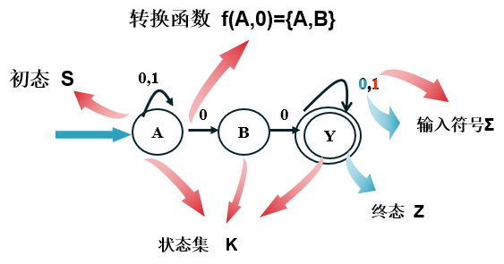
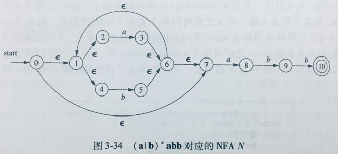
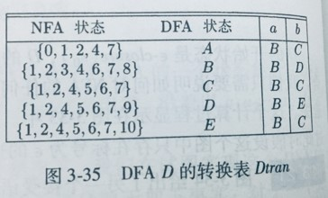
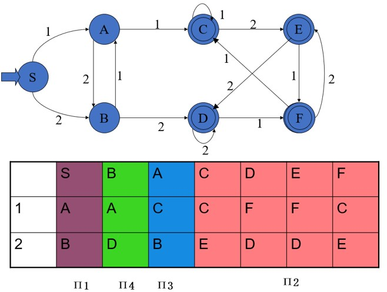

## 词法分析

### 正则表达式
也称为正规式

设字母表为∑，辅助字母表 ∑ = {∅, ε, |, ·, *, (, )}，下面是正规式和它所表示的正规集的递归定义
1. ε 和 ∅ 都是 ∑ 上的正规式，它们所表示的正规集分别为 {ε} 和 {}
2. 任何 a ∈ ∑ ，a 是 ∑ 上的一个正规式，它所表示的正规集为 {a}
3. 假定 e1 和 e2 都是 ∑ 上的正规式，它们所表示的正规集分别为 L(e1) 和 L(e2) ，那么，(e1), e1|e2, e1·e2, e1* 也都是正规式，它们所表示的正规集分别为 L(e1), L(e1)∪L(e2), L(e1)L(e2)和(L(e1))\*
4. 仅由有限次使用上述3个步骤而定义的表达式才是 ∑ 上的正规式，仅由这些正规式所表示的集合才是 ∑ 上的正规集

- `|` 读为“或”
- `·` 读为“连接”
- `*` 读为“闭包”（即，任意有限次的自重复连接）
- 在不致混淆时，括号可省去，但规定算符的优先顺序为 `*`、`·`、`|`
- 连接符 `·` 一般可省略不写
- `*`、`·`、`|` 都是左结合的

#### 无符号数的表示
```
∑ = {d, ., e, +, -}

d为整数，d ∈ [0, 9]

d*(.dd*|ε)(e(+|-|ε)dd*|ε)

```

### 有穷自动机
也称为有限自动机，能准确识别正规集，即识别正规文法所定义的语言和正规式所表示的集合

有穷自动机分为两类：确定的有穷自动机(Deterministic Finite Automata, DFA) 和不确定的有穷自动机(Nondeterministic Finite Automata, NFA)

#### 不确定的有穷自动机(NFA)
##### 定义
M = {K, ∑, f, S, Z}
- K 是有穷集，它的每一个元素称为一个状态
- ∑ 是有穷字母表，它的每一个元素称为一个输入符号
- f 是从 K X ∑* 到 K 的全体子集的映像，即 K X ∑* → 2^K，其中 2^K 表示 K 的幂集
- S ⊆ K ，是一个非空初态集
- Z ⊆ K ，是一个终态集



##### 优缺点
NFA 优点：由正则表达式 → NFA 较容易

NFA 缺点：不确定性，存在回溯，影响了程序执行效率

在有穷自动机的理论里，设L为一个由不确定的有穷自动机接受的集合，则存在一个接受L的确定的有穷自动机

#### 确定的有穷自动机(DFA)
##### 定义
M = {K, ∑, f, S, Z}
- K 是有穷集，它的每一个元素称为一个状态
- ∑ 是有穷字母表，它的每一个元素称为一个输入符号，也称 ∑ 为输入符号表
- f 是转换函数，是 K X ∑ → K 上的映像
    - f(ki, a) = kj (ki∈K, kj∈K)，就意味着当前状态为ki，输入字符为a时，将转换到下一状态kj，把kj称作ki的一个后继状态
- S ⊆ K ，是唯一的一个初态
- Z ⊆ K ，是一个终态集，终态也称可接受状态/结束状态

##### 表示
一个DFA可以表示成一个状态图（状态转换图），也可以表示成一个矩阵

#### NFA → DFA （子集法）
基本思想是让DFA的每一个状态对应NFA的一组状态，也就是方DFA使用它的状态去记录在NFA读入一个输入符号后可能达到的所有状态，在读入符号串 a1a2...an 之后，DFA处在一个状态，这个状态表示这个NFA的状态的一个子集T，T是从NFA的开始状态沿着某个标记为 a1a2...an 的路径可以到达的状态的集合

##### 转换表构造
- 从起始位置开始，经由多条’ ε’边能到达的点归入集合内
- 遍历集合中的点，将经不同的边（如a、b）能到达的点分别归入集合内
- 根据转换表构造DFA

##### 例子 (a|b)*abb



转换表



#### DFA最小化（分割法）
一个有穷自动机是化简了的，指的是没有多余状态并且它的状态中没有两个是相互等价的

无用状态
- 从该自动机的开始状态出发，任何输入串都不能到达的状态，或者从这个状态没有通路到达终态

等价状态，两个状态 s 和 t 等价的条件
- 一致性条件：状态 s 和状态 t 必须同时为可接受状态或不可接受状态
- 蔓延性条件：对于所有输入符号，状态 s 和 状态 t 必须转换到等价的状态里

##### 步骤
- 将 M 的状态分成两个子集，一个由终态（可接受态）组成，另一个由非终态组成
- 将可区分的状态进行划分



- 最后只有四种状态