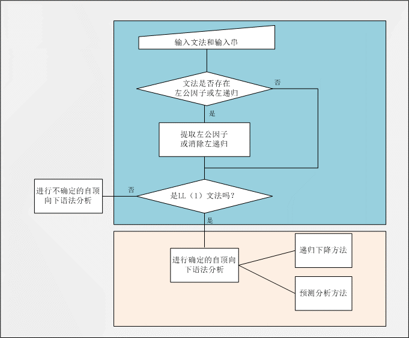

## 自顶向下 - LL(1)语法分析python实现

### 流程要求
实现的时候我是先判断LL(1)再循环提取左公因子和消除左递归，如果不能在有限步骤内提取/消除，则将文法判定为非LL(1)，并调用不确定的自顶向下分析



### 功能实现

因为是使用python编写，所以就直接使用python内的数据结构示意

1. 输入文法字典
```
grammar = dict(
    VT1:[production1, production2, ...]
    VT2:[production1],
    ...
)
```

2. 能推出ε的非终结符列表
```
# 假设小写字母和ε都是终结符
VNs = [a, b, d, ...]

# 假设大写字母都是非终结符
VTs = [A, B, S, ...]

```

3. 构造FIRST字典、FOLLOW字典、SELECT列表
```
# 非终结符: [终结符1, 终结符2, ...]
first_dict = {VN1:[VT1, VT2, ...], VN2:[VT, VT3, ...], ...}

# 非终结符: [终结符1, 终结符2, ...]
follow_dict = {VN1:[VT1, VT2, ...], VN2:[VT2, VT3, ...], ...}

# [非终结符1, 产生式1, [终结符1, 终结符2, ...]], [非终结符2, 产生式2， [终结符2, 终结符3, ...]]
select_list = [[VN1, production1, [VT1, VT2, ...]], [VN1, production2, [VT2, VT3, ...]], [VN2, [production1], [VT2, VT3, ...]], ...]

```

4. 根据SELECT字典，判断是否是LL(1)文法
```
# 非终结符: [[终结符1, 终结符2], [终结符1]]
# 如果列表中的元素有交集，即SELECT集不为空，因此不是LL(1)文法
select_dict = {VN1:[[VT1, VT2, ...], [VN1], [VN2, VN3], ...], VN2:[[VT2, VT3, ...], [VN1, VN2, VN3], ...]}
```

5. 提取左公因子，隐式左公因子需要对产生式进行替换
```
left_factor = {VN: {factor:[production1, production2, ...]}, ...}
```

6. 消除左递归，间接左递归需要对产生式进行替换

7. 删除不可达的产生式
```
# 终结符不在任何一个产生式的右部出现，即为不可达
if VN not in productions:
    del grammar[VN]
```

8. 根据SELECT列表构造预测分析字典
```
predict = {VN1: {VT1: production1, VT2: production1, VT3: production3}, VN2:{VT1: production}, ...}
```

9. 输入一个字符串，判断是否是该文法的句子
- 确定的自顶向下分析方法
    - 预测分析法
    - 递归子程序
- 不确定的自顶向下分析方法

这些方法都使用了栈（列表）这个数据结构

9.1 预测分析法，根据预测字典进行判断
```
# （栈顶符号，当前符号）→（栈顶操作，输入符号操作）
```

9.2 递归子程序
```
# 如果是非终结符，递归调用子程序
```

9.3 不确定的自顶向下分析方法
```
# 从第一个字符开始匹配，遇到非终结符则进行尝试匹配
# 如果栈中的终结符比字符串的字符还多，那么就退回到上一步
```

10. 其他 - 去重合并列表

### 测试
1. 不确定的自顶向下分析

输入
```python
# 输入文法
test = dict(
        S=['aSb','aS','ε']
    )

# 文法起始符号
start = 'S'

# 输入待匹配字符串
s = 'ab#'

# 测试1
Mymain(test, start, s)

# 测试2
Mymain(test, start, 'a#')

# 测试3
Mymain(test, start, 'abc#')

```

输出
```
# 测试1结果
uncertain function test
uncertain function returns "matched"

# 测试2结果
uncertain function test
uncertain function returns "matched"

# 测试3结果
uncertain function test
uncertain function returns "not match"
```

2. 确定的自顶向下分析

输入
```
# 输入文法
test = dict(
        S=['AcB'],
        A=['aA','b'],
        B=['cB','d']
    )

# 测试1
Mymain(test, 'S', 'abccd#')

# 测试2
Mymain(test, 'S', 'bcdd#')
```

输出
```
# 测试1结果
predict function returns "matched"
recursive function returns "matched"

# 测试2结果
predict function returns "VT not match" （栈顶终结符与当前输入不匹配）
recursive function returns "not match"
```

### 总结
- 根据LL1文法的定义来实现（听起来很简单）
- 测试的例子不多，而且在测试过程中还改了不少bug，果然测试是很重要的！
- 左循环和左递归的消除并不完善，其实整个代码也不能说得上完善...