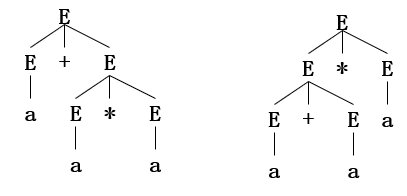
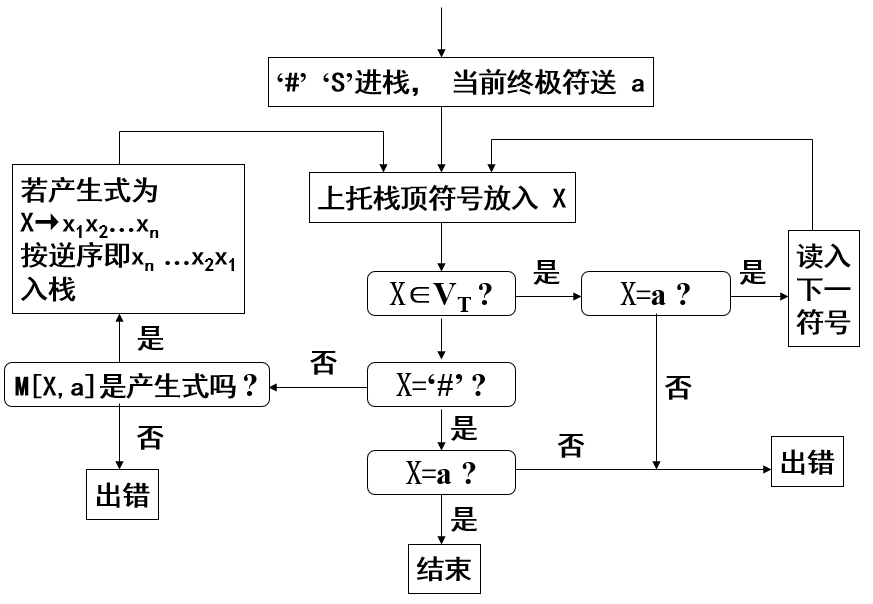
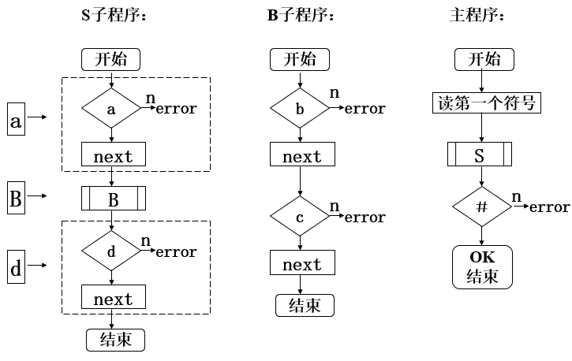

## 自顶向下语法分析
也称为面向目标的分析方法

### 判断LL(1)文法
#### LL(1)文法的定义
LL(1)
- 第一个L表示自顶向下分析是从左到右扫描输入串
- 第二个L表示分析过程中将用最左推导
- 1表示只需向右看一个符号便可决定如何推导（使用哪个产生式/规则）

#### 二义性文法的定义
- 如果对于文法的同一个句子存在两个不同的语法树，则称该句子是二义性的。包含二义性句子的文法称为二义性文法。
- 任何二义性文法都不是LL(1)文法

例如 `G(E): E → E+E | E*E | a`


#### 关于LL(1)文法的结论
结论1：任何LL(1)文法都是无二义性的
结论2：左递归文法必然不是LL(1)文法
结论3：存在一种算法，它能断定任一文法是否为LL(1)文法
结论4：存在一种算法，它能判定任意两个LL(1)文法是否产生相同的语言
结论5：不存在这样的算法，它能判定任意上下文无关语言能否由LL(1)文法产生
结论6：非LL(1)语言是存在的
LL(K)文法：至多向前看K个符号就可以区分用哪个产生式

#### FIRST集
##### 定义
设  是上下文无关文法


若 ，则规定  

称  为 α 的开始符号集或首符号集

##### 构造
1. First(ε) = {ε}
2. 若 β = a, 则 First(a) = {a}；若 β = aγ, 则 First(aγ) = {a}, γ表示任意的串
3. 若 β = A, 且 A 的所有产生式为 A → γ1 | γ2 | … | γn 则 First(A) = First(γ1) ∪ First(γ2) ∪ … ∪ First(γn)
4. 若 β = Tγ，T ∈ VN；若 ε ∉ First(T)，则 First(β) = First(T)；否则，First(β) = First(T) - {ε} ∪ First(γ)

#### FOLLOW集
##### 定义
设  是上下文无关文法，，S是开始符号


若 ，则 


注意：FOLLOW集合中不包含空串ε

##### 构造
开始，令Follow(A)={}
- 若 A 是开始符，则把 `#` 加入到 Follow(A) 中
- 若有 X → …Aa…，a ∈ VT, 则把 a 加入到 Follow(A) 中
- 若有 X → …ABβ，B ∈ VN，则把 First(Bβ) - {ε} 加入到 Follow(A) 中
- 若有 X → …A 或 X → …Aβ 且 ε ∈ First(β)，则把 Follow(X) 加入到 Follow(A) 中

用 `#` 作为输入串的结束符，也称为输入串括号

#### SELECT集
##### 定义
，若 ，则 
若 ，则 

##### 构造
Select(A→α)
- First(α)，ε ∉ First(α)，或 α ∈ VT
- First(α) - {ε} ∪ Follow(A)，ε ∈ First(α)

一个上下文无关文法是LL(1)文法的充分必要条件是，对每个非终结符A的两个不同产生式，A→α，A→β，满足
SELECT(A→α) ∩ SELECT(A→β) = ∅，其中 α 、 β 不能同时

#### 例子
```
S → AB | bC
A → ε | b
B → ε | aD
C → AD | b
D → aS | c
```

1. 求FIRST集
```
FIRST(S) = FIRST(A) ∪ {b} = {ε, b}
FIRST(A) = {ε, b}
FIRST(B) = {ε, a}
FIRST(C) = FIRST(A) ∪ {b} = {ε, b}
FIRST(D) = {a, c}
```

2. 求FOLLOW集
```
FOLLOW(S) = FOLLOW(C) ∪ {#} = {#}
FOLLOW(A) = FIRST(D) ∪ (FIRST(B)-{ε} ∪ FOLLOW(S)) = {a, c, #}
FOLLOW(B) = FOLLOW(S) = {#}
FOLLOW(C) = FOLLOW(S) = {#}
FOLLOW(D) = FOLLOW(C) ∪ FOLLOW(B) = {#}
```

3. 求SELECT集
```
SELECT(S → AB) = (FIRST(A)-{ε}) ∪ (FIRST(B)-{ε}) ∪ FOLLOW(S) = {a, b, #}
SELECT(S → bC) = {b}
SELECT(A → ε) = FOLLOW(A) = {a, c, #}
SELECT(A → b) = {b}
SELECT(B → ε) = FOLLOW(B) = {#}
SELECT(B → aD) = {a}
SELECT(C → AD) = (FIRST(A)-{ε}) ∪ FIRST(D) = {a, b, c}
SELECT(C → b) = {b}
SELECT(D → aS) = {a}
SELECT(D → c) = {c}

```

4. 判断LL1(1)文法
```
SELECT(S → AB) ∩ SELECT(S → bC) = {b} ≠ ∅
SELECT(C → AD) ∩ SELECT(C → b) = {b} ≠ ∅
```
因为无法确定每一步使用哪个产生式，因此该文法不是LL(1)文法

#### 非LL(1)文法 → LL(1)文法
##### 提取左公因子
显示左公因子
```
A → ab | ac
∴ A → a(b|c)
```

提取左公因子`a`后

```
A → aB
B → b | c
```


隐式左公因子
这种情况下对右部以非终结符开始的产生式用左部相同而右部以终结符开始的产生式进行相应的替换

```
A → ad | Bc
B → aA | bB
```

用B产生式替换A产生式的右部
```
A → ad | aAc | bBc
B → aA | bB
```

提取左公因子后
```
A → aC | aBc
C → d | Ac
B → aA | bB
```

有时提取左公因子后会使得某些产生式变为无用产生式，这种情况下必须对文法重新压缩（化简），例如
```
S → aSd | Ac
A → aS | b
```

替换后
```
S → aSd | aSc | bc
A → aS | b
```

消除左公因子后，A变为不可达的符号，因此应删除对应的产生式
```
S → aSB | bc
B → d | c
A → aS | b
```

也存在某些文法不能在有限步骤内提取左公因子

##### 消除左递归
消除直接左递归
- 把直接左递归改写为右递归

例如
```
S → Sa | b
```

改写为
```
S → bA
A → aA|ε
```


消除间接左递归
- 先通过产生式非终结符置换，将间接左递归变为直接左递归
- 然后消除直接左递归

例如
```
A → aB | Bb
B → Ac | d
```

用A产生式替换B产生式的右部
```
A → aB | Bb
B → aBc | Bbc | d
```

消除左递归后得到
```
A → aB | Bb
B → aBcC | dC
C → bcC | ε
```

##### 重新构造等价的文法
根据文法所表达的语言，重新构造一个表示该语言的文法，使其是LL(1)的

例如
```
S → SaS | b
```

该文法的语言为
```
b(ab)*
```

重新构造等价的LL(1)文法
```
S → bA
A → abA | ε
```

### 确定的自顶向下分析
#### 表驱动LL(1)分析方法
又称为LL(1)分析法，需要构造一个预测分析表
- 组成：预测分析程序、先进后出栈、预测分析表

##### 流程图



##### 例子
表达式文法
```
E → E+T | T
T → T*F | F
F → i | (E)
```

消除左递归
```
E → TA
A → +TA | ε
T → FB
B → *FB | ε
F → i | (E)
```

FIRST集
```
FIRST(E) = FIRST(T) = {i, (}
FIRST(A) = {+, ε}
FIRST(T) = FIRST(F) = {i, (}
FIRST(B) = {*, ε}
FIRST(F) = {i, (}
```

FOLLOW集
```
FOLLOW(E) = {), #}
FOLLOW(A) = FOLLOW(E) = {), #}
FOLLOW(T) = (FIRST(A)-{ε}) ∪ FOLLOW(E) ∪ FOLLOW(A) = {+, ), #}
FOLLOW(B) = FOLLOW(T) = {+, ), #}
FOLLOW(F) = FIRST(B) ∪ FOLLOW(T) = {*, +, ), #}
```

SELECT集 → 相同左部产生式的SELECT集没有交集，因此该文法是LL(1)文法
```
SELECT(E → TA) = FIRST(T) = {i, (}
SELECT(A → +TA) = {+}
SELECT(A → ε) = FOLLOW(A) = {), #}
SELECT(T → FB) = FIRST(F) = {i, (}
SELECT(B → *FB) = {*}
SELECT(B → ε) = FOLLOW(B) = {+, ), #}
SELECT(F → i) = {i}
SELECT(F → (E)) = {(}
```

构造预测分析表
- 根据SELECT集构造即可

|   | i | + | * | ( | ) | # |
| - | - | - | - | - | - | - |
| E |TA |   |   |TA |   |   |
| A |   |+TA|   |   | ε | ε |
| T |FB |   |   |FB |   |   |
| B |   | ε |*FB|   | ε | ε |
| F | i |   |   |(E)|   |   |

对 `i+i*i#` 进行分析，在对任意字符串进行分析时需要在结尾添加 `#`


#### 递归下降方法
又称为递归子程序法，是推导法的直接程序化

特点
- 只适用于LL(1)文法
- 根据文法可直接写出处理子程序
- 每个非终结符对应一个子程序

产生式的子程序
- 将产生式右部的所有符号顺序组合就得到了该产生式对应的子程序代码

例如
```
S → aBd
B → bc
```




### 不确定的自顶向下分析
又称为回溯推导分析

简单理解，就是每一步都是尝试，如果失败则回溯，换一个产生式继续尝试，直到所有的情况都遍历完后，若仍未匹配，则返回匹配失败

这里的所有情况，必须排除死循环的匹配，如果用栈来实现这种方法的话，只要判断栈中的非终结符个数是否大于待匹配字符串长度，如果大于，就一定是选择了错误的产生式，因此要回溯到上一步继续进行匹配