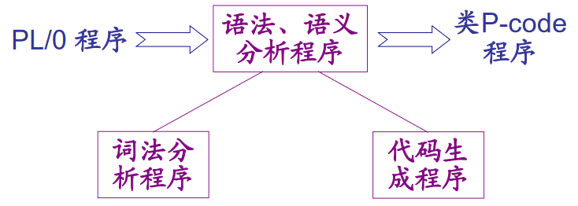
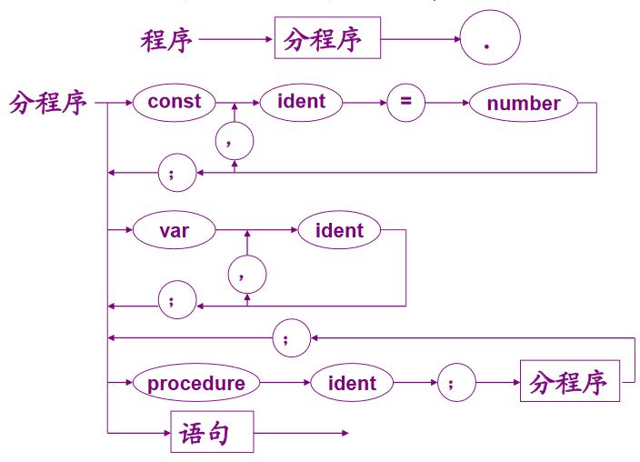
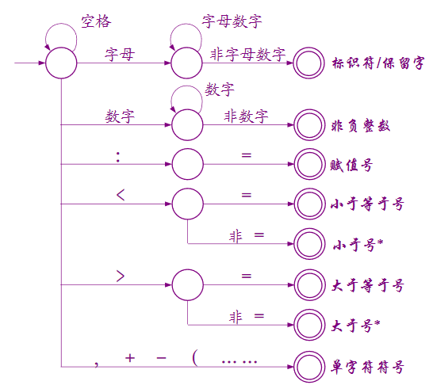
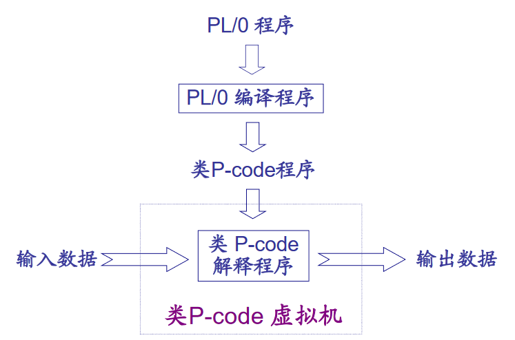
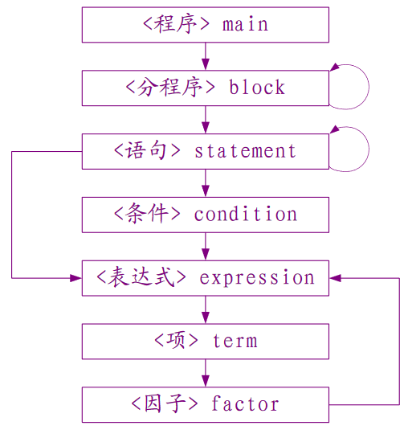

## PL/0编译程序

以语法分析、语义分析为中心的**单遍**编译程序
- 单遍意味着只需对源程序进行一次遍历就能完成编译
- 在进行语法分析的同时进行语义分析



### PL/0语言的EBNF表示

把程序看作由分程序和 `.` 组成，分程序中包含常量/变量/过程声明和语句，分程序又可以嵌套分程序



```
<程序> ::= <分程序>.
<prog> → program <id>；<block>

<分程序> ::= [<常量说明部分>] [<变量说明部分>][<过程说明部分>] <语句>
<block> → [<condecl>][<vardecl>][<proc>] <body>

<常量说明部分> ::= CONST<常量定义> { ,<常量定义> } ;
<condecl> → const <const>{, <const>};

<常量定义> ::= <标识符> = <无符号整数>
<const> → <id> := <integer>

<变量说明部分> ::= VAR<标识符> { , <标识符> } ; 
<vardecl> → var <id>{, <id>};

<过程说明部分> ::= <过程首部><分程序>{; <过程说明部分> };
<过程首部> ::= PROCEDURE<标识符> ； 
<proc> → procedure <id> ([<id>{, <id>}]); <block>{; <proc>}

<复合语句> ::= BEGIN<语句> {;<语句>} END
<body> → begin <statement>{; <statement>} end

<语句> ::= <赋值语句> | <条件语句> | <当型循环语句> | <过程调用语句> | <读语句> | <写语句> | <复合语句> | <空>
<statement> → <id> := <exp>                                     <赋值语句> ::= <标识符> := <表达式>

               |if <lexp> then <statement> [else <statement>]    <条件语句>  ::=IF<条件> THEN<语句>

               |while <lexp> do <statement>                     <当型循环语句> ::= WHILE<条件> DO <语句>

               |call <id> ([<exp>{, <exp>}])                      <过程调用语句> ::= CALL<标识符> 

               |<body>

               |read (<id>{, <id>})                             <读语句>  ::= READ '('<标识符> {,<标识符>} ')'

               |write (<exp>{, <exp>})                           <写语句>  ::= WRITE '('<表达式>{, <表达式>} ')'

<条件> ::= <表达式> <关系运算符> <表达式> | ODD<表达式> 
<lexp> → <exp> <lop> <exp> | odd <exp>

<表达式> ::= [+ | -]<项> { <加法运算符><项>}
<exp> → [+ | -]<term> {<aop><term>}

<项> ::= <因子> {<乘法运算符><因子>} 
<term> → <factor> {<mop><factor>}

<因子>  ::=  <标识符> | <无符号整数> | '('<表达式> ')'
<factor> → <id> | <integer> | (<exp>)

<关系运算符> ::= = | # | < | <= | > | >=
<lop> → = | # | < | <= | > | >=

<加法运算符> ::= + | -
<aop> → + | -

<乘法运算符> ::= * | /
<mop> → * | /

<标识符> ::= <字母> {<字母>|<数字>} 
<id> → l{l | d}

<无符号整数> ::= <数字> {<数字>} 
<integer> → d{d}

<字母> ::= a| b | ... | X | Y | Z
l → a| b | ... | X | Y | Z

<数字> ::= 0 | 1 | 2 | ... | 8 | 9
d → 0 | 1 | 2 | ... | 8 | 9

# 解释
<prog>：程序
<block>：块、程序体
<condecl>：常量说明
<const>：常量
<vardecl>：变量说明
<proc>：分程序
<body>：复合语句
<statement>：语句
<exp>：表达式
<lexp>：条件
<term>：项
<factor>：因子
<aop>：加法运算符
<mop>：乘法运算符
<lop>：关系运算符
```

### PL/0功能模块

#### 词法分析

主要用于识别符号，以及对非法符号进行错误处理




保留字

```
const, var, procedure, begin, end, if, then, else, call, while, do, read, write
```

运算符

```
+, -, *, /, odd（奇偶判断）
```

界符

```
, ; .
```

关系运算符

```
=, #, >, >=, <, <=
```

数字

```
0-9组成
```

标识符

```
字母开头，字母数字组成
```

#### 语法分析

判断程序是否符合规则

处理语句
- 产生目标代码

说明语句
- 操作符号表

#### 语义分析
在语法分析的基础上完成
- 借助符号表进行上下文相关的静态语义分析
- 确保符号表可以体现作用域规则
- 确保标识符属性与上下文环境一致
- 确保标识符先声明后引用
- 确保标识符的长度、数字的位数、过程嵌套说明的层数符合PL/语言的约定
- 提示语义错误信息

1. 符号表
- 根据说明语句生成
- 存储常量、变量、过程
- 常量：标识符，层次，相对于该层的地址偏移量
- 变量：标识符，值，层次
- 过程：过程名，处理语句开始地址（不是说明语句），层次

2. 产生目标代码
- 根据处理语句生成
- 借助符号表生成相应的目标代码

##### 符号表结构

并不是所有符号都有以下 5 个项的值

|名称 | 作用 | 注释|
|- | - | -|
|name|名称||
|kind|类型||
|value|值|仅 const 用|
|level|层|const 不用|
|addr|地址|const 不用|
|size|大小|仅 procedure 用|

#### 错误处理

短语层恢复

- 在进入某个语法单位时，调用TEST函数， 检查当前符号是否属于该语法单位的开始符号集合。若不属于，则滤去开始符号和后跟符号集合外的所有符号
- 在语法单位分析结束时，调用TEST函数，检查当前符号是否属于调用该语法单位时应有的后跟符号集合若不属于，则滤去后跟符号和开始符号集合外的所有符号

后跟符号集随调用深度逐层增加，增加的符号与调用位置相关

##### 错误消息

|错误类型|错误说明|
|-|-|
|0|过程开始部分说明不正确|
|1|常数说明中“=”写成“:=”|
|2|常数说明中“=”后应为整数或字符|
|3|常数说明中的标识符后应是“=”|
|4|const、var、procedure后应为标识符|
|5|漏掉了“,”或“;”|
|6|过程说明后的符号不正确（应该是语句开始符/过程定义符）|
|7|应是语句开始符|
|8|程序体内语句部分的后跟符不正确|
|9|程序结尾漏掉了“.”|
|10|语句间漏掉了“;”|
|11|标识符未声明|
|12|赋值语句中，赋值号左部标识符属性应是变量|
|13|变量后不能是此符号|
|14|call后应为标识符|
|15|call后标识符属性应为过程|
|16|条件语句中漏掉了“then”|
|17|漏掉了“end”或“;”|
|18|while型循环语句漏掉了“do”|
|19|语句后的符号不正确|
|20|应为关系运算符|
|21|表达式内标识符属性不能是过程|
|22|表达式中漏掉“(”|
|23|因子后的非法符号|
|24|表达式的开始符不能是此符号|

#### 活动组织记录（解释执行）


##### 指令格式与功能

指令格式

f|l|a
-|-|-

- f 操作码
- l 层次差
- a 不同的指令含义不同

|指令|功能|
|-|-|
|LIT 0 a |将立即数取到栈顶|
|LOD l a |将层差为l、偏移量为a的存储单元的值取到栈顶|
|STO l a |将栈顶的值存入层差为l、偏移量为a的存储单元|
|CAL l a |调用地址为a的过程，l为调用过程与被调用过程的层差|
|INT 0 a |在运行栈中为被调用的过程开辟a个单元的数据区|
|JMP 0 a |无条件跳转至地址a|
|JPC 0 a |条件跳转，若栈顶值为0则跳转至a地址，否则顺序执行|
|OPR 0 0 |过程调用结束后，返回调用点并退栈|
|OPR 0 1 |将栈顶元素取反|
|OPR 0 2 |次栈顶与栈顶的值相加，结果存入次栈顶|
|OPR 0 3 |次栈顶的值减去栈顶的值，结果存入次栈顶|
|OPR 0 4 |次栈顶的值乘以栈顶的值，结果存入次栈顶|
|OPR 0 5 |次栈顶的值除以栈顶的值，结果存入次栈顶|
|OPR 0 6 |栈顶元素的奇偶判断，奇数结果为1，偶数结果为0，结果值在栈顶|
|OPR 0 7 ||
|OPR 0 8 |比较次栈顶的值与栈顶的值是否相等，相等结果为0，结果存入次栈顶|
|OPR 0 9 |比较次栈顶的值与栈顶的值是否不等，不相等结果为0，结果存入次栈顶|
|OPR 0 10 |比较次栈顶的值是否小于的值栈顶的值，小于结果为0，结果存入次栈顶|
|OPR 0 11 |比较次栈顶的值是否大于等于栈顶的值，结大于等于结果为0，果存入次栈顶|
|OPR 0 12 |比较次栈顶的值是否大于栈顶的值，大于结果为0，结果存入次栈顶|
|OPR 0 13 |比较次栈顶的值是否小于等于栈顶的值，小于等于结果为0，结果存入次栈顶|
|OPR 0 14 |栈顶的值输出至屏幕|
|OPR 0 15 |屏幕输出换行|
|OPR 0 16 |从命令行读入一个输入置于栈顶|

##### 解释结构
PL/0 编译程序运行时的存储分配策略采用栈式动态分配，并用动态链和静态链的方式分别解决递归调用和非局部变量的引用问题

运行栈S：存放程序执行的数据

指令寄存器I：存放当前要执行的代码

栈顶地址寄存器T：指向栈顶

基址寄存器B：存放当前运行过程在栈中的起始地址

指令地址寄存器P：存放下一条要执行的指令地址

名称|符号|作用
-|-|-
栈顶寄存器|Ｔ|指向当最新分配的过程运行所需的数据空间在数据区Ｓ中的位置
基址寄存器|Ｂ|指向每个过程被调用时，在数据区Ｓ中给它分配的数据段起始地址（也称基地址）
静态链|SL|指向定义该过程的直接外过程（或主程序）运行时最新数据段的基地址【保存该过程直接外层的活动记录首地址】
动态链|DL|指向调用该过程前正在运行过程的数据段基地址【调用者的活动记录首地址】
返回地址|RA|记录调用该过程时目标程序的断点，即当时程序地址寄存器Ｐ的值。也就是调用过程指令的下一条指令的地址

##### 解释过程

1. 初始化，p=b=t=0，s[0]=s[1]=s[2]=0
2. 取指令到指令寄存器 i=code[p], p++
3. 分析并解释指令i
4. 若程序未结束（p!=0），转2
5. 返回

### 程序设计
主要语法单位相应子程序之间的调用关系
- 添加了 else 语句的定义



#### 保留字、预定义符号

```python
# 运算符，界符
symbol_class = [':=', '+', '-', '*', '/', '=', '#', '>', '>=', '<', '<=', '(', ')', ';', ',', '.']

# 保留字
saved = ['begin', 'call', 'const', 'do', 'end', 'if', 'odd', # 奇偶判断
         'procedure', 'read', 'then', 'var', 'while', 'write', 'else']

# 操作符
optr = ['lit', 'opr', 'lod', 'sto', 'cal', int', 'jmp', 'jpc', 'lda', 'sta']
```

#### 结构

```python
# 符号表项
class item:
    classes = ['constant', 'variable', 'procedure', 'array']
    def __init__(self, name=None, kind=None):
        self.name = name    # 名称
        self.kind = kind    # 类型
        self.value = None   # 值
        self.level = None   # 层差
        self.addr = None    # 地址
        self.size = None    # 大小

# 虚拟机代码格式
class code:
    def __init__(self, f, l, a):
        self.optr, self.lev, self.addr = f, l, a    # 操作码、层差、不同含义
```

#### 初始化

```python
# 符号表，第一项默认为空
self.table = [item()]

# 文件指针
self.f = None

# 符号缓冲，读取一整行的符号
self.symbols = None

# 虚拟机代码
self.codes = []

# 虚拟机代码指针
self.cx = 0

# 错误数
self.err = 0

# 当前符号
self.symbol = None

# identifier 标识符
self.id = None

# number 数字
self.num = None

# 声明开始符号
self.decl = ['const', 'var', 'procedure']

# 语句开始符号
self.stat = ['begin', 'call', 'if', 'while', 'read', 'write']

# 因子开始符号
self.fac = ['identifier', 'number', '(']

# 后跟符号
self.next = self.decl+self.stat
self.next.extend('.')

# 最大层次数
self.maxlev = 3

# 自动调用
self.self_start(path)
```

#### 词法分析

```python
# 获取一个符号
def getsymbol(self)

# 判断符号的类型（保留字或运算符/标识符/数字/其他）
def declare_kind(self)

# 读取文件
def readfile(self, path)
```

#### 语法分析

```python
# 子程序处理
def block(self, level, next)                # 层差、后跟集合

# 常数/变量定义（复用）
def dup(self, level, dx, kind=None)         # 层差、类型、地址

# 常量定义
def const_declaration(self, level, dx)      # 层差、地址

# 变量定义
def variable_declaration(self, level, dx)   # 层差、地址

# 语句定义
def statement(self, next, level)            # 后跟集、层差

# 算术表达式处理
def expression(self, next, level)           # 后跟集、层差

# 项处理
def term(self, next, level)                 # 后跟集、层差

# 因子处理
def factor(self, next, level)               # 后跟集、层差

# 条件处理
def condition(self, next, level)            # 后跟集、层差
```

#### 语义分析

在语法分析的过程中进行了语义分析

```python
# 在符号表中添加一项
def add_item(self, name, level, dx)         # 名称、层差、地址

# 找到标识符对应的表项在符号表中的位置
def find_item(self, name)                   # 名称

# 生成虚拟机代码
def generate_code(self, f, l, a):           # 操作码、层差、不同含义
```

#### 错误处理

```python
# 短语层恢复
def test(self, s1, s2, n)       # 需要的集合、补救的集合、错误代码

# 错误输出，计数
def error(self, number)         # 错误代码
```

#### 代码执行

```python
# 虚拟机代码执行
def interpret(self)

# 通过过程基址找到符号
def base(self, level, stack, b)     # 层、运行栈、基址
```

#### 辅助功能

```python
# 打印符号表，保存符号表和虚拟机代码
def print_table(self)

# 自动调用
def self_start(self, path)
```

#### column.pl0

使用 columm.pl0 生成的符号表以及代码

```
+--------+----------+-------+------+------+
|  Name  |   Kind   | Value | Size | Addr |
+--------+----------+-------+------+------+
|  None  |   None   |  None | [9]  |  1   |
|   r    | variable |  None | None |  3   |
|   h    | variable |  None | None |  4   |
|  len   | variable |  None | None |  5   |
|   a1   | variable |  None | None |  6   |
|   a2   | variable |  None | None |  7   |
| volumn | variable |  None | None |  8   |
+--------+----------+-------+------+------+
```

```
+-----+-----+---+----+
| Num |  F  | L | A  |
+-----+-----+---+----+
|  0  | jmp | 0 | 1  |
|  1  | int | 0 | 9  |
|  2  | opr | 0 | 16 |
|  3  | sto | 0 | 3  |
|  4  | opr | 0 | 16 |
|  5  | sto | 0 | 4  |
|  6  | lit | 0 | 2  |
|  7  | lit | 0 | 3  |
|  8  | opr | 0 | 4  |
|  9  | lod | 0 | 3  |
|  10 | opr | 0 | 4  |
|  11 | sto | 0 | 5  |
|  12 | lit | 0 | 3  |
|  13 | lod | 0 | 3  |
|  14 | opr | 0 | 4  |
|  15 | lod | 0 | 3  |
|  16 | opr | 0 | 4  |
|  17 | sto | 0 | 6  |
|  18 | lod | 0 | 6  |
|  19 | lod | 0 | 6  |
|  20 | opr | 0 | 2  |
|  21 | lod | 0 | 5  |
|  22 | lod | 0 | 4  |
|  23 | opr | 0 | 4  |
|  24 | opr | 0 | 2  |
|  25 | sto | 0 | 7  |
|  26 | lod | 0 | 6  |
|  27 | lod | 0 | 4  |
|  28 | opr | 0 | 4  |
|  29 | sto | 0 | 8  |
|  30 | lod | 0 | 5  |
|  31 | opr | 0 | 14 |
|  32 | opr | 0 | 15 |
|  33 | lod | 0 | 6  |
|  34 | opr | 0 | 14 |
|  35 | opr | 0 | 15 |
|  36 | lod | 0 | 7  |
|  37 | opr | 0 | 14 |
|  38 | opr | 0 | 15 |
|  39 | lod | 0 | 8  |
|  40 | opr | 0 | 14 |
|  41 | opr | 0 | 15 |
|  42 | opr | 0 | 0  |
+-----+-----+---+----+
```
