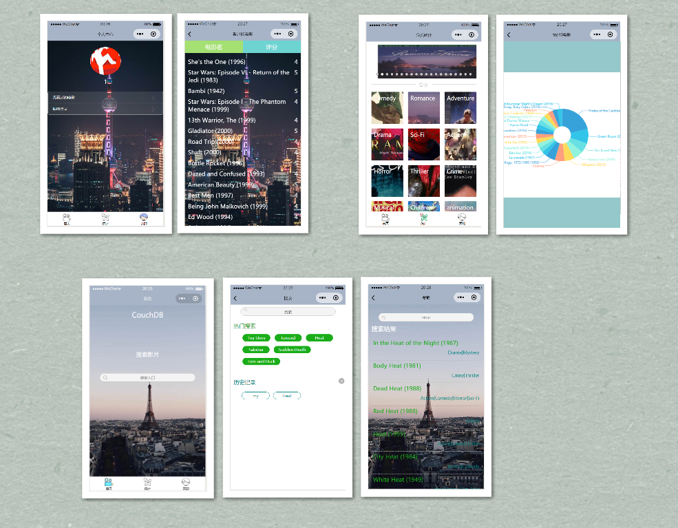

## CouchDB + Flask + Nginx + 微信小程序

### 数据

ratings.csv
- userId
- movieId
- rating
- timestamp

tags.csv
- userId
- movieId
- tag
- timestamp

movies.csv
- movieId
- title
- genres

links.csv
- movieId
- imdbId
- tmdbId

### 实现功能
- task1: 根据用户ID，搜索用户所看的电影名字和评分，按时间从新到旧排序
- task2: 根据输入的关键词，查询电影名字里有关键词的电影
- task3: 查询某一风格最受欢迎的20部电影

### 前端页面



### 后端逻辑

#### task1 & task2
- 根据用户ID，搜索用户所看的电影名字和评分，按时间从新到旧排序
    - 根据 userId 查找 movieId（不访问视图），再查找 title（访问视图）
- 根据输入的关键词，查询电影名字里有关键词的电影
    - 使用 selector 进行匹配 :x:（太慢了）
    - 使用 python 正则匹配 :heavy_check_mark: （不访问视图）

用户视图 `_design/task12/_view/users`
```js
function (doc) {
  if (doc.userId && doc.movieId && doc.rating){
    emit([doc.userId, doc.timestamp], {"userId":doc.userId, "movieId":doc.movieId, "rating":Number(doc.rating)});
  }
}
```

电影视图 `_design/task12/_view/movies`
```js
function (doc) {
  if (doc.movieId && doc.title && doc.genres){
    emit(doc.movieId, {"movieId":doc.movieId, "title":doc.title, "genres":doc.genres});
  }
}
```


#### task3
- 查询某一风格最受欢迎的20部电影
    - 根据 genres 查找 movieId， 再统计看过的人数（也可计算评分均值）
    - 共有 20 种类型

评分视图 `_design/task3/_view/ratings`

```js
function (doc) {
  if (doc.userId && doc.movieId && doc.rating){
    emit(doc.movieId, {"rating":Number(doc.rating)});
  }
}
```

类型视图 `_design/task3/_view/comedy`

```js
function (doc) {
  if (doc.movieId && doc.title && doc.genres){
    var genres = doc.genres.toLowerCase().split("|");
    if (genres.indexOf("comedy") > -1){
      emit(doc.movieId, {"title":doc.title, "genres":genres});
    }
  }
}
```


#### 定时任务

更新存储在 python 后台的字典： 电影 和 top20 

### 参阅

- [What Every Developer Should Know About CouchDB](https://www.dimagi.com/blog/what-every-developer-should-know-about-couchdb/)
- [3.2.1. Introduction to Views](https://docs.couchdb.org/en/stable/ddocs/views/intro.html)
- [View and Query Examples](https://docs.couchbase.com/server/4.5/views/views-query-samples.html)
- [A Recipe for Creating CouchDB Views](https://www.lullabot.com/articles/a-recipe-for-creating-couchdb-views)
- [how do I create a “like” filter view in couchdb](https://stackoverflow.com/questions/5509911/how-do-i-create-a-like-filter-view-in-couchdb)
- [Full-Text Search in CouchDB Using... CouchDB](https://lethain.com/full-text-search-in-couchdb-using-couchdb/)

- [Using CouchDB with python-cloudant](https://samiikon.github.io/2018/06/06/using-couchdb-with-python-cloudant/)
- [Docs » Cloudant client library API » Modules » database](https://python-cloudant.readthedocs.io/en/latest/database.html#cloudant.database.CouchDatabase.get_view_resultsnak)

- [How To Deploy a Flask Application on an Ubuntu VPS](https://www.digitalocean.com/community/tutorials/how-to-deploy-a-flask-application-on-an-ubuntu-vps)
- [How to Install Flask on Ubuntu 18.04](https://linuxize.com/post/how-to-install-flask-on-ubuntu-18-04/)

- [解决 nginx 反向代理时的 upstream timeout 问题](https://juejin.im/post/5b472b785188251b134e6459)

可用于全局搜索数据库的工具（未使用）
- [Installing JDK on Linux](https://iwillteachyoukotlin.com/start/jdk-linux/)
- [Install Java on Ubuntu 16.04](https://www.linode.com/docs/development/java/install-java-on-ubuntu-16-04/)
- [Elasticsearch Reference [6.0] » Getting Started » Installation](https://www.elastic.co/guide/en/elasticsearch/reference/6.0/_installation.html)
- [开始使用 Elasticsearch](https://www.elastic.co/cn/webinars/getting-started-elasticsearch?baymax=default&elektra=docs&storm=top-video)