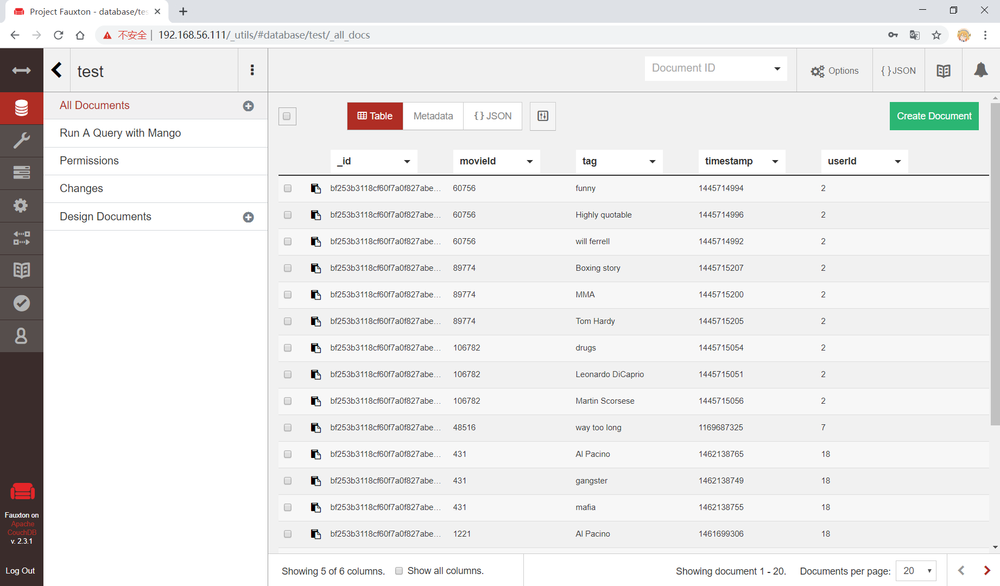
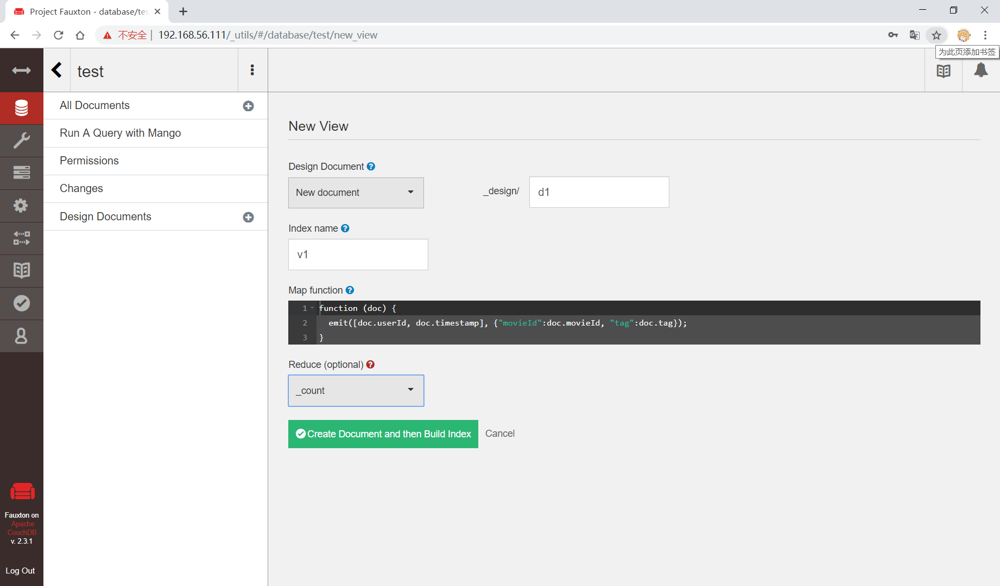
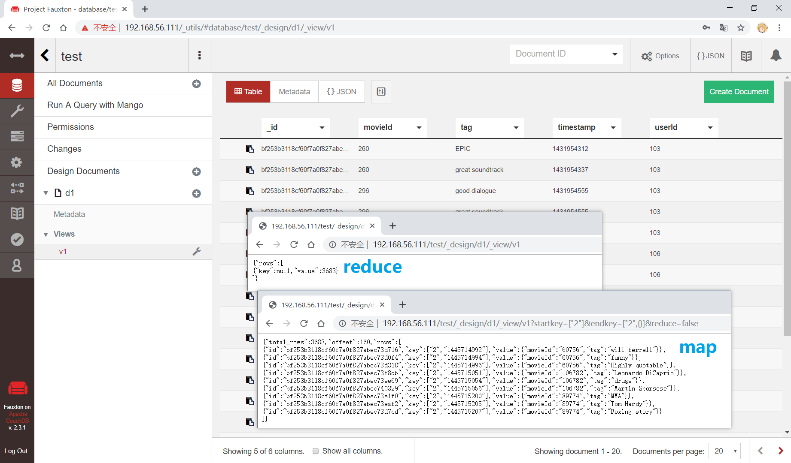
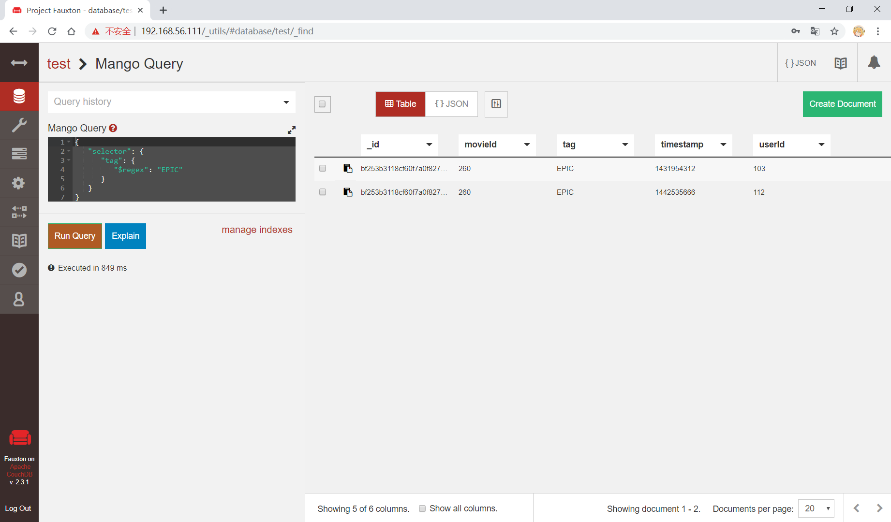
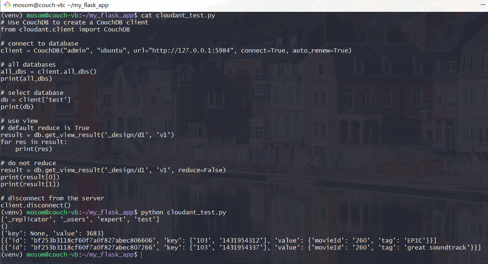

## CouchDB 不完全教程

### 实验环境
- Ubuntu 18.04.1 Server
- Couchdb
    - standalone
    - admin:admin
- npm
    - couchimport
- python 3.6.7
    - cloudant
- nginx
- jq

#### CouchDB 安装

standalone

```bash
# add repository
echo "deb https://apache.bintray.com/couchdb-deb bionic main" \
    | sudo tee -a /etc/apt/sources.list

# install repository key
curl -L https://couchdb.apache.org/repo/bintray-pubkey.asc \
    | sudo apt-key add -

# update repository and install couchdb
sudo apt-get update && sudo apt-get install -y couchdb

# list status of couchdb.service
sudo systemctl status couchdb
```

参阅
- [Installation on Unix-like systems](http://docs.couchdb.org/en/stable/install/unix.html)

#### npm - couchimport 安装

```bash
# install npm
sudo apt-get update && sudo apt install -y npm

# install couchimport
sudo npm install -g couchimport

# version
couchimport --version
```

官方仓库
- [glynnbird/couchimport](https://github.com/glynnbird/couchimport)

#### Python 环境配置

使用虚拟环境

```bash
# install pip and virtualenv 
sudo apt-get install python-pip 
sudo pip install virtualenv 

# cretate virtual environment
sudo virtualenv venv

# activate the virtual environment
source venv/bin/activate

# install cloudant
pip install cloudant
```

官方仓库
- [cloudant/python-cloudant](https://github.com/cloudant/python-cloudant)

#### Nginx 反向代理

```bash
# install nginx
sudo apt-get update && sudo apt-get install -y nginx

# settings
sudo vi /etc/nginx/sites-available/default

# reload
sudo service nginx reload
```

配置文件 [/etc/nginx/sites-available/default](default)

参阅
- [Reverse proxying with nginx](http://docs.couchdb.org/en/stable/best-practices/reverse-proxies.html#reverse-proxying-with-nginx)

#### 其他

```bash
# jq for json
sudo apt update && sudo apt install -y jq
```

### 命令行操作

`PUT`、`DELETE` 操作需要加上用户名和密码
- 实验用户名密码：`admin:ubuntu`

```bash
# 访问初始页面
curl -X GET 127.0.0.1:5984

# 创建数据库
curl -X PUT admin:ubuntu@127.0.0.1:5984/test

# 查看所有数据库
curl -X GET 127.0.0.1:5984/_all_dbs | jq

# 查看指定数据库信息
curl -X GET 127.0.0.1:5984/test | jq

# 查看数据库文档信息
curl -X GET 127.0.0.1:5984/test/_all_docs

# 添加数据
# _id = aaa
curl -X PUT admin:ubuntu@127.0.0.1:5984/test/aaa -d '{"xxx":111,"yyy":222,"zzz":{"a":3,"b":4,"c":[5,6,7]}}'

# _id 自动生成
curl -X POST admin:ubuntu@127.0.0.1:5984/test -H 'content-type: application/json' -d '{"xxx":222,"yyy":222,"zzz":{"a":3,"b":4,"c":[5,6,7]}}'

# 查看数据
curl -X GET 127.0.0.1:5984/test/aaa

# 查看数据是否存在 ETag
curl -X GET 127.0.0.1:5984/test/aaa --head

# 批量添加数据
curl -X POST admin:ubuntu@127.0.0.1:5984/test/_bulk_docs -H 'content-type: application/json' -d '{ "docs": [ { "_id": "bbb", "value": "456" }, { "value": "789" } ] }'

# 查看所有数据
curl -X GET 127.0.0.1:5984/test/_all_docs

# 删除数据
curl -X DELETE admin:ubuntu@127.0.0.1:5984/test/aaa?rev="xxxxxxx"

# 删除数据库
curl -X DELETE admin:ubuntu@127.0.0.1:5984/test
```

<a href="https://asciinema.org/a/lZd4mSXBKXsIyWgJYw8WZge2P?autoplay=1" target="_blank"></a>

#### couchimport

导入少量数据，导入后为字符串

```bash
# 创建数据库
curl -X PUT admin:ubuntu@127.0.0.1:5984/test

# 导入数据
cat ml-latest-small/tags.csv | couchimport

# 查看20条数据
curl -X GET 127.0.0.1:5984/test/_all_docs?limit=3

# 查看特定数据
curl -X GET 127.0.0.1:5984/test/_id
```

<a href="https://asciinema.org/a/2E4hx6M1GHePRhnc0bm62AEVr?autoplay=1" target="_blank"></a>

### Web UI

Futon：http://ip_address/_utils/

#### 数据库

查看 test 数据库



#### 设计文档(design documnt)和视图(view)

以 `userId`、`timestamp` 为键，以 `movieId`、`tag` 为值



#### 查询结果



#### 匹配

使用 `selector` 匹配关键字

```json
{
   "selector": {
      "tag": {
         "$regex": "EPIC"
      }
   }
}
```



### cloudant

使用 cloudant 连接 Couchdb 并访问数据库、数据、视图

```python
# Use CouchDB to create a CouchDB client
from cloudant.client import CouchDB

# connect to database
client = CouchDB("admin", "ubuntu", url="http://127.0.0.1:5984", connect=True, auto_renew=True)

# all databases
all_dbs = client.all_dbs()
print(all_dbs)

# select database
db = client['test']
print(db)

# use view
# default reduce is True
result = db.get_view_result('_design/d1', 'v1')
print(result)

# do not reduce
result = db.get_view_result('_design/d1', 'v1', reduce=False)
print(result[0])
print(result[1])

# disconnect from the server
client.disconnect()
```



### 参阅
- [CouchDB](https://www.wikiwand.com/zh-hans/CouchDB)
- [面向文档的数据库 CouchDB](https://www.ibm.com/developerworks/cn/opensource/os-cn-couchdb/index.html)
- [Importing data to CouchDB with CouchImport](https://medium.com/codait/simple-csv-import-for-couchdb-71616200b095)
- [CouchDB のきほんチートシート curl 編](https://qiita.com/usagi/items/ffe7b2cde9f2f8b1b7f4#%E5%8F%82%E8%80%83)
- [Finding Your Data with Views](http://guide.couchdb.org/draft/views.html)
- [How to pass two parameter values to couchdb views?](https://stackoverflow.com/questions/5742079/how-to-pass-two-parameter-values-to-couchdb-views)
- [CouchDB Map/Reduce](https://www.slideshare.net/okurow/couchdb-mapreduce-13321353)
- [What is the CouchDB equivalent of the SQL COUNT(*) aggregate function?](https://stackoverflow.com/questions/1586585/what-is-the-couchdb-equivalent-of-the-sql-count-aggregate-function)