## 实验2 —— Hadoop、Hbase 安装

### 实验环境
- Ubuntu 18.04.1 Server
- ssh 免密登录

### 安装 Hadoop 与 Hbase

添加用户并赋予权限

```bash
sudo useradd -m hadoop -s /bin/bash  # 创建hadoop用户，并使用/bin/bash作为shell
sudo passwd hadoop                   # 为hadoop用户设置密码，之后需要连续输入两次密码
sudo adduser hadoop sudo             # 为hadoop用户增加管理员权限
su - hadoop                          # 切换当前用户为用户hadoop
sudo apt-get update                  # 更新hadoop用户的apt,方便后面的安装
```

配置 ssh 免密登录

```bash
sudo apt-get install openssh-server   # 安装 SSH server
ssh localhost                         # 登陆 SSH，第一次登陆输入 yes 以及密码
exit                                  # 退出登录的 ssh localhost
cd ~/.ssh/                            # 如果没法进入该目录，执行一次 ssh localhost
ssh-keygen -t rsa　　
cat ./id_rsa.pub >> ./authorized_keys # 加入授权
ssh localhost                         # 此时已不需密码即可登录localhost
```

将本机Windows上的文件上传至服务器的hadoop用户下的文件夹

```bash
scp *.gz hadoop@192.168.56.102:~      # 需要输入密码
```

**注意：以下操作用户为hadoop**

安装 jdk1.8

```bash
sudo mkdir /usr/lib/jvm               # 创建 jvm 文件夹
sudo tar -zxvf jdk-8u201-linux-x64.tar.gz -C /usr/lib/jvm  # 解压到 /usr/lib/jvm 目录下
cd /usr/lib/jvm                       # 进入该目录
sudo mv jdk1.8.0_201 java             # 重命名为java
sudo vi ~/.bashrc                     # 给 JDK 配置环境变量
# export JAVA_HOME=/usr/lib/jvm/java
# export JRE_HOME=${JAVA_HOME}/jre
# export CLASSPATH=.:${JAVA_HOME}/lib:${JRE_HOME}/lib:$CLASSPATH
# export PATH=${JAVA_HOME}/bin:$PATH

source ~/.bashrc                      # 使新配置的环境变量生效
java -version                         # 检测是否安装成功，查看 java 版本
```

安装 hadoop-3.1.2

```bash
sudo tar -zxvf hadoop-3.1.2.tar.gz -C /usr/local    # 解压到/usr/local目录下
cd /usr/local
sudo mv hadoop-3.1.2 hadoop                         # 重命名为 hadoop
sudo chown -R hadoop ./hadoop                       # 修改文件权限
sudo vi ~/.bashrc                                   # 给 hadoop 配置环境变量
# export HADOOP_HOME=/usr/local/hadoop
# export HADOOP_COMMON_LIB_NATIVE_DIR=$HADOOP_HOME/lib/native
# export PATH=$PATH:$HADOOP_HOME/bin:$HADOOP_HOME/sbin

source ~/.bashrc                                    # 使新配置的环境变量生效
hadoop version                                      # 检测是否安装成功，查看 hadoop 版本
```

安装 hbase-1.2.11

```bash
sudo tar -zxvf hbase-1.2.11-bin.tar.gz -C /usr/local    # 解压到/usr/local目录下
sudo mv /usr/local/hbase-1.2.11 /usr/local/hbase        # 重命名为 hbase
cd /usr/local
sudo chown -R hadoop ./hbase                            # 将 hbase 下的所有文件的所有者改为 hadoop
sudo vi ~/.bashrc                                       # 给 hbase 配置环境变量
# export PATH=$PATH:/usr/local/hbase/bin

source ~/.bashrc                                        # 使新配置的环境变量生效
hbase version                                          # 检测是否安装成功，查看 hbase 版本
```

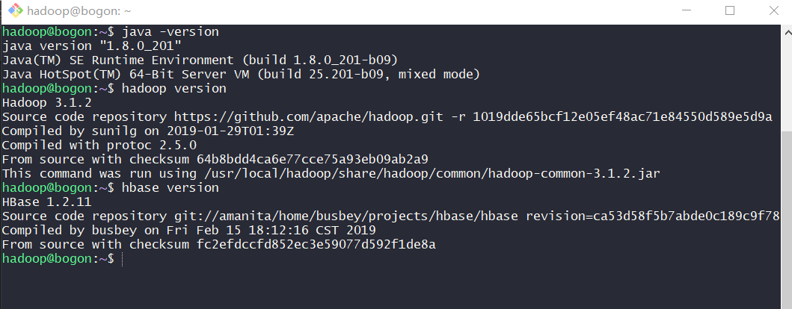

### Hadoop 操作

#### 伪分布配置

将 JDK 的路径(`echo $JAVA_HOME`)添加到 `hadoop-env.sh` 文件

```bash
sudo vi /usr/local/hadoop/etc/hadoop/hadoop-env.sh
# export JAVA_HOME=/usr/lib/jvm/java
```

修改配置文件 `/usr/local/hadoop/etc/hadoop/core-site.xml`

```xml
<configuration>
    <property>
        <name>hadoop.tmp.dir</name>
        <value>file:/usr/local/hadoop/tmp</value>
        <description>A base for other temporary directories.</description>
    </property>
    <property>
        <name>fs.defaultFS</name>
        <value>hdfs://localhost:9000</value>
    </property>
</configuration>
```

修改配置文件 `/usr/local/hadoop/etc/hadoop/hdfs-site.xml`

```xml
<configuration>
    <property>
        <name>dfs.replication</name>
        <value>1</value>
    </property>
    <property>
        <name>dfs.namenode.name.dir</name>
        <value>file:/usr/local/hadoop/tmp/dfs/name</value>
    </property>
    <property>
        <name>dfs.datanode.data.dir</name>
        <value>file:/usr/local/hadoop/tmp/dfs/data</value>
    </property>
</configuration>
```

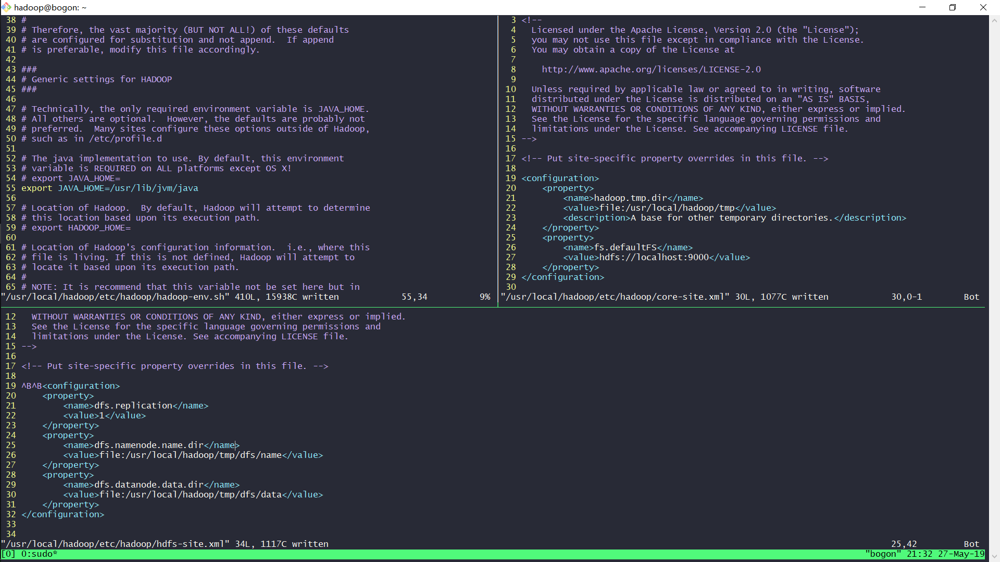


执行 NameNode 格式化

```bash
/usr/local/hadoop/bin/hdfs namenode -format
```

启动namenode和datanode进程，并查看启动结果

```bash
/usr/local/hadoop/sbin/start-dfs.sh
```

启动完成后，可以通过命令 jps 来判断是否成功启动

```bash
jps
```

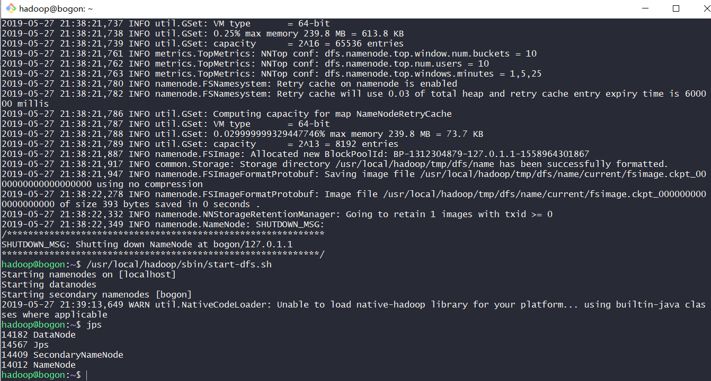

成功启动后，也可以访问 Web 界面 http://localhost:9870 查看 NameNode 和 Datanode 信息，还可以在线查看 HDFS 中的文件

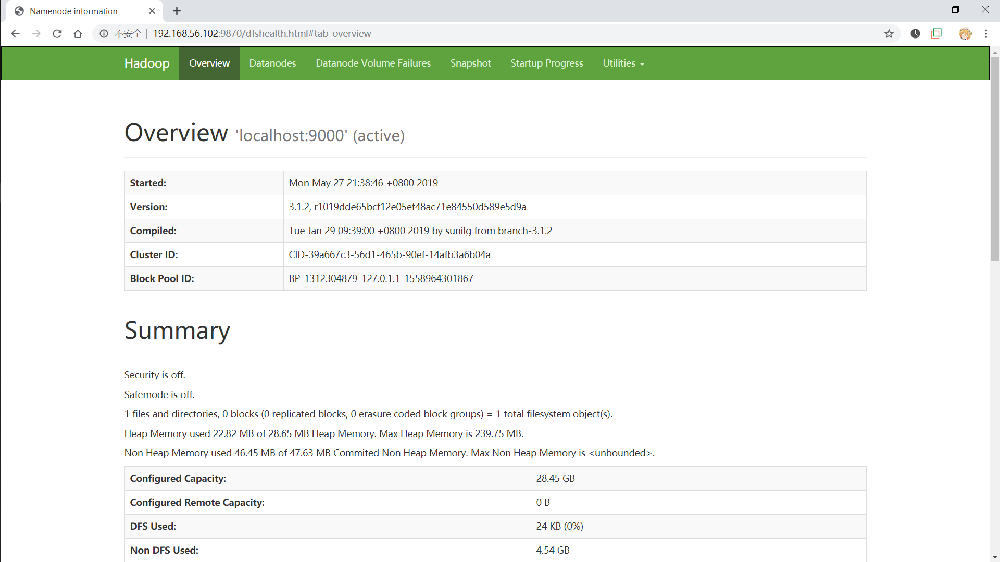

#### 运行 Hadoop 伪分布式实例

创建用户目录

```bash
cd /usr/local/hadoop/bin/
hdfs dfs -mkdir -p /user/hadoop
```

将 `/usr/local/hadoop/etc/hadoop` 中的 xml 文件作为输入文件复制到分布式文件系统中的 `/user/hadoop/input` 中

```bash
hdfs dfs -mkdir input
hdfs dfs -put ../etc/hadoop/*.xml input
```

复制完成后，可以通过如下命令查看文件列表

```bash
hdfs dfs -ls input
```

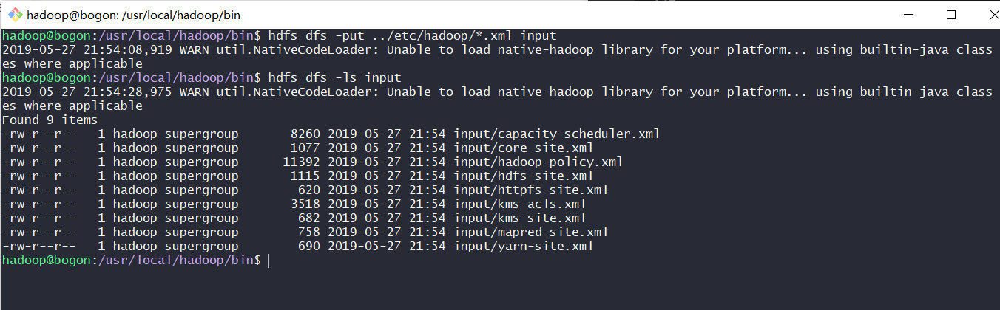

运行一些例子

```bash
hadoop jar ../share/hadoop/mapreduce/hadoop-mapreduce-examples-*.jar grep input output 'dfs[a-z.]+'
```

查看运行结果的命令

```bash
hdfs dfs -cat output/*
```

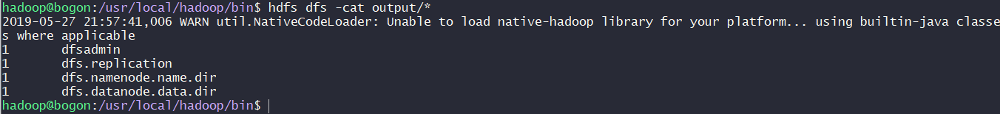

在网页上查看结果

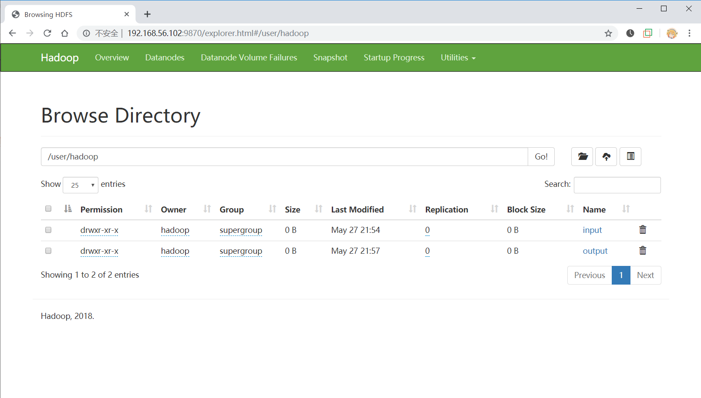

删除执行结果

```bash
hdfs dfs -rm -r output    # 删除 output 文件夹
```

关闭 hadoop

```bash
/usr/local/hadoop/sbin/stop-dfs.sh
```

#### YARN 单机配置

<!-- 将 JDK 的路径(echo $JAVA_HOME)添加到 yarn-env.sh 文件

```bash
sudo vi /usr/local/hadoop/etc/hadoop/yarn-env.sh
# export JAVA_HOME=/usr/lib/jvm/java
``` -->

修改配置文件 `/usr/local/hadoop/etc/hadoop/mapred-site.xml`

```xml
<configuration>
    <property>
        <name>mapreduce.framework.name</name>
        <value>yarn</value>
    </property>
</configuration>
```

修改配置文件 `/usr/local/hadoop/etc/hadoop/yarn-site.xml`

```xml
<configuration>
    <property>
        <name>yarn.nodemanager.aux-services</name>
        <value>mapreduce_shuffle</value>
    </property>
</configuration>
```

启动 ResourceManager daemon 和 NodeManager daemon

```bash
/usr/local/hadoop/sbin/start-yarn.sh
```

访问 Web 界面 http://localhost:8088 查看 ResourceManager 信息

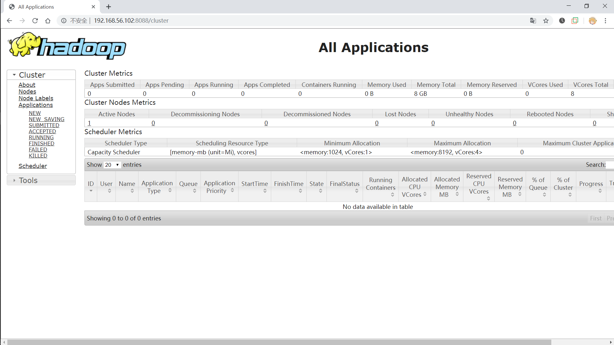

停止 YARN

```bash
/usr/local/hadoop/sbin/stop-yarn.sh
```

### Hbase 操作

#### 单机运行 standalone

修改配置文件 `/usr/local/hbase/conf/hbase-env.sh`，添加 JAVA_HOME 配置

将 JDK 的路径(`echo $JAVA_HOME`)添加到 `hbase-env.sh` 文件

```bash
sudo vi /usr/local/hbase/conf/hbase-env.sh
# export JAVA_HOME=/usr/lib/jvm/java
# export HBASE_MANAGES_ZK=true
```

修改配置文件 `/usr/local/hbase/conf/hbase-site.xml`

```xml
<configuration>
    <property>
        <name>hadoop.rootdir</name>
        <value>file:/usr/local/hbase/tmp</value>
    </property>
</configuration>
```
 
采用如下命令启动服务、查看进程和启动客户端

```bash
/usr/local/hbase/bin/start-hbase.sh

# 查看运行结果
jps

# 进入交互界面
hbase shell
```

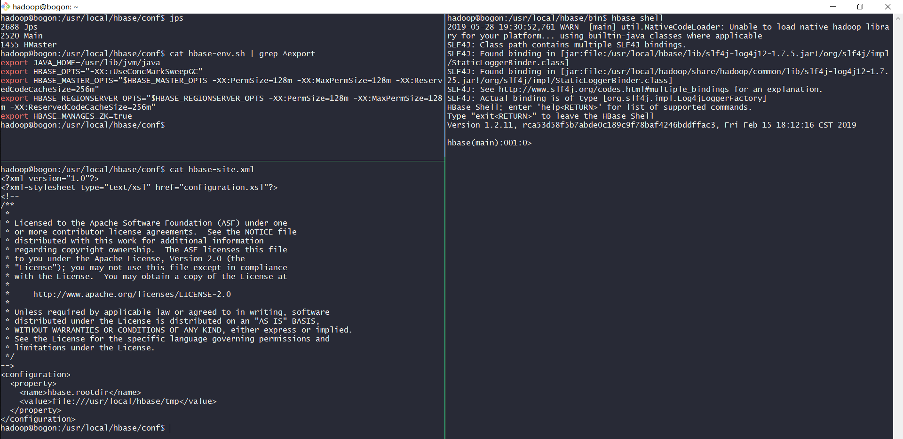

#### 伪分布配置 cluster

修改配置文件 `/usr/local/hbase/conf/hbase-site.xml`

```xml
<configuration>
    <property>
        <name>hadoop.rootdir</name>
        <value>hdfs://localhost:9000/hbase</value>
    </property>
    <property>
        <name>hadoop.cluster.distributed</name>
        <value>true</value>
    </property>
</configuration>
```

启动服务

```bash
/usr/local/hadoop/sbin/start-dfs.sh
/usr/local/hbase/bin/start-hbase.sh
jps
```

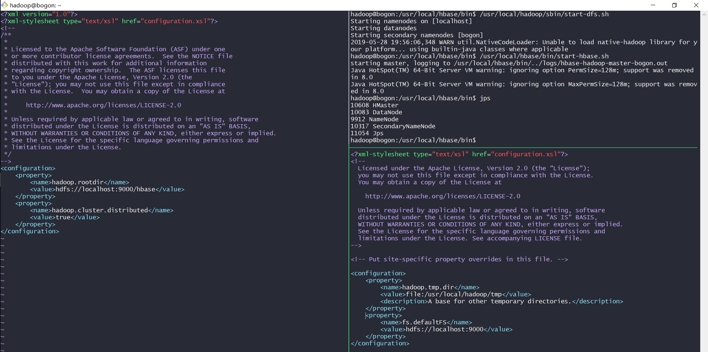

查看 DFS 中 Hbase 目录，自动创建
```bash
hdfs dfs -ls hbase
```

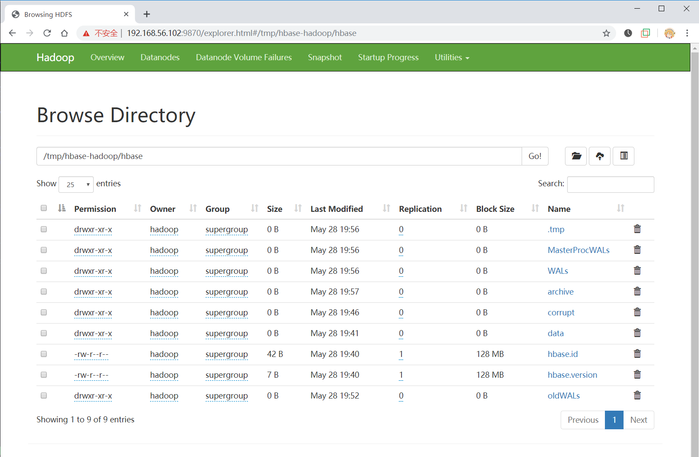

#### HMaster
启动 HMaster Server
- 控制 HBase 集群

用 `localmaster-backup.sh` 启动. 为每个后备 HMaster 加一个 16000 端口之上的偏移量，启动后可以查看结果

```bash
/usr/local/hbase/bin/local-master-backup.sh start 2 3 5
jps
```

启动和停止附加区域服务器 RegionServers

```bash
/usr/local/hbase/bin/local-regionservers.sh start 2 3 4 5
jps
```

进入交互页面

```bash
hbase shell
```

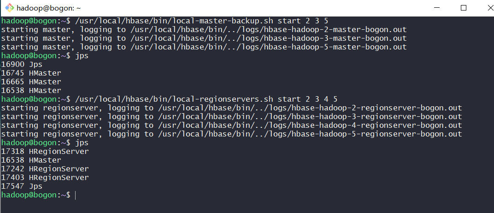

##### 基本数据库操作

创建表
- 使用 create 命令创建一个新表，必须规定表名和列族名

```sql
create 'test', 'cf'
```

显示表信息
- 使用 list 命令可以显示表信息
- 使用 describe 命令显示表的详细信息

```sql
list 'test'
describe 'test'
```

向表中加入数据

```sql
put 'test', 'row1', 'cf:a', 'value1'
put 'test', 'row2', 'cf:b', 'value2'
put 'test', 'row3', 'cf:c', 'value3'
```

扫描表

```sql
scan 'test'
```

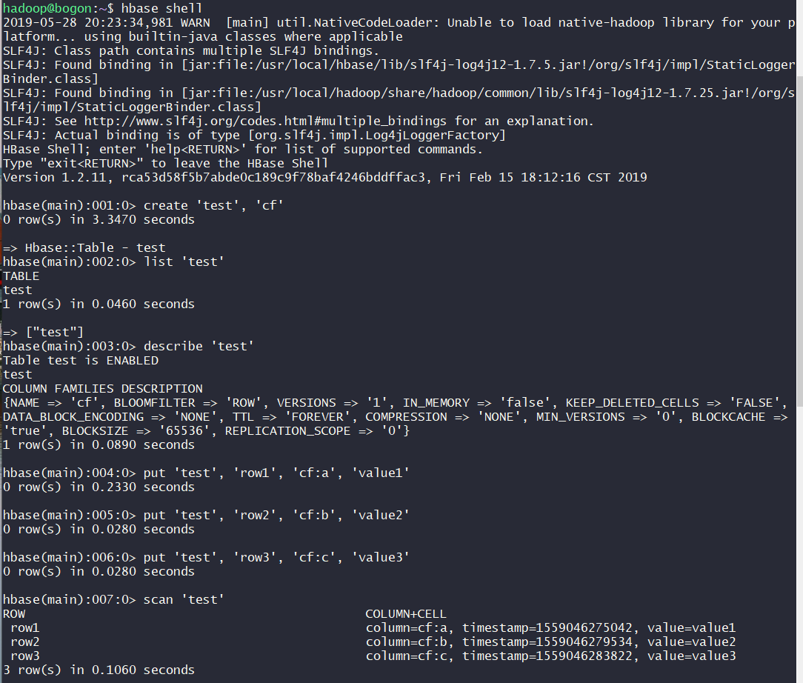

读取一行数据

```sql
get 'test', 'row1'
```

禁用表

```sql
disable 'test'
enable 'test'
```

删除表

```sql
drop 'test'
```

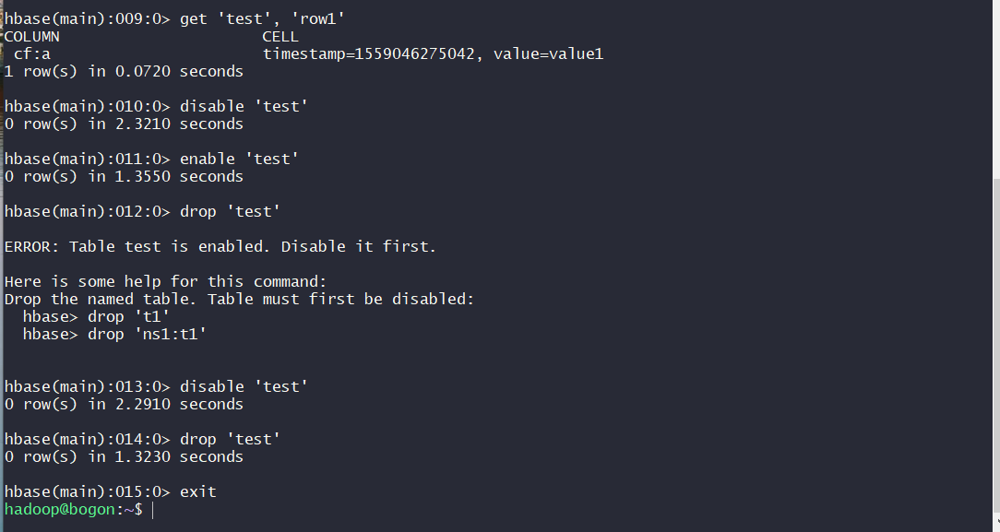

### 参阅
- [Ubuntu18.04下Hadoop 3的安装与配置（伪分布式环境）](https://fuhailin.github.io/Hadoop-Install/)
- [Hbase error zookeeper exists failed after 3 retiries](https://stackoverflow.com/questions/31674331/hbase-error-zookeeper-exists-failed-after-3-retiries)
- [Apache HBase ™ Reference Guide](https://hbase.apache.org/1.2/book.html)