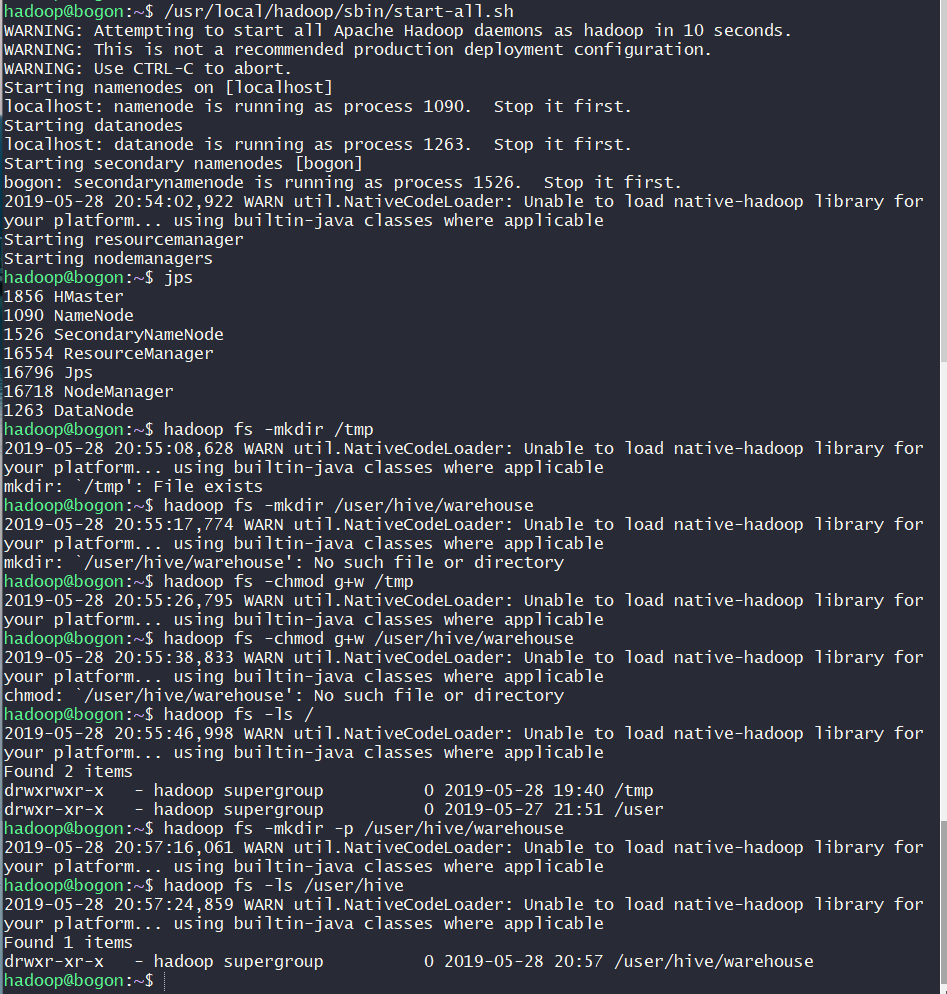
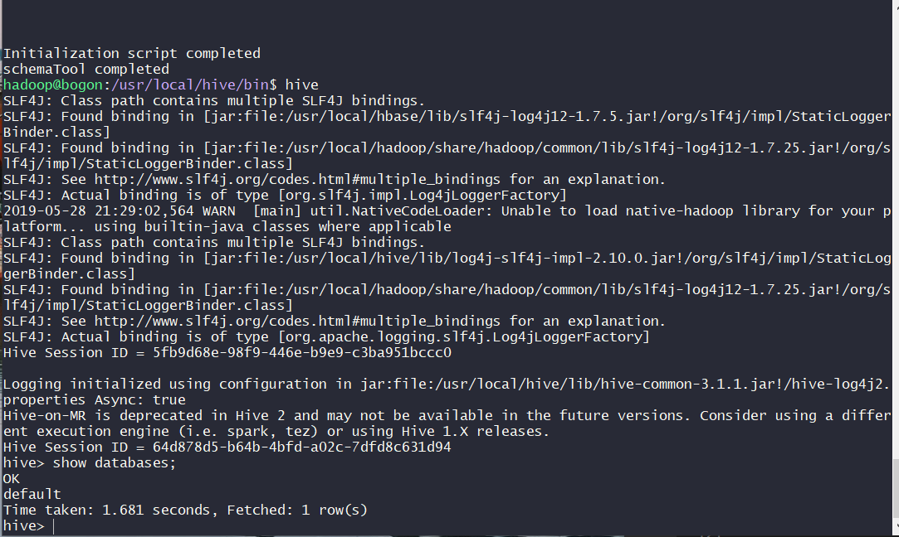
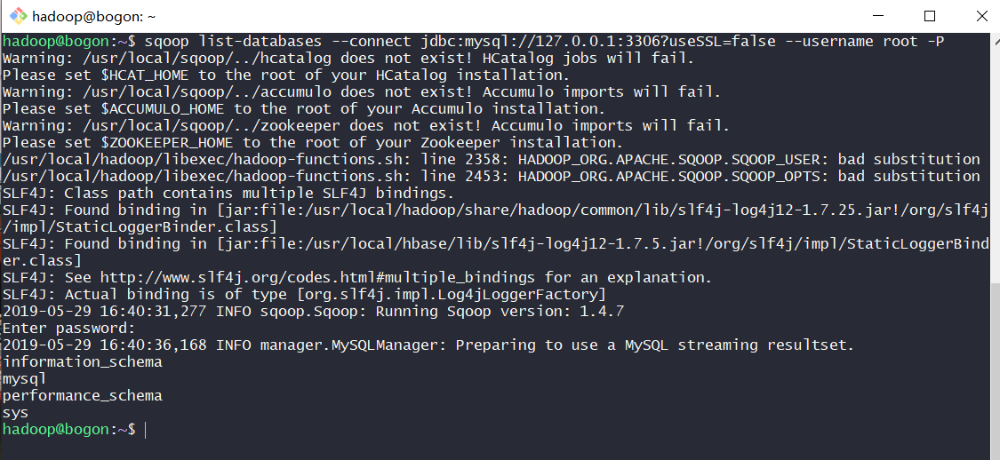

## 实验3 —— Hive、Sqoop 安装

### 实验环境
- Ubuntu 18.04.1 Server
- ssh 免密登录操作
- 切换到 hadoop 用户：`su - hadoop`

### 安装 Hive 与 Sqoop

将本机 Windows 上的文件上传至服务器的 hadoop 用户下的文件夹

```bash
scp *.gz hadoop@192.168.56.102:~      # 需要输入密码
```

安装 Hive-3.1.1

```bash
sudo tar -zxvf apache-hive-3.1.1-bin.tar.gz -C /usr/local   # 解压到 /usr/local 目录下
cd /usr/local
sudo mv apache-hive-3.1.1-bin hive                          # 将文件夹名改为 hive
sudo chown -R hadoop:hadoop hive                            # 修改文件权限
sudo vi ~/.bashrc                                           # 给 hive 配置环境变量
# export HIVE_HOME=/usr/local/hive
# export PATH=$PATH:$HIVE_HOME/bin

source ~/.bashrc                                            # 使新配置的环境变量生效
```

安装 sqoop-1.4.7

```bash
sudo tar -zxvf sqoop-1.4.7.bin__hadoop-2.6.0.tar.gz -C /usr/local   # 解压到 /usr/local 目录下
cd /usr/local
sudo mv sqoop-1.4.7.bin__hadoop-2.6.0 sqoop                         # 将文件夹名改为 sqoop
sudo chown -R hadoop:hadoop sqoop                                   # 修改文件权限
sudo vi ~/.bashrc                                                   # 给 sqoop 配置环境变量
# export SQOOP_HOME=/usr/local/sqoop
# export PATH=$PATH:$SBT_HOME/bin:$SQOOP_HOME/bin
# export CLASSPATH=$CLASSPATH:$SQOOP_HOME/lib

source ~/.bashrc                                                    # 使新配置的环境变量生效
# sqoop version                                                       # 检测是否安装成功，查看 sqoop 版本
```

安装 mysql

```bash
sudo apt-get update                 # 更新
sudo apt-get install mysql-server   # 安装 mysql
sudo mysql                          # 设置 root 密码
```

将 root 密码设置为 `password`，并刷新权限
- 完成后用 `mysql -u root -p` 并输入密码进入数据库

```sql
ALTER USER 'root'@'localhost' IDENTIFIED WITH mysql_native_password BY 'password';
FLUSH PRIVILEGES;
EXIT;
```

安装 mysql-connector-java-5.1.41

```bash
sudo tar -zxvf mysql-connector-java-5.1.41.tar.gz           # 解压mysql 
cd mysql-connector-java-5.1.41
cp mysql-connector-java-5.1.41-bin.jar /usr/local/sqoop/lib # 将 mysql 驱动包拷贝到 /usr/local/sqoop/lib
```

### Hive 操作

启用默认配置文件

```bash
cd /usr/local/hive/conf
cp hive-default.xml.template hive-default.xml
```

启动 hadoop

```bash
/usr/local/hadoop/sbin/start-all.sh
```

在 hdfs 中建立 hive 相关文件夹

```bash
hadoop fs -mkdir /tmp
hadoop fs -mkdir -p /user/hive/warehouse
hadoop fs -chmod g+w /tmp
hadoop fs -chmod g+w /user/hive/warehouse
```

查看结果

```bash
hadoop fs -ls /
hadoop fs -ls /user/hive
```



创建配置文件 `/usr/local/hive/conf/hive-site.xml`

```xml
<property>
    <name>javax.jdo.option.ConnectionURL</name>
    <value>jdbc:derby:/usr/local/hive/metastore_db;databaseName=metastore_db;create=true</value>
</property>
```

初始化 hive 元数据库，元数据库采用 derby

```bash
schematool -dbType derby -initSchema
```

启动 hive 客户端

```bash
hive
```

查看数据库

```sql
show databases;
```



### Sqoop 操作

修改配置文件 `/usr/local/sqoop/conf/sqoop-env.sh`

```bash
cd /usr/local/sqoop/conf
cp sqoop-env-template.sh sqoop-env.sh

sudo vi sqoop-env.sh
# export HADOOP_COMMON_HOME=/usr/local/hadoop
# export HADOOP_MAPRED_HOME=/usr/local/hadoop
# export HBASE_HOME=/usr/local/hbase
# export HIVE_HOME=/usr/local/hive
```

测试与 MYSQL 的连接

```bash
sqoop list-databases --connect jdbc:mysql://127.0.0.1:3306?useSSL=false --username root -P  # 输入密码
```



### 参阅
- [How To Install MySQL on Ubuntu 18.04](https://www.digitalocean.com/community/tutorials/how-to-install-mysql-on-ubuntu-18-04)
- [mysql doesn't ask for root password when installing](https://askubuntu.com/questions/766900/mysql-doesnt-ask-for-root-password-when-installing)
- [FAILED: HiveException java.lang.RuntimeException: Unable to instantiate org.apache.hadoop.hive.ql.metadata.SessionHiveMetaStoreClient](https://askubuntu.com/questions/1073035/failed-hiveexception-java-lang-runtimeexception-unable-to-instantiate-org-apac)
- [ERROR 1698 (28000): Access denied for user 'root'@'localhost'](https://stackoverflow.com/questions/39281594/error-1698-28000-access-denied-for-user-rootlocalhost)