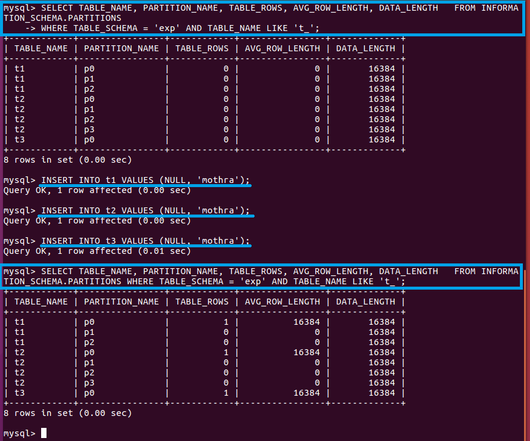

## 实验1 —— MYSQL分区

### 实验环境
- Ubuntu 16.04 Desktop
- MYSQL 5.7

### 准备工作

安装 MYSQL 后登录

```bash
# 以root用户登录
mysql -r root -p
```

创建并使用数据库

```sql
CREATE DATABASE exp;
SHOW DATABASES;
USE exp;
```

### 实验步骤

#### 1、分区使用

建表并分区

```sql
CREATE TABLE employees(
	id INT NOT NULL,
	fname VARCHAR(30),
	lname VARCHAR(30),
	job_code INT NOT NULL,
	store_id INT NOT NULL
)
PARTITION BY RANGE (store_id)(
    PARTITION p0 VALUES LESS THAN (6),
    PARTITION p1 VALUES LESS THAN (11),
    PARTITION p2 VALUES LESS THAN (16),
    PARTITION p3 VALUES LESS THAN (21)
);

CREATE TABLE employees1(
	id INT NOT NULL,
	fname VARCHAR(30),
	lname VARCHAR(30),
	job_code INT NOT NULL,
	store_id INT NOT NULL
)
PARTITION BY RANGE (store_id)(
    PARTITION p0 VALUES LESS THAN (6),
    PARTITION p1 VALUES LESS THAN (11),
    PARTITION p2 VALUES LESS THAN (16),
    PARTITION p3 VALUES LESS THAN MAXVALUE
);
```

查看分区

```sql
SHOW CREATE TABLE employees\G;
SHOW CREATE TABLE employees1\G;
```


分析这两个分区方式有何不同，向两个表插入记录时会有何不同结果

```sql
INSERT INTO employees VALUES(1, 'zhang', 'san', 1, 21);
INSERT INTO employees1 VALUES(1, 'zhang', 'san', 1, 21);
```


两个表都按照 store_id 的值进行分区
- employees 的四个分区分别是小于6、小于11、小于16、小于21，插入 store_id 值为21时系统无法将其放入任何一个分区，因此报错
- employees1 的四个分区分别是小于6、小于11、小于16、小于最大值，系统将会把所有 store_id 大于等于16的数据存放到p3分区，因此记录插入成功

向 employees1 插入数据

```sql
INSERT INTO employees1 VALUES
    (2, 'zhang', 'san', 1, 2),
    (3, 'zhang', 'san', 1, 7),
    (4, 'zhang', 'san', 1, 10),
    (5, 'zhang', 'san', 1, 15),
    (6, 'zhang', 'san', 1, 17),
    (7, 'zhang', 'san', 1, 19),
    (8, 'zhang', 'san', 1, 20),
    (9, 'zhang', 'san', 1, 10),
    (10, 'zhang', 'san', 1, 2);
```

查看分区，查看查询使用分区

```sql
-- EXPLAIN语句提供有关MySQL如何执行语句的信息
-- ego       (\G) Send command to mysql server, display result vertically.
EXPLAIN SELECT * FROM employees1 \G
EXPLAIN SELECT * FROM employees1 WHERE store_id < 11 \G
```


记录结果，分析结果有何不同？解释可能的原因。
- `partitions`
    - 选择全部的数据将会从4个分区内选择
    - 选择 store_id 小于11的数据将会从p0、p1分区选择
- `rows`
    - 所有10条记录
    - 满足条件的5条记录
- `Extra`
    - 无条件
    - 使用 where 限定

#### 2、列表划分

建表并分区

```sql
CREATE TABLE h2(
    c1 INT,
    c2 INT
)
PARTITION BY LIST(c1)(
    PARTITION p0 VALUES IN (1, 4, 7),
    PARTITION p1 VALUES IN (2, 5, 8)
);
```

插入数据

```sql
INSERT INTO h2 VALUES (3, 5);
INSERT IGNORE INTO h2 VALUES (2, 5), (6, 10), (7, 5), (3, 1), (1, 9);
```


观察插入的结果并记录，解释为何会得到这对应结果
- p0分区只能存放 c1 值为 1/4/7的数据，p1分区只能存放 c1 值为2/5/8的数据
- 第一个插入语句的 c1 值为3无法插入，报错
- 第二个插入语句使用 `IGNORE` 忽略指令插入操作时的警告，将除了 (3,1)、(6,10) 的数据成功插入表中

#### 3、散列分区

删除表并重建

```sql
DROP TABLE employees;
CREATE TABLE employees(
	id INT NOT NULL,
	fname VARCHAR(30),
	lname VARCHAR(30),
	job_code INT NOT NULL,
	store_id INT NOT NULL
)
PARTITION BY HASH(store_id)
PARTITIONS 4;
```

插入记录

```sql
INSERT INTO employees VALUES
    (1, 'zhang', 'san', 1, 1),
    (2, 'zhang', 'si', 1, 2),
    (3, 'zhang', 'wu', 2, 3),
    (4, 'zhang', 'liu', 2, 4),
    (4, 'zhang', 'qi', 2, 5);
```

查看分区情况

```sql
SELECT TABLE_NAME, PARTITION_NAME, TABLE_ROWS, AVG_ROW_LENGTH, DATA_LENGTH  FROM INFORMATION_SCHEMA.PARTITIONS
WHERE TABLE_SCHEMA = 'exp' AND TABLE_NAME LIKE 'employees';

-- EXPLAIN语句提供有关MySQL如何执行语句的信息
EXPLAIN PARTITIONS SELECT store_id FROM employees WHERE store_id in (1, 5);
```


记录得到的结果并分析
- 以 store_id 的哈希值作为分区依据，分为4个分区，推测1、5在同一个分区
- MYSQL 以取模结果为分区依据

#### 4、键值分区

新建表并插入记录

```sql
CREATE TABLE k1(
    id INT NOT NULL PRIMARY KEY,
    name VARCHAR(20)
)
PARTITION BY KEY()
PARTITIONS 2;

INSERT INTO k1 VALUES
    (1, 'zhang'),
    (2, 'si'),
    (3, 'wu'),
    (4, 'liu');

SELECT TABLE_NAME, PARTITION_NAME, TABLE_ROWS, AVG_ROW_LENGTH, DATA_LENGTH  FROM INFORMATION_SCHEMA.PARTITIONS
WHERE TABLE_SCHEMA = 'exp' AND TABLE_NAME LIKE 'k1';

-- EXPLAIN语句提供有关MySQL如何执行语句的信息
EXPLAIN PARTITIONS SELECT store_id FROM employees WHERE store_id in (1, 3);
EXPLAIN PARTITIONS SELECT store_id FROM employees WHERE store_id in (2, 4);
EXPLAIN PARTITIONS SELECT store_id FROM employees WHERE store_id in (1, 2);
```


记录得到的结果并分析
- 默认以主键为分区依据，分为2个分区，推测1、3在同一个分区
- 有点类似根据哈希值进行分区

#### 5、分区中的空值处理

创建表并分区

```sql
CREATE TABLE t1 (
    c1 INT,
    c2 VARCHAR(20)
)
PARTITION BY RANGE(c1) (
    PARTITION p0 VALUES LESS THAN (0),
    PARTITION p1 VALUES LESS THAN (10),
    PARTITION p2 VALUES LESS THAN MAXVALUE
);

CREATE TABLE t2 (
    c1 INT,
    c2 VARCHAR(20)
)
PARTITION BY RANGE(c1) (
    PARTITION p0 VALUES LESS THAN (-5),
    PARTITION p1 VALUES LESS THAN (0),
    PARTITION p2 VALUES LESS THAN (10),
    PARTITION p3 VALUES LESS THAN MAXVALUE
);

CREATE TABLE t3 (
    c1 INT,
    c2 VARCHAR(20)
)
PARTITION BY HASH(c1);
```

查看创建的分区

```sql
SELECT TABLE_NAME, PARTITION_NAME, TABLE_ROWS, AVG_ROW_LENGTH, DATA_LENGTH   FROM INFORMATION_SCHEMA.PARTITIONS
WHERE TABLE_SCHEMA = 'exp' AND TABLE_NAME LIKE 't_';
```


插入空记录

```sql
INSERT INTO t1 VALUES (NULL, 'mothra');
INSERT INTO t2 VALUES (NULL, 'mothra');
INSERT INTO t3 VALUES (NULL, 'mothra');
```



结果有何不同？推测一下散列表分区会如何处理空值。
- 分区默认 NULL 小于任何一个非零数字，因此当插入数据为 NULL 时将会被放到第一个分区中

#### 6、分区选择

创建表并插入数据

```sql
CREATE TABLE employees2 (
    id INT NOT NULL AUTO_INCREMENT PRIMARY KEY,
    fname VARCHAR(25) NOT NULL,
    lname VARCHAR(25) NOT NULL,
    store_id INT NOT NULL,
    department_id INT NOT NULL
) 
PARTITION BY RANGE(id) (
    PARTITION p0 VALUES LESS THAN (5),
    PARTITION p1 VALUES LESS THAN (10),
    PARTITION p2 VALUES LESS THAN (15),
    PARTITION p3 VALUES LESS THAN MAXVALUE
);

INSERT INTO employees2 VALUES
    (NULL, 'Bob', 'Taylor', 3, 2), (NULL, 'Frank', 'Williams', 1, 2),
    (NULL, 'Ellen', 'Johnson', 3, 4), (NULL, 'Jim', 'Smith', 2, 4),
    (NULL, 'Mary', 'Jones', 1, 1), (NULL, 'Linda', 'Black', 2, 3),
    (NULL, 'Ed', 'Jones', 2, 1), (NULL, 'June', 'Wilson', 3, 1),
    (NULL, 'Andy', 'Smith', 1, 3), (NULL, 'Lou', 'Waters', 2, 4),
    (NULL, 'Jill', 'Stone', 1, 4), (NULL, 'Roger', 'White', 3, 2),
    (NULL, 'Howard', 'Andrews', 1, 2), (NULL, 'Fred', 'Goldberg', 3, 3),
    (NULL, 'Barbara', 'Brown', 2, 3), (NULL, 'Alice', 'Rogers', 2, 2),
    (NULL, 'Mark', 'Morgan', 3, 3), (NULL, 'Karen', 'Cole', 3, 2);
```

指定分区进行查询

```sql
SELECT * FROM employees2 PARTITION (p1);
```


观察查询结果与 `SELECT * FROM employees2;` 有何不同，说明主要区别。
- `PARTITION` 指定从分区中选择数据

#### 7、分区效率测试

创建表并导入数据，查看 order_status 并依此分区

```sql
-- 建表
CREATE TABLE orders (
    order_id INT PRIMARY KEY,
    order_date DATETIME,
    order_customer_id INT,
    order_status VARCHAR(45)
);

-- 将记录导入表中
LOAD DATA LOCAL INFILE '/home/user/Desktop/orders' INTO TABLE orders FIELDS TERMINATED BY ',';

-- 查看总数 68884
SELECT COUNT(*) FROM orders;

-- 查看 order_id 范围
SELECT MIN(order_id), MAX(order_id) FROM orders;
```

根据以上操作得到分区所需信息，新建表并按 order_id 进行分区

```sql
-- 建表，按订单编号分区
CREATE TABLE orders1 (
    order_id INT PRIMARY KEY,
    order_date DATETIME,
    order_customer_id INT,
    order_status VARCHAR(45)
)
PARTITION BY RANGE(order_id)(
    PARTITION p0 VALUES LESS THAN (20000),
    PARTITION p1 VALUES LESS THAN (40000),
    PARTITION p2 VALUES LESS THAN (60000),
    PARTITION p3 VALUES LESS THAN MAXVALUE
);

-- 将记录导入表中
LOAD DATA LOCAL INFILE '/home/user/Desktop/orders' INTO TABLE orders1 FIELDS TERMINATED BY ',';
```

获得查询所需信息，开启 profile

```sql
-- 计算1/4 17221
SELECT 68884/4;

-- 计算1/2 34442
SELECT 68884/2;

-- 开启 PROFILE
show variables like '%profil%';
set profiling = 1;
```

设计如下查询：
- 特定行
- 全部记录
- 约1/4记录
- 50%记录

```sql
-- 全部记录
SELECT * FROM orders;
SELECT * FROM orders1;0/35

-- 1/2记录 68884/2=34442
SELECT * FROM orders LIMIT 34442;
SELECT * FROM orders1 LIMIT 34442;

-- 1/4记录
SELECT * FROM orders LIMIT 17221;
SELECT * FROM orders1 LIMIT 17221;

-- 特定记录
SELECT * FROM orders WHERE order_id=68883;
SELECT * FROM orders1 WHERE order_id=68883;

-- 查看结果
SHOW PROFILES;
```


结论
- 查询记录较多时，分区的速度更快；查询记录较少时，不分区的速度更快
- 推测分区时并行执行的，因此在数据量大的情况下效率会更高

### 参阅
- [22.2.1 RANGE Partitioning](https://dev.mysql.com/doc/refman/5.7/en/partitioning-range.html)
- [8.8.2 EXPLAIN Output Format](https://dev.mysql.com/doc/refman/5.7/en/explain-output.html)
- [13.2.5 INSERT Syntax](https://dev.mysql.com/doc/refman/5.7/en/insert.html)
- [22.2.4 HASH Partitioning](https://dev.mysql.com/doc/refman/5.7/en/partitioning-hash.html)
- [22.2.5 KEY Partitioning](https://dev.mysql.com/doc/refman/5.7/en/partitioning-key.html)
- [22.2.7 How MySQL Partitioning Handles NULL](https://dev.mysql.com/doc/refman/5.7/en/partitioning-handling-nulls.html)
- [22.5 Partition Selection](https://dev.mysql.com/doc/refman/5.7/en/partitioning-selection.html)
- [3.3.3 Loading Data into a Table](https://dev.mysql.com/doc/refman/5.7/en/loading-tables.html)
- [13.7.5.30 SHOW PROFILE Syntax](https://dev.mysql.com/doc/refman/5.7/en/show-profile.html)
