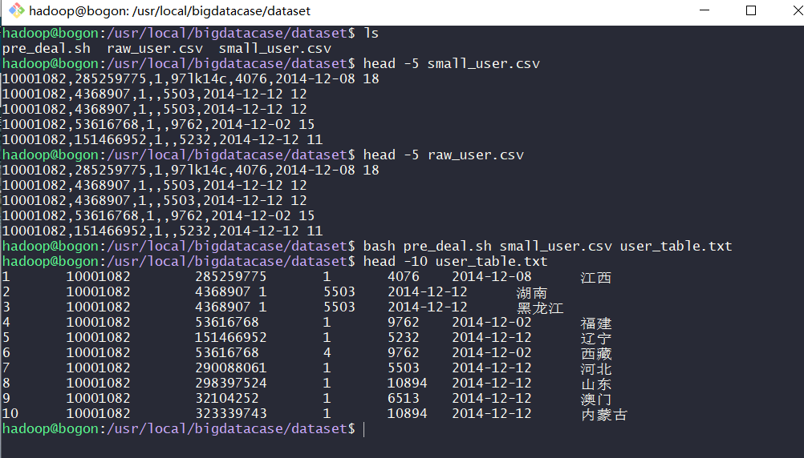
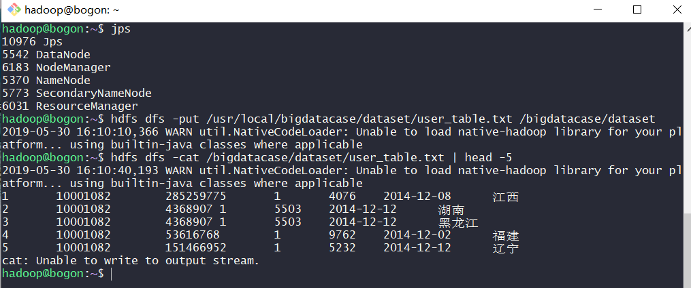
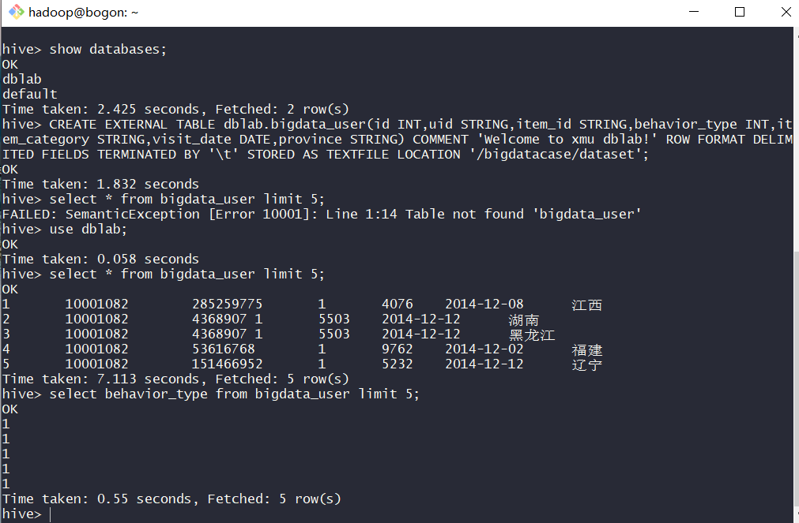
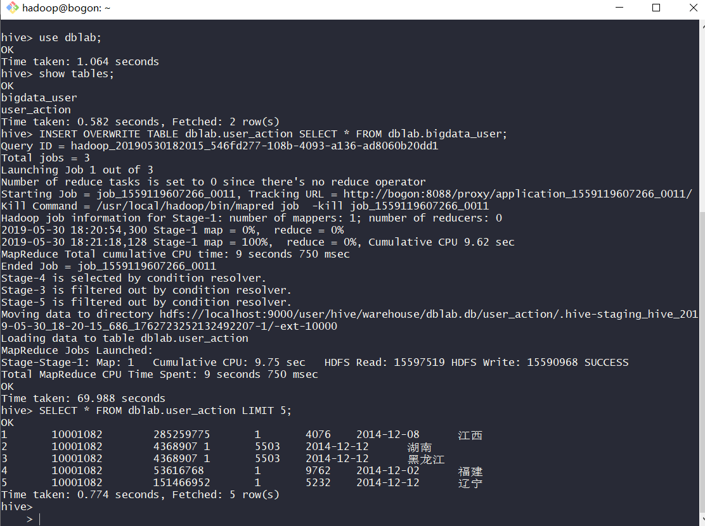
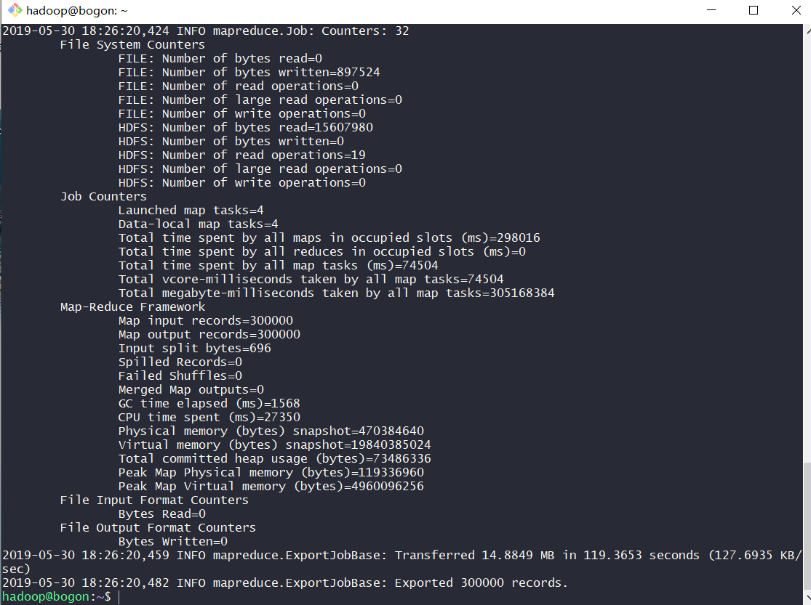
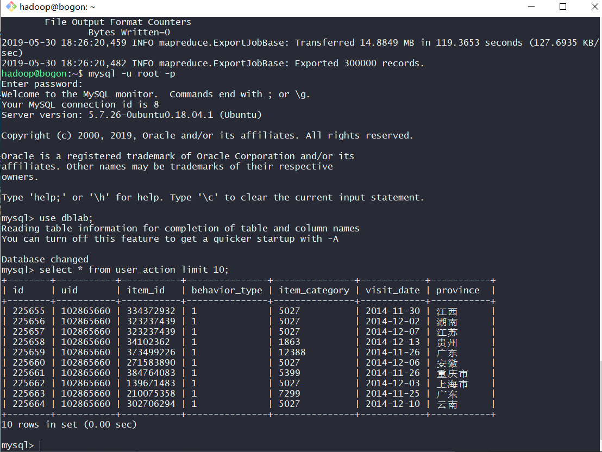
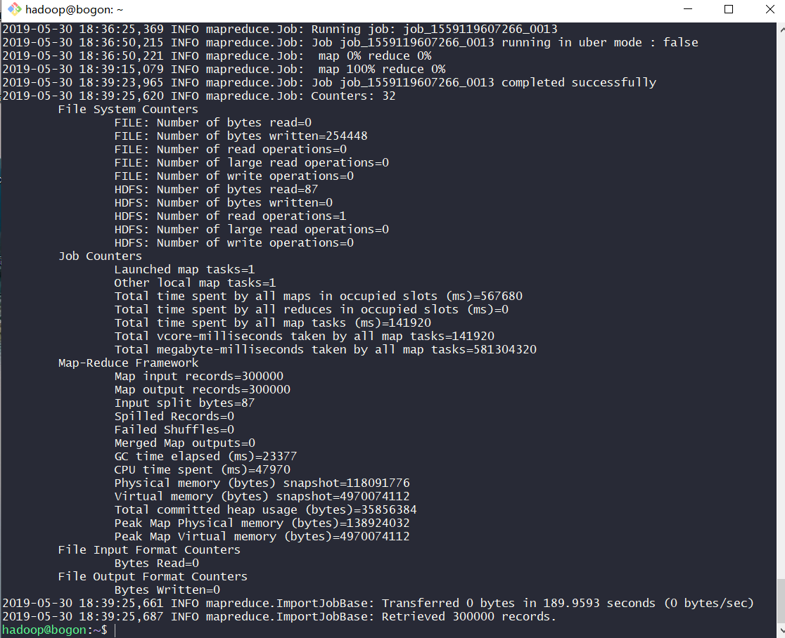
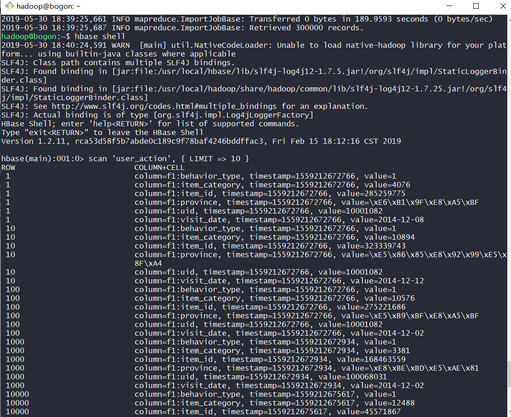

## 实验4 —— 数据上传Hive + 数据库间互导

### 实验环境
- Ubuntu 18.04.1 Server
- ssh 免密登录
- 切换到 hadoop 用户：`su - hadoop`

### 本地数据集上传到 Hive

将本机 Windows 上的文件上传至服务器的 hadoop 用户下的文件夹

```bash
scp *.gz hadoop@192.168.56.102:~      # 需要输入密码
```

创建文件夹用于保存数据集

```bash
sudo mkdir /usr/local/bigdatacase           # 创建文件夹
cd /usr/local
sudo chown -R hadoop:hadoop bigdatacase     # 修改文件权限
mkdir bigdatacase/dataset                   # 创建文件夹保存数据集
```

将实验数据复制到上述步骤创建的文件夹

```bash
cp *.csv /usr/local/bigdatacase/dataset
```

数据处理

```bash
# 查看前 5 行
head -5 small_user.csv

# 删除第一行字段名称
sed -i '1d' small_user.csv
sed -i '1d' raw_user.csv

# 查看结果
head -5 small_user.csv
head -5 raw_user.csv
```

编写脚本对字段进行预处理

```bash
sudo vi pre_deal.sh                             # 编写脚本
bash pre_deal.sh small_user.csv user_table.txt  # 处理数据
head -10 user_table.txt                         # 查看前 10 行数据
```



将数据导入 Hive

1. 启动 HDFS

```bash
/usr/local/hadoop/sbin/start-all.sh
```

2. 将 user_table.txt 上传到 HDFS 中

```bash
hdfs dfs -mkdir -p /bigdatacase/dataset                                             # 创建文件夹
hdfs dfs -put /usr/local/bigdatacase/dataset/user_table.txt /bigdatacase/dataset    # 上传文件
hdfs dfs -cat /bigdatacase/dataset/user_table.txt | head -10                        # 查看上传的文件
```



3. 在 Hive 上创建数据库

```bash
hive    # 启动 hive
```

```sql
create database dblab;
use dblab;
```

4. 创建外部表

```sql
CREATE EXTERNAL TABLE dblab.bigdata_user(id INT,uid STRING,item_id STRING,behavior_type INT,item_category STRING,visit_date DATE,province STRING) COMMENT 'Welcome to xmu dblab!' ROW FORMAT DELIMITED FIELDS TERMINATED BY '\t' STORED AS TEXTFILE LOCATION '/bigdatacase/dataset';
```

5. 查询数据

```sql
select * from bigdata_user limit 5;
select behavior_type from bigdata_user limit 5;
```



### Hive, Mysql, Hbase 数据互导

#### 1. Hive 预操作

启动 Hadoop

```bash
/usr/local/hadoop/sbin/start-all.sh
```

启动 MYSQL

```bash
service mysql start
```

启动 Hive

```bash
hive
```

#### 2. 创建临时表

```sql
create table dblab.user_action(id STRING, uid STRING, item_id STRING, behavior_type STRING, item_category STRING, visit_date DATE, province STRING) COMMENT 'Welcome to XMU dblab! ' ROW FORMAT DELIMITED FIELDS TERMINATED BY '\t' STORED AS TEXTFILE;
```

查看创建的数据文件

```sql
hdfs dfs -ls /user/hive/warehouse/dblab.db/user_action
```

#### 3. 将 bigdata_user 表中的数据插入到 user_action

进入 Hive 

```sql
INSERT OVERWRITE TABLE dblab.user_action SELECT * FROM dblab.bigdata_user;
SELECT * FROM dblab.user_action LIMIT 5;
```

> 遇到错误 FAILED: Execution Error, return code 2 from org.apache.hadoop.hive.ql.exec.mr.MapRedTask

在 `/usr/local/hadoop/etc/hadoop/mapred-site.xml` 中添加如下内容

```xml
    <property>
        <name>yarn.app.mapreduce.am.env</name>
        <value>HADOOP_MAPRED_HOME=$HADOOP_HOME</value>
    </property>
    <property>
        <name>mapreduce.map.env</name>
        <value>HADOOP_MAPRED_HOME=$HADOOP_HOME</value>
    </property>
    <property>
        <name>mapreduce.reduce.env</name>
        <value>HADOOP_MAPRED_HOME=$HADOOP_HOME</value>
    </property>
    <property>
        <name>mapreduce.map.memory.mb</name>
        <value>4096</value>
    </property>
    <property>
        <name>mapreduce.reduce.memory.mb</name>
        <value>8192</value>
    </property>
    <property>
        <name>mapreduce.map.java.opts</name>
        <value>-Xmx3072m</value>
    </property>
    <property>
        <name>mapreduce.reduce.java.opts</name>
        <value>-Xmx6144m</value>
    </property>
```



#### 4. 使用 Sqoop 将数据从 Hive 导入 MySQL

a. 为导入的数据创建相应数据库及表
(1) 登录 MYSQL

```bash
mysql -u root -p
```

(2) 创建数据库及数据表
```sql
show databases;         # 显示所有数据库
create database dblab;  # 创建dblab数据库
use dblab;              # 使用数据库
CREATE TABLE `dblab`.`user_action` (`id` varchar(50),`uid` varchar(50),`item_id` varchar(50),`behavior_type` varchar(10),`item_category` varchar(50), `visit_date` DATE,`province` varchar(20)) ENGINE=InnoDB DEFAULT CHARSET=utf8;
exit;                   # 退出
```

b. 导入数据

修改 mysql 配置文件以支持中文

```bash
sudo vi /etc/mysql/mysql.conf.d/mysqld.cnf  # 配置文件
# character_set_server=utf8
sudo service mysql restart                  # 重启 mysql
```

查看修改结果

```sql
show databases;
use dblab;
show variables like "char%";
```

导入 mysql

```bash
sqoop export --connect jdbc:mysql://127.0.0.1:3306/dblab?useSSL=false --username root -P --table user_action --export-dir '/user/hive/warehouse/dblab.db/user_action' --input-fields-terminated-by '\t';
```



c. 查看 user_action 表数据
```sql
use dblab;
select * from user_action limit 10;
```



#### 5. 使用 Sqoop 将数据从 MYSQL 导入 HBase

a. 启动Hadoop集群、MySQL服务、HBase服务

```bash
/usr/local/hbase/bin/start-hbase.sh
```

b. 创建导入数据对应的数据表

启动 HBase Shell

```bash
hbase shell
```

创建表

```sql
create 'user_action', { NAME => 'f1', VERSIONS => 5}
```

c. 向 Hbase 导入数据

```bash
sqoop import --connect jdbc:mysql://127.0.0.1:3306/dblab --username root -P --table user_action --hbase-table user_action --column-family f1 --hbase-row-key id --hbase-create-table -m 1
```



d. 查看 HBase 中 user_action 表数据

只查询前面10行

```sql
scan 'user_action', { LIMIT => 10 }
```



### 参阅
- [FAILED: Execution Error, return code 2 from org.apache.hadoop.hive.ql.exec.mr.MapRedTask](http://discuss.itversity.com/t/failed-execution-error-return-code-2-from-org-apache-hadoop-hive-ql-exec-mr-mapredtask/7108/3)
- [Hadoop: Could not find or load main class org.apache.hadoop.mapreduce.v2.app.MRAppMaster](https://stackoverflow.com/questions/49675782/hadoop-could-not-find-or-load-main-class-org-apache-hadoop-mapreduce-v2-app-mra)
- [hive程序报FAILED: Execution Error, return code 2 from org.apache.hadoop.hive.ql.exec.mr.MapRedTask](https://blog.csdn.net/qq_26442553/article/details/80143559)
- [hive 执行报beyond physical memory limits](https://blog.csdn.net/zj360202/article/details/38440369)
- [CDH的坑之Sqoop导出数据到MySQL](https://my.oschina.net/u/3754001/blog/1861501)
- [Container is running beyond memory limits](https://stackoverflow.com/questions/21005643/container-is-running-beyond-memory-limits)