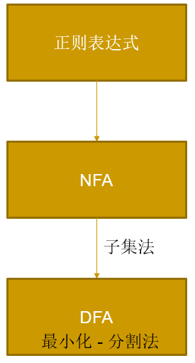
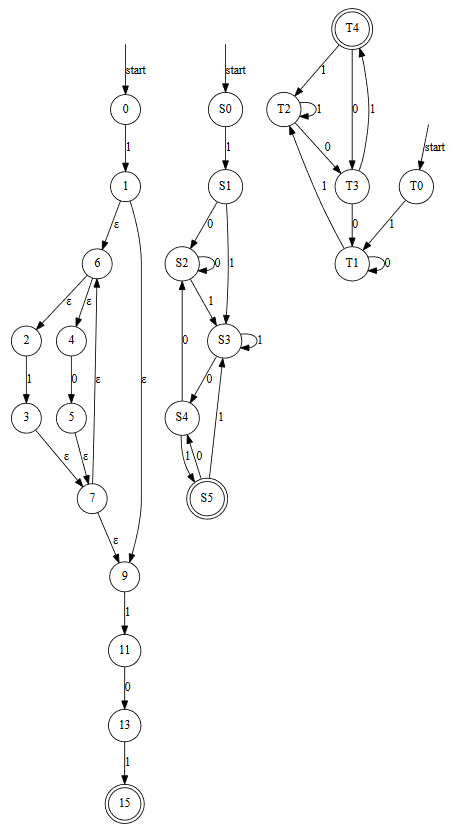

## DFA词法分析python实现

### 流程


### 功能实现
1. 正则表达式规范化

添加被省略的 `·`

```python
# 字符 与 字符
regex = re.sub('(\w)(\w)', r'\1·\2', regex)

# 字符 与 (
# ) 与 (
regex = re.sub(r'(\*)(\w{1}|\()', r'\1·\2', regex)

# * 与 (
# * 与 字符
regex = re.sub(r'(\w|\))(\()', r'\1·\2', regex)
```

2. 构造后缀表达式

根据优先级构造，用到一个操作符栈（列表）

3. 节点结构

起始节点、终止节点、边 [[起始/终止节点，起始/终止/其他结点，权值（符号）], ...]
```python
class node():
    def __init__(self):
        self.start , self.end, self.edges = '', '', []
```

4. 构造NFA

根据后缀表达式进行构造，和算术表达式的计算类似，用到一个操作数（节点）栈
- 有点和边就可以进行绘图了

```python
for s in postfix:
    new node
    if s not in priority:
        node init with s
    else:
        if s == symbol1_in_priority:
            pop node1, node2...
            node init with node1, node2, ...
            change node1, node2, ...
        elif s == symbol2_in_priority:
            ...
    opnd.append(node)
```

5. NFA→DFA - 子集法

5.1 经过任意条ε边能到达的节点

5.2 状态转换表

6. DFA最小化 - 分割法

6.1 统计表

6.2 判断状态

根据DFA统计表，返回相同节点（即无法区分的节点），其状态相同，同为终态或同为初态

判断两个节点是否同时在一个集合中，即是否是同态的

6.3 分割法

### 测试
输入
```
regex = '1(1|0)*101'
```

输出
```
正则表达式： 1(1|0)*101
格式化后： 1·(1|0)*·1·0·1
后缀表达式： 110|*·1·0·1·
```

绘图


### 总结
- 一个月之前的代码了
- 理解和实现都比较简单，但是代码没有详细的注释还超级冗余啊（摔