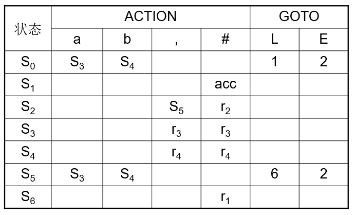
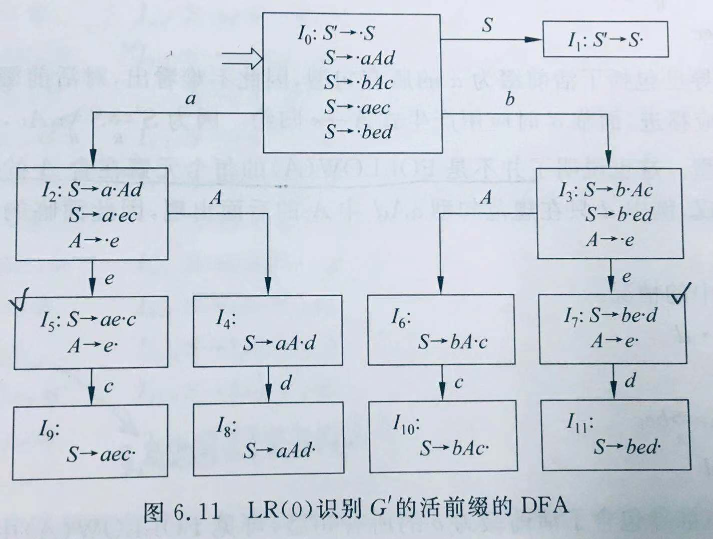
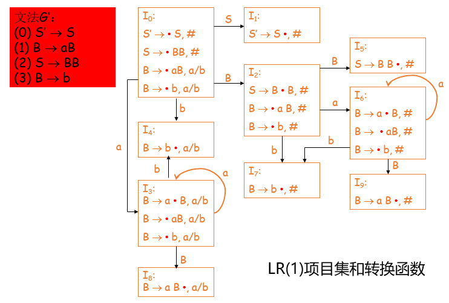

## LR语法分析
代码实现的方法包括LR(0)、SLR(1)、LR(1)、LALR(1)

### LR分析

LR方法是通过求**句柄**逐步归约进行语法分析

LR(k)分析是根据当前分析栈中的符号串和向右顺序查看输入串的k(k≥0)个符号就可以唯一确定分析的动作是移进还是归约以及用哪个产生式归约

从左到右扫描(L)自底向上进行规约(R)是规范规约

以下每一种方式的分析过程都是相同的，不同的是Action表和Goto表的构造

#### 结构
从逻辑上，LR分析由3部分组成
- 总控程序
- 分析表
    - Action表（动作表）
    - Goto表（状态转换）
- 分析栈
    - 文法符号栈
    - 状态栈

Action表中的动作有4种可能，分别是移进、归约、接受、出错

Goto表中包含经过某一非终结符转换到另一状态

分析的动作由栈顶状态和当前输入符号所决定


Action表和Goto表的例子


- 这里的S指的是状态，r指的是归约
- 可以看出Goto表是通过非终结符跳转到另一状态，Action表既包含状态跳转又包含归约和接收
- Goto表和Action表都包含出错，即空白表项

#### 项目集的构造
首先扩充文法，这一步是必要的，为了避免起始符号的产生式有多个导致判断错误

概括来说就是通过加 `·` 进行构造

首先在开始符号的产生式右部最左端添加 `·` ，如果 `·` 后是非终结符，则找出所有该非终结符对应的产生式，并在其左部最左端添加 `·` ，加入到这个项目集中，直到遇到终结符则停止扩充

第一个项目集构造好后，遍历项目集中每个 `·` 后的符号，这些符号就是状态转移的表项依据（Action表和Goto表），然后对对应的产生式进行**移点**的操作，即遇到所期望的符号（ `·` 后的那个符号）就移动 `·` ，移点后的产生式就是新的项目集的第一个产生式，项目集的扩充与之前相同

如果 `·` 在产生式右部的最后，则需要进行归约，此时根据不同的方法在Action表中添加归约项目
- LR(0)，所有Action表项都添加归约
- SLR(1)，根据产生式左部非终结符的Follow集添加归约
- LR(0)，根据向前搜索符添加归约
- LALR(0)，同LR(0)

#### Action表和Goto表的构造
根据项目集的跳转情况进行构建
- 如果是归约项，在Action表中添加表项
- 如果是状态转移，遇到终结符转移添加Action表项，遇到非终结符转移添加Goto表项


#### 分析
初始情况
- 状态栈：[0]
    - 这里的0指的是起始状态，即起始项目集的编号
- 符号栈：[#]

分析过程
- 根据输入符号和状态栈栈顶判断当前动作
    - 移进
        - 输入符号压入符号栈
        - 跳转状态压入状态栈
    - 归约
        - 弹出归约符号，同时弹出等长数量的状态
        - 将归约后的符号压入符号栈，根据当前符号栈栈顶、状态栈栈顶判断当前动作
    - 接受
        - 分析成功，终止分析
    - 出错
        - 分析错误，输出错误，终止分析

#### 包含关系
LR(0) ⊂ SLR(1) ⊂ LALR(1) ⊂ LR(1)

因此LR(0)语法一定是LR(1)语法，LR(1)语法的范围更大，因此LR(1)分析的适用范围也更大，但其复杂度上升

### LR(0)
LR(0)的构造最为简单，根据项目集构造对应的Action表和Goto表即可

但是LR(0)可能会存在多余归约，因为一个项目集里遇到归约时，其Action表会全部设置为归约

而且LR(0)中可能会存在冲突，归约-归约冲突、移进-归约冲突，这使得LR(0)的适用范围比较小


- 其中打勾的项目集中存在移进-归约冲突

### SLR(1)
SLR(1)在LR(0)的基础上进行改进，在项目集中出现冲突时才向前看一个输出符号，即查看产生式左部非终结符的Follow集

*强调一下，这里的向前看是往右看一个符号的意思*

对于归约-归约冲突，查看归约后的符号的Follow集（产生式左部的非终结符），如果两两之间没有交集，就可以解决冲突
- 此时Action表中的归约不是全部设置为一样的（冲突），而是根据Follow集设置

对于移进-归约冲突，和上述的解决方法相同

如果存在冲突的LR(0)文法能用以上方法解决冲突，那么该文法是SLR(1)文法


#### 改进的SLR(1)
不只是对存在冲突的项目集采用上述冲突解决办法，而是在构造Action表和Goto表的时候对所有项目集采用查看Follow集的方式


### LR(1)
如果无法用SLR(1)的方法解决LR(0)中存在的冲突，那么可以采用LR(1)的方法

LR(1)方法中，使用向前搜索符作为产生式归约的搜索符，而SLR(1)中使用的是Follow集。一个项目集中的向前搜索符的构造如下，其中A是起始符号，产生式后的即为向前搜索符
```
A → ·Bb     # #
B → ·Cc     # b
C → ·DE     # c
D → ·a      # First(E) = d
D → ·E      # First(E) = d
E → d       # d
```

向前搜索符的构造用到了非终结符的Follow集，推导出的产生式会根据上一产生式来决定向前搜索符
- 如果上一产生式 `·` 后的二个符号是终结符，则向前搜索符为该终结符
- 如果上一产生式 `·` 后的二个符号是非终结符，则向前搜索符为该非终结符的First集
- 如果上一产生式 `·` 后的二个符号为空，即没有符号，则向前搜索符继承上一产生式

如果是开始产生式（起始的第一个产生式），则向前搜索符为 `#` 

移点后向前搜索符保持不变，只是项目集中新生成的产生式的向前搜索符需要设置


例子



### LALR(1)
如果不看向前搜索符，两个项目集中的产生式相同，称为具有相同的心，将这两个项目集称为同心集。如果将同心集合并后不产生新的冲突，则为LALR(1)文法

同心的集合并只需要将向前搜索符进行合并即可，因为其产生式是相同的。合并同心集后，项目集的数量减少，但项目集中的范围扩大，将会导致LALR(1)比LR(1)更晚发现错误