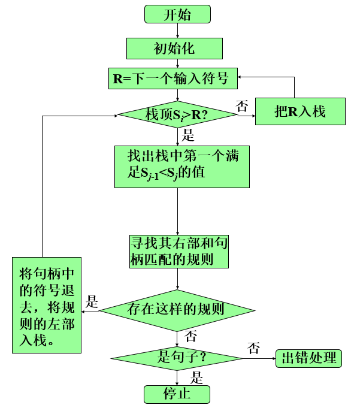
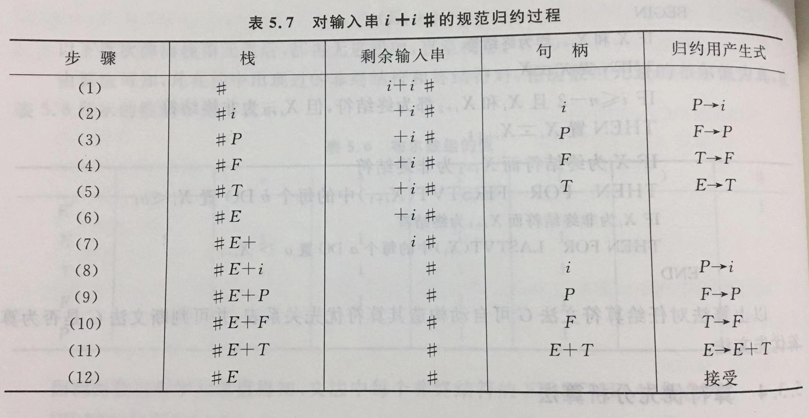
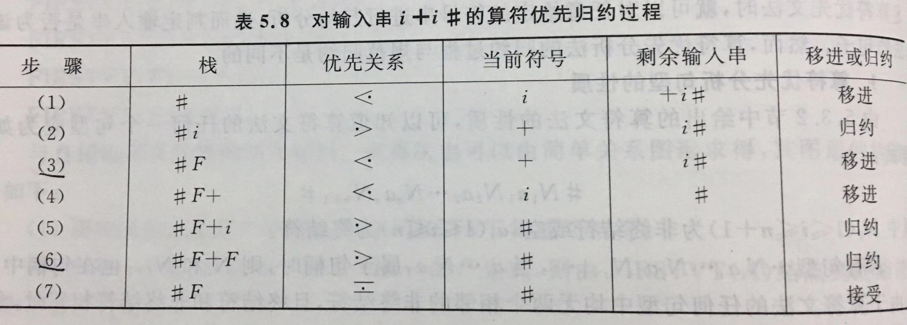

## 自底向上优先分析

基本都采用移进-归约方法，使用一个栈来存放归约得到的符号

归约中的动作
- 移进
    - 读入一个符号并把它归约入栈
- 归约
    - 当栈中的部分形成一个句柄（栈顶的符号序列）时，对句柄进行归约
- 接受
    - 当栈中的符号仅有#和识别符号时，输入符号也到达结尾，执行接受动作
- 错误处理
    - 当识别程序发现错误的时候，表明输入符号串不是句子

规范归约 - 按句柄进行归

句柄 - 可归约串

简单优先分析的基本思想是对一个文法按一定规则求出该文法所有符号（包括终结符和非终结符）之间的优先关系，按照这种关系确定归约过程中的句柄，实际上是一种规范归约

算符优先分析的基本思想是只规定算符之间的优先关系，也就是只考虑终结符之间的优先关系，由于算符优先分析不考虑非终结符之间的优先关系，在归约过程中只要找到可归约串就归约，并不考虑归约到哪个非终结符，因此**算符优先分析不是规范归约**

### 简单优先分析
简单优先分析是按照文法符号（终结符和非终结符）的优先关系确定句柄

#### 简单优先文法
若一个文法是简单优先文法，必须满足以下条件
- 在文法符号集 V 中，任意两个符号之间最多只有一种优先关系成立
    - 保证识别出句柄
- 在文法中，任意两个产生式没有相同的右部
    - 保证可以确定归约到哪个非终结符

#### 优先关系
文法 G 中任意两文法符号 X 和 Y
1. 若 X 和 Y 的优先级相等，表示为 X = Y
    - 当且仅当 G 中存在产生式规则 A → …XY…
2. 若 X 的优先级比 Y 的优先级大，表示为 X > Y
    - 当且仅当 G 中存在产生式规则 A → …XB… ，且 
3. 若 X 的优先级比 Y 的优先性小，表示为 X < Y
    - 当且仅当 G 中存在产生式规则 A → …BD… ，且  和 

这里的 = 、> 、< 和算术表达式中的不同，即 `a>b` 和 `b<a` 是不一样的，不能相互推出

#### 简单优先分析流程图



### 算符优先分析
#### 算符文法 (operator grammar, OG)
任何一个产生式都不包含两个非终结符相邻的情况

#### 算符优先关系
设 G 是一个不含ε产生式的算符文法，a 和 b 是任意两个终结符，A, B, C 是非终结符，算符优先关系 = 、<、> 定义如下
1. a = b 当且仅当 G 中含有形如 A → …ab… 或 A → …aBb… 的产生式
2. a < b 当且仅当 G 中含有形如 A → …aB… 的产生式，且  或 
3. a > b 当且仅当 G 中含有形如 A → …Bb… 的产生式，且  或 

#### 算符优先文法(operator precedence grammar, OPG)
设有一个不含 ε 产生式的算符文法G，如果任一终结符对 (a,b) 之间至多只存在 =、<、> 中的一种关系，则称 G 是一个算符优先文法
- 即优先关系是确定的

#### 算符优先算法
##### 算符优先关系表的构造

其中…表示V*中的符号串


##### 三种优先关系的计算
= 关系
- 直接查看产生式的右部，对如下形式的产生式，有 a = b 成立
```
A→…ab…
A→…aBb…
```

 < 关系
- 求出每个非终结符 B 的 FIRSTVT(B)，对如下形式的产生式，对每一 b ∈ FIRSTVT(B)，有 a < b 成立
```
A→…aB…
```

 \> 关系
- 求出每个非终结符 B 的 LASTVT(B)，对如下形式的产生式，对每一 a ∈ LASTVT(B)，有 a > b成立
```
A→…Bb…
```

##### 例子
表达式文法
```
E' → #E#
E → E+T
E → T
T → T*F
T → F
F → P↑F | P
P → (E)
P → i
```

FIRSTVT集
```
FIRSTVT(E') = {#}
FIRSTVT(E) = {+} ∪ FIRSTVT(T) = {+, *} ∪ FIRSTVT(F) = {+, *, ↑} ∪ FIRSTVT(P) = {+, *, ↑, (, i)}
FIRSTVT(T) = {*} ∪ FIRSTVT(F) = {*, ↑} ∪ FIRSTVT(P) = {*, ↑, (, i)}
FIRSTVT(F) = {↑} ∪ FIRSTVT(P) = {↑, (, i)}
FIRSTVT(P) = {(, i)}
```

LASTVT集
```
LASTVT(E') = {#}
LASTVT(E) = {+} ∪ LASTVT(T) = {+, *} ∪ LASTVT(F) = {+, *, ↑} ∪ LASTVT(P) = {+, *, ↑, ), i}
LASTVT(T) = {+, *} ∪ LASTVT(F) = {*, ↑} ∪ LASTVT(P) = {*, ↑, ), i}
LASTVT(F) = {↑} ∪ LASTVT(P) = {↑, ), i}
LASTVT(P) = {), i}
```

优先关系
```
// = 关系
# = #, ( = )

// < 关系
# < FIRSTVT(E)
+ < FIRSTVT(T)
* < FIRSTVT(F)
↑ < FIRSTVT(F)
( < FIRSTVT(E)

// > 关系
LASTVT(E) > #
LASTVT(E) > +
LASTVT(T) > *
LASTVT(P) > ↑
LASTVT(E) > )
```

优先关系表

 |+|*|↑|i|(|)|#
-|-|-|-|-|-|-|-
+|>|<|<|<|<|>|>
*|>|>|<|<|<|>|>
↑|>|>|<|<|<|>|>
i|>|>|>| | |>|>
(|<|<|<|<|<|=| 
)|>|>|>| | |>|>
\#|<|<|<|<|<| |=

对输入串 `i+i#` 进行简单优先归约（规范归约）


对输入串 `i+i#` 进行算符优先归约（非规范归约）



#### 局限性
可以使用优先函数来替代优先关系表，但是对于没有关系的情况无法进行区分，因而出错时不能准确地指出错误位置

有时，对于一些不属于文法的句子，算符优先分析也可以正确地进行归约。而且通常适用语言的文法也难以满足算符优先文法的条件，因此算符优先文法仅适用于表达式的语法分析。