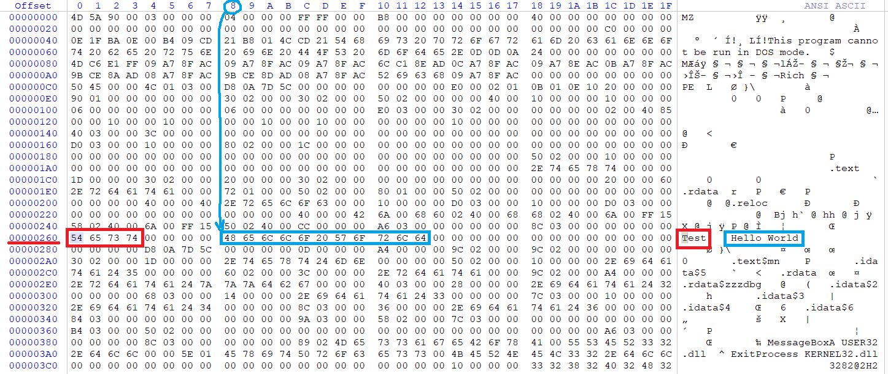
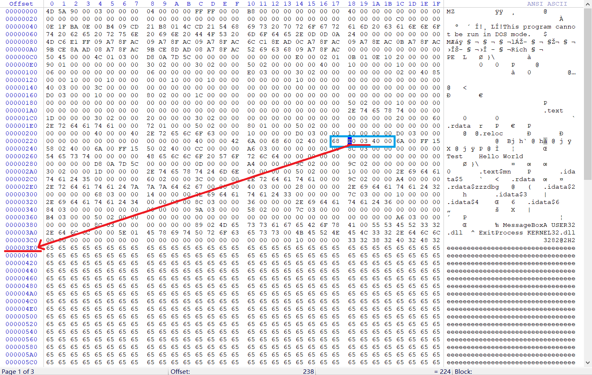
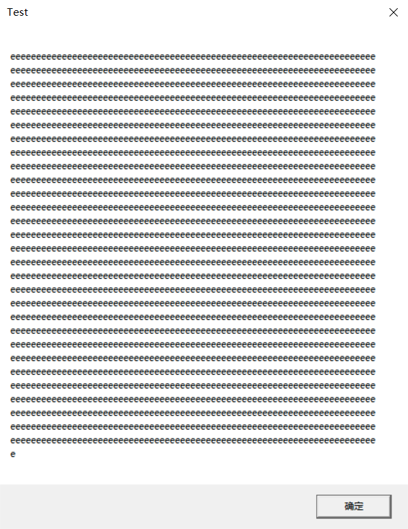
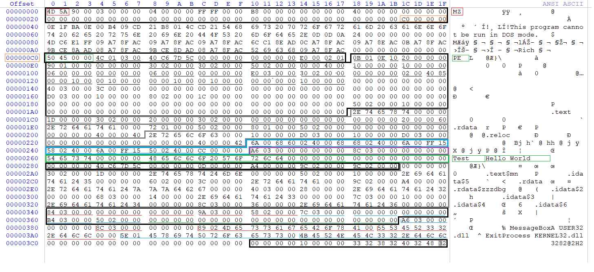
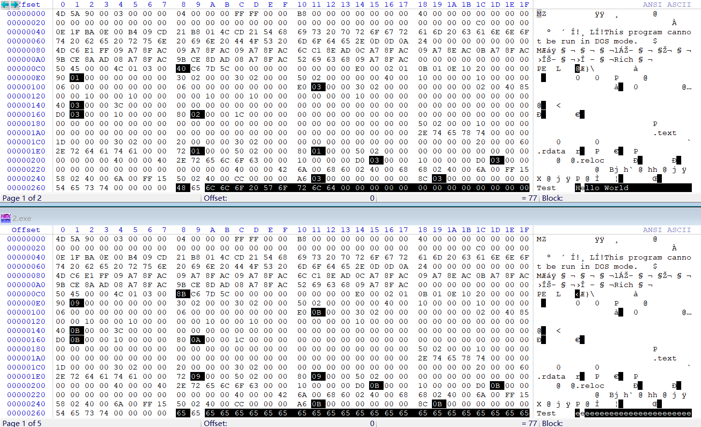
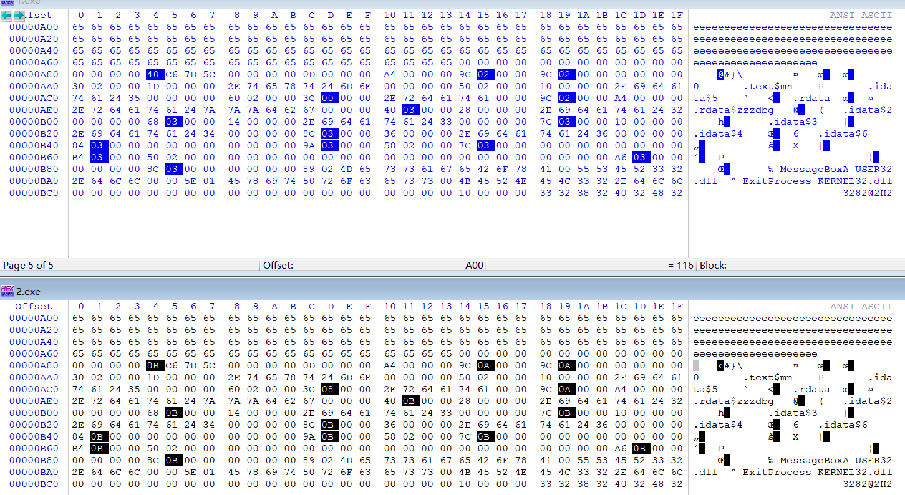

### 2、上一题的程序中，修改的显示内容变为一个很长的字符串（至少2kb长）。并且保证程序正常运行不崩溃。

提示：可执行文件中原有的空间有限，必须要新加入数据，加入数据后必须要修改.text字段中的指针。

#### 文件末尾添加字符串

使用上一题中使用MessageBoxA[生成的可执行文件]()

反汇编：`dumpbin /headers /nologo xxx.exe`

```bash
Dump of file 1.exe

File Type: EXECUTABLE IMAGE

  00400230: 6A 00              push        0
  00400232: 68 60 02 40 00     push        400260h
  00400237: 68 68 02 40 00     push        400268h
  0040023C: 6A 00              push        0
  0040023E: FF 15 58 02 40 00  call        dword ptr ds:[00400258h]
  00400244: 6A 00              push        0
  00400246: FF 15 50 02 40 00  call        dword ptr ds:[00400250h]
  0040024C: CC                 int         3

  Summary

         180 .rdata
          10 .reloc
          20 .text
```

4个push对应MessageBoxA的4个参数，其中 `400260h` 对应 `Text`，`400268h` 对应 `Hello World`。

查看PE文件头信息（以下省略区块表）：`dumpbin /headers /nologo xxx.exe`

```bash

Dump of file 1.exe

PE signature found

File Type: EXECUTABLE IMAGE

FILE HEADER VALUES
             14C machine (x86)
               3 number of sections
        5C7D0AD8 time date stamp Mon Mar  4 19:24:08 2019
               0 file pointer to symbol table
               0 number of symbols
              E0 size of optional header
             102 characteristics
                   Executable
                   32 bit word machine

OPTIONAL HEADER VALUES
             10B magic # (PE32)
           14.16 linker version
              20 size of code
             190 size of initialized data
               0 size of uninitialized data
             230 entry point (00400230)
             230 base of code
             250 base of data
          400000 image base (00400000 to 004003DF)
              10 section alignment
              10 file alignment
            6.00 operating system version
            0.00 image version
            6.00 subsystem version
               0 Win32 version
             3E0 size of image
             230 size of headers
               0 checksum
               2 subsystem (Windows GUI)
            8540 DLL characteristics
                   Dynamic base
                   NX compatible
                   No structured exception handler
                   Terminal Server Aware
          100000 size of stack reserve
            1000 size of stack commit
          100000 size of heap reserve
            1000 size of heap commit
               0 loader flags
              10 number of directories
               0 [       0] RVA [size] of Export Directory
             340 [      3C] RVA [size] of Import Directory
               0 [       0] RVA [size] of Resource Directory
               0 [       0] RVA [size] of Exception Directory
               0 [       0] RVA [size] of Certificates Directory
             3D0 [      10] RVA [size] of Base Relocation Directory
             280 [      1C] RVA [size] of Debug Directory
               0 [       0] RVA [size] of Architecture Directory
               0 [       0] RVA [size] of Global Pointer Directory
               0 [       0] RVA [size] of Thread Storage Directory
               0 [       0] RVA [size] of Load Configuration Directory
               0 [       0] RVA [size] of Bound Import Directory
             250 [      10] RVA [size] of Import Address Table Directory
               0 [       0] RVA [size] of Delay Import Directory
               0 [       0] RVA [size] of COM Descriptor Directory
               0 [       0] RVA [size] of Reserved Directory
```

从输出得知基地址(ImageBase)为 `400000h` ，计算出字符串 `Text` 的地址为 `400260h-400000h=260h`，字符串 `Hello World` 的地址为 `400268h-400000h=268h`。用十六进制编辑器WinHex查看该PE文件，验证地址偏移。



在文件末尾添加2060个 `e` ，然后将.text区块中指向 `Hello World` 的指针改为指向新增的字符串的地址，保存即可。



修改后的程序运行结果如下



#### PE文件分析
对原始的 Hello World 程序进行查看和分析，从上往下、从左往右将每个部分进行划分。对比发现有些信息和微软官网上给出的格式解释有出入，.text 和 .rdata 之间是 IAT 。



- DOS Header
- DOS Stub
- NT Header
  - Signature
  - File Header
  - Optional Header
- Section Header * 3
- .text
- Import Address Table Directory(IAT)
  - IMAGE_THUNK_DATA
- .rdata
- Debug Directory
- Debug Data
- IMAGE_IMPORT_DESCRIPTOR(IID)
- IMAGE_NAME_TABLE(INT)
  - IMAGE_THUNK_DATA
- Base Relocation Directory


#### 直接修改.rdata节
直接比对显示 Hello World 和 2060 个 e 的可执行文件的文件头信息，可以发现大小相差 800H，指针也偏移了 800H，其中时间戳不修改应该没有什么影响。
- 800H 是将 `Hello World` 修改为 2060 个 `e` 并进行对齐后的大小差
- 根据文件结构，需要修改的数据有大小、地址、指针

```bash
λ diff 1-1.txt 2-1.txt
2c2
< Dump of file 1.exe
---
> Dump of file 2.exe
11c11
<         5C7DC640 time date stamp Tue Mar  5 08:43:44 2019
---
>         5C7DC68B time date stamp Tue Mar  5 08:44:59 2019
23c23
<              190 size of initialized data
---
>              990 size of initialized data
28c28
<           400000 image base (00400000 to 004003DF)
---
>           400000 image base (00400000 to 00400BDF)
35c35
<              3E0 size of image
---
>              BE0 size of image
51c51
<              340 [      3C] RVA [size] of Import Directory
---
>              B40 [      3C] RVA [size] of Import Directory
55,56c55,56
<              3D0 [      10] RVA [size] of Base Relocation Directory
<              280 [      1C] RVA [size] of Debug Directory
---
>              BD0 [      10] RVA [size] of Base Relocation Directory
>              A80 [      1C] RVA [size] of Debug Directory
84,87c84,87
<      172 virtual size
<      250 virtual address (00400250 to 004003C1)
<      180 size of raw data
<      250 file pointer to raw data (00000250 to 000003CF)
---
>      972 virtual size
>      250 virtual address (00400250 to 00400BC1)
>      980 size of raw data
>      250 file pointer to raw data (00000250 to 00000BCF)
100c100
<     5C7DC640 coffgrp       A4 0000029C      29C
---
>     5C7DC68B coffgrp       A4 00000A9C      A9C
105c105
<      3D0 virtual address (004003D0 to 004003DF)
---
>      BD0 virtual address (00400BD0 to 00400BDF)
107c107
<      3D0 file pointer to raw data (000003D0 to 000003DF)
---
>      BD0 file pointer to raw data (00000BD0 to 00000BDF)
119c119
<          180 .rdata
---
>          980 .rdata
```

使用 WinHex 直接对比两个文件



将 Hello World 替换为 e 后并进行对齐，再次查看差异



#### 参阅
- [MessageBoxA function](https://docs.microsoft.com/en-us/windows/desktop/api/winuser/nf-winuser-messageboxa)
- [ExitProcess function](https://docs.microsoft.com/en-us/windows/desktop/api/processthreadsapi/nf-processthreadsapi-exitprocess)
- [ImageHlp Structures](https://docs.microsoft.com/zh-cn/windows/desktop/Debug/imagehlp-structures)
- [PE文件解析 系列文章(一)](https://bbs.pediy.com/thread-247114.htm)
- [PE Format](https://docs.microsoft.com/zh-cn/windows/desktop/Debug/pe-format)
- [PE .rdata section contents](https://reverseengineering.stackexchange.com/questions/6941/pe-rdata-section-contents)
- [PE Format Walkthrough](PE-Format-Walkthrough.pdf)
- [PE Format Layout](PE-Format-Layout.pdf)