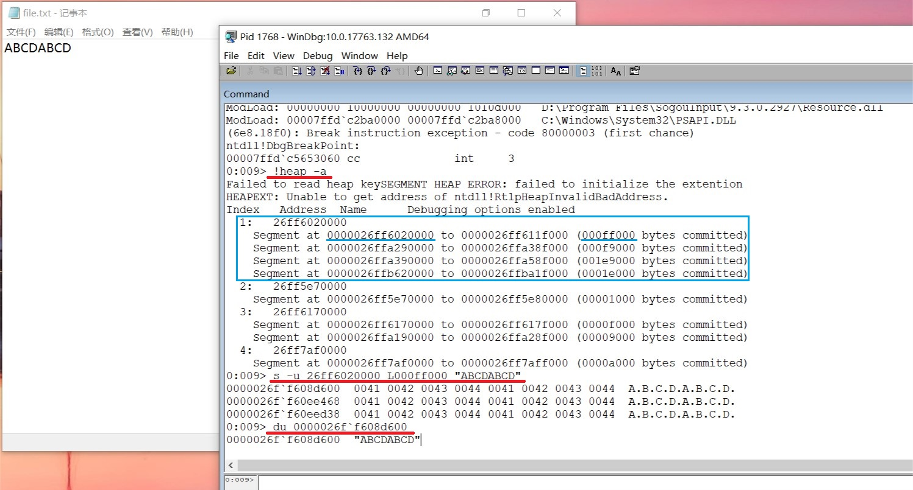
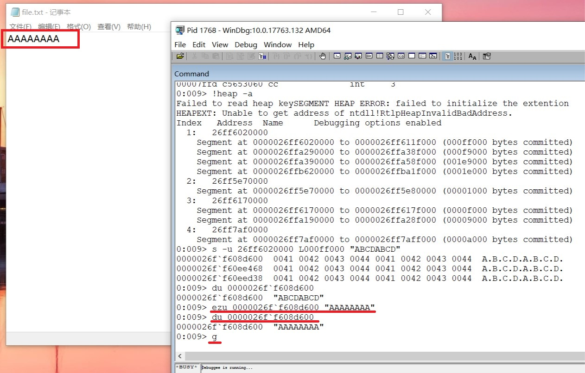

### 3、在notepad（32位64位均可）中，输入一段文字。然后使用调试器，在内存中修改这段文字。使得没有在界面操作notepad的修改文字的情况下。notepad中显示的文字变化。

提示：在调试器中定位控件缓存的内存地址，可以用搜索、逆向、消息截获分析、API截获分析等方法。

#### Windbg直接修改内存

原理：找到存放字符串的内存地址，对其进行修改，再让进程继续执行。

使用WinDbg依次点击 `File - Attach to a Process(F6)` 附加到notepad进程。列出已分配的堆，并在其中查找字符串 `ABCDABCD`。

```
# 查看所有堆
!heap -a

# 查找字符串
s -u 26ff6020000 L000ff000 "ABCDABCD"

# 显示Unicode
du 0000026f`f608d600
```



对第一个内存位置的数据进行修改，并让进程继续运行。此时记事本最小化重新从任务栏弹出，显示修改后的字符串。

```
# 修改字符串
ezu 0000026f`f608d600 "AAAAAAAA"

# 显示Unicode
du 0000026f`f608d600

# 继续运行程序
g
```



#### 参阅
- [windbg修改notepad内容(!pte/!dd/.process/s命令)](https://blog.csdn.net/lixiangminghate/article/details/53086667)
- [!heap](https://docs.microsoft.com/en-us/windows-hardware/drivers/debugger/-heap)
- [s (Search Memory)](https://docs.microsoft.com/en-us/windows-hardware/drivers/debugger/s--search-memory-)
- [d, da, db, dc, dd, dD, df, dp, dq, du, dw (Display Memory)](https://docs.microsoft.com/en-us/windows-hardware/drivers/debugger/d--da--db--dc--dd--dd--df--dp--dq--du--dw--dw--dyb--dyd--display-memor)
- [e, ea, eb, ed, eD, ef, ep, eq, eu, ew, eza (Enter Values)](https://docs.microsoft.com/en-us/windows-hardware/drivers/debugger/e--ea--eb--ed--ed--ef--ep--eq--eu--ew--eza--ezu--enter-values-)
- [g (Go)](https://docs.microsoft.com/en-us/windows-hardware/drivers/debugger/g--go-)