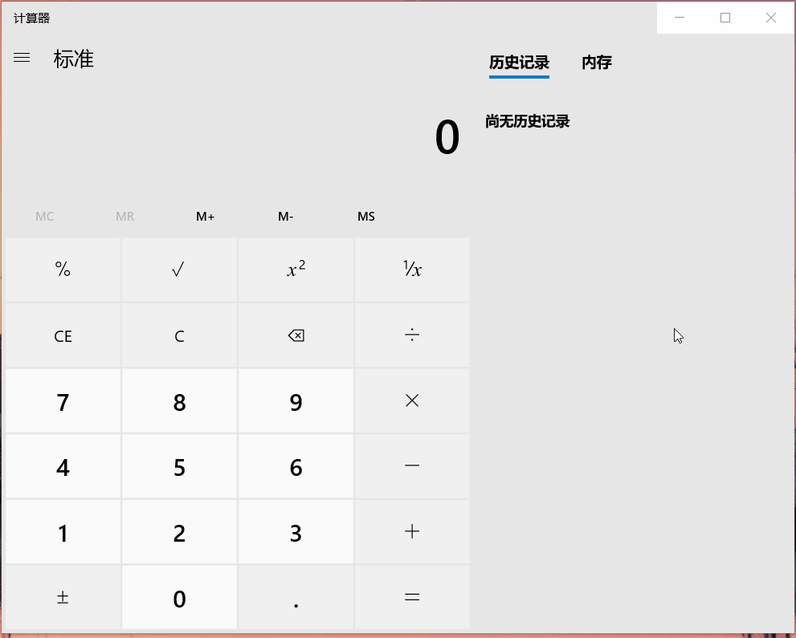

### 4、通过调试器监控计算器程序的运行，每当运行结果为666时，就改为999。

提示：找到运行结果在内存中保存的地址。监控 “=” 按键消息等。

#### 设置条件断点
- 实验环境：Win10
- 实验对象：calc.exe x64

原理：监控输出结果，当其为666时则改为999即可

总结：
- 小bug就是输入666也会变成999，但不影响之后的计算和结果
- 没什么技巧，单步调试看两天就能找到了（lay了lay了）

#### 参阅
- [x64dbg’s documentation](https://x64dbg.readthedocs.io/en/latest/)