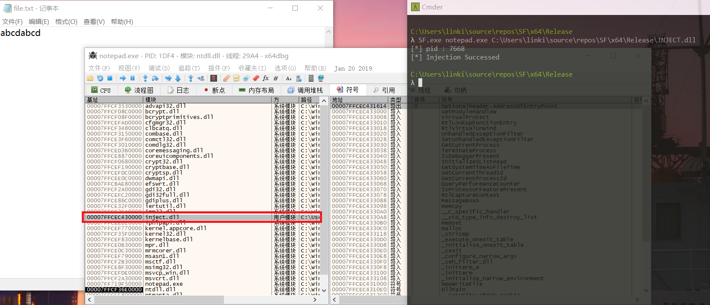

### 5、通过API hook的方法，在每次notepad保存txt文件时，就将文件内容修改为 “you have been hacked!”

提示：API hook 的关键是编写一个假函数，用假函数的指针替换IAT中真函数的指针（当然这种方式只能对通过IAT调用的管用，但是够了。）在假函数调用真函数，修改真函数的参数和返回的数据，将修改后的数据返回给调用者。

#### 实验环境
- 实验环境：Win10
- 实验对象：notepad.exe x64

#### API hook

找到dll在内存中的加载位置，通过修改第一个字节（引发断点异常）来对参数进行修改，最后再复原，继续调用函数。

#### IAT hook

写一个假函数dll，再用dll注入的方式让目标进程加载假函数dll。当调用函数 `WriteFile` 时将会调用假函数，将缓存内容修改后再调用原来的函数，以达到修改保存内容的目的。

IAT Hook 的结果

#### 参阅
- [Taking a Snapshot and Viewing Processes](https://docs.microsoft.com/zh-cn/windows/desktop/ToolHelp/taking-a-snapshot-and-viewing-processes)
- [寄存器使用](https://docs.microsoft.com/zh-cn/previous-versions/visualstudio/visual-studio-2008/9z1stfyw(v%3dvs.90))