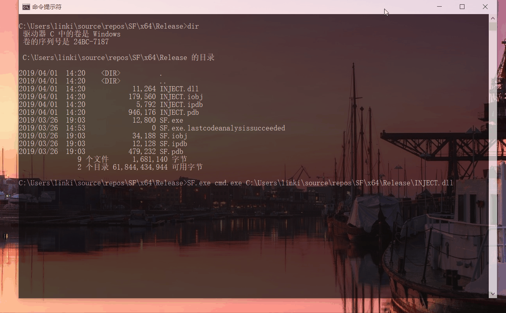

### 6、通过API hook的方法，使得cmd的dir命令看不到任意目录下的hacker.exe 

提示：首先需要分析dir是通过什么API的调用来遍历目录的，然后hook相关函数。

#### 实验环境
- 实验环境：Win10
- 实验对象：cmd.exe

#### 实验过程

##### 调试

一开始断到了 `ntdll.dll` 的 `ZwQueryDirectoryFileEx` 然后折腾半天发现cmd的导入表里根本就没有，妄想用 `JMP` 指令（好难，不会）

课上老师给了 hint : `FindNextFileW`。用调试器显然可以断到，但是查看cmd的导入表会发现该函数是在 `api-ms-win-core-file-l1-1-0.dll` 中，并没有像[官方](https://docs.microsoft.com/en-us/windows/desktop/api/fileapi/nf-fileapi-findnextfilew#requirements)给出那样导入 `kernel32.dll`。

##### IAT hook

上一个任务中已经使用过 IAT hook 了，这次稍微修改就能复用，不同的是得先调用原函数然后再返回，之前是先修改参数再调用原函数。

#### 代码

详见代码注释

#### 参阅
- [FindNextFileW function](https://docs.microsoft.com/en-us/windows/desktop/api/fileapi/nf-fileapi-findnextfilew)