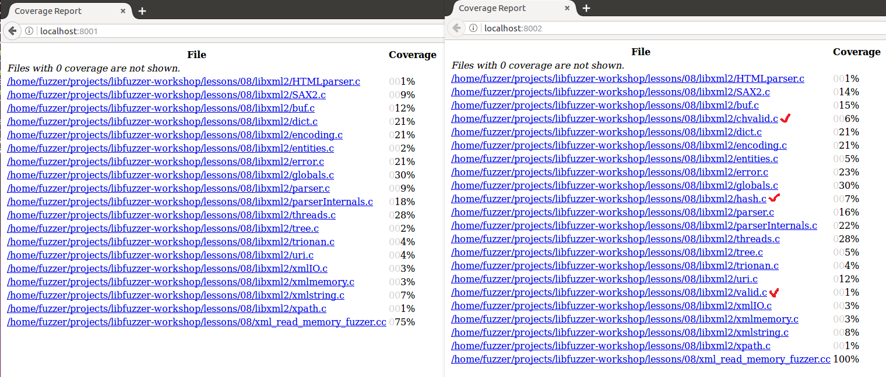

# [libfuzzer-workshop/lessons/08](https://github.com/Dor1s/libfuzzer-workshop/tree/master/lessons/08)

## libxml2

源码编译安装 `libxml2`

```bash
# 解压
tar xzf libxml2.tgz
cd libxml2

# 运行脚本进行配置
./autogen.sh

# FUZZ C++ 标志
export FUZZ_CXXFLAGS="-O2 -fno-omit-frame-pointer -g -fsanitize=address \
    -fsanitize-coverage=edge,indirect-calls,trace-cmp,trace-div,trace-gep,trace-pc-guard"

# CXX       C++编译器
# CCLD      链接器
CXX="clang++ $FUZZ_CXXFLAGS" CC="clang $FUZZ_CXXFLAGS" \
    CCLD="clang++ $FUZZ_CXXFLAGS"  ./configure

# -j        同时运行的作业/命令数
# $(nproc)  可用处理器单元数
make -j$(nproc)
```

### xmlReadMemory

相关函数原型

```cpp
// 出现错误（无法解析或没有有效的上下文）时的处理函数
void xmlGenericErrorFunc (void * ctx,       // 解析上下文
                          const char * msg, // 消息
                          ... ...)          // 格式化消息的格外参数

// 重置错误处理函数
void xmlSetGenericErrorFunc (void * ctx,      // 新的错误处理上下文
            xmlGenericErrorFunc handler)      // 新的函数句柄

// 解析内存中的 XML 文档并构建一棵树
xmlDocPtr xmlReadMemory (const char * buffer,   // 指向字符数组的指针
            int size,                           // 字符数组大小
            const char * URL,                   // 用于文档的基本 URL
            const char * encoding,              // 文件编码格式
            int options)                        // xmlParserOption

// 释放文档使用的所有结构，包括树
void xmlFreeDoc (xmlDocPtr cur)  // 指向文档的指针
```

`xmlSetGenericErrorFunc` 函数用于禁用日志记录错误消息，比如"Incorrect XML document"，因为 fuzz 中随机产生的数据肯定有很多不符合 xml 结构，所以要避免大量的日志记录

fuzzer 的逻辑容易理解，不断地调用 `xmlReadMemory` 解析随机生成的数据，函数调用成功则释放空间

```cpp
#include "libxml/parser.h"

void ignore (void* ctx, const char* msg, ...) {
  // Error handler to avoid spam of error messages from libxml parser.
}

extern "C" int LLVMFuzzerTestOneInput(const uint8_t* data, size_t size) {
  xmlSetGenericErrorFunc(NULL, &ignore);    // 禁用日志记录错误消息
  // 如果成功返回则释放
  if (auto doc = xmlReadMemory(reinterpret_cast<const char*>(data), // 数据类型转换
                               static_cast<int>(size), "noname.xml", NULL, 0)) {
    xmlFreeDoc(doc);
  }

  return 0;
}
```

编译 fuzzer

```bash
# $FUZZ_CXXFLAGS  编译时定义的变量
# -I              包含头文件
clang++ -std=c++11 xml_read_memory_fuzzer.cc $FUZZ_CXXFLAGS -I libxml2/include \
    libxml2/.libs/libxml2.a ../../libFuzzer/libFuzzer.a -lz \
    -o xml_read_memory_fuzzer
```

不使用字典运行 5 min
- 覆盖率 1505
- 输出推荐的字典
- 没有 crash 只有 DONE

```bash
# 创建语料库
mkdir corpus1

# -max_total_time       设置最长的运行时间（秒）
# -print_final_stats    执行后打印统计信息
./xml_read_memory_fuzzer -max_total_time=300 -print_final_stats=1 corpus1
```

<details>
<summary> 运行结果 </summary><br>

```bash
INFO: Seed: 636375831
INFO: Loaded 1 modules (52586 guards): [0xc68980, 0xc9bf28), 
Loading corpus dir: corpus1
INFO: -max_len is not provided, using 64
INFO: A corpus is not provided, starting from an empty corpus
#0	READ units: 1
#1	INITED cov: 449 ft: 397 corp: 1/1b exec/s: 0 rss: 32Mb
#2	NEW    cov: 449 ft: 399 corp: 2/2b exec/s: 0 rss: 32Mb L: 1 MS: 1 ShuffleBytes-
#4	NEW    cov: 456 ft: 446 corp: 3/3b exec/s: 0 rss: 32Mb L: 1 MS: 3 ShuffleBytes-CrossOver-ChangeBinInt-
#6	NEW    cov: 457 ft: 477 corp: 4/5b exec/s: 0 rss: 33Mb L: 2 MS: 5 ShuffleBytes-CrossOver-ChangeBinInt-CopyPart-InsertByte-
#8	NEW    cov: 457 ft: 478 corp: 5/7b exec/s: 0 rss: 33Mb L: 2 MS: 2 ChangeBit-InsertByte-
#9	NEW    cov: 469 ft: 492 corp: 6/50b exec/s: 0 rss: 33Mb L: 43 MS: 3 ChangeBit-InsertByte-InsertRepeatedBytes-
#14	NEW    cov: 469 ft: 493 corp: 7/54b exec/s: 0 rss: 33Mb L: 4 MS: 3 ChangeBit-InsertByte-CopyPart-
#27	NEW    cov: 471 ft: 495 corp: 8/59b exec/s: 0 rss: 33Mb L: 5 MS: 1 CMP- DE: "\xff\xff\xff\x01"-
#30	NEW    cov: 471 ft: 496 corp: 9/62b exec/s: 0 rss: 34Mb L: 3 MS: 4 CMP-ShuffleBytes-ShuffleBytes-EraseBytes- DE: "\xff\xff\xff\x01"-
#34	NEW    cov: 471 ft: 497 corp: 10/75b exec/s: 0 rss: 34Mb L: 13 MS: 3 ChangeBit-ChangeByte-CMP- DE: "use_counters"-
#49	NEW    cov: 471 ft: 498 corp: 11/91b exec/s: 0 rss: 34Mb L: 16 MS: 3 ChangeByte-ShuffleBytes-CMP- DE: "print_final_sta"-
#77	NEW    cov: 475 ft: 502 corp: 12/111b exec/s: 0 rss: 35Mb L: 20 MS: 1 InsertRepeatedBytes-
#82	NEW    cov: 477 ft: 504 corp: 13/113b exec/s: 0 rss: 35Mb L: 2 MS: 1 InsertByte-
#159	NEW    cov: 482 ft: 509 corp: 14/120b exec/s: 0 rss: 36Mb L: 7 MS: 3 ChangeBit-InsertRepeatedBytes-CMP- DE: "\x09\x00\x00\x00"-
#252	NEW    cov: 484 ft: 524 corp: 15/123b exec/s: 0 rss: 38Mb L: 3 MS: 1 CopyPart-
#327	NEW    cov: 486 ft: 526 corp: 16/139b exec/s: 0 rss: 40Mb L: 16 MS: 1 InsertRepeatedBytes-
#342	NEW    cov: 486 ft: 527 corp: 17/176b exec/s: 0 rss: 40Mb L: 37 MS: 1 InsertRepeatedBytes-
#408	NEW    cov: 486 ft: 536 corp: 18/183b exec/s: 0 rss: 41Mb L: 7 MS: 2 ShuffleBytes-PersAutoDict- DE: "\x09\x00\x00\x00"-
#422	NEW    cov: 486 ft: 547 corp: 19/193b exec/s: 0 rss: 41Mb L: 10 MS: 1 CrossOver-
#426	NEW    cov: 486 ft: 549 corp: 20/247b exec/s: 0 rss: 42Mb L: 54 MS: 5 CrossOver-CrossOver-CopyPart-EraseBytes-ShuffleBytes-
#541	NEW    cov: 486 ft: 552 corp: 21/252b exec/s: 0 rss: 44Mb L: 5 MS: 5 CopyPart-CopyPart-ShuffleBytes-CopyPart-InsertByte-
#714	NEW    cov: 487 ft: 553 corp: 22/287b exec/s: 0 rss: 47Mb L: 35 MS: 3 InsertRepeatedBytes-CMP-PersAutoDict- DE: "artifact_prefix"-"\xff\xff\xff\x01"-
#723	NEW    cov: 488 ft: 558 corp: 23/294b exec/s: 0 rss: 47Mb L: 7 MS: 2 PersAutoDict-PersAutoDict- DE: "\x09\x00\x00\x00"-"\x09\x00\x00\x00"-
#743	NEW    cov: 489 ft: 559 corp: 24/302b exec/s: 0 rss: 50Mb L: 8 MS: 2 InsertByte-ChangeBit-
#837	NEW    cov: 500 ft: 623 corp: 25/304b exec/s: 0 rss: 52Mb L: 2 MS: 1 ChangeBit-
#979	NEW    cov: 501 ft: 624 corp: 26/310b exec/s: 0 rss: 54Mb L: 6 MS: 3 ChangeByte-ChangeBit-CopyPart-
#1072	NEW    cov: 501 ft: 625 corp: 27/314b exec/s: 0 rss: 56Mb L: 4 MS: 1 CopyPart-
#1112	NEW    cov: 501 ft: 626 corp: 28/318b exec/s: 0 rss: 57Mb L: 4 MS: 1 CopyPart-
#1287	NEW    cov: 501 ft: 627 corp: 29/327b exec/s: 0 rss: 61Mb L: 9 MS: 1 CrossOver-
#1449	NEW    cov: 562 ft: 707 corp: 30/338b exec/s: 0 rss: 64Mb L: 11 MS: 3 ShuffleBytes-InsertByte-CMP- DE: "<\x00\x00\x00\x00\x00\x00\x00"-
#1452	NEW    cov: 598 ft: 803 corp: 31/349b exec/s: 0 rss: 64Mb L: 11 MS: 1 ChangeByte-
#1453	NEW    cov: 643 ft: 867 corp: 32/360b exec/s: 0 rss: 64Mb L: 11 MS: 2 ChangeByte-ChangeByte-
#1455	NEW    cov: 655 ft: 939 corp: 33/370b exec/s: 0 rss: 64Mb L: 10 MS: 4 ChangeByte-ChangeByte-EraseBytes-InsertByte-
#1456	NEW    cov: 655 ft: 940 corp: 34/380b exec/s: 0 rss: 64Mb L: 10 MS: 5 ChangeByte-ChangeByte-EraseBytes-InsertByte-CopyPart-
#1463	NEW    cov: 659 ft: 956 corp: 35/418b exec/s: 0 rss: 64Mb L: 38 MS: 2 PersAutoDict-PersAutoDict- DE: "print_final_sta"-"use_counters"-
#1465	NEW    cov: 661 ft: 960 corp: 36/460b exec/s: 0 rss: 65Mb L: 42 MS: 4 PersAutoDict-PersAutoDict-ShuffleBytes-CMP- DE: "print_final_sta"-"use_counters"-"\xff\xff\xff\x01"-
#1466	NEW    cov: 661 ft: 973 corp: 37/488b exec/s: 0 rss: 65Mb L: 28 MS: 5 PersAutoDict-PersAutoDict-ShuffleBytes-CMP-EraseBytes- DE: "print_final_sta"-"use_counters"-"\xff\xff\xff\x01"-
#1468	NEW    cov: 664 ft: 980 corp: 38/500b exec/s: 0 rss: 65Mb L: 12 MS: 2 CopyPart-CopyPart-
#1469	NEW    cov: 664 ft: 982 corp: 39/512b exec/s: 0 rss: 65Mb L: 12 MS: 3 CopyPart-CopyPart-ShuffleBytes-
#1470	NEW    cov: 669 ft: 996 corp: 40/530b exec/s: 0 rss: 65Mb L: 18 MS: 4 CopyPart-CopyPart-ShuffleBytes-CMP- DE: "ISO-10"-
#1473	NEW    cov: 670 ft: 1005 corp: 41/540b exec/s: 0 rss: 65Mb L: 10 MS: 2 ChangeByte-ChangeBinInt-
#1537	NEW    cov: 671 ft: 1007 corp: 42/555b exec/s: 0 rss: 66Mb L: 15 MS: 1 PersAutoDict- DE: "\xff\xff\xff\x01"-
#1548	NEW    cov: 674 ft: 1015 corp: 43/566b exec/s: 0 rss: 66Mb L: 11 MS: 2 ChangeBit-ChangeByte-
#1560	NEW    cov: 676 ft: 1017 corp: 44/624b exec/s: 0 rss: 67Mb L: 58 MS: 4 EraseBytes-EraseBytes-ChangeBit-InsertRepeatedBytes-
#1577	NEW    cov: 682 ft: 1025 corp: 45/637b exec/s: 0 rss: 67Mb L: 13 MS: 1 CopyPart-
#1578	NEW    cov: 685 ft: 1054 corp: 46/650b exec/s: 0 rss: 67Mb L: 13 MS: 2 CopyPart-ShuffleBytes-
#1592	NEW    cov: 687 ft: 1057 corp: 47/660b exec/s: 0 rss: 68Mb L: 10 MS: 1 ChangeBinInt-
#1612	NEW    cov: 688 ft: 1058 corp: 48/699b exec/s: 0 rss: 68Mb L: 39 MS: 1 InsertRepeatedBytes-
#1618	NEW    cov: 695 ft: 1068 corp: 49/712b exec/s: 0 rss: 68Mb L: 13 MS: 2 ShuffleBytes-ChangeBit-
#1619	NEW    cov: 697 ft: 1071 corp: 50/726b exec/s: 0 rss: 68Mb L: 14 MS: 3 ShuffleBytes-ChangeBit-InsertByte-
#1638	NEW    cov: 697 ft: 1076 corp: 51/790b exec/s: 0 rss: 69Mb L: 64 MS: 2 CrossOver-CrossOver-
#1639	NEW    cov: 697 ft: 1079 corp: 52/848b exec/s: 0 rss: 69Mb L: 58 MS: 3 CrossOver-CrossOver-EraseBytes-
#1667	NEW    cov: 697 ft: 1081 corp: 53/887b exec/s: 0 rss: 69Mb L: 39 MS: 1 InsertByte-
#1669	NEW    cov: 697 ft: 1083 corp: 54/920b exec/s: 0 rss: 69Mb L: 33 MS: 3 InsertByte-CopyPart-EraseBytes-
#1672	NEW    cov: 738 ft: 1120 corp: 55/930b exec/s: 0 rss: 70Mb L: 10 MS: 1 EraseBytes-
#1673	NEW    cov: 739 ft: 1127 corp: 56/948b exec/s: 0 rss: 70Mb L: 18 MS: 2 EraseBytes-CopyPart-
#1674	NEW    cov: 740 ft: 1129 corp: 57/967b exec/s: 0 rss: 70Mb L: 19 MS: 3 EraseBytes-CopyPart-InsertByte-
#1676	NEW    cov: 740 ft: 1134 corp: 58/983b exec/s: 0 rss: 70Mb L: 16 MS: 5 EraseBytes-CopyPart-InsertByte-CopyPart-EraseBytes-
#1701	NEW    cov: 757 ft: 1171 corp: 59/1046b exec/s: 0 rss: 71Mb L: 63 MS: 5 CrossOver-ChangeByte-EraseBytes-ChangeBit-InsertRepeatedBytes-
#1702	NEW    cov: 759 ft: 1173 corp: 60/1060b exec/s: 0 rss: 71Mb L: 14 MS: 1 ChangeBit-
#1722	NEW    cov: 759 ft: 1175 corp: 61/1073b exec/s: 0 rss: 71Mb L: 13 MS: 1 ShuffleBytes-
#1729	NEW    cov: 759 ft: 1185 corp: 62/1117b exec/s: 0 rss: 71Mb L: 44 MS: 3 InsertRepeatedBytes-CMP-EraseBytes- DE: "\xff\xff\xff9"-
#1742	NEW    cov: 760 ft: 1188 corp: 63/1136b exec/s: 0 rss: 72Mb L: 19 MS: 1 CMP- DE: "\xff\xff\xff\xff\xff\xff\xff\xff"-
#1743	NEW    cov: 760 ft: 1196 corp: 64/1163b exec/s: 0 rss: 72Mb L: 27 MS: 2 CMP-PersAutoDict- DE: "\xff\xff\xff\xff\xff\xff\xff\xff"-"\xff\xff\xff\xff\xff\xff\xff\xff"-
#1746	NEW    cov: 761 ft: 1197 corp: 65/1190b exec/s: 0 rss: 72Mb L: 27 MS: 5 CMP-PersAutoDict-ShuffleBytes-ShuffleBytes-CMP- DE: "\xff\xff\xff\xff\xff\xff\xff\xff"-"\xff\xff\xff\xff\xff\xff\xff\xff"-"\x01\x00\x00\x00\x00\x00\x00R"-
#1773	NEW    cov: 762 ft: 1198 corp: 66/1254b exec/s: 0 rss: 73Mb L: 64 MS: 2 InsertByte-CrossOver-
#1792	NEW    cov: 762 ft: 1203 corp: 67/1298b exec/s: 0 rss: 74Mb L: 44 MS: 1 ChangeBinInt-
#1825	NEW    cov: 766 ft: 1207 corp: 68/1362b exec/s: 0 rss: 75Mb L: 64 MS: 4 InsertByte-CMP-PersAutoDict-CrossOver- DE: "F\x00\x00\x00\x00\x00\x00\x00"-"artifact_prefix"-
#1891	NEW    cov: 784 ft: 1231 corp: 69/1406b exec/s: 0 rss: 77Mb L: 44 MS: 5 ChangeByte-InsertRepeatedBytes-ShuffleBytes-InsertByte-InsertByte-
#1915	NEW    cov: 786 ft: 1233 corp: 70/1419b exec/s: 0 rss: 77Mb L: 13 MS: 4 EraseBytes-PersAutoDict-ChangeByte-ShuffleBytes- DE: "\x09\x00\x00\x00"-
#1943	NEW    cov: 786 ft: 1235 corp: 71/1437b exec/s: 0 rss: 78Mb L: 18 MS: 2 ShuffleBytes-EraseBytes-
#1944	NEW    cov: 786 ft: 1240 corp: 72/1452b exec/s: 0 rss: 78Mb L: 15 MS: 3 ShuffleBytes-EraseBytes-EraseBytes-
#1945	NEW    cov: 788 ft: 1242 corp: 73/1467b exec/s: 0 rss: 78Mb L: 15 MS: 4 ShuffleBytes-EraseBytes-EraseBytes-ChangeByte-
#1995	NEW    cov: 788 ft: 1244 corp: 74/1516b exec/s: 0 rss: 80Mb L: 49 MS: 4 InsertRepeatedBytes-PersAutoDict-ChangeBit-CopyPart- DE: "artifact_prefix"-
#2011	NEW    cov: 788 ft: 1245 corp: 75/1553b exec/s: 0 rss: 80Mb L: 37 MS: 5 CopyPart-ChangeByte-CrossOver-ChangeBit-ChangeBinInt-
#2052	NEW    cov: 788 ft: 1248 corp: 76/1576b exec/s: 0 rss: 81Mb L: 23 MS: 1 InsertRepeatedBytes-
#2057	NEW    cov: 788 ft: 1250 corp: 77/1587b exec/s: 0 rss: 82Mb L: 11 MS: 1 CMP- DE: "ASCII"-
#2072	NEW    cov: 789 ft: 1254 corp: 78/1597b exec/s: 0 rss: 82Mb L: 10 MS: 1 CMP- DE: "\xff\xff\xff\xff\xff\xff\xff\xff"-
#2132	NEW    cov: 789 ft: 1255 corp: 79/1607b exec/s: 0 rss: 84Mb L: 10 MS: 1 ChangeBinInt-
#2137	NEW    cov: 790 ft: 1256 corp: 80/1619b exec/s: 0 rss: 84Mb L: 12 MS: 1 CopyPart-
#2157	NEW    cov: 791 ft: 1257 corp: 81/1646b exec/s: 0 rss: 84Mb L: 27 MS: 1 CMP- DE: "UTF-1"-
#2183	NEW    cov: 792 ft: 1258 corp: 82/1675b exec/s: 0 rss: 85Mb L: 29 MS: 2 ChangeASCIIInt-EraseBytes-
#2224	NEW    cov: 793 ft: 1259 corp: 83/1691b exec/s: 0 rss: 86Mb L: 16 MS: 3 EraseBytes-ShuffleBytes-PersAutoDict- DE: "UTF-1"-
#2226	NEW    cov: 793 ft: 1261 corp: 84/1743b exec/s: 0 rss: 86Mb L: 52 MS: 5 EraseBytes-ShuffleBytes-PersAutoDict-InsertRepeatedBytes-PersAutoDict- DE: "UTF-1"-"ISO-10"-
#2247	NEW    cov: 793 ft: 1262 corp: 85/1754b exec/s: 0 rss: 87Mb L: 11 MS: 1 ChangeByte-
#2285	NEW    cov: 793 ft: 1263 corp: 86/1793b exec/s: 0 rss: 88Mb L: 39 MS: 4 ChangeBinInt-ShuffleBytes-ChangeBit-ChangeBinInt-
#2322	NEW    cov: 794 ft: 1264 corp: 87/1857b exec/s: 0 rss: 89Mb L: 64 MS: 1 CrossOver-
#2427	NEW    cov: 794 ft: 1267 corp: 88/1897b exec/s: 0 rss: 92Mb L: 40 MS: 1 InsertRepeatedBytes-
#2443	NEW    cov: 801 ft: 1274 corp: 89/1921b exec/s: 0 rss: 92Mb L: 24 MS: 2 InsertRepeatedBytes-EraseBytes-
#2617	NEW    cov: 806 ft: 1293 corp: 90/1941b exec/s: 2617 rss: 98Mb L: 20 MS: 1 CrossOver-
#2620	NEW    cov: 806 ft: 1294 corp: 91/1988b exec/s: 2620 rss: 98Mb L: 47 MS: 4 CrossOver-InsertRepeatedBytes-ShuffleBytes-InsertRepeatedBytes-
#2685	NEW    cov: 808 ft: 1296 corp: 92/1992b exec/s: 2685 rss: 99Mb L: 4 MS: 4 CrossOver-ShuffleBytes-CrossOver-InsertByte-
#2703	NEW    cov: 810 ft: 1298 corp: 93/2004b exec/s: 2703 rss: 100Mb L: 12 MS: 2 ChangeByte-CMP- DE: "\xff\xbe"-
#2716	NEW    cov: 811 ft: 1299 corp: 94/2023b exec/s: 2716 rss: 100Mb L: 19 MS: 5 ChangeBit-CopyPart-InsertByte-ChangeByte-CMP- DE: "\x01\x00\x00\x00\x00\x00\x00\x00"-
#2767	NEW    cov: 811 ft: 1300 corp: 95/2047b exec/s: 2767 rss: 102Mb L: 24 MS: 1 ChangeByte-
#2812	NEW    cov: 811 ft: 1301 corp: 96/2058b exec/s: 2812 rss: 103Mb L: 11 MS: 1 PersAutoDict- DE: "\xff\xff\xff\xff\xff\xff\xff\xff"-
#2910	NEW    cov: 811 ft: 1303 corp: 97/2090b exec/s: 2910 rss: 106Mb L: 32 MS: 4 PersAutoDict-ShuffleBytes-ChangeBinInt-EraseBytes- DE: "print_final_sta"-
#2911	NEW    cov: 811 ft: 1304 corp: 98/2127b exec/s: 2911 rss: 106Mb L: 37 MS: 5 PersAutoDict-ShuffleBytes-ChangeBinInt-EraseBytes-PersAutoDict- DE: "print_final_sta"-"ASCII"-
#2953	NEW    cov: 820 ft: 1316 corp: 99/2184b exec/s: 2953 rss: 107Mb L: 57 MS: 2 InsertByte-PersAutoDict- DE: "use_counters"-
#2954	NEW    cov: 823 ft: 1322 corp: 100/2244b exec/s: 2954 rss: 107Mb L: 60 MS: 3 InsertByte-PersAutoDict-InsertRepeatedBytes- DE: "use_counters"-
#3018	NEW    cov: 826 ft: 1326 corp: 101/2247b exec/s: 3018 rss: 110Mb L: 3 MS: 2 EraseBytes-CrossOver-
#3230	NEW    cov: 826 ft: 1329 corp: 102/2270b exec/s: 3230 rss: 115Mb L: 23 MS: 4 ChangeBinInt-CopyPart-ChangeBinInt-CrossOver-
#3354	NEW    cov: 833 ft: 1336 corp: 103/2296b exec/s: 3354 rss: 119Mb L: 26 MS: 3 InsertByte-EraseBytes-ChangeBit-
#3402	NEW    cov: 833 ft: 1338 corp: 104/2354b exec/s: 3402 rss: 120Mb L: 58 MS: 1 InsertByte-
#3404	NEW    cov: 833 ft: 1339 corp: 105/2412b exec/s: 3404 rss: 120Mb L: 58 MS: 3 InsertByte-PersAutoDict-CopyPart- DE: "<\x00\x00\x00\x00\x00\x00\x00"-
#3502	NEW    cov: 834 ft: 1344 corp: 106/2468b exec/s: 3502 rss: 122Mb L: 56 MS: 1 InsertRepeatedBytes-
#3547	NEW    cov: 834 ft: 1349 corp: 107/2493b exec/s: 3547 rss: 123Mb L: 25 MS: 1 InsertByte-
#3617	NEW    cov: 837 ft: 1352 corp: 108/2512b exec/s: 3617 rss: 125Mb L: 19 MS: 1 InsertByte-
#3626	NEW    cov: 837 ft: 1354 corp: 109/2551b exec/s: 3626 rss: 125Mb L: 39 MS: 5 ShuffleBytes-InsertByte-InsertByte-EraseBytes-InsertRepeatedBytes-
#3660	NEW    cov: 842 ft: 1363 corp: 110/2593b exec/s: 3660 rss: 126Mb L: 42 MS: 4 InsertByte-InsertRepeatedBytes-ChangeByte-ChangeByte-
#3684	NEW    cov: 842 ft: 1364 corp: 111/2594b exec/s: 3684 rss: 127Mb L: 1 MS: 3 InsertRepeatedBytes-ChangeBinInt-CrossOver-
#3686	NEW    cov: 845 ft: 1367 corp: 112/2595b exec/s: 3686 rss: 127Mb L: 1 MS: 5 InsertRepeatedBytes-ChangeBinInt-CrossOver-ChangeBit-ChangeByte-
#3863	NEW    cov: 845 ft: 1368 corp: 113/2626b exec/s: 3863 rss: 131Mb L: 31 MS: 2 InsertRepeatedBytes-ShuffleBytes-
#3864	NEW    cov: 845 ft: 1370 corp: 114/2657b exec/s: 3864 rss: 132Mb L: 31 MS: 3 InsertRepeatedBytes-ShuffleBytes-ChangeBit-
#4139	NEW    cov: 845 ft: 1372 corp: 115/2685b exec/s: 4139 rss: 138Mb L: 28 MS: 3 ChangeBinInt-CMP-PersAutoDict- DE: "\xff\xff\xff\x7f"-"use_counters"-
#4202	NEW    cov: 845 ft: 1374 corp: 116/2697b exec/s: 4202 rss: 140Mb L: 12 MS: 1 EraseBytes-
#4213	NEW    cov: 845 ft: 1376 corp: 117/2761b exec/s: 4213 rss: 140Mb L: 64 MS: 2 ChangeByte-CrossOver-
#4262	NEW    cov: 860 ft: 1392 corp: 118/2775b exec/s: 4262 rss: 142Mb L: 14 MS: 1 CMP- DE: "\xfe\xff\xff?"-
#4265	NEW    cov: 861 ft: 1393 corp: 119/2787b exec/s: 4265 rss: 142Mb L: 12 MS: 4 CMP-ChangeBinInt-EraseBytes-PersAutoDict- DE: "\xfe\xff\xff?"-"\xfe\xff\xff?"-
#4296	NEW    cov: 863 ft: 1395 corp: 120/2851b exec/s: 4296 rss: 142Mb L: 64 MS: 5 ShuffleBytes-CrossOver-ChangeByte-ShuffleBytes-CrossOver-
#4383	NEW    cov: 873 ft: 1407 corp: 121/2908b exec/s: 4383 rss: 145Mb L: 57 MS: 2 InsertRepeatedBytes-ChangeBit-
#4412	NEW    cov: 877 ft: 1416 corp: 122/2933b exec/s: 4412 rss: 145Mb L: 25 MS: 1 CopyPart-
#4414	NEW    cov: 877 ft: 1420 corp: 123/2960b exec/s: 4414 rss: 145Mb L: 27 MS: 3 CopyPart-InsertByte-InsertByte-
#4416	NEW    cov: 878 ft: 1421 corp: 124/2991b exec/s: 4416 rss: 145Mb L: 31 MS: 5 CopyPart-InsertByte-InsertByte-CMP-CMP- DE: "ISO-"-"\x01\x00\x00\x00\x00\x00\x00\x00"-
#4440	NEW    cov: 880 ft: 1426 corp: 125/3047b exec/s: 4440 rss: 146Mb L: 56 MS: 4 ChangeBit-CMP-ShuffleBytes-InsertRepeatedBytes- DE: "UCS-4"-
#4441	NEW    cov: 880 ft: 1427 corp: 126/3086b exec/s: 4441 rss: 146Mb L: 39 MS: 5 ChangeBit-CMP-ShuffleBytes-InsertRepeatedBytes-CrossOver- DE: "UCS-4"-
#4475	NEW    cov: 880 ft: 1431 corp: 127/3094b exec/s: 4475 rss: 147Mb L: 8 MS: 4 CopyPart-ChangeBinInt-ChangeByte-EraseBytes-
#4476	NEW    cov: 880 ft: 1434 corp: 128/3098b exec/s: 4476 rss: 147Mb L: 4 MS: 5 CopyPart-ChangeBinInt-ChangeByte-EraseBytes-EraseBytes-
#4481	NEW    cov: 880 ft: 1436 corp: 129/3162b exec/s: 4481 rss: 147Mb L: 64 MS: 5 ShuffleBytes-CMP-EraseBytes-InsertByte-CrossOver- DE: "\x00\x00\x00\x00\x00\x00\x00\x00"-
#4592	NEW    cov: 880 ft: 1441 corp: 130/3219b exec/s: 2296 rss: 150Mb L: 57 MS: 1 ChangeBinInt-
#4608	NEW    cov: 880 ft: 1443 corp: 131/3228b exec/s: 2304 rss: 150Mb L: 9 MS: 2 InsertByte-PersAutoDict- DE: "\xff\xff\xff\x01"-
#4609	NEW    cov: 893 ft: 1457 corp: 132/3237b exec/s: 2304 rss: 150Mb L: 9 MS: 3 InsertByte-PersAutoDict-ShuffleBytes- DE: "\xff\xff\xff\x01"-
#4610	NEW    cov: 894 ft: 1462 corp: 133/3254b exec/s: 2305 rss: 150Mb L: 17 MS: 4 InsertByte-PersAutoDict-ShuffleBytes-CMP- DE: "\xff\xff\xff\x01"-"H\x00\x00\x00\x00\x00\x00\x00"-
#4611	NEW    cov: 896 ft: 1464 corp: 134/3271b exec/s: 2305 rss: 150Mb L: 17 MS: 5 InsertByte-PersAutoDict-ShuffleBytes-CMP-ShuffleBytes- DE: "\xff\xff\xff\x01"-"H\x00\x00\x00\x00\x00\x00\x00"-
#4772	NEW    cov: 896 ft: 1465 corp: 135/3333b exec/s: 2386 rss: 156Mb L: 62 MS: 1 CopyPart-
#4887	NEW    cov: 896 ft: 1468 corp: 136/3350b exec/s: 2443 rss: 159Mb L: 17 MS: 1 ChangeBinInt-
#4888	NEW    cov: 896 ft: 1469 corp: 137/3367b exec/s: 2444 rss: 159Mb L: 17 MS: 2 ChangeBinInt-CopyPart-
#4889	NEW    cov: 897 ft: 1471 corp: 138/3379b exec/s: 2444 rss: 159Mb L: 12 MS: 3 ChangeBinInt-CopyPart-EraseBytes-
#4891	NEW    cov: 897 ft: 1475 corp: 139/3402b exec/s: 2445 rss: 159Mb L: 23 MS: 5 ChangeBinInt-CopyPart-EraseBytes-ChangeBit-CrossOver-
#4977	NEW    cov: 898 ft: 1477 corp: 140/3405b exec/s: 2488 rss: 162Mb L: 3 MS: 1 ChangeBit-
#4993	NEW    cov: 898 ft: 1480 corp: 141/3436b exec/s: 2496 rss: 162Mb L: 31 MS: 2 ChangeByte-CopyPart-
#5022	NEW    cov: 898 ft: 1481 corp: 142/3461b exec/s: 2511 rss: 163Mb L: 25 MS: 1 ChangeBinInt-
#5109	NEW    cov: 898 ft: 1486 corp: 143/3525b exec/s: 2554 rss: 165Mb L: 64 MS: 3 InsertByte-EraseBytes-CrossOver-
#5147	NEW    cov: 898 ft: 1490 corp: 144/3531b exec/s: 2573 rss: 166Mb L: 6 MS: 1 EraseBytes-
#5187	NEW    cov: 898 ft: 1491 corp: 145/3534b exec/s: 2593 rss: 167Mb L: 3 MS: 1 PersAutoDict- DE: "\xff\xbe"-
#5188	NEW    cov: 898 ft: 1509 corp: 146/3541b exec/s: 2594 rss: 167Mb L: 7 MS: 2 PersAutoDict-PersAutoDict- DE: "\xff\xbe"-"ISO-"-
#5202	NEW    cov: 898 ft: 1511 corp: 147/3544b exec/s: 2601 rss: 167Mb L: 3 MS: 1 ChangeBit-
#5203	NEW    cov: 903 ft: 1516 corp: 148/3547b exec/s: 2601 rss: 167Mb L: 3 MS: 2 ChangeBit-ChangeByte-
#5223	NEW    cov: 903 ft: 1517 corp: 149/3558b exec/s: 2611 rss: 168Mb L: 11 MS: 2 InsertByte-EraseBytes-
#5235	NEW    cov: 903 ft: 1518 corp: 150/3593b exec/s: 2617 rss: 168Mb L: 35 MS: 4 EraseBytes-ShuffleBytes-CrossOver-EraseBytes-
#5259	NEW    cov: 904 ft: 1522 corp: 151/3608b exec/s: 2629 rss: 169Mb L: 15 MS: 3 ChangeBit-ChangeByte-CMP- DE: "\xfe\xff\xff?"-
#5265	NEW    cov: 904 ft: 1524 corp: 152/3637b exec/s: 2632 rss: 169Mb L: 29 MS: 4 CMP-PersAutoDict-EraseBytes-CMP- DE: "\xff\xff\xff\xff\xff\xff\xffU"-"\xff\xff\xff\x01"-"Q\x00\x00\x00"-
#5297	NEW    cov: 904 ft: 1525 corp: 153/3642b exec/s: 2648 rss: 170Mb L: 5 MS: 1 EraseBytes-
#5312	NEW    cov: 904 ft: 1526 corp: 154/3681b exec/s: 2656 rss: 170Mb L: 39 MS: 1 CrossOver-
#5469	NEW    cov: 905 ft: 1528 corp: 155/3719b exec/s: 2734 rss: 174Mb L: 38 MS: 3 ChangeBinInt-InsertRepeatedBytes-InsertRepeatedBytes-
#5471	NEW    cov: 905 ft: 1529 corp: 156/3772b exec/s: 2735 rss: 174Mb L: 53 MS: 5 ChangeBinInt-InsertRepeatedBytes-InsertRepeatedBytes-CopyPart-EraseBytes-
#5472	NEW    cov: 906 ft: 1530 corp: 157/3786b exec/s: 2736 rss: 174Mb L: 14 MS: 1 CrossOver-
#5556	NEW    cov: 906 ft: 1532 corp: 158/3842b exec/s: 2778 rss: 177Mb L: 56 MS: 5 ChangeByte-ChangeBinInt-ShuffleBytes-ChangeBit-ChangeBinInt-
#5565	NEW    cov: 907 ft: 1533 corp: 159/3865b exec/s: 2782 rss: 177Mb L: 23 MS: 4 EraseBytes-CopyPart-ChangeByte-ChangeByte-
#5610	NEW    cov: 909 ft: 1535 corp: 160/3896b exec/s: 2805 rss: 178Mb L: 31 MS: 4 CopyPart-ChangeByte-CrossOver-ChangeByte-
#5618	NEW    cov: 909 ft: 1538 corp: 161/3915b exec/s: 2809 rss: 178Mb L: 19 MS: 2 EraseBytes-InsertByte-
#5622	NEW    cov: 909 ft: 1539 corp: 162/3925b exec/s: 2811 rss: 179Mb L: 10 MS: 1 CMP- DE: "\xff\xff\xff\xff\xff\xff\xff:"-
#5624	NEW    cov: 910 ft: 1542 corp: 163/3989b exec/s: 2812 rss: 179Mb L: 64 MS: 3 CMP-ChangeByte-CrossOver- DE: "\xff\xff\xff\xff\xff\xff\xff:"-
#5632	NEW    cov: 910 ft: 1547 corp: 164/4000b exec/s: 2816 rss: 179Mb L: 11 MS: 1 PersAutoDict- DE: "H\x00\x00\x00\x00\x00\x00\x00"-
#5776	NEW    cov: 910 ft: 1548 corp: 165/4025b exec/s: 2888 rss: 183Mb L: 25 MS: 5 EraseBytes-ShuffleBytes-PersAutoDict-CMP-InsertByte- DE: "UTF-1"-"UCS-"-
#5795	NEW    cov: 910 ft: 1549 corp: 166/4060b exec/s: 2897 rss: 183Mb L: 35 MS: 4 ChangeBit-CrossOver-ShuffleBytes-EraseBytes-
#5827	NEW    cov: 910 ft: 1550 corp: 167/4085b exec/s: 2913 rss: 184Mb L: 25 MS: 1 ChangeBinInt-
#6015	NEW    cov: 910 ft: 1552 corp: 168/4110b exec/s: 3007 rss: 189Mb L: 25 MS: 4 CMP-ChangeByte-ChangeBinInt-CrossOver- DE: "\x01\x00\x00\x00\x00\x00\x00\x00"-
#6038	NEW    cov: 911 ft: 1557 corp: 169/4129b exec/s: 3019 rss: 189Mb L: 19 MS: 2 EraseBytes-CMP- DE: "\xff\xff\xff\xff\xff\xff\xff:"-
#6153	NEW    cov: 911 ft: 1561 corp: 170/4140b exec/s: 3076 rss: 192Mb L: 11 MS: 2 ShuffleBytes-CMP- DE: "\xff\xff\xff\xff\xff\xff\xffU"-
#6213	NEW    cov: 912 ft: 1562 corp: 171/4161b exec/s: 3106 rss: 194Mb L: 21 MS: 2 CMP-InsertByte- DE: "UCS-4"-
#6233	NEW    cov: 912 ft: 1564 corp: 172/4225b exec/s: 3116 rss: 194Mb L: 64 MS: 2 ChangeBit-ChangeBinInt-
#6286	NEW    cov: 967 ft: 1642 corp: 173/4289b exec/s: 2095 rss: 196Mb L: 64 MS: 5 CopyPart-CopyPart-CrossOver-ShuffleBytes-ChangeBit-
#6300	NEW    cov: 967 ft: 1643 corp: 174/4353b exec/s: 2100 rss: 196Mb L: 64 MS: 4 PersAutoDict-CrossOver-ShuffleBytes-PersAutoDict- DE: "\xff\xff\xff\xff\xff\xff\xff\xff"-"\xff\xff\xff\xff\xff\xff\xff:"-
#6343	NEW    cov: 967 ft: 1661 corp: 175/4389b exec/s: 2114 rss: 197Mb L: 36 MS: 2 ChangeBit-CrossOver-
#6406	NEW    cov: 967 ft: 1664 corp: 176/4397b exec/s: 2135 rss: 199Mb L: 8 MS: 5 EraseBytes-ChangeByte-ChangeBinInt-InsertByte-CopyPart-
#6557	NEW    cov: 967 ft: 1665 corp: 177/4404b exec/s: 2185 rss: 204Mb L: 7 MS: 1 ChangeBit-
#6570	NEW    cov: 967 ft: 1666 corp: 178/4444b exec/s: 2190 rss: 204Mb L: 40 MS: 4 InsertByte-InsertRepeatedBytes-CMP-InsertRepeatedBytes- DE: "\x01\x00\x00\x00\x00\x00\x00\x80"-
#6578	NEW    cov: 967 ft: 1671 corp: 179/4494b exec/s: 2192 rss: 205Mb L: 50 MS: 2 ShuffleBytes-InsertRepeatedBytes-
#6609	NEW    cov: 967 ft: 1672 corp: 180/4509b exec/s: 2203 rss: 205Mb L: 15 MS: 3 ChangeByte-CopyPart-ChangeByte-
#6617	NEW    cov: 967 ft: 1681 corp: 181/4556b exec/s: 2205 rss: 206Mb L: 47 MS: 1 EraseBytes-
#6664	NEW    cov: 968 ft: 1695 corp: 182/4583b exec/s: 2221 rss: 207Mb L: 27 MS: 3 CrossOver-ShuffleBytes-CopyPart-
#6669	NEW    cov: 968 ft: 1737 corp: 183/4647b exec/s: 2223 rss: 207Mb L: 64 MS: 3 ShuffleBytes-ChangeByte-CrossOver-
#6688	NEW    cov: 968 ft: 1739 corp: 184/4697b exec/s: 2229 rss: 207Mb L: 50 MS: 2 CopyPart-ChangeBinInt-
#6700	NEW    cov: 968 ft: 1745 corp: 185/4761b exec/s: 2233 rss: 208Mb L: 64 MS: 4 ChangeByte-ChangeByte-CopyPart-ChangeByte-
#6704	NEW    cov: 968 ft: 1751 corp: 186/4825b exec/s: 2234 rss: 208Mb L: 64 MS: 3 ChangeBit-ChangeBinInt-PersAutoDict- DE: "print_final_sta"-
#6727	NEW    cov: 970 ft: 1762 corp: 187/4865b exec/s: 2242 rss: 208Mb L: 40 MS: 1 EraseBytes-
#6744	NEW    cov: 970 ft: 1764 corp: 188/4916b exec/s: 2248 rss: 209Mb L: 51 MS: 3 ChangeASCIIInt-ChangeBinInt-InsertRepeatedBytes-
#6745	NEW    cov: 970 ft: 1765 corp: 189/4968b exec/s: 2248 rss: 209Mb L: 52 MS: 4 ChangeASCIIInt-ChangeBinInt-InsertRepeatedBytes-InsertByte-
#6765	NEW    cov: 970 ft: 1771 corp: 190/5032b exec/s: 2255 rss: 209Mb L: 64 MS: 4 ShuffleBytes-ChangeASCIIInt-ChangeBinInt-PersAutoDict- DE: "F\x00\x00\x00\x00\x00\x00\x00"-
#6832	NEW    cov: 972 ft: 1772 corp: 191/5072b exec/s: 2277 rss: 211Mb L: 40 MS: 1 CopyPart-
#6862	NEW    cov: 978 ft: 1778 corp: 192/5099b exec/s: 2287 rss: 212Mb L: 27 MS: 1 CMP- DE: "\x01\x00\x00\x00\x00\x00\x00\x00"-
#6887	NEW    cov: 978 ft: 1780 corp: 193/5153b exec/s: 2295 rss: 213Mb L: 54 MS: 1 InsertRepeatedBytes-
#6910	NEW    cov: 978 ft: 1861 corp: 194/5217b exec/s: 2303 rss: 213Mb L: 64 MS: 4 ChangeBinInt-CopyPart-ShuffleBytes-ChangeBinInt-
#7005	NEW    cov: 978 ft: 1867 corp: 195/5274b exec/s: 2335 rss: 216Mb L: 57 MS: 4 ShuffleBytes-ChangeByte-EraseBytes-InsertRepeatedBytes-
#7006	NEW    cov: 978 ft: 1868 corp: 196/5334b exec/s: 2335 rss: 216Mb L: 60 MS: 5 ShuffleBytes-ChangeByte-EraseBytes-InsertRepeatedBytes-InsertRepeatedBytes-
#7028	NEW    cov: 978 ft: 1869 corp: 197/5367b exec/s: 2342 rss: 216Mb L: 33 MS: 2 CMP-EraseBytes- DE: "UCS2"-
#7053	NEW    cov: 978 ft: 1884 corp: 198/5394b exec/s: 2351 rss: 217Mb L: 27 MS: 2 ChangeByte-ChangeBinInt-
#7072	NEW    cov: 978 ft: 1886 corp: 199/5452b exec/s: 2357 rss: 217Mb L: 58 MS: 1 PersAutoDict- DE: "H\x00\x00\x00\x00\x00\x00\x00"-
#7079	NEW    cov: 978 ft: 1893 corp: 200/5511b exec/s: 2359 rss: 218Mb L: 59 MS: 3 ChangeByte-ChangeByte-CrossOver-
#7081	NEW    cov: 978 ft: 1914 corp: 201/5574b exec/s: 2360 rss: 218Mb L: 63 MS: 5 ChangeByte-ChangeByte-CrossOver-InsertRepeatedBytes-CopyPart-
#7123	NEW    cov: 978 ft: 1924 corp: 202/5637b exec/s: 2374 rss: 219Mb L: 63 MS: 2 ChangeBit-ChangeBinInt-
#7124	NEW    cov: 978 ft: 1976 corp: 203/5700b exec/s: 2374 rss: 219Mb L: 63 MS: 3 ChangeBit-ChangeBinInt-CopyPart-
#7139	NEW    cov: 978 ft: 2088 corp: 204/5764b exec/s: 2379 rss: 219Mb L: 64 MS: 3 CopyPart-PersAutoDict-CrossOver- DE: "\xfe\xff\xff?"-
#7141	NEW    cov: 978 ft: 2169 corp: 205/5828b exec/s: 2380 rss: 220Mb L: 64 MS: 5 CopyPart-PersAutoDict-CrossOver-ShuffleBytes-ChangeBinInt- DE: "\xfe\xff\xff?"-
#7169	NEW    cov: 979 ft: 2170 corp: 206/5891b exec/s: 2389 rss: 220Mb L: 63 MS: 3 ChangeByte-ChangeBit-PersAutoDict- DE: "\x09\x00\x00\x00"-
#7203	NEW    cov: 979 ft: 2171 corp: 207/5948b exec/s: 2401 rss: 221Mb L: 57 MS: 2 ChangeBit-ChangeBit-
#7218	NEW    cov: 979 ft: 2174 corp: 208/6011b exec/s: 2406 rss: 221Mb L: 63 MS: 2 ShuffleBytes-CopyPart-
#7237	NEW    cov: 979 ft: 2178 corp: 209/6041b exec/s: 2412 rss: 222Mb L: 30 MS: 1 CrossOver-
#7238	NEW    cov: 979 ft: 2184 corp: 210/6071b exec/s: 2412 rss: 222Mb L: 30 MS: 2 CrossOver-ChangeByte-
#7239	NEW    cov: 981 ft: 2195 corp: 211/6105b exec/s: 2413 rss: 222Mb L: 34 MS: 3 CrossOver-ChangeByte-CrossOver-
#7242	NEW    cov: 981 ft: 2196 corp: 212/6138b exec/s: 2414 rss: 222Mb L: 33 MS: 1 EraseBytes-
#7247	NEW    cov: 983 ft: 2198 corp: 213/6197b exec/s: 2415 rss: 222Mb L: 59 MS: 1 InsertByte-
#7257	NEW    cov: 983 ft: 2203 corp: 214/6261b exec/s: 2419 rss: 223Mb L: 64 MS: 1 CopyPart-
#7262	NEW    cov: 983 ft: 2204 corp: 215/6276b exec/s: 2420 rss: 223Mb L: 15 MS: 1 CrossOver-
#7263	NEW    cov: 983 ft: 2205 corp: 216/6291b exec/s: 2421 rss: 223Mb L: 15 MS: 2 CrossOver-ChangeByte-
#7264	NEW    cov: 983 ft: 2209 corp: 217/6346b exec/s: 2421 rss: 223Mb L: 55 MS: 3 CrossOver-ChangeByte-InsertRepeatedBytes-
#7265	NEW    cov: 983 ft: 2210 corp: 218/6402b exec/s: 2421 rss: 223Mb L: 56 MS: 4 CrossOver-ChangeByte-InsertRepeatedBytes-InsertByte-
#7273	NEW    cov: 983 ft: 2212 corp: 219/6466b exec/s: 2424 rss: 223Mb L: 64 MS: 2 ChangeByte-CMP- DE: "\xff\xff\xff3"-
#7314	NEW    cov: 983 ft: 2214 corp: 220/6481b exec/s: 2438 rss: 225Mb L: 15 MS: 3 CrossOver-CopyPart-ChangeBit-
#7362	NEW    cov: 983 ft: 2215 corp: 221/6545b exec/s: 2454 rss: 226Mb L: 64 MS: 1 InsertRepeatedBytes-
#7417	NEW    cov: 983 ft: 2217 corp: 222/6579b exec/s: 2472 rss: 228Mb L: 34 MS: 1 ChangeByte-
#7418	NEW    cov: 983 ft: 2231 corp: 223/6613b exec/s: 2472 rss: 228Mb L: 34 MS: 2 ChangeByte-CopyPart-
#7433	NEW    cov: 983 ft: 2233 corp: 224/6677b exec/s: 2477 rss: 228Mb L: 64 MS: 2 ShuffleBytes-ChangeBinInt-
#7434	NEW    cov: 983 ft: 2241 corp: 225/6741b exec/s: 2478 rss: 228Mb L: 64 MS: 3 ShuffleBytes-ChangeBinInt-CMP- DE: "\xff\xff\xff\xff\xff\xff\xffU"-
#7435	NEW    cov: 983 ft: 2259 corp: 226/6786b exec/s: 2478 rss: 228Mb L: 45 MS: 4 ShuffleBytes-ChangeBinInt-CMP-EraseBytes- DE: "\xff\xff\xff\xff\xff\xff\xffU"-
#7444	NEW    cov: 983 ft: 2265 corp: 227/6846b exec/s: 2481 rss: 229Mb L: 60 MS: 3 CMP-CMP-EraseBytes- DE: "\x11\x00\x00\x00"-"\x08\x00"-
#7477	NEW    cov: 983 ft: 2269 corp: 228/6895b exec/s: 2492 rss: 230Mb L: 49 MS: 1 EraseBytes-
#7481	NEW    cov: 984 ft: 2270 corp: 229/6942b exec/s: 2493 rss: 230Mb L: 47 MS: 5 EraseBytes-CrossOver-ChangeBit-EraseBytes-InsertRepeatedBytes-
#7499	NEW    cov: 984 ft: 2276 corp: 230/6949b exec/s: 2499 rss: 230Mb L: 7 MS: 3 ShuffleBytes-CMP-CrossOver- DE: "Q\x00\x00\x00\x00\x00\x00\x00"-
#7534	NEW    cov: 985 ft: 2277 corp: 231/6968b exec/s: 2511 rss: 231Mb L: 19 MS: 3 CrossOver-EraseBytes-CMP- DE: "\x00\x00\x00\x00\x00\x00\x00\x00"-
#7560	NEW    cov: 985 ft: 2293 corp: 232/7030b exec/s: 2520 rss: 232Mb L: 62 MS: 4 EraseBytes-EraseBytes-InsertRepeatedBytes-CopyPart-
#7564	NEW    cov: 985 ft: 2296 corp: 233/7073b exec/s: 2521 rss: 232Mb L: 43 MS: 3 CrossOver-PersAutoDict-CrossOver- DE: "\x01\x00\x00\x00\x00\x00\x00\x80"-
#7565	NEW    cov: 987 ft: 2298 corp: 234/7121b exec/s: 2521 rss: 232Mb L: 48 MS: 4 CrossOver-PersAutoDict-CrossOver-CMP- DE: "\x01\x00\x00\x00\x00\x00\x00\x80"-"UCS-4"-
#7575	NEW    cov: 987 ft: 2299 corp: 235/7151b exec/s: 2525 rss: 233Mb L: 30 MS: 4 ShuffleBytes-ChangeBinInt-ChangeBit-CrossOver-
#7636	NEW    cov: 987 ft: 2312 corp: 236/7206b exec/s: 2545 rss: 234Mb L: 55 MS: 5 ChangeBit-ChangeByte-ShuffleBytes-InsertByte-CrossOver-
#7645	NEW    cov: 987 ft: 2324 corp: 237/7259b exec/s: 2548 rss: 234Mb L: 53 MS: 4 InsertByte-PersAutoDict-CrossOver-CrossOver- DE: "\xff\xff\xff\x01"-
#7657	NEW    cov: 987 ft: 2326 corp: 238/7323b exec/s: 2552 rss: 235Mb L: 64 MS: 1 InsertByte-
#7658	NEW    cov: 1017 ft: 2356 corp: 239/7387b exec/s: 2552 rss: 235Mb L: 64 MS: 2 InsertByte-ShuffleBytes-
#7700	NEW    cov: 1018 ft: 2357 corp: 240/7448b exec/s: 2566 rss: 236Mb L: 61 MS: 4 PersAutoDict-ChangeBinInt-ShuffleBytes-EraseBytes- DE: "UCS-4"-
#7718	NEW    cov: 1018 ft: 2362 corp: 241/7512b exec/s: 2572 rss: 237Mb L: 64 MS: 2 ChangeByte-ChangeByte-
#7774	NEW    cov: 1018 ft: 2363 corp: 242/7576b exec/s: 1943 rss: 239Mb L: 64 MS: 3 CMP-ShuffleBytes-ShuffleBytes- DE: "\xff\xff\xff\xff"-
#7821	NEW    cov: 1027 ft: 2372 corp: 243/7639b exec/s: 1955 rss: 240Mb L: 63 MS: 5 ChangeBinInt-ChangeBinInt-ChangeByte-ChangeBinInt-ChangeBinInt-
#7822	NEW    cov: 1027 ft: 2374 corp: 244/7674b exec/s: 1955 rss: 240Mb L: 35 MS: 1 InsertByte-
#7826	NEW    cov: 1028 ft: 2375 corp: 245/7738b exec/s: 1956 rss: 240Mb L: 64 MS: 5 InsertByte-CrossOver-EraseBytes-ChangeBit-CrossOver-
#7857	NEW    cov: 1029 ft: 2377 corp: 246/7795b exec/s: 1964 rss: 241Mb L: 57 MS: 1 EraseBytes-
#7862	NEW    cov: 1031 ft: 2379 corp: 247/7830b exec/s: 1965 rss: 242Mb L: 35 MS: 1 InsertByte-
#7865	NEW    cov: 1031 ft: 2385 corp: 248/7870b exec/s: 1966 rss: 242Mb L: 40 MS: 4 InsertByte-CMP-InsertByte-CrossOver- DE: "UTF-1"-
#7869	NEW    cov: 1031 ft: 2392 corp: 249/7934b exec/s: 1967 rss: 242Mb L: 64 MS: 3 ChangeBinInt-PersAutoDict-CrossOver- DE: "\x01\x00\x00\x00\x00\x00\x00\x80"-
#7890	NEW    cov: 1031 ft: 2398 corp: 250/7974b exec/s: 1972 rss: 242Mb L: 40 MS: 4 ChangeByte-CrossOver-ChangeBinInt-CopyPart-
#7899	NEW    cov: 1032 ft: 2401 corp: 251/8038b exec/s: 1974 rss: 243Mb L: 64 MS: 3 InsertByte-ChangeBit-CopyPart-
#7918	NEW    cov: 1034 ft: 2403 corp: 252/8102b exec/s: 1979 rss: 243Mb L: 64 MS: 2 PersAutoDict-CMP- DE: "UCS2"-"\x00\x00\x00\x00\x00\x00\x00\x00"-
#7921	NEW    cov: 1034 ft: 2422 corp: 253/8166b exec/s: 1980 rss: 243Mb L: 64 MS: 5 PersAutoDict-CMP-ChangeBinInt-ChangeBinInt-CrossOver- DE: "UCS2"-"\x00\x00\x00\x00\x00\x00\x00\x00"-
#8017	NEW    cov: 1034 ft: 2424 corp: 254/8223b exec/s: 2004 rss: 246Mb L: 57 MS: 1 PersAutoDict- DE: "\x08\x00"-
#8044	NEW    cov: 1034 ft: 2431 corp: 255/8287b exec/s: 2011 rss: 247Mb L: 64 MS: 3 ChangeBit-ChangeBinInt-PersAutoDict- DE: "\x01\x00\x00\x00\x00\x00\x00\x00"-
#8045	NEW    cov: 1034 ft: 2439 corp: 256/8351b exec/s: 2011 rss: 247Mb L: 64 MS: 4 ChangeBit-ChangeBinInt-PersAutoDict-CopyPart- DE: "\x01\x00\x00\x00\x00\x00\x00\x00"-
#8107	NEW    cov: 1034 ft: 2447 corp: 257/8415b exec/s: 2026 rss: 248Mb L: 64 MS: 1 ChangeByte-
#8108	NEW    cov: 1034 ft: 2503 corp: 258/8479b exec/s: 2027 rss: 248Mb L: 64 MS: 2 ChangeByte-CopyPart-
#8113	NEW    cov: 1034 ft: 2505 corp: 259/8518b exec/s: 2028 rss: 248Mb L: 39 MS: 2 CMP-PersAutoDict- DE: "UTF-8"-"\xff\xff\xff\xff\xff\xff\xff\xff"-
#8135	NEW    cov: 1034 ft: 2506 corp: 260/8556b exec/s: 2033 rss: 249Mb L: 38 MS: 4 EraseBytes-ChangeBit-ChangeByte-PersAutoDict- DE: "<\x00\x00\x00\x00\x00\x00\x00"-
#8192	pulse  cov: 1034 ft: 2506 corp: 260/8556b exec/s: 2048 rss: 251Mb
#8214	NEW    cov: 1034 ft: 2512 corp: 261/8620b exec/s: 2053 rss: 251Mb L: 64 MS: 3 ChangeByte-ShuffleBytes-ChangeByte-
#8219	NEW    cov: 1034 ft: 2513 corp: 262/8673b exec/s: 2054 rss: 251Mb L: 53 MS: 3 ChangeByte-EraseBytes-PersAutoDict- DE: "\x09\x00\x00\x00"-
#8238	NEW    cov: 1041 ft: 2521 corp: 263/8737b exec/s: 2059 rss: 252Mb L: 64 MS: 2 ShuffleBytes-ChangeBinInt-
#8306	NEW    cov: 1041 ft: 2524 corp: 264/8753b exec/s: 2076 rss: 254Mb L: 16 MS: 5 InsertRepeatedBytes-EraseBytes-ChangeByte-PersAutoDict-ShuffleBytes- DE: "<\x00\x00\x00\x00\x00\x00\x00"-
#8412	NEW    cov: 1041 ft: 2526 corp: 265/8817b exec/s: 2103 rss: 257Mb L: 64 MS: 1 ChangeBinInt-
#8429	NEW    cov: 1041 ft: 2529 corp: 266/8859b exec/s: 2107 rss: 257Mb L: 42 MS: 3 ChangeBinInt-CrossOver-ChangeBit-
#8454	NEW    cov: 1042 ft: 2530 corp: 267/8880b exec/s: 2113 rss: 258Mb L: 21 MS: 3 ShuffleBytes-CrossOver-ChangeBit-
#8467	NEW    cov: 1043 ft: 2531 corp: 268/8925b exec/s: 2116 rss: 259Mb L: 45 MS: 1 ChangeBit-
#8521	NEW    cov: 1043 ft: 2532 corp: 269/8981b exec/s: 2130 rss: 260Mb L: 56 MS: 5 ShuffleBytes-CopyPart-ChangeByte-InsertByte-EraseBytes-
#8545	NEW    cov: 1043 ft: 2533 corp: 270/9036b exec/s: 2136 rss: 261Mb L: 55 MS: 4 CopyPart-ChangeBit-EraseBytes-InsertRepeatedBytes-
#8552	NEW    cov: 1043 ft: 2535 corp: 271/9100b exec/s: 2138 rss: 261Mb L: 64 MS: 1 CMP- DE: "ISO-10646-"-
#8632	NEW    cov: 1043 ft: 2536 corp: 272/9158b exec/s: 2158 rss: 263Mb L: 58 MS: 1 CrossOver-
#8655	NEW    cov: 1043 ft: 2537 corp: 273/9180b exec/s: 2163 rss: 264Mb L: 22 MS: 4 ShuffleBytes-PersAutoDict-EraseBytes-ShuffleBytes- DE: "\xfe\xff\xff?"-
#8677	NEW    cov: 1043 ft: 2538 corp: 274/9244b exec/s: 2169 rss: 264Mb L: 64 MS: 1 InsertRepeatedBytes-
#8759	NEW    cov: 1043 ft: 2545 corp: 275/9283b exec/s: 2189 rss: 267Mb L: 39 MS: 3 ShuffleBytes-ShuffleBytes-EraseBytes-
#8815	NEW    cov: 1045 ft: 2555 corp: 276/9347b exec/s: 2203 rss: 269Mb L: 64 MS: 4 CopyPart-CrossOver-CMP-CrossOver- DE: "St5ctypeIcE"-
#8823	NEW    cov: 1045 ft: 2575 corp: 277/9411b exec/s: 2205 rss: 269Mb L: 64 MS: 2 InsertByte-CrossOver-
#8827	NEW    cov: 1045 ft: 2576 corp: 278/9475b exec/s: 2206 rss: 269Mb L: 64 MS: 1 ChangeByte-
#8875	NEW    cov: 1046 ft: 2577 corp: 279/9539b exec/s: 2218 rss: 270Mb L: 64 MS: 4 EraseBytes-CrossOver-ChangeBinInt-CopyPart-
#8888	NEW    cov: 1048 ft: 2579 corp: 280/9603b exec/s: 2222 rss: 271Mb L: 64 MS: 2 ChangeBit-CMP- DE: "UTF-16BE"-
#8933	NEW    cov: 1048 ft: 2580 corp: 281/9646b exec/s: 2233 rss: 272Mb L: 43 MS: 2 PersAutoDict-CMP- DE: "\xff\xff\xff\xff"-"\xfe\xff\xff?"-
#8936	NEW    cov: 1048 ft: 2582 corp: 282/9710b exec/s: 2234 rss: 272Mb L: 64 MS: 5 PersAutoDict-CMP-InsertRepeatedBytes-InsertByte-InsertRepeatedBytes- DE: "\xff\xff\xff\xff"-"\xfe\xff\xff?"-
#9003	NEW    cov: 1048 ft: 2584 corp: 283/9770b exec/s: 2250 rss: 274Mb L: 60 MS: 2 CopyPart-CopyPart-
#9019	NEW    cov: 1048 ft: 2585 corp: 284/9818b exec/s: 2254 rss: 274Mb L: 48 MS: 3 ChangeByte-ShuffleBytes-InsertRepeatedBytes-
#9048	NEW    cov: 1048 ft: 2587 corp: 285/9882b exec/s: 2262 rss: 275Mb L: 64 MS: 2 ChangeBinInt-PersAutoDict- DE: "<\x00\x00\x00\x00\x00\x00\x00"-
#9067	NEW    cov: 1048 ft: 2589 corp: 286/9891b exec/s: 2266 rss: 276Mb L: 9 MS: 1 CMP- DE: "\x00\x00\x00\x00"-
#9101	NEW    cov: 1048 ft: 2590 corp: 287/9937b exec/s: 1820 rss: 277Mb L: 46 MS: 5 ChangeBinInt-CrossOver-InsertRepeatedBytes-ChangeBinInt-ChangeByte-
#9121	NEW    cov: 1050 ft: 2592 corp: 288/10001b exec/s: 1824 rss: 277Mb L: 64 MS: 5 ChangeBit-ChangeByte-CMP-ChangeBit-CMP- DE: "E\x00\x00\x00\x00\x00\x00\x00"-"ISO-1064"-
#9225	NEW    cov: 1051 ft: 2598 corp: 289/10052b exec/s: 1845 rss: 282Mb L: 51 MS: 4 ChangeBit-ChangeBinInt-CMP-InsertByte- DE: "\xff\xff\xff\xff\xff\xff\xffI"-
#9287	NEW    cov: 1051 ft: 2599 corp: 290/10105b exec/s: 1857 rss: 283Mb L: 53 MS: 1 InsertRepeatedBytes-
#9387	NEW    cov: 1051 ft: 2600 corp: 291/10169b exec/s: 1877 rss: 286Mb L: 64 MS: 1 PersAutoDict- DE: "UTF-1"-
#9424	NEW    cov: 1051 ft: 2601 corp: 292/10206b exec/s: 1884 rss: 287Mb L: 37 MS: 3 EraseBytes-ChangeBinInt-CopyPart-
#9452	NEW    cov: 1051 ft: 2624 corp: 293/10270b exec/s: 1890 rss: 288Mb L: 64 MS: 1 CopyPart-
#9559	NEW    cov: 1051 ft: 2626 corp: 294/10313b exec/s: 1911 rss: 291Mb L: 43 MS: 3 EraseBytes-EraseBytes-CMP- DE: "\xff\xff\x0e\xa0"-
#9572	NEW    cov: 1051 ft: 2632 corp: 295/10377b exec/s: 1914 rss: 291Mb L: 64 MS: 1 ChangeBinInt-
#9595	NEW    cov: 1052 ft: 2633 corp: 296/10441b exec/s: 1919 rss: 292Mb L: 64 MS: 4 ChangeBinInt-ChangeByte-ChangeBinInt-CopyPart-
#9609	NEW    cov: 1052 ft: 2635 corp: 297/10505b exec/s: 1921 rss: 293Mb L: 64 MS: 3 ChangeByte-ChangeBit-CrossOver-
#9631	NEW    cov: 1053 ft: 2636 corp: 298/10561b exec/s: 1926 rss: 293Mb L: 56 MS: 5 ShuffleBytes-ChangeByte-ShuffleBytes-ChangeASCIIInt-EraseBytes-
#9685	NEW    cov: 1053 ft: 2637 corp: 299/10624b exec/s: 1937 rss: 295Mb L: 63 MS: 4 EraseBytes-InsertRepeatedBytes-ChangeASCIIInt-ChangeBit-
#9787	NEW    cov: 1053 ft: 2638 corp: 300/10681b exec/s: 1957 rss: 297Mb L: 57 MS: 1 CopyPart-
#9829	NEW    cov: 1053 ft: 2641 corp: 301/10734b exec/s: 1965 rss: 299Mb L: 53 MS: 3 ChangeBinInt-CrossOver-CopyPart-
#9830	NEW    cov: 1053 ft: 2646 corp: 302/10787b exec/s: 1966 rss: 299Mb L: 53 MS: 4 ChangeBinInt-CrossOver-CopyPart-ChangeByte-
#9886	NEW    cov: 1053 ft: 2647 corp: 303/10851b exec/s: 1977 rss: 301Mb L: 64 MS: 5 ChangeBinInt-ChangeByte-CMP-EraseBytes-CrossOver- DE: "L\x00\x00\x00\x00\x00\x00\x00"-
#9887	NEW    cov: 1053 ft: 2648 corp: 304/10915b exec/s: 1977 rss: 301Mb L: 64 MS: 1 ChangeBit-
#9967	NEW    cov: 1053 ft: 2687 corp: 305/10979b exec/s: 1993 rss: 303Mb L: 64 MS: 1 CopyPart-
#9998	NEW    cov: 1053 ft: 2688 corp: 306/11043b exec/s: 1999 rss: 304Mb L: 64 MS: 2 ChangeBit-ChangeBinInt-
#10167	NEW    cov: 1053 ft: 2689 corp: 307/11107b exec/s: 2033 rss: 309Mb L: 64 MS: 1 CopyPart-
#10374	NEW    cov: 1054 ft: 2690 corp: 308/11156b exec/s: 1729 rss: 314Mb L: 49 MS: 3 CrossOver-ChangeBinInt-CrossOver-
#10467	NEW    cov: 1054 ft: 2691 corp: 309/11220b exec/s: 1744 rss: 318Mb L: 64 MS: 1 ChangeASCIIInt-
#10818	NEW    cov: 1056 ft: 2693 corp: 310/11250b exec/s: 1803 rss: 328Mb L: 30 MS: 2 EraseBytes-ChangeByte-
#10848	NEW    cov: 1056 ft: 2694 corp: 311/11314b exec/s: 1808 rss: 328Mb L: 64 MS: 2 ShuffleBytes-ChangeByte-
#10963	NEW    cov: 1056 ft: 2695 corp: 312/11378b exec/s: 1827 rss: 332Mb L: 64 MS: 2 ChangeByte-CrossOver-
#11081	NEW    cov: 1057 ft: 2696 corp: 313/11442b exec/s: 1846 rss: 332Mb L: 64 MS: 5 ChangeBit-CrossOver-ChangeBit-ShuffleBytes-CrossOver-
#11132	NEW    cov: 1057 ft: 2697 corp: 314/11506b exec/s: 1855 rss: 332Mb L: 64 MS: 1 ChangeBinInt-
#11377	NEW    cov: 1057 ft: 2698 corp: 315/11545b exec/s: 1896 rss: 334Mb L: 39 MS: 1 ChangeBinInt-
#11391	NEW    cov: 1057 ft: 2704 corp: 316/11588b exec/s: 1898 rss: 334Mb L: 43 MS: 5 InsertByte-PersAutoDict-InsertRepeatedBytes-ChangeByte-InsertRepeatedBytes- DE: "UCS-"-
#11402	NEW    cov: 1057 ft: 2705 corp: 317/11601b exec/s: 1900 rss: 334Mb L: 13 MS: 1 ChangeBit-
#11468	NEW    cov: 1069 ft: 2720 corp: 318/11657b exec/s: 1911 rss: 334Mb L: 56 MS: 2 PersAutoDict-EraseBytes- DE: "ISO-10646-"-
#11690	NEW    cov: 1069 ft: 2721 corp: 319/11712b exec/s: 1670 rss: 336Mb L: 55 MS: 4 ChangeByte-EraseBytes-ChangeByte-CMP- DE: "ISO-"-
#11789	NEW    cov: 1070 ft: 2722 corp: 320/11755b exec/s: 1684 rss: 336Mb L: 43 MS: 3 ChangeBit-ChangeBit-PersAutoDict- DE: "ISO-1064"-
#11925	NEW    cov: 1070 ft: 2723 corp: 321/11815b exec/s: 1703 rss: 338Mb L: 60 MS: 4 ChangeByte-ChangeBinInt-EraseBytes-ChangeBinInt-
#12014	NEW    cov: 1071 ft: 2724 corp: 322/11867b exec/s: 1716 rss: 339Mb L: 52 MS: 3 EraseBytes-ChangeByte-InsertByte-
#12294	NEW    cov: 1073 ft: 2726 corp: 323/11931b exec/s: 1756 rss: 340Mb L: 64 MS: 3 EraseBytes-ChangeBit-CrossOver-
#12296	NEW    cov: 1073 ft: 2728 corp: 324/11995b exec/s: 1756 rss: 340Mb L: 64 MS: 5 EraseBytes-ChangeBit-CrossOver-PersAutoDict-CMP- DE: "\xff\xbe"-"ISO-8859-1"-
#12509	NEW    cov: 1073 ft: 2729 corp: 325/12059b exec/s: 1787 rss: 341Mb L: 64 MS: 3 EraseBytes-InsertByte-CrossOver-
#12626	NEW    cov: 1078 ft: 2737 corp: 326/12115b exec/s: 1803 rss: 342Mb L: 56 MS: 5 ChangeBit-ChangeASCIIInt-ChangeBinInt-ChangeByte-ChangeByte-
#12804	NEW    cov: 1078 ft: 2738 corp: 327/12179b exec/s: 1829 rss: 343Mb L: 64 MS: 3 CMP-InsertRepeatedBytes-CrossOver- DE: "\x12\x00"-
#12911	NEW    cov: 1078 ft: 2739 corp: 328/12242b exec/s: 1844 rss: 344Mb L: 63 MS: 5 ChangeBinInt-CopyPart-ChangeBit-EraseBytes-CrossOver-
#13107	NEW    cov: 1079 ft: 2741 corp: 329/12290b exec/s: 1872 rss: 345Mb L: 48 MS: 1 CopyPart-
#13205	NEW    cov: 1079 ft: 2746 corp: 330/12346b exec/s: 1650 rss: 346Mb L: 56 MS: 4 ChangeBit-ChangeASCIIInt-CopyPart-ShuffleBytes-
#13254	NEW    cov: 1082 ft: 2749 corp: 331/12366b exec/s: 1656 rss: 347Mb L: 20 MS: 3 ShuffleBytes-ChangeBit-PersAutoDict- DE: "ASCII"-
#13255	NEW    cov: 1083 ft: 2750 corp: 332/12386b exec/s: 1656 rss: 347Mb L: 20 MS: 4 ShuffleBytes-ChangeBit-PersAutoDict-CMP- DE: "ASCII"-"E\x00\x00\x00\x00\x00\x00\x00"-
#13258	NEW    cov: 1083 ft: 2755 corp: 333/12434b exec/s: 1657 rss: 347Mb L: 48 MS: 2 CMP-InsertByte- DE: "\x01\x00\x00\x00"-
#13377	NEW    cov: 1083 ft: 2762 corp: 334/12485b exec/s: 1672 rss: 348Mb L: 51 MS: 1 EraseBytes-
#13404	NEW    cov: 1084 ft: 2763 corp: 335/12540b exec/s: 1675 rss: 348Mb L: 55 MS: 3 EraseBytes-InsertRepeatedBytes-InsertRepeatedBytes-
#13405	NEW    cov: 1084 ft: 2764 corp: 336/12595b exec/s: 1675 rss: 348Mb L: 55 MS: 4 EraseBytes-InsertRepeatedBytes-InsertRepeatedBytes-CMP- DE: "\x01\x00\x00\x00\x00\x00\x00\x00"-
#13717	NEW    cov: 1084 ft: 2765 corp: 337/12652b exec/s: 1714 rss: 348Mb L: 57 MS: 1 InsertRepeatedBytes-
#13725	NEW    cov: 1084 ft: 2766 corp: 338/12703b exec/s: 1715 rss: 348Mb L: 51 MS: 4 CMP-ShuffleBytes-ChangeByte-CrossOver- DE: "US-AS"-
#13728	NEW    cov: 1085 ft: 2767 corp: 339/12745b exec/s: 1716 rss: 348Mb L: 42 MS: 2 CrossOver-CMP- DE: "]\x00\x00\x00\x00\x00\x00\x00"-
#13748	NEW    cov: 1085 ft: 2770 corp: 340/12808b exec/s: 1718 rss: 349Mb L: 63 MS: 2 EraseBytes-CopyPart-
#13762	NEW    cov: 1086 ft: 2771 corp: 341/12833b exec/s: 1720 rss: 349Mb L: 25 MS: 1 EraseBytes-
#13911	NEW    cov: 1086 ft: 2773 corp: 342/12895b exec/s: 1738 rss: 350Mb L: 62 MS: 5 InsertRepeatedBytes-CopyPart-CMP-ChangeBinInt-PersAutoDict- DE: "Y\x00\x00\x00\x00\x00\x00\x00"-"\x12\x00"-
#14041	NEW    cov: 1087 ft: 2774 corp: 343/12959b exec/s: 1755 rss: 351Mb L: 64 MS: 5 ShuffleBytes-CopyPart-CrossOver-ChangeByte-PersAutoDict- DE: "]\x00\x00\x00\x00\x00\x00\x00"-
#14042	NEW    cov: 1087 ft: 2784 corp: 344/13015b exec/s: 1755 rss: 351Mb L: 56 MS: 1 PersAutoDict- DE: "UTF-8"-
#14222	NEW    cov: 1088 ft: 2785 corp: 345/13034b exec/s: 1777 rss: 353Mb L: 19 MS: 1 ShuffleBytes-
#14550	NEW    cov: 1088 ft: 2787 corp: 346/13098b exec/s: 1616 rss: 360Mb L: 64 MS: 4 EraseBytes-EraseBytes-EraseBytes-CrossOver-
#14551	NEW    cov: 1088 ft: 2788 corp: 347/13162b exec/s: 1616 rss: 360Mb L: 64 MS: 5 EraseBytes-EraseBytes-EraseBytes-CrossOver-CrossOver-
#14702	NEW    cov: 1089 ft: 2789 corp: 348/13184b exec/s: 1633 rss: 360Mb L: 22 MS: 1 CopyPart-
#14976	NEW    cov: 1091 ft: 2791 corp: 349/13244b exec/s: 1664 rss: 361Mb L: 60 MS: 5 ChangeByte-ChangeBit-ChangeBit-ChangeBit-InsertByte-
#14979	NEW    cov: 1091 ft: 2792 corp: 350/13308b exec/s: 1664 rss: 361Mb L: 64 MS: 3 ChangeBinInt-ChangeByte-CrossOver-
#15092	NEW    cov: 1091 ft: 2794 corp: 351/13366b exec/s: 1676 rss: 362Mb L: 58 MS: 1 CopyPart-
#15474	NEW    cov: 1093 ft: 2796 corp: 352/13430b exec/s: 1719 rss: 365Mb L: 64 MS: 3 ShuffleBytes-CopyPart-ChangeByte-
#16037	NEW    cov: 1093 ft: 2808 corp: 353/13494b exec/s: 1781 rss: 369Mb L: 64 MS: 1 PersAutoDict- DE: "\xff\xff\xff\xff\xff\xff\xff:"-
#16097	NEW    cov: 1094 ft: 2809 corp: 354/13558b exec/s: 1788 rss: 369Mb L: 64 MS: 1 ChangeByte-
#16162	NEW    cov: 1094 ft: 2810 corp: 355/13622b exec/s: 1795 rss: 369Mb L: 64 MS: 1 ChangeBit-
#16163	NEW    cov: 1094 ft: 2813 corp: 356/13686b exec/s: 1795 rss: 369Mb L: 64 MS: 2 ChangeBit-ShuffleBytes-
#16384	pulse  cov: 1094 ft: 2813 corp: 356/13686b exec/s: 1638 rss: 370Mb
#16389	NEW    cov: 1094 ft: 2815 corp: 357/13743b exec/s: 1638 rss: 371Mb L: 57 MS: 3 ChangeByte-InsertByte-ChangeBit-
#16413	NEW    cov: 1094 ft: 2816 corp: 358/13807b exec/s: 1641 rss: 371Mb L: 64 MS: 2 ChangeByte-CopyPart-
#16632	NEW    cov: 1094 ft: 2817 corp: 359/13871b exec/s: 1663 rss: 373Mb L: 64 MS: 1 CopyPart-
#16912	NEW    cov: 1094 ft: 2818 corp: 360/13935b exec/s: 1691 rss: 377Mb L: 64 MS: 1 CopyPart-
#16967	NEW    cov: 1094 ft: 2819 corp: 361/13999b exec/s: 1696 rss: 377Mb L: 64 MS: 1 CrossOver-
#17172	NEW    cov: 1094 ft: 2820 corp: 362/14063b exec/s: 1717 rss: 378Mb L: 64 MS: 1 ChangeBit-
#17273	NEW    cov: 1094 ft: 2822 corp: 363/14127b exec/s: 1727 rss: 378Mb L: 64 MS: 2 CrossOver-CrossOver-
#17363	NEW    cov: 1094 ft: 2825 corp: 364/14174b exec/s: 1578 rss: 378Mb L: 47 MS: 2 ShuffleBytes-CopyPart-
#17551	NEW    cov: 1094 ft: 2826 corp: 365/14195b exec/s: 1595 rss: 379Mb L: 21 MS: 5 CMP-ShuffleBytes-CrossOver-InsertByte-PersAutoDict- DE: "G\x00\x00\x00\x00\x00\x00\x00"-"UCS2"-
#17682	NEW    cov: 1094 ft: 2829 corp: 366/14259b exec/s: 1607 rss: 381Mb L: 64 MS: 1 CopyPart-
#18139	NEW    cov: 1094 ft: 2830 corp: 367/14299b exec/s: 1649 rss: 386Mb L: 40 MS: 3 ShuffleBytes-ChangeASCIIInt-ShuffleBytes-
#18229	NEW    cov: 1094 ft: 2832 corp: 368/14346b exec/s: 1657 rss: 386Mb L: 47 MS: 3 ChangeByte-PersAutoDict-EraseBytes- DE: "print_final_sta"-
#18232	NEW    cov: 1094 ft: 2833 corp: 369/14410b exec/s: 1657 rss: 386Mb L: 64 MS: 1 CopyPart-
#18362	NEW    cov: 1094 ft: 2836 corp: 370/14474b exec/s: 1669 rss: 386Mb L: 64 MS: 1 CopyPart-
#18372	NEW    cov: 1098 ft: 2841 corp: 371/14494b exec/s: 1670 rss: 386Mb L: 20 MS: 1 PersAutoDict- DE: "ISO-"-
#19083	NEW    cov: 1099 ft: 2845 corp: 372/14543b exec/s: 1590 rss: 388Mb L: 49 MS: 2 ChangeBit-CrossOver-
#19309	NEW    cov: 1099 ft: 2848 corp: 373/14607b exec/s: 1609 rss: 389Mb L: 64 MS: 3 ChangeBit-ChangeASCIIInt-ChangeBit-
#19332	NEW    cov: 1099 ft: 2849 corp: 374/14663b exec/s: 1611 rss: 389Mb L: 56 MS: 1 InsertByte-
#19626	NEW    cov: 1100 ft: 2850 corp: 375/14723b exec/s: 1635 rss: 389Mb L: 60 MS: 5 ShuffleBytes-ChangeByte-ChangeBinInt-EraseBytes-ShuffleBytes-
#19893	NEW    cov: 1100 ft: 2851 corp: 376/14736b exec/s: 1657 rss: 389Mb L: 13 MS: 2 ChangeBit-CopyPart-
#19912	NEW    cov: 1100 ft: 2852 corp: 377/14789b exec/s: 1659 rss: 389Mb L: 53 MS: 1 CrossOver-
#20016	NEW    cov: 1100 ft: 2853 corp: 378/14851b exec/s: 1668 rss: 389Mb L: 62 MS: 5 ShuffleBytes-ChangeBit-InsertRepeatedBytes-EraseBytes-CopyPart-
#20062	NEW    cov: 1100 ft: 2855 corp: 379/14915b exec/s: 1671 rss: 389Mb L: 64 MS: 1 CopyPart-
#20274	NEW    cov: 1100 ft: 2856 corp: 380/14970b exec/s: 1689 rss: 389Mb L: 55 MS: 3 PersAutoDict-ShuffleBytes-CopyPart- DE: "UTF-8"-
#20386	NEW    cov: 1100 ft: 2857 corp: 381/15025b exec/s: 1698 rss: 390Mb L: 55 MS: 5 PersAutoDict-ChangeByte-EraseBytes-ChangeByte-InsertRepeatedBytes- DE: "\x01\x00\x00\x00\x00\x00\x00R"-
#20517	NEW    cov: 1100 ft: 2860 corp: 382/15087b exec/s: 1709 rss: 391Mb L: 62 MS: 1 CopyPart-
#20528	NEW    cov: 1100 ft: 2861 corp: 383/15151b exec/s: 1710 rss: 391Mb L: 64 MS: 2 ShuffleBytes-ChangeBinInt-
#20562	NEW    cov: 1100 ft: 2862 corp: 384/15215b exec/s: 1713 rss: 391Mb L: 64 MS: 1 CopyPart-
#20575	NEW    cov: 1101 ft: 2865 corp: 385/15276b exec/s: 1714 rss: 391Mb L: 61 MS: 4 ShuffleBytes-InsertRepeatedBytes-ChangeBit-ShuffleBytes-
#20932	NEW    cov: 1101 ft: 2866 corp: 386/15337b exec/s: 1610 rss: 391Mb L: 61 MS: 1 ShuffleBytes-
#20950	NEW    cov: 1101 ft: 2867 corp: 387/15400b exec/s: 1611 rss: 391Mb L: 63 MS: 4 CopyPart-ChangeASCIIInt-ShuffleBytes-CopyPart-
#20960	NEW    cov: 1101 ft: 2868 corp: 388/15457b exec/s: 1612 rss: 391Mb L: 57 MS: 4 CopyPart-CrossOver-CMP-EraseBytes- DE: "\xc0\x00\x00\x00"-
#20987	NEW    cov: 1101 ft: 2869 corp: 389/15521b exec/s: 1614 rss: 391Mb L: 64 MS: 1 CrossOver-
#21670	NEW    cov: 1101 ft: 2877 corp: 390/15584b exec/s: 1666 rss: 393Mb L: 63 MS: 4 EraseBytes-InsertByte-ChangeBit-CopyPart-
#21734	NEW    cov: 1115 ft: 2890 corp: 391/15647b exec/s: 1671 rss: 393Mb L: 63 MS: 3 ChangeByte-ChangeBinInt-InsertByte-
#21806	NEW    cov: 1118 ft: 2897 corp: 392/15710b exec/s: 1677 rss: 393Mb L: 63 MS: 5 ChangeBit-CopyPart-CopyPart-ShuffleBytes-CopyPart-
#22167	NEW    cov: 1118 ft: 2899 corp: 393/15717b exec/s: 1705 rss: 393Mb L: 7 MS: 1 CrossOver-
#22298	NEW    cov: 1118 ft: 2900 corp: 394/15781b exec/s: 1592 rss: 393Mb L: 64 MS: 2 ChangeASCIIInt-CopyPart-
#22307	NEW    cov: 1118 ft: 2901 corp: 395/15788b exec/s: 1593 rss: 394Mb L: 7 MS: 1 CopyPart-
#22583	NEW    cov: 1123 ft: 2906 corp: 396/15848b exec/s: 1613 rss: 394Mb L: 60 MS: 2 EraseBytes-InsertRepeatedBytes-
#22584	NEW    cov: 1124 ft: 2907 corp: 397/15909b exec/s: 1613 rss: 394Mb L: 61 MS: 3 EraseBytes-InsertRepeatedBytes-InsertByte-
#22754	NEW    cov: 1124 ft: 2910 corp: 398/15970b exec/s: 1625 rss: 394Mb L: 61 MS: 3 ShuffleBytes-ChangeBinInt-CopyPart-
#22820	NEW    cov: 1131 ft: 2917 corp: 399/16013b exec/s: 1630 rss: 394Mb L: 43 MS: 4 CrossOver-EraseBytes-ChangeBit-ChangeBinInt-
#23127	NEW    cov: 1132 ft: 2918 corp: 400/16033b exec/s: 1651 rss: 394Mb L: 20 MS: 1 ChangeByte-
#23128	NEW    cov: 1133 ft: 2919 corp: 401/16053b exec/s: 1652 rss: 394Mb L: 20 MS: 2 ChangeByte-CopyPart-
#23178	NEW    cov: 1134 ft: 2923 corp: 402/16117b exec/s: 1655 rss: 394Mb L: 64 MS: 2 ShuffleBytes-CrossOver-
#23179	NEW    cov: 1134 ft: 2924 corp: 403/16181b exec/s: 1655 rss: 394Mb L: 64 MS: 3 ShuffleBytes-CrossOver-ShuffleBytes-
#23630	NEW    cov: 1135 ft: 2925 corp: 404/16244b exec/s: 1687 rss: 394Mb L: 63 MS: 4 ChangeByte-ChangeBit-CMP-CopyPart- DE: "\xff\xff\xff\xff\xff\xff\xff:"-
#23763	NEW    cov: 1136 ft: 2926 corp: 405/16284b exec/s: 1697 rss: 394Mb L: 40 MS: 2 ChangeByte-ShuffleBytes-
#23898	NEW    cov: 1137 ft: 2927 corp: 406/16345b exec/s: 1593 rss: 394Mb L: 61 MS: 2 CMP-CopyPart- DE: "\x01\x00\x00\x00\x00\x00\x00]"-
#23999	NEW    cov: 1137 ft: 2930 corp: 407/16Kb exec/s: 1599 rss: 395Mb L: 63 MS: 3 ChangeBinInt-ShuffleBytes-ChangeBinInt-
#24188	NEW    cov: 1138 ft: 2931 corp: 408/16Kb exec/s: 1612 rss: 395Mb L: 20 MS: 2 ChangeByte-PersAutoDict- DE: "ISO-8859-1"-
#24441	NEW    cov: 1138 ft: 2932 corp: 409/16Kb exec/s: 1629 rss: 395Mb L: 64 MS: 5 ChangeBinInt-ChangeByte-CrossOver-ChangeBit-CopyPart-
#24748	NEW    cov: 1138 ft: 2953 corp: 410/16Kb exec/s: 1649 rss: 395Mb L: 64 MS: 2 EraseBytes-CopyPart-
#24819	NEW    cov: 1138 ft: 2956 corp: 411/16Kb exec/s: 1654 rss: 395Mb L: 64 MS: 3 ChangeASCIIInt-CopyPart-CopyPart-
#24930	NEW    cov: 1138 ft: 2959 corp: 412/16Kb exec/s: 1662 rss: 395Mb L: 64 MS: 4 ChangeBit-CopyPart-CrossOver-CrossOver-
#24947	NEW    cov: 1138 ft: 2960 corp: 413/16Kb exec/s: 1663 rss: 396Mb L: 60 MS: 1 ShuffleBytes-
#24957	NEW    cov: 1138 ft: 2962 corp: 414/16Kb exec/s: 1663 rss: 396Mb L: 64 MS: 1 CrossOver-
#25108	NEW    cov: 1139 ft: 2963 corp: 415/16Kb exec/s: 1673 rss: 396Mb L: 63 MS: 2 EraseBytes-InsertByte-
#25207	NEW    cov: 1139 ft: 2980 corp: 416/16Kb exec/s: 1575 rss: 396Mb L: 64 MS: 1 InsertRepeatedBytes-
#25376	NEW    cov: 1139 ft: 2981 corp: 417/16Kb exec/s: 1586 rss: 396Mb L: 64 MS: 5 PersAutoDict-ShuffleBytes-InsertByte-ChangeByte-CrossOver- DE: "\x01\x00\x00\x00\x00\x00\x00\x00"-
#25478	NEW    cov: 1139 ft: 2982 corp: 418/16Kb exec/s: 1592 rss: 396Mb L: 4 MS: 2 ChangeBit-EraseBytes-
#25638	NEW    cov: 1139 ft: 2983 corp: 419/16Kb exec/s: 1602 rss: 396Mb L: 55 MS: 2 CopyPart-CopyPart-
#25759	NEW    cov: 1140 ft: 2984 corp: 420/16Kb exec/s: 1609 rss: 396Mb L: 47 MS: 3 ChangeByte-CopyPart-ChangeBinInt-
#26041	NEW    cov: 1141 ft: 2985 corp: 421/16Kb exec/s: 1627 rss: 396Mb L: 64 MS: 5 CopyPart-ChangeBit-CopyPart-ShuffleBytes-ChangeBinInt-
#26122	NEW    cov: 1141 ft: 2986 corp: 422/16Kb exec/s: 1632 rss: 396Mb L: 57 MS: 1 EraseBytes-
#26162	NEW    cov: 1142 ft: 2992 corp: 423/16Kb exec/s: 1635 rss: 396Mb L: 64 MS: 1 CopyPart-
#26242	NEW    cov: 1142 ft: 2993 corp: 424/16Kb exec/s: 1640 rss: 396Mb L: 64 MS: 1 CopyPart-
#27033	NEW    cov: 1142 ft: 2994 corp: 425/16Kb exec/s: 1590 rss: 396Mb L: 30 MS: 2 EraseBytes-CopyPart-
#27065	NEW    cov: 1143 ft: 2995 corp: 426/17Kb exec/s: 1592 rss: 396Mb L: 64 MS: 4 ChangeBit-ShuffleBytes-CopyPart-PersAutoDict- DE: "\xff\xff\xff9"-
#27317	NEW    cov: 1143 ft: 2996 corp: 427/17Kb exec/s: 1606 rss: 396Mb L: 60 MS: 1 InsertRepeatedBytes-
#27754	NEW    cov: 1149 ft: 3001 corp: 428/17Kb exec/s: 1632 rss: 396Mb L: 62 MS: 3 ChangeByte-EraseBytes-ChangeByte-
#28057	NEW    cov: 1149 ft: 3002 corp: 429/17Kb exec/s: 1558 rss: 396Mb L: 21 MS: 1 ChangeByte-
#28127	NEW    cov: 1150 ft: 3003 corp: 430/17Kb exec/s: 1562 rss: 396Mb L: 25 MS: 1 PersAutoDict- DE: "US-AS"-
#28239	NEW    cov: 1150 ft: 3006 corp: 431/17Kb exec/s: 1568 rss: 396Mb L: 17 MS: 3 EraseBytes-ChangeBit-ChangeBinInt-
#28322	NEW    cov: 1151 ft: 3007 corp: 432/17Kb exec/s: 1573 rss: 396Mb L: 64 MS: 1 CrossOver-
#28414	NEW    cov: 1156 ft: 3039 corp: 433/17Kb exec/s: 1578 rss: 396Mb L: 20 MS: 3 EraseBytes-EraseBytes-ChangeBinInt-
#28605	NEW    cov: 1156 ft: 3041 corp: 434/17Kb exec/s: 1589 rss: 396Mb L: 30 MS: 4 ChangeBit-EraseBytes-CopyPart-EraseBytes-
#29161	NEW    cov: 1156 ft: 3043 corp: 435/17Kb exec/s: 1620 rss: 396Mb L: 58 MS: 5 ShuffleBytes-EraseBytes-InsertByte-ChangeBinInt-InsertByte-
#29506	NEW    cov: 1156 ft: 3044 corp: 436/17Kb exec/s: 1639 rss: 397Mb L: 64 MS: 5 ShuffleBytes-EraseBytes-ChangeBinInt-PersAutoDict-CrossOver- DE: "H\x00\x00\x00\x00\x00\x00\x00"-
#29766	NEW    cov: 1156 ft: 3048 corp: 437/17Kb exec/s: 1566 rss: 397Mb L: 63 MS: 5 ChangeByte-ChangeBinInt-EraseBytes-PersAutoDict-CopyPart- DE: "<\x00\x00\x00\x00\x00\x00\x00"-
#29918	NEW    cov: 1156 ft: 3049 corp: 438/17Kb exec/s: 1574 rss: 397Mb L: 64 MS: 2 CopyPart-ShuffleBytes-
#30050	NEW    cov: 1156 ft: 3050 corp: 439/17Kb exec/s: 1581 rss: 398Mb L: 4 MS: 4 InsertRepeatedBytes-CrossOver-CMP-CrossOver- DE: "\x7f\xff\xff\xff"-
#30417	NEW    cov: 1156 ft: 3051 corp: 440/17Kb exec/s: 1600 rss: 398Mb L: 64 MS: 1 CopyPart-
#30460	NEW    cov: 1156 ft: 3055 corp: 441/17Kb exec/s: 1603 rss: 398Mb L: 63 MS: 4 InsertByte-CopyPart-InsertByte-CMP- DE: "ISO-1064"-
#30773	NEW    cov: 1156 ft: 3057 corp: 442/17Kb exec/s: 1619 rss: 398Mb L: 64 MS: 2 ChangeBit-ShuffleBytes-
#30775	NEW    cov: 1156 ft: 3058 corp: 443/17Kb exec/s: 1619 rss: 398Mb L: 64 MS: 4 ChangeBit-ShuffleBytes-ChangeBinInt-ShuffleBytes-
#31752	NEW    cov: 1156 ft: 3059 corp: 444/17Kb exec/s: 1587 rss: 399Mb L: 55 MS: 1 InsertRepeatedBytes-
#31885	NEW    cov: 1156 ft: 3061 corp: 445/17Kb exec/s: 1594 rss: 399Mb L: 63 MS: 4 ChangeByte-ShuffleBytes-ChangeASCIIInt-InsertByte-
#31886	NEW    cov: 1156 ft: 3062 corp: 446/18Kb exec/s: 1594 rss: 399Mb L: 63 MS: 5 ChangeByte-ShuffleBytes-ChangeASCIIInt-InsertByte-ChangeBit-
#32153	NEW    cov: 1156 ft: 3063 corp: 447/18Kb exec/s: 1607 rss: 399Mb L: 64 MS: 2 CopyPart-CopyPart-
#32528	NEW    cov: 1157 ft: 3064 corp: 448/18Kb exec/s: 1626 rss: 401Mb L: 64 MS: 2 ChangeASCIIInt-ChangeBinInt-
#32554	NEW    cov: 1158 ft: 3065 corp: 449/18Kb exec/s: 1627 rss: 401Mb L: 63 MS: 3 PersAutoDict-ChangeBinInt-ChangeBinInt- DE: "Q\x00\x00\x00\x00\x00\x00\x00"-
#32768	pulse  cov: 1158 ft: 3065 corp: 449/18Kb exec/s: 1638 rss: 401Mb
#32802	NEW    cov: 1159 ft: 3066 corp: 450/18Kb exec/s: 1640 rss: 401Mb L: 62 MS: 1 EraseBytes-
#32858	NEW    cov: 1159 ft: 3072 corp: 451/18Kb exec/s: 1564 rss: 401Mb L: 41 MS: 2 ChangeASCIIInt-EraseBytes-
#32861	NEW    cov: 1159 ft: 3079 corp: 452/18Kb exec/s: 1564 rss: 402Mb L: 59 MS: 5 ChangeASCIIInt-EraseBytes-CopyPart-ChangeByte-CopyPart-
#32867	NEW    cov: 1159 ft: 3080 corp: 453/18Kb exec/s: 1565 rss: 402Mb L: 64 MS: 1 CopyPart-
#33043	NEW    cov: 1159 ft: 3081 corp: 454/18Kb exec/s: 1573 rss: 402Mb L: 8 MS: 2 CrossOver-ShuffleBytes-
#33227	NEW    cov: 1159 ft: 3082 corp: 455/18Kb exec/s: 1582 rss: 402Mb L: 62 MS: 1 CopyPart-
#33250	NEW    cov: 1159 ft: 3084 corp: 456/18Kb exec/s: 1583 rss: 402Mb L: 63 MS: 4 CopyPart-ShuffleBytes-ChangeBinInt-ShuffleBytes-
#33581	NEW    cov: 1161 ft: 3086 corp: 457/18Kb exec/s: 1599 rss: 402Mb L: 64 MS: 5 InsertRepeatedBytes-ChangeByte-ChangeByte-ChangeBinInt-InsertRepeatedBytes-
#33770	NEW    cov: 1161 ft: 3087 corp: 458/18Kb exec/s: 1608 rss: 402Mb L: 64 MS: 4 CopyPart-CrossOver-ShuffleBytes-CrossOver-
#34269	NEW    cov: 1162 ft: 3088 corp: 459/18Kb exec/s: 1631 rss: 402Mb L: 64 MS: 3 ShuffleBytes-ChangeASCIIInt-CopyPart-
#34469	NEW    cov: 1163 ft: 3089 corp: 460/18Kb exec/s: 1641 rss: 402Mb L: 64 MS: 3 PersAutoDict-PersAutoDict-CrossOver- DE: "ISO-10646-"-"\xff\xff\xff\x7f"-
#35321	NEW    cov: 1163 ft: 3091 corp: 461/18Kb exec/s: 1605 rss: 402Mb L: 36 MS: 5 CrossOver-ChangeASCIIInt-CrossOver-ShuffleBytes-CrossOver-
#35650	NEW    cov: 1163 ft: 3093 corp: 462/18Kb exec/s: 1620 rss: 402Mb L: 45 MS: 4 InsertByte-CrossOver-EraseBytes-ChangeBinInt-
#35866	NEW    cov: 1163 ft: 3095 corp: 463/18Kb exec/s: 1630 rss: 402Mb L: 54 MS: 5 CopyPart-ChangeBinInt-CopyPart-ChangeByte-CMP- DE: "\xff\xff\xff\x95"-
#36254	NEW    cov: 1163 ft: 3096 corp: 464/18Kb exec/s: 1647 rss: 402Mb L: 61 MS: 3 ChangeBinInt-PersAutoDict-ChangeASCIIInt- DE: "UTF-8"-
#36682	NEW    cov: 1163 ft: 3097 corp: 465/19Kb exec/s: 1594 rss: 402Mb L: 63 MS: 1 InsertRepeatedBytes-
#36782	NEW    cov: 1164 ft: 3098 corp: 466/19Kb exec/s: 1599 rss: 402Mb L: 11 MS: 1 ChangeByte-
#37022	NEW    cov: 1164 ft: 3100 corp: 467/19Kb exec/s: 1609 rss: 402Mb L: 64 MS: 1 ShuffleBytes-
#37303	NEW    cov: 1164 ft: 3101 corp: 468/19Kb exec/s: 1621 rss: 402Mb L: 30 MS: 2 CopyPart-ChangeBit-
#37459	NEW    cov: 1164 ft: 3103 corp: 469/19Kb exec/s: 1628 rss: 402Mb L: 21 MS: 3 CopyPart-ChangeBit-InsertByte-
#37482	NEW    cov: 1166 ft: 3105 corp: 470/19Kb exec/s: 1629 rss: 402Mb L: 20 MS: 1 ShuffleBytes-
#37864	NEW    cov: 1166 ft: 3106 corp: 471/19Kb exec/s: 1646 rss: 402Mb L: 61 MS: 3 EraseBytes-PersAutoDict-InsertRepeatedBytes- DE: "E\x00\x00\x00\x00\x00\x00\x00"-
#37865	NEW    cov: 1166 ft: 3107 corp: 472/19Kb exec/s: 1646 rss: 402Mb L: 61 MS: 4 EraseBytes-PersAutoDict-InsertRepeatedBytes-ChangeBit- DE: "E\x00\x00\x00\x00\x00\x00\x00"-
#38157	NEW    cov: 1166 ft: 3109 corp: 473/19Kb exec/s: 1589 rss: 402Mb L: 64 MS: 1 ChangeBinInt-
#39068	NEW    cov: 1166 ft: 3112 corp: 474/19Kb exec/s: 1627 rss: 403Mb L: 64 MS: 2 ShuffleBytes-CopyPart-
#39069	NEW    cov: 1167 ft: 3114 corp: 475/19Kb exec/s: 1627 rss: 403Mb L: 64 MS: 3 ShuffleBytes-CopyPart-CrossOver-
#39405	NEW    cov: 1167 ft: 3115 corp: 476/19Kb exec/s: 1641 rss: 403Mb L: 64 MS: 4 EraseBytes-CrossOver-ShuffleBytes-CrossOver-
#39664	NEW    cov: 1167 ft: 3116 corp: 477/19Kb exec/s: 1586 rss: 403Mb L: 63 MS: 3 InsertRepeatedBytes-ChangeASCIIInt-ChangeByte-
#39797	NEW    cov: 1168 ft: 3149 corp: 478/19Kb exec/s: 1591 rss: 403Mb L: 37 MS: 1 CopyPart-
#40184	NEW    cov: 1169 ft: 3150 corp: 479/19Kb exec/s: 1607 rss: 403Mb L: 23 MS: 3 InsertByte-InsertByte-PersAutoDict- DE: "ISO-"-
#40457	NEW    cov: 1169 ft: 3151 corp: 480/19Kb exec/s: 1618 rss: 403Mb L: 26 MS: 1 CrossOver-
#40742	NEW    cov: 1169 ft: 3152 corp: 481/19Kb exec/s: 1629 rss: 403Mb L: 40 MS: 1 CopyPart-
#41088	NEW    cov: 1169 ft: 3154 corp: 482/19Kb exec/s: 1643 rss: 403Mb L: 64 MS: 2 CopyPart-CopyPart-
#41388	NEW    cov: 1177 ft: 3172 corp: 483/19Kb exec/s: 1591 rss: 403Mb L: 63 MS: 2 CMP-ShuffleBytes- DE: "!\x00\x00\x00"-
#41390	NEW    cov: 1177 ft: 3173 corp: 484/19Kb exec/s: 1591 rss: 403Mb L: 64 MS: 4 CMP-ShuffleBytes-ChangeByte-CopyPart- DE: "!\x00\x00\x00"-
#41533	NEW    cov: 1177 ft: 3174 corp: 485/19Kb exec/s: 1597 rss: 403Mb L: 32 MS: 2 ChangeByte-EraseBytes-
#41712	NEW    cov: 1177 ft: 3175 corp: 486/20Kb exec/s: 1604 rss: 403Mb L: 62 MS: 1 CrossOver-
#41714	NEW    cov: 1178 ft: 3176 corp: 487/20Kb exec/s: 1604 rss: 403Mb L: 64 MS: 3 CrossOver-CrossOver-CopyPart-
#41823	NEW    cov: 1178 ft: 3177 corp: 488/20Kb exec/s: 1608 rss: 403Mb L: 31 MS: 2 InsertRepeatedBytes-EraseBytes-
#42002	NEW    cov: 1181 ft: 3183 corp: 489/20Kb exec/s: 1615 rss: 403Mb L: 37 MS: 1 ChangeBinInt-
#42113	NEW    cov: 1181 ft: 3188 corp: 490/20Kb exec/s: 1619 rss: 403Mb L: 38 MS: 2 ChangeBit-EraseBytes-
#42563	NEW    cov: 1183 ft: 3190 corp: 491/20Kb exec/s: 1637 rss: 403Mb L: 64 MS: 2 ChangeBit-ChangeByte-
#43452	NEW    cov: 1183 ft: 3191 corp: 492/20Kb exec/s: 1609 rss: 403Mb L: 64 MS: 1 ChangeBinInt-
#43594	NEW    cov: 1183 ft: 3192 corp: 493/20Kb exec/s: 1614 rss: 403Mb L: 64 MS: 3 ShuffleBytes-ChangeByte-ChangeByte-
#43903	NEW    cov: 1183 ft: 3235 corp: 494/20Kb exec/s: 1626 rss: 403Mb L: 51 MS: 2 CMP-CopyPart- DE: "US-AS"-
#43928	NEW    cov: 1183 ft: 3236 corp: 495/20Kb exec/s: 1626 rss: 403Mb L: 32 MS: 2 EraseBytes-EraseBytes-
#44098	NEW    cov: 1183 ft: 3240 corp: 496/20Kb exec/s: 1633 rss: 403Mb L: 61 MS: 2 InsertByte-EraseBytes-
#44100	NEW    cov: 1183 ft: 3245 corp: 497/20Kb exec/s: 1633 rss: 403Mb L: 50 MS: 4 InsertByte-EraseBytes-InsertByte-EraseBytes-
#44538	NEW    cov: 1183 ft: 3246 corp: 498/20Kb exec/s: 1649 rss: 403Mb L: 44 MS: 2 CMP-EraseBytes- DE: "ASCII"-
#44678	NEW    cov: 1183 ft: 3249 corp: 499/20Kb exec/s: 1654 rss: 403Mb L: 52 MS: 2 ShuffleBytes-CopyPart-
#44679	NEW    cov: 1191 ft: 3255 corp: 500/20Kb exec/s: 1654 rss: 403Mb L: 53 MS: 3 ShuffleBytes-CopyPart-InsertByte-
#44694	NEW    cov: 1191 ft: 3256 corp: 501/20Kb exec/s: 1655 rss: 403Mb L: 49 MS: 3 ChangeByte-EraseBytes-PersAutoDict- DE: "\x01\x00\x00\x00\x00\x00\x00\x00"-
#44852	NEW    cov: 1193 ft: 3262 corp: 502/20Kb exec/s: 1601 rss: 403Mb L: 61 MS: 1 CMP- DE: "\xff\xff\xff\xff\xff\xff\xff\xff"-
#44985	NEW    cov: 1193 ft: 3263 corp: 503/20Kb exec/s: 1606 rss: 403Mb L: 47 MS: 4 EraseBytes-ChangeBit-ChangeByte-CMP- DE: "\x07\x00"-
#45022	NEW    cov: 1193 ft: 3269 corp: 504/20Kb exec/s: 1607 rss: 403Mb L: 51 MS: 1 ChangeByte-
#45227	NEW    cov: 1194 ft: 3271 corp: 505/20Kb exec/s: 1615 rss: 403Mb L: 7 MS: 1 CopyPart-
#45394	NEW    cov: 1195 ft: 3272 corp: 506/20Kb exec/s: 1621 rss: 403Mb L: 21 MS: 3 ChangeByte-ChangeBinInt-InsertByte-
#45396	NEW    cov: 1197 ft: 3274 corp: 507/20Kb exec/s: 1621 rss: 403Mb L: 15 MS: 5 ChangeByte-ChangeBinInt-InsertByte-CMP-EraseBytes- DE: "ISO-8859-1"-
#45505	NEW    cov: 1197 ft: 3276 corp: 508/21Kb exec/s: 1625 rss: 403Mb L: 64 MS: 4 CopyPart-ChangeByte-ChangeBinInt-ChangeBit-
#46178	NEW    cov: 1197 ft: 3277 corp: 509/21Kb exec/s: 1592 rss: 404Mb L: 39 MS: 2 EraseBytes-CopyPart-
#46258	NEW    cov: 1197 ft: 3278 corp: 510/21Kb exec/s: 1595 rss: 404Mb L: 35 MS: 2 ChangeByte-ShuffleBytes-
#46302	NEW    cov: 1197 ft: 3281 corp: 511/21Kb exec/s: 1596 rss: 404Mb L: 62 MS: 1 InsertByte-
#46616	NEW    cov: 1197 ft: 3282 corp: 512/21Kb exec/s: 1607 rss: 404Mb L: 64 MS: 5 CopyPart-ChangeByte-ChangeBit-CopyPart-CopyPart-
#46799	NEW    cov: 1197 ft: 3284 corp: 513/21Kb exec/s: 1613 rss: 404Mb L: 18 MS: 3 EraseBytes-CMP-EraseBytes- DE: "\xff\xff\xff\x1f"-
#46992	NEW    cov: 1198 ft: 3285 corp: 514/21Kb exec/s: 1620 rss: 404Mb L: 64 MS: 1 ChangeBinInt-
#47190	NEW    cov: 1198 ft: 3288 corp: 515/21Kb exec/s: 1627 rss: 404Mb L: 59 MS: 4 ChangeByte-CopyPart-ChangeBit-InsertRepeatedBytes-
#47191	NEW    cov: 1198 ft: 3291 corp: 516/21Kb exec/s: 1627 rss: 404Mb L: 59 MS: 5 ChangeByte-CopyPart-ChangeBit-InsertRepeatedBytes-ChangeBit-
#47798	NEW    cov: 1198 ft: 3301 corp: 517/21Kb exec/s: 1593 rss: 404Mb L: 62 MS: 2 CMP-CopyPart- DE: "UTF-1"-
#48332	NEW    cov: 1198 ft: 3302 corp: 518/21Kb exec/s: 1611 rss: 404Mb L: 62 MS: 1 ChangeBit-
#48636	NEW    cov: 1198 ft: 3307 corp: 519/21Kb exec/s: 1621 rss: 404Mb L: 54 MS: 5 ShuffleBytes-ShuffleBytes-CMP-EraseBytes-ChangeBit- DE: "\x00\x00\x00\x00\x00\x00\x00\x00"-
#48708	NEW    cov: 1198 ft: 3310 corp: 520/21Kb exec/s: 1623 rss: 404Mb L: 51 MS: 2 ChangeByte-ChangeBinInt-
#49543	NEW    cov: 1198 ft: 3311 corp: 521/21Kb exec/s: 1598 rss: 405Mb L: 63 MS: 2 ShuffleBytes-ChangeBit-
#50073	NEW    cov: 1200 ft: 3313 corp: 522/21Kb exec/s: 1615 rss: 405Mb L: 64 MS: 2 ChangeASCIIInt-ShuffleBytes-
#50139	NEW    cov: 1201 ft: 3314 corp: 523/21Kb exec/s: 1617 rss: 405Mb L: 64 MS: 3 ChangeBit-ChangeByte-ShuffleBytes-
#50268	NEW    cov: 1202 ft: 3315 corp: 524/21Kb exec/s: 1621 rss: 405Mb L: 58 MS: 2 ChangeBinInt-PersAutoDict- DE: "UCS2"-
#50302	NEW    cov: 1202 ft: 3320 corp: 525/21Kb exec/s: 1622 rss: 405Mb L: 8 MS: 1 CopyPart-
#50471	NEW    cov: 1202 ft: 3322 corp: 526/21Kb exec/s: 1628 rss: 405Mb L: 45 MS: 5 CrossOver-ChangeBinInt-EraseBytes-ShuffleBytes-InsertRepeatedBytes-
#50688	NEW    cov: 1202 ft: 3323 corp: 527/21Kb exec/s: 1635 rss: 405Mb L: 64 MS: 2 CrossOver-CrossOver-
#51095	NEW    cov: 1202 ft: 3324 corp: 528/22Kb exec/s: 1596 rss: 405Mb L: 64 MS: 4 PersAutoDict-ChangeBinInt-ChangeBit-InsertRepeatedBytes- DE: "artifact_prefix"-
#51709	NEW    cov: 1203 ft: 3325 corp: 529/22Kb exec/s: 1615 rss: 405Mb L: 11 MS: 3 CopyPart-ChangeByte-EraseBytes-
#51927	NEW    cov: 1203 ft: 3326 corp: 530/22Kb exec/s: 1622 rss: 405Mb L: 57 MS: 1 InsertRepeatedBytes-
#52209	NEW    cov: 1204 ft: 3327 corp: 531/22Kb exec/s: 1631 rss: 405Mb L: 37 MS: 3 EraseBytes-CMP-CrossOver- DE: "\x01\x00\x00\x00\x00\x00\x00R"-
#52379	NEW    cov: 1204 ft: 3328 corp: 532/22Kb exec/s: 1587 rss: 405Mb L: 58 MS: 3 CrossOver-InsertRepeatedBytes-InsertRepeatedBytes-
#52597	NEW    cov: 1205 ft: 3329 corp: 533/22Kb exec/s: 1593 rss: 405Mb L: 55 MS: 1 InsertRepeatedBytes-
#52642	NEW    cov: 1205 ft: 3330 corp: 534/22Kb exec/s: 1595 rss: 405Mb L: 63 MS: 1 CopyPart-
#52837	NEW    cov: 1205 ft: 3331 corp: 535/22Kb exec/s: 1601 rss: 405Mb L: 63 MS: 1 ChangeByte-
#53118	NEW    cov: 1205 ft: 3332 corp: 536/22Kb exec/s: 1609 rss: 405Mb L: 58 MS: 2 ShuffleBytes-CopyPart-
#53199	NEW    cov: 1205 ft: 3334 corp: 537/22Kb exec/s: 1612 rss: 405Mb L: 63 MS: 3 PersAutoDict-ChangeASCIIInt-ChangeBinInt- DE: "ISO-"-
#53214	NEW    cov: 1205 ft: 3335 corp: 538/22Kb exec/s: 1612 rss: 405Mb L: 9 MS: 3 CopyPart-ChangeBinInt-InsertByte-
#54036	NEW    cov: 1219 ft: 3349 corp: 539/22Kb exec/s: 1589 rss: 405Mb L: 61 MS: 5 InsertRepeatedBytes-CMP-ShuffleBytes-InsertByte-ChangeBit- DE: "\x00\x00\x002"-
#54538	NEW    cov: 1219 ft: 3353 corp: 540/22Kb exec/s: 1604 rss: 406Mb L: 63 MS: 2 ChangeBit-CopyPart-
#54613	NEW    cov: 1220 ft: 3355 corp: 541/22Kb exec/s: 1606 rss: 406Mb L: 34 MS: 2 EraseBytes-EraseBytes-
#54755	NEW    cov: 1220 ft: 3356 corp: 542/22Kb exec/s: 1610 rss: 406Mb L: 62 MS: 4 InsertByte-ChangeByte-CMP-InsertRepeatedBytes- DE: "b\x00\x00\x00\x00\x00\x00\x00"-
#54877	NEW    cov: 1221 ft: 3357 corp: 543/22Kb exec/s: 1614 rss: 406Mb L: 51 MS: 1 ShuffleBytes-
#54891	NEW    cov: 1221 ft: 3358 corp: 544/22Kb exec/s: 1614 rss: 406Mb L: 54 MS: 5 CopyPart-InsertByte-ChangeBinInt-ChangeASCIIInt-EraseBytes-
#54913	NEW    cov: 1221 ft: 3360 corp: 545/22Kb exec/s: 1615 rss: 406Mb L: 62 MS: 2 InsertByte-InsertRepeatedBytes-
#55528	NEW    cov: 1221 ft: 3361 corp: 546/22Kb exec/s: 1633 rss: 406Mb L: 64 MS: 2 ChangeASCIIInt-CopyPart-
#56188	NEW    cov: 1221 ft: 3363 corp: 547/22Kb exec/s: 1605 rss: 406Mb L: 23 MS: 2 ChangeBinInt-EraseBytes-
#56194	NEW    cov: 1221 ft: 3365 corp: 548/23Kb exec/s: 1605 rss: 406Mb L: 34 MS: 3 PersAutoDict-ChangeBit-EraseBytes- DE: "St5ctypeIcE"-
#56917	NEW    cov: 1221 ft: 3376 corp: 549/23Kb exec/s: 1626 rss: 407Mb L: 62 MS: 1 ChangeBinInt-
#57034	NEW    cov: 1221 ft: 3379 corp: 550/23Kb exec/s: 1629 rss: 407Mb L: 63 MS: 3 CopyPart-CopyPart-ShuffleBytes-
#57204	NEW    cov: 1222 ft: 3380 corp: 551/23Kb exec/s: 1634 rss: 407Mb L: 58 MS: 3 CrossOver-ChangeByte-CopyPart-
#58387	NEW    cov: 1222 ft: 3385 corp: 552/23Kb exec/s: 1621 rss: 408Mb L: 56 MS: 1 PersAutoDict- DE: "\x08\x00"-
#58547	NEW    cov: 1222 ft: 3388 corp: 553/23Kb exec/s: 1626 rss: 408Mb L: 12 MS: 1 CopyPart-
#59097	NEW    cov: 1222 ft: 3389 corp: 554/23Kb exec/s: 1641 rss: 409Mb L: 64 MS: 1 CrossOver-
#59823	NEW    cov: 1222 ft: 3390 corp: 555/23Kb exec/s: 1616 rss: 409Mb L: 64 MS: 2 CMP-ChangeByte- DE: "UTF-16LE"-
#60272	NEW    cov: 1222 ft: 3392 corp: 556/23Kb exec/s: 1628 rss: 410Mb L: 64 MS: 1 CrossOver-
#60349	NEW    cov: 1222 ft: 3393 corp: 557/23Kb exec/s: 1631 rss: 410Mb L: 58 MS: 3 ChangeByte-CrossOver-InsertRepeatedBytes-
#60365	NEW    cov: 1224 ft: 3395 corp: 558/23Kb exec/s: 1631 rss: 410Mb L: 64 MS: 4 PersAutoDict-InsertRepeatedBytes-InsertByte-ChangeBit- DE: "F\x00\x00\x00\x00\x00\x00\x00"-
#60724	NEW    cov: 1224 ft: 3396 corp: 559/23Kb exec/s: 1641 rss: 410Mb L: 63 MS: 3 CopyPart-CrossOver-CopyPart-
#61067	NEW    cov: 1224 ft: 3398 corp: 560/23Kb exec/s: 1607 rss: 410Mb L: 49 MS: 1 EraseBytes-
#61889	NEW    cov: 1224 ft: 3399 corp: 561/23Kb exec/s: 1628 rss: 410Mb L: 64 MS: 3 CopyPart-ChangeByte-ChangeByte-
#61953	NEW    cov: 1225 ft: 3400 corp: 562/23Kb exec/s: 1630 rss: 410Mb L: 49 MS: 2 PersAutoDict-CrossOver- DE: "UTF-16BE"-
#62688	NEW    cov: 1225 ft: 3401 corp: 563/23Kb exec/s: 1607 rss: 411Mb L: 46 MS: 2 ChangeBinInt-EraseBytes-
#63375	NEW    cov: 1225 ft: 3402 corp: 564/23Kb exec/s: 1625 rss: 411Mb L: 32 MS: 4 ChangeBit-CMP-ChangeASCIIInt-EraseBytes- DE: "UCS-"-
#63476	NEW    cov: 1226 ft: 3403 corp: 565/23Kb exec/s: 1627 rss: 411Mb L: 62 MS: 5 CopyPart-CopyPart-InsertByte-ChangeByte-CopyPart-
#63827	NEW    cov: 1226 ft: 3404 corp: 566/23Kb exec/s: 1636 rss: 411Mb L: 64 MS: 1 CrossOver-
#63997	NEW    cov: 1226 ft: 3406 corp: 567/24Kb exec/s: 1640 rss: 411Mb L: 64 MS: 1 CopyPart-
#64007	NEW    cov: 1227 ft: 3407 corp: 568/24Kb exec/s: 1641 rss: 411Mb L: 11 MS: 1 ChangeBinInt-
#64097	NEW    cov: 1227 ft: 3408 corp: 569/24Kb exec/s: 1643 rss: 411Mb L: 64 MS: 1 CrossOver-
#64182	NEW    cov: 1228 ft: 3409 corp: 570/24Kb exec/s: 1645 rss: 411Mb L: 63 MS: 1 ChangeBit-
#64458	NEW    cov: 1228 ft: 3417 corp: 571/24Kb exec/s: 1611 rss: 411Mb L: 55 MS: 2 CopyPart-ChangeByte-
#64625	NEW    cov: 1229 ft: 3418 corp: 572/24Kb exec/s: 1615 rss: 411Mb L: 51 MS: 4 ChangeBinInt-ChangeBinInt-ShuffleBytes-CMP- DE: "UTF-16"-
#64677	NEW    cov: 1229 ft: 3419 corp: 573/24Kb exec/s: 1616 rss: 411Mb L: 55 MS: 1 InsertRepeatedBytes-
#65381	NEW    cov: 1229 ft: 3424 corp: 574/24Kb exec/s: 1634 rss: 411Mb L: 61 MS: 5 InsertByte-ChangeByte-EraseBytes-CopyPart-CopyPart-
#65431	NEW    cov: 1230 ft: 3425 corp: 575/24Kb exec/s: 1635 rss: 411Mb L: 4 MS: 5 InsertRepeatedBytes-EraseBytes-InsertRepeatedBytes-ChangeByte-CrossOver-
#65488	NEW    cov: 1230 ft: 3426 corp: 576/24Kb exec/s: 1637 rss: 411Mb L: 58 MS: 2 EraseBytes-CrossOver-
#65489	NEW    cov: 1230 ft: 3427 corp: 577/24Kb exec/s: 1637 rss: 411Mb L: 59 MS: 3 EraseBytes-CrossOver-InsertByte-
#65536	pulse  cov: 1230 ft: 3427 corp: 577/24Kb exec/s: 1638 rss: 411Mb
#65692	NEW    cov: 1230 ft: 3431 corp: 578/24Kb exec/s: 1642 rss: 411Mb L: 64 MS: 1 CopyPart-
#67988	NEW    cov: 1256 ft: 3454 corp: 579/24Kb exec/s: 1658 rss: 411Mb L: 47 MS: 2 EraseBytes-ChangeBinInt-
#68032	NEW    cov: 1256 ft: 3456 corp: 580/24Kb exec/s: 1659 rss: 411Mb L: 64 MS: 1 CopyPart-
#68351	NEW    cov: 1257 ft: 3458 corp: 581/24Kb exec/s: 1667 rss: 411Mb L: 64 MS: 5 InsertRepeatedBytes-ChangeBit-CMP-InsertByte-CrossOver- DE: "\x01\x00\x00\x00"-
#68472	NEW    cov: 1257 ft: 3459 corp: 582/24Kb exec/s: 1630 rss: 411Mb L: 64 MS: 1 ChangeBit-
#68559	NEW    cov: 1259 ft: 3461 corp: 583/24Kb exec/s: 1632 rss: 411Mb L: 64 MS: 3 CrossOver-ChangeBinInt-CMP- DE: "X\x00\x00\x00\x00\x00\x00\x00"-
#68575	NEW    cov: 1259 ft: 3462 corp: 584/24Kb exec/s: 1632 rss: 411Mb L: 33 MS: 4 EraseBytes-CrossOver-ChangeASCIIInt-EraseBytes-
#68688	NEW    cov: 1260 ft: 3463 corp: 585/24Kb exec/s: 1635 rss: 411Mb L: 51 MS: 2 ShuffleBytes-PersAutoDict- DE: "\xff\xff\xff\xff"-
#69157	NEW    cov: 1260 ft: 3464 corp: 586/25Kb exec/s: 1646 rss: 411Mb L: 64 MS: 1 ChangeBinInt-
#69290	NEW    cov: 1261 ft: 3466 corp: 587/25Kb exec/s: 1649 rss: 411Mb L: 55 MS: 4 ChangeBit-CopyPart-ChangeByte-CopyPart-
#69424	NEW    cov: 1261 ft: 3467 corp: 588/25Kb exec/s: 1652 rss: 411Mb L: 57 MS: 3 ChangeBit-ChangeByte-InsertRepeatedBytes-
#69647	NEW    cov: 1263 ft: 3469 corp: 589/25Kb exec/s: 1658 rss: 411Mb L: 55 MS: 1 PersAutoDict- DE: "ASCII"-
#69705	NEW    cov: 1264 ft: 3470 corp: 590/25Kb exec/s: 1659 rss: 411Mb L: 64 MS: 4 ChangeByte-CopyPart-InsertByte-CrossOver-
#69767	NEW    cov: 1265 ft: 3471 corp: 591/25Kb exec/s: 1661 rss: 411Mb L: 64 MS: 1 InsertRepeatedBytes-
#69814	NEW    cov: 1265 ft: 3474 corp: 592/25Kb exec/s: 1662 rss: 411Mb L: 57 MS: 3 ShuffleBytes-InsertByte-InsertByte-
#70168	NEW    cov: 1269 ft: 3477 corp: 593/25Kb exec/s: 1670 rss: 411Mb L: 64 MS: 2 ShuffleBytes-InsertByte-
#70186	NEW    cov: 1269 ft: 3490 corp: 594/25Kb exec/s: 1632 rss: 411Mb L: 54 MS: 5 PersAutoDict-ChangeByte-EraseBytes-PersAutoDict-InsertRepeatedBytes- DE: "\xff\xff\xff\x95"-"\xff\xff\xff9"-
#70772	NEW    cov: 1269 ft: 3491 corp: 595/25Kb exec/s: 1645 rss: 411Mb L: 64 MS: 1 CopyPart-
#70928	NEW    cov: 1269 ft: 3494 corp: 596/25Kb exec/s: 1649 rss: 411Mb L: 30 MS: 2 CopyPart-CopyPart-
#71224	NEW    cov: 1269 ft: 3495 corp: 597/25Kb exec/s: 1656 rss: 412Mb L: 61 MS: 3 ChangeByte-CopyPart-ChangeBinInt-
#71498	NEW    cov: 1269 ft: 3508 corp: 598/25Kb exec/s: 1662 rss: 412Mb L: 56 MS: 2 ShuffleBytes-PersAutoDict- DE: "\x08\x00"-
#71942	NEW    cov: 1273 ft: 3511 corp: 599/25Kb exec/s: 1673 rss: 412Mb L: 23 MS: 1 CrossOver-
#72159	NEW    cov: 1277 ft: 3515 corp: 600/25Kb exec/s: 1639 rss: 412Mb L: 54 MS: 3 InsertByte-InsertRepeatedBytes-ChangeBinInt-
#72688	NEW    cov: 1277 ft: 3517 corp: 601/25Kb exec/s: 1652 rss: 412Mb L: 64 MS: 2 ChangeASCIIInt-ChangeByte-
#72738	NEW    cov: 1278 ft: 3518 corp: 602/25Kb exec/s: 1653 rss: 412Mb L: 24 MS: 2 ChangeASCIIInt-InsertByte-
#73333	NEW    cov: 1280 ft: 3523 corp: 603/25Kb exec/s: 1666 rss: 412Mb L: 49 MS: 2 EraseBytes-CopyPart-
#73352	NEW    cov: 1281 ft: 3524 corp: 604/25Kb exec/s: 1667 rss: 412Mb L: 61 MS: 1 ChangeByte-
#73854	NEW    cov: 1282 ft: 3525 corp: 605/25Kb exec/s: 1641 rss: 412Mb L: 17 MS: 3 ChangeBinInt-CopyPart-CopyPart-
#74208	NEW    cov: 1282 ft: 3526 corp: 606/25Kb exec/s: 1649 rss: 412Mb L: 24 MS: 2 InsertByte-ChangeBit-
#74997	NEW    cov: 1282 ft: 3527 corp: 607/26Kb exec/s: 1666 rss: 412Mb L: 21 MS: 1 CopyPart-
#75067	NEW    cov: 1282 ft: 3528 corp: 608/26Kb exec/s: 1668 rss: 412Mb L: 42 MS: 1 EraseBytes-
#75087	NEW    cov: 1282 ft: 3531 corp: 609/26Kb exec/s: 1668 rss: 412Mb L: 48 MS: 1 CopyPart-
#75088	NEW    cov: 1282 ft: 3532 corp: 610/26Kb exec/s: 1668 rss: 412Mb L: 58 MS: 2 CopyPart-CopyPart-
#75378	NEW    cov: 1282 ft: 3533 corp: 611/26Kb exec/s: 1675 rss: 412Mb L: 60 MS: 2 InsertByte-ChangeBinInt-
#75524	NEW    cov: 1282 ft: 3534 corp: 612/26Kb exec/s: 1678 rss: 412Mb L: 51 MS: 3 PersAutoDict-ChangeASCIIInt-InsertRepeatedBytes- DE: "\xff\xff\xff\x95"-
#75633	NEW    cov: 1283 ft: 3535 corp: 613/26Kb exec/s: 1680 rss: 412Mb L: 52 MS: 2 EraseBytes-ChangeBit-
#75785	NEW    cov: 1285 ft: 3537 corp: 614/26Kb exec/s: 1647 rss: 412Mb L: 64 MS: 4 PersAutoDict-ChangeByte-EraseBytes-CrossOver- DE: "UCS-4"-
#75858	NEW    cov: 1285 ft: 3538 corp: 615/26Kb exec/s: 1649 rss: 412Mb L: 61 MS: 2 ShuffleBytes-ChangeBinInt-
#75982	NEW    cov: 1286 ft: 3539 corp: 616/26Kb exec/s: 1651 rss: 412Mb L: 64 MS: 1 CopyPart-
#75990	NEW    cov: 1290 ft: 3544 corp: 617/26Kb exec/s: 1651 rss: 412Mb L: 64 MS: 4 ShuffleBytes-ShuffleBytes-InsertByte-ChangeBit-
#76110	NEW    cov: 1290 ft: 3545 corp: 618/26Kb exec/s: 1654 rss: 412Mb L: 43 MS: 4 CopyPart-ChangeByte-CopyPart-CrossOver-
#76213	NEW    cov: 1290 ft: 3546 corp: 619/26Kb exec/s: 1656 rss: 412Mb L: 22 MS: 2 CrossOver-ShuffleBytes-
#76841	NEW    cov: 1291 ft: 3547 corp: 620/26Kb exec/s: 1670 rss: 412Mb L: 64 MS: 5 ChangeByte-CMP-ShuffleBytes-ChangeBinInt-ShuffleBytes- DE: "ISO-10"-
#77217	NEW    cov: 1291 ft: 3549 corp: 621/26Kb exec/s: 1642 rss: 412Mb L: 64 MS: 1 ChangeBinInt-
#77218	NEW    cov: 1291 ft: 3551 corp: 622/26Kb exec/s: 1642 rss: 412Mb L: 49 MS: 2 ChangeBinInt-EraseBytes-
#77457	NEW    cov: 1291 ft: 3556 corp: 623/26Kb exec/s: 1648 rss: 413Mb L: 64 MS: 1 InsertRepeatedBytes-
#77726	NEW    cov: 1291 ft: 3557 corp: 624/26Kb exec/s: 1653 rss: 413Mb L: 64 MS: 5 ChangeByte-CrossOver-PersAutoDict-ChangeByte-CrossOver- DE: "\x01\x00\x00\x00\x00\x00\x00\x00"-
#78027	NEW    cov: 1291 ft: 3559 corp: 625/26Kb exec/s: 1660 rss: 413Mb L: 64 MS: 1 InsertRepeatedBytes-
#78028	NEW    cov: 1291 ft: 3561 corp: 626/27Kb exec/s: 1660 rss: 413Mb L: 64 MS: 2 InsertRepeatedBytes-CMP- DE: "NSt6locale5"-
#78141	NEW    cov: 1291 ft: 3562 corp: 627/27Kb exec/s: 1662 rss: 413Mb L: 48 MS: 5 CopyPart-ChangeByte-ChangeByte-EraseBytes-CopyPart-
#78679	NEW    cov: 1291 ft: 3564 corp: 628/27Kb exec/s: 1639 rss: 413Mb L: 64 MS: 3 CrossOver-EraseBytes-InsertRepeatedBytes-
#78680	NEW    cov: 1291 ft: 3566 corp: 629/27Kb exec/s: 1639 rss: 413Mb L: 64 MS: 4 CrossOver-EraseBytes-InsertRepeatedBytes-ChangeByte-
#78705	NEW    cov: 1291 ft: 3567 corp: 630/27Kb exec/s: 1639 rss: 413Mb L: 64 MS: 4 PersAutoDict-PersAutoDict-CMP-CrossOver- DE: "\x12\x00"-"\x00\x00\x00\x00"-")\x00\x00\x00"-
#78823	NEW    cov: 1291 ft: 3569 corp: 631/27Kb exec/s: 1642 rss: 413Mb L: 64 MS: 2 ShuffleBytes-ChangeBinInt-
#79328	NEW    cov: 1291 ft: 3570 corp: 632/27Kb exec/s: 1652 rss: 413Mb L: 59 MS: 2 CopyPart-InsertRepeatedBytes-
#79673	NEW    cov: 1291 ft: 3571 corp: 633/27Kb exec/s: 1659 rss: 413Mb L: 33 MS: 2 EraseBytes-EraseBytes-
#79727	NEW    cov: 1291 ft: 3573 corp: 634/27Kb exec/s: 1660 rss: 413Mb L: 64 MS: 1 ChangeBit-
#79787	NEW    cov: 1291 ft: 3575 corp: 635/27Kb exec/s: 1662 rss: 413Mb L: 64 MS: 1 CopyPart-
#79881	NEW    cov: 1293 ft: 3577 corp: 636/27Kb exec/s: 1664 rss: 413Mb L: 64 MS: 5 CopyPart-CopyPart-ChangeBinInt-CMP-ChangeBit- DE: "\xff\xff\xff\xff\xff\xff\xff\xff"-
#80012	NEW    cov: 1293 ft: 3579 corp: 637/27Kb exec/s: 1632 rss: 413Mb L: 60 MS: 1 CopyPart-
#80013	NEW    cov: 1294 ft: 3580 corp: 638/27Kb exec/s: 1632 rss: 413Mb L: 60 MS: 2 CopyPart-ChangeBinInt-
#80242	NEW    cov: 1294 ft: 3585 corp: 639/27Kb exec/s: 1637 rss: 413Mb L: 64 MS: 1 CopyPart-
#80302	NEW    cov: 1294 ft: 3590 corp: 640/27Kb exec/s: 1638 rss: 413Mb L: 64 MS: 1 ShuffleBytes-
#80303	NEW    cov: 1294 ft: 3591 corp: 641/27Kb exec/s: 1638 rss: 413Mb L: 64 MS: 2 ShuffleBytes-CopyPart-
#80372	NEW    cov: 1296 ft: 3593 corp: 642/27Kb exec/s: 1640 rss: 413Mb L: 58 MS: 1 ShuffleBytes-
#80375	NEW    cov: 1296 ft: 3595 corp: 643/28Kb exec/s: 1640 rss: 413Mb L: 62 MS: 4 ShuffleBytes-InsertRepeatedBytes-ChangeBit-CopyPart-
#80833	NEW    cov: 1296 ft: 3596 corp: 644/28Kb exec/s: 1649 rss: 413Mb L: 64 MS: 2 ChangeBinInt-CopyPart-
#80953	NEW    cov: 1296 ft: 3598 corp: 645/28Kb exec/s: 1652 rss: 413Mb L: 64 MS: 2 InsertRepeatedBytes-CrossOver-
#80973	NEW    cov: 1296 ft: 3600 corp: 646/28Kb exec/s: 1652 rss: 413Mb L: 44 MS: 2 CopyPart-EraseBytes-
#81153	NEW    cov: 1296 ft: 3602 corp: 647/28Kb exec/s: 1656 rss: 413Mb L: 57 MS: 2 EraseBytes-InsertRepeatedBytes-
#81524	NEW    cov: 1296 ft: 3605 corp: 648/28Kb exec/s: 1630 rss: 414Mb L: 21 MS: 3 CopyPart-PersAutoDict-ShuffleBytes- DE: "ISO-"-
#81626	NEW    cov: 1296 ft: 3606 corp: 649/28Kb exec/s: 1632 rss: 414Mb L: 64 MS: 5 ChangeBit-InsertRepeatedBytes-CrossOver-InsertRepeatedBytes-CrossOver-
#82232	NEW    cov: 1296 ft: 3607 corp: 650/28Kb exec/s: 1644 rss: 414Mb L: 50 MS: 1 CrossOver-
#82697	NEW    cov: 1296 ft: 3608 corp: 651/28Kb exec/s: 1653 rss: 414Mb L: 62 MS: 1 CopyPart-
#82849	NEW    cov: 1296 ft: 3609 corp: 652/28Kb exec/s: 1656 rss: 414Mb L: 61 MS: 3 InsertByte-ShuffleBytes-ChangeBinInt-
#82868	NEW    cov: 1296 ft: 3610 corp: 653/28Kb exec/s: 1657 rss: 414Mb L: 64 MS: 2 CMP-ShuffleBytes- DE: "\xff\xff\xff\xff\xff\xff\xffC"-
#82953	NEW    cov: 1296 ft: 3612 corp: 654/28Kb exec/s: 1659 rss: 414Mb L: 63 MS: 2 CopyPart-ChangeBinInt-
#83037	NEW    cov: 1296 ft: 3614 corp: 655/28Kb exec/s: 1628 rss: 414Mb L: 64 MS: 1 CopyPart-
#83221	NEW    cov: 1296 ft: 3615 corp: 656/28Kb exec/s: 1631 rss: 414Mb L: 43 MS: 5 CopyPart-ShuffleBytes-ChangeBinInt-EraseBytes-CopyPart-
#84183	NEW    cov: 1297 ft: 3616 corp: 657/28Kb exec/s: 1650 rss: 414Mb L: 51 MS: 2 ChangeByte-CrossOver-
#84661	NEW    cov: 1298 ft: 3617 corp: 658/28Kb exec/s: 1660 rss: 414Mb L: 43 MS: 5 ChangeBinInt-CrossOver-CrossOver-CrossOver-PersAutoDict- DE: "ISO-1064"-
#84874	NEW    cov: 1298 ft: 3618 corp: 659/28Kb exec/s: 1632 rss: 414Mb L: 64 MS: 3 ShuffleBytes-CopyPart-ChangeBinInt-
#85358	NEW    cov: 1298 ft: 3619 corp: 660/28Kb exec/s: 1641 rss: 414Mb L: 64 MS: 2 ChangeByte-CMP- DE: "ISOISO-10646-\xff\xff\xff\xff\xffO-"-
#85409	NEW    cov: 1299 ft: 3620 corp: 661/29Kb exec/s: 1642 rss: 414Mb L: 49 MS: 3 CopyPart-ChangeByte-ShuffleBytes-
#85456	NEW    cov: 1299 ft: 3621 corp: 662/29Kb exec/s: 1643 rss: 414Mb L: 57 MS: 5 ChangeBinInt-PersAutoDict-EraseBytes-ChangeByte-CopyPart- DE: "\x12\x00"-
#85557	NEW    cov: 1299 ft: 3623 corp: 663/29Kb exec/s: 1645 rss: 414Mb L: 61 MS: 1 InsertRepeatedBytes-
#85957	NEW    cov: 1303 ft: 3627 corp: 664/29Kb exec/s: 1653 rss: 414Mb L: 64 MS: 1 ShuffleBytes-
#86037	NEW    cov: 1303 ft: 3653 corp: 665/29Kb exec/s: 1654 rss: 414Mb L: 62 MS: 1 CopyPart-
#86542	NEW    cov: 1304 ft: 3654 corp: 666/29Kb exec/s: 1632 rss: 414Mb L: 46 MS: 1 EraseBytes-
#86543	NEW    cov: 1304 ft: 3655 corp: 667/29Kb exec/s: 1632 rss: 414Mb L: 56 MS: 2 EraseBytes-CopyPart-
#86788	NEW    cov: 1304 ft: 3656 corp: 668/29Kb exec/s: 1637 rss: 414Mb L: 35 MS: 2 CrossOver-EraseBytes-
#86825	NEW    cov: 1304 ft: 3657 corp: 669/29Kb exec/s: 1638 rss: 414Mb L: 55 MS: 4 InsertByte-CrossOver-ChangeBinInt-EraseBytes-
#87257	NEW    cov: 1304 ft: 3658 corp: 670/29Kb exec/s: 1646 rss: 414Mb L: 60 MS: 1 CopyPart-
#87872	NEW    cov: 1305 ft: 3659 corp: 671/29Kb exec/s: 1627 rss: 414Mb L: 62 MS: 1 PersAutoDict- DE: "\xff\xff\xff\x01"-
#88562	NEW    cov: 1305 ft: 3660 corp: 672/29Kb exec/s: 1640 rss: 414Mb L: 64 MS: 1 CopyPart-
#88806	NEW    cov: 1305 ft: 3661 corp: 673/29Kb exec/s: 1644 rss: 414Mb L: 64 MS: 5 ChangeBinInt-CMP-CrossOver-CrossOver-CopyPart- DE: ".\x00"-
#89117	NEW    cov: 1305 ft: 3662 corp: 674/29Kb exec/s: 1650 rss: 414Mb L: 64 MS: 1 ChangeBinInt-
#89159	NEW    cov: 1305 ft: 3666 corp: 675/29Kb exec/s: 1651 rss: 414Mb L: 64 MS: 3 CrossOver-CopyPart-CopyPart-
#89578	NEW    cov: 1305 ft: 3669 corp: 676/29Kb exec/s: 1628 rss: 414Mb L: 64 MS: 2 ChangeByte-CopyPart-
#90472	NEW    cov: 1305 ft: 3672 corp: 677/29Kb exec/s: 1644 rss: 414Mb L: 63 MS: 1 CopyPart-
#90473	NEW    cov: 1305 ft: 3673 corp: 678/29Kb exec/s: 1644 rss: 414Mb L: 63 MS: 2 CopyPart-ChangeByte-
#90474	NEW    cov: 1305 ft: 3675 corp: 679/30Kb exec/s: 1644 rss: 414Mb L: 49 MS: 3 CopyPart-ChangeByte-CrossOver-
#90724	NEW    cov: 1305 ft: 3676 corp: 680/30Kb exec/s: 1649 rss: 414Mb L: 64 MS: 3 InsertRepeatedBytes-CMP-InsertByte- DE: "\x01\x00\x00\x02"-
#91313	NEW    cov: 1307 ft: 3678 corp: 681/30Kb exec/s: 1660 rss: 414Mb L: 63 MS: 2 ChangeBit-ShuffleBytes-
#91452	NEW    cov: 1308 ft: 3679 corp: 682/30Kb exec/s: 1662 rss: 414Mb L: 64 MS: 1 CrossOver-
#91977	NEW    cov: 1308 ft: 3680 corp: 683/30Kb exec/s: 1642 rss: 415Mb L: 8 MS: 1 CMP- DE: "\x00\x00\x00\x00"-
#92447	NEW    cov: 1308 ft: 3681 corp: 684/30Kb exec/s: 1650 rss: 415Mb L: 56 MS: 1 InsertByte-
#92608	NEW    cov: 1308 ft: 3682 corp: 685/30Kb exec/s: 1653 rss: 415Mb L: 38 MS: 2 InsertByte-ChangeByte-
#93138	NEW    cov: 1308 ft: 3684 corp: 686/30Kb exec/s: 1663 rss: 415Mb L: 64 MS: 2 ChangeByte-InsertByte-
#93333	NEW    cov: 1309 ft: 3685 corp: 687/30Kb exec/s: 1666 rss: 415Mb L: 44 MS: 2 InsertByte-InsertRepeatedBytes-
#93727	NEW    cov: 1309 ft: 3686 corp: 688/30Kb exec/s: 1644 rss: 415Mb L: 34 MS: 1 CrossOver-
#94039	NEW    cov: 1309 ft: 3689 corp: 689/30Kb exec/s: 1649 rss: 415Mb L: 34 MS: 3 CopyPart-CopyPart-EraseBytes-
#94122	NEW    cov: 1309 ft: 3697 corp: 690/30Kb exec/s: 1651 rss: 415Mb L: 63 MS: 1 CopyPart-
#94786	NEW    cov: 1309 ft: 3698 corp: 691/30Kb exec/s: 1662 rss: 415Mb L: 64 MS: 5 EraseBytes-CMP-ChangeByte-CopyPart-CMP- DE: "\xffO"-"\xff\xff\xff\xff\xff\xff\xff\xff"-
#94903	NEW    cov: 1309 ft: 3699 corp: 692/30Kb exec/s: 1664 rss: 415Mb L: 64 MS: 2 CMP-CrossOver- DE: "X\x00\x00\x00\x00\x00\x00\x00"-
#95639	NEW    cov: 1309 ft: 3708 corp: 693/30Kb exec/s: 1648 rss: 415Mb L: 64 MS: 3 ChangeBinInt-CopyPart-CopyPart-
#96484	NEW    cov: 1309 ft: 3709 corp: 694/30Kb exec/s: 1663 rss: 416Mb L: 64 MS: 3 InsertRepeatedBytes-CrossOver-CrossOver-
#96588	NEW    cov: 1309 ft: 3710 corp: 695/30Kb exec/s: 1665 rss: 416Mb L: 64 MS: 2 ChangeASCIIInt-CopyPart-
#96924	NEW    cov: 1309 ft: 3711 corp: 696/30Kb exec/s: 1671 rss: 416Mb L: 52 MS: 3 ShuffleBytes-ChangeByte-EraseBytes-
#97006	NEW    cov: 1309 ft: 3713 corp: 697/30Kb exec/s: 1672 rss: 416Mb L: 44 MS: 5 InsertByte-ChangeBit-InsertByte-EraseBytes-InsertRepeatedBytes-
#97093	NEW    cov: 1309 ft: 3714 corp: 698/31Kb exec/s: 1674 rss: 416Mb L: 63 MS: 2 CopyPart-CopyPart-
#97096	NEW    cov: 1309 ft: 3715 corp: 699/31Kb exec/s: 1645 rss: 416Mb L: 63 MS: 5 CopyPart-CopyPart-ChangeByte-ShuffleBytes-ShuffleBytes-
#97552	NEW    cov: 1309 ft: 3716 corp: 700/31Kb exec/s: 1653 rss: 416Mb L: 24 MS: 1 InsertByte-
#97703	NEW    cov: 1310 ft: 3717 corp: 701/31Kb exec/s: 1655 rss: 416Mb L: 23 MS: 2 ShuffleBytes-ChangeBinInt-
#99584	NEW    cov: 1311 ft: 3718 corp: 702/31Kb exec/s: 1687 rss: 416Mb L: 64 MS: 3 ChangeBinInt-ShuffleBytes-ChangeBit-
#100107	NEW    cov: 1311 ft: 3719 corp: 703/31Kb exec/s: 1668 rss: 416Mb L: 51 MS: 1 CrossOver-
#100462	NEW    cov: 1311 ft: 3720 corp: 704/31Kb exec/s: 1674 rss: 416Mb L: 62 MS: 1 InsertRepeatedBytes-
#101202	NEW    cov: 1311 ft: 3721 corp: 705/31Kb exec/s: 1686 rss: 416Mb L: 49 MS: 1 InsertRepeatedBytes-
#101227	NEW    cov: 1312 ft: 3722 corp: 706/31Kb exec/s: 1687 rss: 416Mb L: 62 MS: 1 ChangeByte-
#101326	NEW    cov: 1312 ft: 3723 corp: 707/31Kb exec/s: 1688 rss: 416Mb L: 64 MS: 5 ShuffleBytes-PersAutoDict-ChangeBit-ChangeByte-CrossOver- DE: "\xff\xbe"-
#101330	NEW    cov: 1312 ft: 3724 corp: 708/31Kb exec/s: 1688 rss: 416Mb L: 64 MS: 4 ShuffleBytes-EraseBytes-InsertRepeatedBytes-CrossOver-
#101593	NEW    cov: 1312 ft: 3729 corp: 709/31Kb exec/s: 1665 rss: 416Mb L: 64 MS: 2 ChangeBit-CopyPart-
#102000	NEW    cov: 1329 ft: 3745 corp: 710/31Kb exec/s: 1672 rss: 416Mb L: 54 MS: 4 ChangeBit-EraseBytes-InsertRepeatedBytes-InsertByte-
#102762	NEW    cov: 1329 ft: 3746 corp: 711/31Kb exec/s: 1684 rss: 416Mb L: 41 MS: 1 EraseBytes-
#104663	NEW    cov: 1329 ft: 3747 corp: 712/31Kb exec/s: 1688 rss: 416Mb L: 64 MS: 2 ShuffleBytes-ChangeByte-
#104897	NEW    cov: 1329 ft: 3752 corp: 713/31Kb exec/s: 1691 rss: 416Mb L: 55 MS: 1 InsertRepeatedBytes-
#105636	NEW    cov: 1329 ft: 3753 corp: 714/31Kb exec/s: 1703 rss: 416Mb L: 64 MS: 5 ChangeBinInt-ChangeBinInt-CopyPart-InsertRepeatedBytes-CMP- DE: ":\xff\xff\xff\xff\xffO-"-
#105740	NEW    cov: 1329 ft: 3755 corp: 715/31Kb exec/s: 1705 rss: 416Mb L: 64 MS: 4 InsertByte-ChangeByte-CrossOver-CopyPart-
#106069	NEW    cov: 1329 ft: 3756 corp: 716/31Kb exec/s: 1683 rss: 416Mb L: 61 MS: 3 ChangeBinInt-ChangeBinInt-CrossOver-
#107407	NEW    cov: 1329 ft: 3759 corp: 717/32Kb exec/s: 1704 rss: 416Mb L: 55 MS: 1 CMP- DE: ")\x00\x00\x00"-
#108606	NEW    cov: 1330 ft: 3760 corp: 718/32Kb exec/s: 1696 rss: 416Mb L: 48 MS: 5 EraseBytes-CopyPart-InsertByte-InsertByte-InsertByte-
#108760	NEW    cov: 1330 ft: 3762 corp: 719/32Kb exec/s: 1699 rss: 416Mb L: 62 MS: 4 ShuffleBytes-EraseBytes-ShuffleBytes-CopyPart-
#108912	NEW    cov: 1331 ft: 3763 corp: 720/32Kb exec/s: 1701 rss: 416Mb L: 40 MS: 1 CopyPart-
#108943	NEW    cov: 1331 ft: 3764 corp: 721/32Kb exec/s: 1702 rss: 416Mb L: 54 MS: 2 ChangeBinInt-PersAutoDict- DE: ":\xff\xff\xff\xff\xffO-"-
#109369	NEW    cov: 1332 ft: 3765 corp: 722/32Kb exec/s: 1708 rss: 416Mb L: 40 MS: 3 EraseBytes-ChangeByte-CMP- DE: "UTF8"-
#109529	NEW    cov: 1332 ft: 3766 corp: 723/32Kb exec/s: 1711 rss: 416Mb L: 64 MS: 3 CopyPart-ShuffleBytes-ShuffleBytes-
#109587	NEW    cov: 1332 ft: 3768 corp: 724/32Kb exec/s: 1712 rss: 416Mb L: 64 MS: 1 ShuffleBytes-
#109590	NEW    cov: 1332 ft: 3769 corp: 725/32Kb exec/s: 1712 rss: 416Mb L: 63 MS: 4 ShuffleBytes-ChangeBit-EraseBytes-CopyPart-
#110053	NEW    cov: 1332 ft: 3770 corp: 726/32Kb exec/s: 1693 rss: 416Mb L: 61 MS: 2 ChangeBinInt-CopyPart-
#110434	NEW    cov: 1332 ft: 3771 corp: 727/32Kb exec/s: 1698 rss: 416Mb L: 64 MS: 3 ChangeBinInt-ChangeByte-CopyPart-
#110435	NEW    cov: 1332 ft: 3772 corp: 728/32Kb exec/s: 1699 rss: 416Mb L: 64 MS: 4 ChangeBinInt-ChangeByte-CopyPart-ChangeBit-
#110784	NEW    cov: 1332 ft: 3773 corp: 729/32Kb exec/s: 1704 rss: 416Mb L: 64 MS: 3 ChangeByte-InsertByte-ShuffleBytes-
#111125	NEW    cov: 1333 ft: 3774 corp: 730/32Kb exec/s: 1683 rss: 416Mb L: 63 MS: 4 InsertRepeatedBytes-ShuffleBytes-InsertByte-ChangeBinInt-
#111687	NEW    cov: 1333 ft: 3791 corp: 731/32Kb exec/s: 1692 rss: 416Mb L: 54 MS: 1 ChangeByte-
#111852	NEW    cov: 1333 ft: 3793 corp: 732/32Kb exec/s: 1694 rss: 416Mb L: 64 MS: 1 ShuffleBytes-
#112215	NEW    cov: 1333 ft: 3795 corp: 733/32Kb exec/s: 1700 rss: 416Mb L: 21 MS: 4 InsertByte-CopyPart-ChangeBinInt-CrossOver-
#112267	NEW    cov: 1333 ft: 3796 corp: 734/32Kb exec/s: 1701 rss: 416Mb L: 64 MS: 1 CopyPart-
#114128	NEW    cov: 1333 ft: 3798 corp: 735/33Kb exec/s: 1678 rss: 416Mb L: 64 MS: 2 EraseBytes-CopyPart-
#114367	NEW    cov: 1333 ft: 3801 corp: 736/33Kb exec/s: 1681 rss: 416Mb L: 61 MS: 1 CopyPart-
#114868	NEW    cov: 1333 ft: 3803 corp: 737/33Kb exec/s: 1689 rss: 416Mb L: 64 MS: 2 ChangeByte-CopyPart-
#115474	NEW    cov: 1333 ft: 3804 corp: 738/33Kb exec/s: 1673 rss: 417Mb L: 64 MS: 3 CrossOver-ShuffleBytes-ShuffleBytes-
#115476	NEW    cov: 1333 ft: 3805 corp: 739/33Kb exec/s: 1673 rss: 417Mb L: 64 MS: 5 CrossOver-ShuffleBytes-ShuffleBytes-PersAutoDict-CrossOver- DE: "\x00\x00\x00\x00"-
#115536	NEW    cov: 1333 ft: 3806 corp: 740/33Kb exec/s: 1674 rss: 417Mb L: 64 MS: 5 ChangeBit-EraseBytes-ChangeByte-ChangeBit-CopyPart-
#116439	NEW    cov: 1333 ft: 3807 corp: 741/33Kb exec/s: 1687 rss: 417Mb L: 64 MS: 3 CMP-ChangeBit-ChangeByte- DE: "UCS-4"-
#117816	NEW    cov: 1333 ft: 3808 corp: 742/33Kb exec/s: 1683 rss: 417Mb L: 17 MS: 5 ChangeBit-ShuffleBytes-ChangeBit-ShuffleBytes-CopyPart-
#117907	NEW    cov: 1333 ft: 3811 corp: 743/33Kb exec/s: 1684 rss: 417Mb L: 64 MS: 1 CopyPart-
#117998	NEW    cov: 1333 ft: 3812 corp: 744/33Kb exec/s: 1685 rss: 417Mb L: 64 MS: 2 ChangeBit-CrossOver-
#118069	NEW    cov: 1333 ft: 3813 corp: 745/33Kb exec/s: 1686 rss: 417Mb L: 39 MS: 3 InsertByte-ChangeBit-EraseBytes-
#119377	NEW    cov: 1334 ft: 3814 corp: 746/33Kb exec/s: 1681 rss: 417Mb L: 47 MS: 1 InsertRepeatedBytes-
#119659	NEW    cov: 1334 ft: 3815 corp: 747/33Kb exec/s: 1661 rss: 417Mb L: 64 MS: 3 ShuffleBytes-ChangeBit-CopyPart-
#119742	NEW    cov: 1334 ft: 3816 corp: 748/33Kb exec/s: 1663 rss: 417Mb L: 64 MS: 1 ShuffleBytes-
#120937	NEW    cov: 1334 ft: 3818 corp: 749/33Kb exec/s: 1656 rss: 417Mb L: 60 MS: 1 CopyPart-
#120959	NEW    cov: 1334 ft: 3819 corp: 750/33Kb exec/s: 1656 rss: 417Mb L: 55 MS: 3 CMP-InsertByte-EraseBytes- DE: "\xff?"-
#121632	NEW    cov: 1334 ft: 3820 corp: 751/33Kb exec/s: 1666 rss: 417Mb L: 61 MS: 1 CopyPart-
#122758	NEW    cov: 1334 ft: 3821 corp: 752/34Kb exec/s: 1658 rss: 417Mb L: 64 MS: 2 ChangeBinInt-InsertByte-
#123237	NEW    cov: 1335 ft: 3824 corp: 753/34Kb exec/s: 1665 rss: 417Mb L: 64 MS: 1 CopyPart-
#123429	NEW    cov: 1336 ft: 3825 corp: 754/34Kb exec/s: 1645 rss: 417Mb L: 64 MS: 3 ChangeBit-CopyPart-ShuffleBytes-
#123772	NEW    cov: 1337 ft: 3826 corp: 755/34Kb exec/s: 1650 rss: 417Mb L: 40 MS: 1 ShuffleBytes-
#124235	NEW    cov: 1338 ft: 3827 corp: 756/34Kb exec/s: 1656 rss: 418Mb L: 64 MS: 4 ShuffleBytes-ShuffleBytes-ChangeBit-ShuffleBytes-
#126247	NEW    cov: 1338 ft: 3828 corp: 757/34Kb exec/s: 1661 rss: 418Mb L: 64 MS: 1 CopyPart-
#126353	NEW    cov: 1338 ft: 3829 corp: 758/34Kb exec/s: 1662 rss: 418Mb L: 56 MS: 2 ChangeByte-CrossOver-
#126354	NEW    cov: 1338 ft: 3830 corp: 759/34Kb exec/s: 1662 rss: 418Mb L: 64 MS: 3 ChangeByte-CrossOver-PersAutoDict- DE: "<\x00\x00\x00\x00\x00\x00\x00"-
#126385	NEW    cov: 1338 ft: 3831 corp: 760/34Kb exec/s: 1662 rss: 418Mb L: 64 MS: 4 ChangeBinInt-ChangeBinInt-CopyPart-InsertRepeatedBytes-
#127117	NEW    cov: 1338 ft: 3832 corp: 761/34Kb exec/s: 1650 rss: 418Mb L: 64 MS: 1 CopyPart-
#127258	NEW    cov: 1338 ft: 3849 corp: 762/34Kb exec/s: 1652 rss: 418Mb L: 54 MS: 2 ShuffleBytes-CopyPart-
#127353	NEW    cov: 1338 ft: 3854 corp: 763/34Kb exec/s: 1653 rss: 418Mb L: 55 MS: 2 InsertByte-CopyPart-
#127808	NEW    cov: 1338 ft: 3855 corp: 764/34Kb exec/s: 1659 rss: 418Mb L: 64 MS: 2 ChangeASCIIInt-CMP- DE: "\xff\xff\xff\xff\xff\xff\xffC"-
#127972	NEW    cov: 1338 ft: 3868 corp: 765/34Kb exec/s: 1661 rss: 418Mb L: 64 MS: 1 CopyPart-
#128040	NEW    cov: 1338 ft: 3870 corp: 766/34Kb exec/s: 1662 rss: 418Mb L: 39 MS: 4 EraseBytes-ChangeByte-PersAutoDict-CopyPart- DE: "\x07\x00"-
#128542	NEW    cov: 1338 ft: 3871 corp: 767/34Kb exec/s: 1647 rss: 418Mb L: 51 MS: 1 ChangeByte-
#128763	NEW    cov: 1338 ft: 3872 corp: 768/34Kb exec/s: 1650 rss: 418Mb L: 64 MS: 2 CopyPart-CrossOver-
#129599	NEW    cov: 1338 ft: 3873 corp: 769/34Kb exec/s: 1661 rss: 418Mb L: 39 MS: 3 CopyPart-ChangeBinInt-EraseBytes-
#130233	NEW    cov: 1338 ft: 3874 corp: 770/35Kb exec/s: 1648 rss: 418Mb L: 64 MS: 2 CopyPart-CopyPart-
#130807	NEW    cov: 1338 ft: 3876 corp: 771/35Kb exec/s: 1655 rss: 418Mb L: 64 MS: 1 CopyPart-
#131072	pulse  cov: 1338 ft: 3876 corp: 771/35Kb exec/s: 1659 rss: 418Mb
#131152	NEW    cov: 1339 ft: 3877 corp: 772/35Kb exec/s: 1660 rss: 418Mb L: 47 MS: 1 ShuffleBytes-
#131985	NEW    cov: 1339 ft: 3892 corp: 773/35Kb exec/s: 1649 rss: 418Mb L: 61 MS: 4 InsertByte-ChangeBit-EraseBytes-CopyPart-
#131998	NEW    cov: 1340 ft: 3893 corp: 774/35Kb exec/s: 1649 rss: 418Mb L: 62 MS: 2 ChangeASCIIInt-ChangeByte-
#132354	NEW    cov: 1341 ft: 3894 corp: 775/35Kb exec/s: 1654 rss: 418Mb L: 40 MS: 3 InsertByte-ChangeASCIIInt-CrossOver-
#133081	NEW    cov: 1341 ft: 3895 corp: 776/35Kb exec/s: 1642 rss: 419Mb L: 64 MS: 5 CopyPart-ShuffleBytes-ShuffleBytes-ChangeBinInt-CopyPart-
#133884	NEW    cov: 1341 ft: 3896 corp: 777/35Kb exec/s: 1652 rss: 419Mb L: 44 MS: 3 CopyPart-CMP-CrossOver- DE: "UTF-8"-
#133987	NEW    cov: 1341 ft: 3898 corp: 778/35Kb exec/s: 1654 rss: 419Mb L: 64 MS: 1 ShuffleBytes-
#134098	NEW    cov: 1341 ft: 3899 corp: 779/35Kb exec/s: 1655 rss: 419Mb L: 61 MS: 2 ChangeBit-CopyPart-
#134362	NEW    cov: 1341 ft: 3901 corp: 780/35Kb exec/s: 1638 rss: 419Mb L: 64 MS: 1 ChangeByte-
#134734	NEW    cov: 1341 ft: 3903 corp: 781/35Kb exec/s: 1643 rss: 419Mb L: 60 MS: 3 CopyPart-ShuffleBytes-InsertByte-
#136399	NEW    cov: 1341 ft: 3904 corp: 782/35Kb exec/s: 1663 rss: 419Mb L: 54 MS: 3 ChangeByte-ChangeByte-ChangeBinInt-
#137568	NEW    cov: 1341 ft: 3905 corp: 783/35Kb exec/s: 1657 rss: 419Mb L: 59 MS: 2 PersAutoDict-CopyPart- DE: "\xc0\x00\x00\x00"-
#138031	NEW    cov: 1341 ft: 3908 corp: 784/35Kb exec/s: 1663 rss: 419Mb L: 62 MS: 5 ChangeBinInt-CMP-CopyPart-CrossOver-InsertRepeatedBytes- DE: "\xc0\x00\x00\x00"-
#138043	NEW    cov: 1353 ft: 3920 corp: 785/35Kb exec/s: 1663 rss: 419Mb L: 58 MS: 2 ChangeByte-ChangeBinInt-
#138403	NEW    cov: 1354 ft: 3921 corp: 786/35Kb exec/s: 1647 rss: 419Mb L: 24 MS: 2 InsertByte-ChangeByte-
#138862	NEW    cov: 1354 ft: 3922 corp: 787/35Kb exec/s: 1653 rss: 419Mb L: 64 MS: 1 CopyPart-
#138875	NEW    cov: 1354 ft: 3923 corp: 788/35Kb exec/s: 1653 rss: 419Mb L: 43 MS: 4 ChangeBit-ChangeByte-ChangeByte-InsertRepeatedBytes-
#138999	NEW    cov: 1354 ft: 3929 corp: 789/36Kb exec/s: 1654 rss: 419Mb L: 63 MS: 3 ChangeBit-ShuffleBytes-CopyPart-
#139332	NEW    cov: 1354 ft: 3932 corp: 790/36Kb exec/s: 1639 rss: 419Mb L: 64 MS: 1 CopyPart-
#139968	NEW    cov: 1354 ft: 3937 corp: 791/36Kb exec/s: 1646 rss: 419Mb L: 64 MS: 2 ShuffleBytes-ChangeBit-
#141880	NEW    cov: 1354 ft: 3938 corp: 792/36Kb exec/s: 1649 rss: 420Mb L: 63 MS: 4 ShuffleBytes-InsertByte-ChangeASCIIInt-CopyPart-
#142061	NEW    cov: 1354 ft: 3939 corp: 793/36Kb exec/s: 1651 rss: 420Mb L: 50 MS: 5 ShuffleBytes-EraseBytes-CMP-ChangeByte-PersAutoDict- DE: "S-\xaa\xc2\xfe"-"\x07\x00"-
#143104	NEW    cov: 1354 ft: 3941 corp: 794/36Kb exec/s: 1644 rss: 420Mb L: 64 MS: 3 InsertRepeatedBytes-ShuffleBytes-CopyPart-
#143194	NEW    cov: 1354 ft: 3942 corp: 795/36Kb exec/s: 1645 rss: 420Mb L: 64 MS: 3 ShuffleBytes-CopyPart-ShuffleBytes-
#143322	NEW    cov: 1354 ft: 3943 corp: 796/36Kb exec/s: 1647 rss: 420Mb L: 64 MS: 1 CrossOver-
#143587	NEW    cov: 1354 ft: 3944 corp: 797/36Kb exec/s: 1631 rss: 420Mb L: 63 MS: 1 ShuffleBytes-
#143632	NEW    cov: 1354 ft: 3945 corp: 798/36Kb exec/s: 1632 rss: 420Mb L: 61 MS: 1 CMP- DE: "IS-O"-
#144307	NEW    cov: 1354 ft: 3947 corp: 799/36Kb exec/s: 1639 rss: 420Mb L: 60 MS: 1 InsertByte-
#144647	NEW    cov: 1354 ft: 3949 corp: 800/36Kb exec/s: 1643 rss: 420Mb L: 64 MS: 1 ChangeBit-
#145522	NEW    cov: 1354 ft: 3950 corp: 801/36Kb exec/s: 1635 rss: 420Mb L: 47 MS: 1 EraseBytes-
#145736	NEW    cov: 1354 ft: 3951 corp: 802/36Kb exec/s: 1637 rss: 420Mb L: 64 MS: 5 CMP-PersAutoDict-CopyPart-CrossOver-CrossOver- DE: "SU"-"UTF-16"-
#145997	NEW    cov: 1354 ft: 3953 corp: 803/36Kb exec/s: 1640 rss: 420Mb L: 64 MS: 1 CopyPart-
#146262	NEW    cov: 1354 ft: 3963 corp: 804/36Kb exec/s: 1643 rss: 420Mb L: 55 MS: 1 CMP- DE: "UTF-8"-
#146368	NEW    cov: 1354 ft: 3964 corp: 805/36Kb exec/s: 1644 rss: 420Mb L: 64 MS: 2 ChangeBit-ShuffleBytes-
#146557	NEW    cov: 1354 ft: 3965 corp: 806/37Kb exec/s: 1628 rss: 421Mb L: 64 MS: 1 ChangeBit-
#147061	NEW    cov: 1354 ft: 3966 corp: 807/37Kb exec/s: 1634 rss: 421Mb L: 64 MS: 5 InsertRepeatedBytes-CopyPart-PersAutoDict-ShuffleBytes-InsertByte- DE: "ISO-8859-1"-
#147203	NEW    cov: 1354 ft: 3967 corp: 808/37Kb exec/s: 1635 rss: 421Mb L: 55 MS: 2 ChangeBit-ChangeByte-
#148153	NEW    cov: 1354 ft: 3968 corp: 809/37Kb exec/s: 1646 rss: 421Mb L: 64 MS: 2 ShuffleBytes-InsertByte-
#148312	NEW    cov: 1354 ft: 3969 corp: 810/37Kb exec/s: 1629 rss: 421Mb L: 64 MS: 1 CrossOver-
#148367	NEW    cov: 1354 ft: 3970 corp: 811/37Kb exec/s: 1630 rss: 421Mb L: 64 MS: 1 CopyPart-
#150684	NEW    cov: 1355 ft: 3971 corp: 812/37Kb exec/s: 1637 rss: 421Mb L: 37 MS: 3 ChangeBit-ChangeByte-EraseBytes-
#151534	NEW    cov: 1355 ft: 3972 corp: 813/37Kb exec/s: 1647 rss: 421Mb L: 63 MS: 3 ChangeByte-ChangeBit-ShuffleBytes-
#152823	NEW    cov: 1355 ft: 3973 corp: 814/37Kb exec/s: 1643 rss: 421Mb L: 61 MS: 2 ShuffleBytes-CopyPart-
#153647	NEW    cov: 1355 ft: 3974 corp: 815/37Kb exec/s: 1634 rss: 421Mb L: 64 MS: 1 InsertRepeatedBytes-
#154157	NEW    cov: 1356 ft: 3975 corp: 816/37Kb exec/s: 1639 rss: 421Mb L: 51 MS: 1 PersAutoDict- DE: "IS-O"-
#155262	NEW    cov: 1356 ft: 3976 corp: 817/37Kb exec/s: 1634 rss: 421Mb L: 52 MS: 1 CopyPart-
#155867	NEW    cov: 1356 ft: 3977 corp: 818/37Kb exec/s: 1640 rss: 421Mb L: 55 MS: 1 CopyPart-
#155999	NEW    cov: 1356 ft: 3989 corp: 819/37Kb exec/s: 1642 rss: 421Mb L: 63 MS: 3 InsertRepeatedBytes-CrossOver-CopyPart-
#156776	NEW    cov: 1356 ft: 3990 corp: 820/37Kb exec/s: 1633 rss: 421Mb L: 62 MS: 5 ChangeBinInt-ShuffleBytes-CopyPart-CrossOver-CopyPart-
#159188	NEW    cov: 1356 ft: 3991 corp: 821/37Kb exec/s: 1641 rss: 421Mb L: 57 MS: 2 CrossOver-InsertByte-
#161688	NEW    cov: 1356 ft: 3992 corp: 822/37Kb exec/s: 1649 rss: 421Mb L: 63 MS: 2 ChangeBit-CopyPart-
#161887	NEW    cov: 1356 ft: 3993 corp: 823/38Kb exec/s: 1651 rss: 421Mb L: 52 MS: 1 InsertRepeatedBytes-
#162117	NEW    cov: 1356 ft: 3994 corp: 824/38Kb exec/s: 1654 rss: 421Mb L: 58 MS: 1 CopyPart-
#164068	NEW    cov: 1356 ft: 3995 corp: 825/38Kb exec/s: 1657 rss: 421Mb L: 64 MS: 2 ChangeASCIIInt-CopyPart-
#165602	NEW    cov: 1356 ft: 3996 corp: 826/38Kb exec/s: 1672 rss: 421Mb L: 58 MS: 1 InsertByte-
#165995	NEW    cov: 1356 ft: 4017 corp: 827/38Kb exec/s: 1659 rss: 421Mb L: 64 MS: 4 ChangeBinInt-CopyPart-CopyPart-CopyPart-
#166088	NEW    cov: 1357 ft: 4018 corp: 828/38Kb exec/s: 1660 rss: 421Mb L: 63 MS: 2 CMP-CopyPart- DE: "\x00\x00\x00\x00\x00\x00\x00\x00"-
#167790	NEW    cov: 1358 ft: 4019 corp: 829/38Kb exec/s: 1661 rss: 421Mb L: 62 MS: 4 CMP-ChangeBit-EraseBytes-CopyPart- DE: "UCS2"-
#169314	NEW    cov: 1358 ft: 4021 corp: 830/38Kb exec/s: 1676 rss: 421Mb L: 35 MS: 3 ChangeASCIIInt-PersAutoDict-CopyPart- DE: "UTF-8"-
#171501	NEW    cov: 1358 ft: 4027 corp: 831/38Kb exec/s: 1681 rss: 421Mb L: 63 MS: 5 ChangeBit-ShuffleBytes-CopyPart-ShuffleBytes-CopyPart-
#172368	NEW    cov: 1358 ft: 4028 corp: 832/38Kb exec/s: 1673 rss: 421Mb L: 61 MS: 2 CopyPart-CopyPart-
#173077	NEW    cov: 1360 ft: 4030 corp: 833/38Kb exec/s: 1680 rss: 421Mb L: 56 MS: 1 InsertByte-
#175896	NEW    cov: 1360 ft: 4031 corp: 834/38Kb exec/s: 1691 rss: 422Mb L: 59 MS: 5 ChangeByte-ShuffleBytes-PersAutoDict-PersAutoDict-CopyPart- DE: "UTF8"-"ISOISO-10646-\xff\xff\xff\xff\xffO-"-
#176297	NEW    cov: 1360 ft: 4032 corp: 835/38Kb exec/s: 1679 rss: 422Mb L: 38 MS: 1 EraseBytes-
#177998	NEW    cov: 1362 ft: 4034 corp: 836/38Kb exec/s: 1695 rss: 422Mb L: 57 MS: 2 PersAutoDict-ChangeBit- DE: "\x12\x00"-
#181148	NEW    cov: 1362 ft: 4036 corp: 837/38Kb exec/s: 1692 rss: 422Mb L: 64 MS: 2 ShuffleBytes-CopyPart-
#181633	NEW    cov: 1362 ft: 4038 corp: 838/38Kb exec/s: 1697 rss: 422Mb L: 64 MS: 2 ChangeByte-CopyPart-
#182613	NEW    cov: 1362 ft: 4050 corp: 839/38Kb exec/s: 1706 rss: 423Mb L: 63 MS: 2 ChangeASCIIInt-CopyPart-
#183083	NEW    cov: 1362 ft: 4051 corp: 840/38Kb exec/s: 1695 rss: 423Mb L: 64 MS: 2 CopyPart-CrossOver-
#183134	NEW    cov: 1363 ft: 4053 corp: 841/39Kb exec/s: 1695 rss: 423Mb L: 50 MS: 3 EraseBytes-CopyPart-CopyPart-
#183135	NEW    cov: 1363 ft: 4054 corp: 842/39Kb exec/s: 1695 rss: 423Mb L: 59 MS: 4 EraseBytes-CopyPart-CopyPart-InsertRepeatedBytes-
#187698	NEW    cov: 1363 ft: 4067 corp: 843/39Kb exec/s: 1722 rss: 424Mb L: 63 MS: 2 ChangeASCIIInt-CopyPart-
#188224	NEW    cov: 1363 ft: 4068 corp: 844/39Kb exec/s: 1711 rss: 424Mb L: 52 MS: 3 ChangeBit-CMP-PersAutoDict- DE: "\x04\x00"-"artifact_prefix"-
#192812	NEW    cov: 1363 ft: 4069 corp: 845/39Kb exec/s: 1721 rss: 425Mb L: 64 MS: 1 ShuffleBytes-
#193827	NEW    cov: 1363 ft: 4070 corp: 846/39Kb exec/s: 1730 rss: 425Mb L: 57 MS: 1 CopyPart-
#194100	NEW    cov: 1363 ft: 4071 corp: 847/39Kb exec/s: 1717 rss: 425Mb L: 64 MS: 4 EraseBytes-ChangeBit-ChangeBit-CopyPart-
#194164	NEW    cov: 1363 ft: 4072 corp: 848/39Kb exec/s: 1718 rss: 425Mb L: 63 MS: 3 InsertByte-ChangeBinInt-CopyPart-
#196322	NEW    cov: 1363 ft: 4073 corp: 849/39Kb exec/s: 1722 rss: 425Mb L: 64 MS: 1 PersAutoDict- DE: "ISO-"-
#199357	NEW    cov: 1363 ft: 4074 corp: 850/39Kb exec/s: 1718 rss: 425Mb L: 61 MS: 1 CopyPart-
#199855	NEW    cov: 1363 ft: 4075 corp: 851/39Kb exec/s: 1708 rss: 425Mb L: 62 MS: 4 ShuffleBytes-ChangeBinInt-ShuffleBytes-CopyPart-
#199944	NEW    cov: 1363 ft: 4076 corp: 852/39Kb exec/s: 1708 rss: 425Mb L: 63 MS: 3 ShuffleBytes-ChangeBit-CopyPart-
#200109	NEW    cov: 1365 ft: 4078 corp: 853/39Kb exec/s: 1710 rss: 425Mb L: 64 MS: 3 PersAutoDict-ShuffleBytes-CopyPart- DE: "SU"-
#200792	NEW    cov: 1365 ft: 4079 corp: 854/39Kb exec/s: 1716 rss: 425Mb L: 64 MS: 1 CopyPart-
#201855	NEW    cov: 1366 ft: 4080 corp: 855/39Kb exec/s: 1710 rss: 425Mb L: 17 MS: 4 InsertByte-EraseBytes-InsertRepeatedBytes-CrossOver-
#201875	NEW    cov: 1371 ft: 4085 corp: 856/39Kb exec/s: 1710 rss: 425Mb L: 60 MS: 4 CopyPart-ChangeBit-ChangeBinInt-EraseBytes-
#204964	NEW    cov: 1371 ft: 4087 corp: 857/39Kb exec/s: 1722 rss: 425Mb L: 48 MS: 3 CopyPart-ChangeASCIIInt-CopyPart-
#207956	NEW    cov: 1371 ft: 4088 corp: 858/40Kb exec/s: 1718 rss: 425Mb L: 55 MS: 5 ChangeBinInt-ChangeBinInt-CrossOver-ChangeBinInt-CopyPart-
#208073	NEW    cov: 1372 ft: 4089 corp: 859/40Kb exec/s: 1719 rss: 425Mb L: 63 MS: 2 ChangeByte-CMP- DE: "St5ctypeIcE"-
#210052	NEW    cov: 1372 ft: 4093 corp: 860/40Kb exec/s: 1721 rss: 425Mb L: 55 MS: 1 ShuffleBytes-
#210229	NEW    cov: 1372 ft: 4094 corp: 861/40Kb exec/s: 1723 rss: 425Mb L: 64 MS: 3 ChangeBinInt-ChangeByte-CopyPart-
#211189	NEW    cov: 1372 ft: 4097 corp: 862/40Kb exec/s: 1731 rss: 425Mb L: 64 MS: 3 CopyPart-ChangeBit-CopyPart-
#211430	NEW    cov: 1372 ft: 4098 corp: 863/40Kb exec/s: 1733 rss: 425Mb L: 44 MS: 4 CopyPart-ChangeBit-ChangeBinInt-EraseBytes-
#213142	NEW    cov: 1372 ft: 4100 corp: 864/40Kb exec/s: 1732 rss: 425Mb L: 64 MS: 1 CopyPart-
#216017	NEW    cov: 1373 ft: 4101 corp: 865/40Kb exec/s: 1742 rss: 425Mb L: 26 MS: 1 CrossOver-
#216182	NEW    cov: 1375 ft: 4103 corp: 866/40Kb exec/s: 1743 rss: 425Mb L: 64 MS: 1 InsertByte-
#218471	NEW    cov: 1375 ft: 4107 corp: 867/40Kb exec/s: 1747 rss: 425Mb L: 64 MS: 5 CopyPart-ChangeByte-ShuffleBytes-ShuffleBytes-ShuffleBytes-
#220557	NEW    cov: 1375 ft: 4108 corp: 868/40Kb exec/s: 1750 rss: 425Mb L: 64 MS: 1 CrossOver-
#223497	NEW    cov: 1375 ft: 4113 corp: 869/40Kb exec/s: 1759 rss: 425Mb L: 60 MS: 1 CopyPart-
#225143	NEW    cov: 1375 ft: 4116 corp: 870/40Kb exec/s: 1758 rss: 425Mb L: 29 MS: 2 EraseBytes-CopyPart-
#227794	NEW    cov: 1375 ft: 4118 corp: 871/40Kb exec/s: 1765 rss: 426Mb L: 64 MS: 3 ShuffleBytes-InsertRepeatedBytes-ChangeByte-
#228483	NEW    cov: 1375 ft: 4129 corp: 872/40Kb exec/s: 1771 rss: 426Mb L: 56 MS: 2 ShuffleBytes-CopyPart-
#230179	NEW    cov: 1375 ft: 4130 corp: 873/40Kb exec/s: 1770 rss: 426Mb L: 64 MS: 3 ShuffleBytes-CopyPart-CopyPart-
#230263	NEW    cov: 1375 ft: 4132 corp: 874/40Kb exec/s: 1771 rss: 426Mb L: 64 MS: 2 ShuffleBytes-ShuffleBytes-
#230567	NEW    cov: 1375 ft: 4146 corp: 875/40Kb exec/s: 1773 rss: 426Mb L: 64 MS: 1 ShuffleBytes-
#231746	NEW    cov: 1376 ft: 4147 corp: 876/41Kb exec/s: 1769 rss: 426Mb L: 61 MS: 5 InsertByte-ShuffleBytes-PersAutoDict-PersAutoDict-ShuffleBytes- DE: "X\x00\x00\x00\x00\x00\x00\x00"-"\xff\xff\xff\xff"-
#231964	NEW    cov: 1376 ft: 4149 corp: 877/41Kb exec/s: 1770 rss: 426Mb L: 62 MS: 3 ChangeASCIIInt-ShuffleBytes-CopyPart-
#232089	NEW    cov: 1376 ft: 4150 corp: 878/41Kb exec/s: 1771 rss: 426Mb L: 57 MS: 3 ChangeByte-ChangeBinInt-InsertByte-
#233362	NEW    cov: 1376 ft: 4151 corp: 879/41Kb exec/s: 1781 rss: 426Mb L: 63 MS: 1 CopyPart-
#233825	NEW    cov: 1376 ft: 4153 corp: 880/41Kb exec/s: 1771 rss: 426Mb L: 53 MS: 4 InsertRepeatedBytes-EraseBytes-CopyPart-CopyPart-
#237512	NEW    cov: 1376 ft: 4154 corp: 881/41Kb exec/s: 1785 rss: 426Mb L: 64 MS: 1 CopyPart-
#238198	NEW    cov: 1376 ft: 4155 corp: 882/41Kb exec/s: 1790 rss: 426Mb L: 63 MS: 2 InsertByte-ShuffleBytes-
#238674	NEW    cov: 1376 ft: 4156 corp: 883/41Kb exec/s: 1794 rss: 426Mb L: 61 MS: 3 EraseBytes-CopyPart-InsertRepeatedBytes-
#245652	NEW    cov: 1376 ft: 4157 corp: 884/41Kb exec/s: 1806 rss: 426Mb L: 64 MS: 1 InsertRepeatedBytes-
#245672	NEW    cov: 1376 ft: 4160 corp: 885/41Kb exec/s: 1806 rss: 426Mb L: 64 MS: 1 CopyPart-
#248968	NEW    cov: 1376 ft: 4161 corp: 886/41Kb exec/s: 1817 rss: 426Mb L: 64 MS: 2 ChangeBit-CopyPart-
#250312	NEW    cov: 1376 ft: 4162 corp: 887/41Kb exec/s: 1813 rss: 426Mb L: 64 MS: 1 CopyPart-
#252032	NEW    cov: 1376 ft: 4163 corp: 888/41Kb exec/s: 1826 rss: 426Mb L: 64 MS: 1 CopyPart-
#252785	NEW    cov: 1376 ft: 4164 corp: 889/41Kb exec/s: 1818 rss: 426Mb L: 48 MS: 4 EraseBytes-CrossOver-CMP-InsertRepeatedBytes- DE: "ISO-10"-
#253605	NEW    cov: 1376 ft: 4165 corp: 890/41Kb exec/s: 1824 rss: 426Mb L: 56 MS: 4 ChangeByte-ChangeByte-CopyPart-ShuffleBytes-
#254452	NEW    cov: 1376 ft: 4166 corp: 891/41Kb exec/s: 1817 rss: 426Mb L: 64 MS: 1 ShuffleBytes-
#255402	NEW    cov: 1376 ft: 4173 corp: 892/41Kb exec/s: 1824 rss: 426Mb L: 64 MS: 1 ShuffleBytes-
#255537	NEW    cov: 1376 ft: 4174 corp: 893/42Kb exec/s: 1825 rss: 426Mb L: 63 MS: 1 ChangeBinInt-
#255932	NEW    cov: 1376 ft: 4178 corp: 894/42Kb exec/s: 1828 rss: 426Mb L: 52 MS: 1 CopyPart-
#258739	NEW    cov: 1376 ft: 4181 corp: 895/42Kb exec/s: 1822 rss: 426Mb L: 64 MS: 3 CMP-CrossOver-CopyPart- DE: "@\x00"-
#259694	NEW    cov: 1376 ft: 4182 corp: 896/42Kb exec/s: 1828 rss: 426Mb L: 25 MS: 3 EraseBytes-EraseBytes-ChangeByte-
#260316	NEW    cov: 1376 ft: 4183 corp: 897/42Kb exec/s: 1833 rss: 426Mb L: 64 MS: 5 ChangeBinInt-ChangeBit-ChangeBit-CopyPart-CopyPart-
#260857	NEW    cov: 1376 ft: 4185 corp: 898/42Kb exec/s: 1824 rss: 426Mb L: 64 MS: 1 CopyPart-
#262144	pulse  cov: 1376 ft: 4185 corp: 898/42Kb exec/s: 1833 rss: 427Mb
#263447	NEW    cov: 1376 ft: 4189 corp: 899/42Kb exec/s: 1829 rss: 427Mb L: 64 MS: 1 CopyPart-
#264356	NEW    cov: 1378 ft: 4191 corp: 900/42Kb exec/s: 1835 rss: 427Mb L: 64 MS: 5 ChangeBit-CrossOver-CMP-ChangeBinInt-ChangeBinInt- DE: "UTF-8"-
#264883	NEW    cov: 1378 ft: 4192 corp: 901/42Kb exec/s: 1826 rss: 427Mb L: 64 MS: 2 ChangeBinInt-PersAutoDict- DE: "UCS2"-
#266388	NEW    cov: 1379 ft: 4193 corp: 902/42Kb exec/s: 1824 rss: 427Mb L: 64 MS: 2 EraseBytes-CrossOver-
#266619	NEW    cov: 1379 ft: 4194 corp: 903/42Kb exec/s: 1826 rss: 427Mb L: 58 MS: 3 InsertByte-ChangeBit-CopyPart-
#267465	NEW    cov: 1380 ft: 4195 corp: 904/42Kb exec/s: 1831 rss: 427Mb L: 63 MS: 4 ChangeBinInt-ChangeBit-EraseBytes-InsertByte-
#267613	NEW    cov: 1380 ft: 4196 corp: 905/42Kb exec/s: 1832 rss: 427Mb L: 56 MS: 2 EraseBytes-InsertRepeatedBytes-
#268077	NEW    cov: 1380 ft: 4198 corp: 906/42Kb exec/s: 1823 rss: 427Mb L: 61 MS: 1 CopyPart-
#268194	NEW    cov: 1380 ft: 4199 corp: 907/42Kb exec/s: 1824 rss: 427Mb L: 64 MS: 3 ChangeBit-ChangeByte-CrossOver-
#268518	NEW    cov: 1380 ft: 4200 corp: 908/42Kb exec/s: 1826 rss: 427Mb L: 48 MS: 2 ChangeByte-EraseBytes-
#269734	NEW    cov: 1380 ft: 4201 corp: 909/42Kb exec/s: 1822 rss: 427Mb L: 64 MS: 3 CrossOver-ChangeBit-CrossOver-
#269885	NEW    cov: 1380 ft: 4203 corp: 910/43Kb exec/s: 1823 rss: 427Mb L: 60 MS: 4 ChangeByte-CMP-ShuffleBytes-CrossOver- DE: "UTF-16BE"-
#269886	NEW    cov: 1380 ft: 4204 corp: 911/43Kb exec/s: 1823 rss: 427Mb L: 60 MS: 5 ChangeByte-CMP-ShuffleBytes-CrossOver-CopyPart- DE: "UTF-16BE"-
#270063	NEW    cov: 1380 ft: 4206 corp: 912/43Kb exec/s: 1824 rss: 427Mb L: 61 MS: 2 CopyPart-PersAutoDict- DE: "\xff\xff\xff\x1f"-
#270763	NEW    cov: 1380 ft: 4212 corp: 913/43Kb exec/s: 1829 rss: 427Mb L: 63 MS: 2 ChangeBit-CopyPart-
#274205	NEW    cov: 1381 ft: 4213 corp: 914/43Kb exec/s: 1840 rss: 427Mb L: 41 MS: 4 ChangeByte-ChangeBinInt-ChangeByte-CrossOver-
#274582	NEW    cov: 1381 ft: 4214 corp: 915/43Kb exec/s: 1830 rss: 427Mb L: 54 MS: 1 CopyPart-
#278928	NEW    cov: 1381 ft: 4216 corp: 916/43Kb exec/s: 1847 rss: 427Mb L: 54 MS: 2 EraseBytes-CopyPart-
#282207	NEW    cov: 1381 ft: 4218 corp: 917/43Kb exec/s: 1856 rss: 427Mb L: 8 MS: 1 InsertByte-
#282581	NEW    cov: 1381 ft: 4219 corp: 918/43Kb exec/s: 1859 rss: 427Mb L: 64 MS: 5 InsertRepeatedBytes-ShuffleBytes-CrossOver-ChangeByte-CrossOver-
#283202	NEW    cov: 1381 ft: 4220 corp: 919/43Kb exec/s: 1850 rss: 427Mb L: 63 MS: 1 CopyPart-
#283203	NEW    cov: 1381 ft: 4221 corp: 920/43Kb exec/s: 1851 rss: 427Mb L: 63 MS: 2 CopyPart-ChangeByte-
#283817	NEW    cov: 1381 ft: 4223 corp: 921/43Kb exec/s: 1855 rss: 427Mb L: 9 MS: 1 InsertByte-
#284826	NEW    cov: 1381 ft: 4224 corp: 922/43Kb exec/s: 1849 rss: 427Mb L: 61 MS: 5 EraseBytes-ChangeBit-ChangeBit-ChangeASCIIInt-InsertRepeatedBytes-
#288213	NEW    cov: 1386 ft: 4233 corp: 923/43Kb exec/s: 1859 rss: 427Mb L: 56 MS: 2 PersAutoDict-CopyPart- DE: "\x07\x00"-
#288477	NEW    cov: 1386 ft: 4235 corp: 924/43Kb exec/s: 1861 rss: 427Mb L: 55 MS: 1 EraseBytes-
#288479	NEW    cov: 1386 ft: 4237 corp: 925/43Kb exec/s: 1861 rss: 427Mb L: 55 MS: 3 EraseBytes-CopyPart-ChangeBinInt-
#288638	NEW    cov: 1386 ft: 4238 corp: 926/43Kb exec/s: 1862 rss: 427Mb L: 64 MS: 2 ChangeBinInt-ChangeByte-
#289816	NEW    cov: 1386 ft: 4240 corp: 927/43Kb exec/s: 1857 rss: 427Mb L: 38 MS: 5 EraseBytes-ChangeBinInt-ChangeBit-CopyPart-CopyPart-
#291258	NEW    cov: 1386 ft: 4242 corp: 928/43Kb exec/s: 1855 rss: 427Mb L: 64 MS: 2 CopyPart-CrossOver-
#293677	NEW    cov: 1386 ft: 4243 corp: 929/43Kb exec/s: 1858 rss: 427Mb L: 64 MS: 1 ChangeBinInt-
#297102	NEW    cov: 1386 ft: 4245 corp: 930/44Kb exec/s: 1868 rss: 427Mb L: 62 MS: 1 CopyPart-
#299165	NEW    cov: 1386 ft: 4246 corp: 931/44Kb exec/s: 1869 rss: 427Mb L: 62 MS: 4 EraseBytes-PersAutoDict-CMP-InsertByte- DE: "UTF-8"-"ISO-"-
#300418	NEW    cov: 1386 ft: 4253 corp: 932/44Kb exec/s: 1865 rss: 427Mb L: 64 MS: 2 EraseBytes-CopyPart-
#300797	NEW    cov: 1386 ft: 4254 corp: 933/44Kb exec/s: 1868 rss: 427Mb L: 58 MS: 1 ChangeBit-
#301426	NEW    cov: 1386 ft: 4255 corp: 934/44Kb exec/s: 1860 rss: 427Mb L: 57 MS: 5 ChangeBit-ChangeBinInt-ChangeByte-EraseBytes-CopyPart-
#301457	NEW    cov: 1386 ft: 4256 corp: 935/44Kb exec/s: 1860 rss: 427Mb L: 64 MS: 1 CopyPart-
#301532	NEW    cov: 1386 ft: 4257 corp: 936/44Kb exec/s: 1861 rss: 427Mb L: 64 MS: 1 ShuffleBytes-
#301535	NEW    cov: 1386 ft: 4258 corp: 937/44Kb exec/s: 1861 rss: 427Mb L: 64 MS: 4 ShuffleBytes-ShuffleBytes-ChangeBit-CopyPart-
#301910	NEW    cov: 1386 ft: 4259 corp: 938/44Kb exec/s: 1863 rss: 427Mb L: 37 MS: 4 EraseBytes-InsertByte-ChangeByte-CopyPart-
#303217	NEW    cov: 1386 ft: 4260 corp: 939/44Kb exec/s: 1871 rss: 428Mb L: 56 MS: 1 EraseBytes-
#306340	NEW    cov: 1386 ft: 4261 corp: 940/44Kb exec/s: 1867 rss: 428Mb L: 54 MS: 4 ChangeBinInt-ChangeByte-ChangeByte-CopyPart-
#312517	NEW    cov: 1388 ft: 4265 corp: 941/44Kb exec/s: 1882 rss: 428Mb L: 56 MS: 1 ChangeBinInt-
#313119	NEW    cov: 1388 ft: 4266 corp: 942/44Kb exec/s: 1886 rss: 428Mb L: 56 MS: 3 ChangeByte-ChangeBinInt-CopyPart-
#314137	NEW    cov: 1388 ft: 4267 corp: 943/44Kb exec/s: 1881 rss: 428Mb L: 34 MS: 1 CrossOver-
#317511	NEW    cov: 1388 ft: 4268 corp: 944/44Kb exec/s: 1889 rss: 428Mb L: 61 MS: 5 PersAutoDict-ChangeBinInt-EraseBytes-InsertRepeatedBytes-PersAutoDict- DE: "\x09\x00\x00\x00"-"\xff\xff\xff\xff"-
#317833	NEW    cov: 1388 ft: 4269 corp: 945/44Kb exec/s: 1891 rss: 428Mb L: 64 MS: 2 CopyPart-CrossOver-
#319584	NEW    cov: 1388 ft: 4270 corp: 946/44Kb exec/s: 1891 rss: 428Mb L: 55 MS: 3 InsertRepeatedBytes-ChangeByte-CopyPart-
#320129	NEW    cov: 1388 ft: 4272 corp: 947/44Kb exec/s: 1883 rss: 428Mb L: 64 MS: 3 CrossOver-PersAutoDict-CrossOver- DE: "!\x00\x00\x00"-
#321907	NEW    cov: 1388 ft: 4273 corp: 948/45Kb exec/s: 1893 rss: 428Mb L: 64 MS: 1 CopyPart-
#322332	NEW    cov: 1388 ft: 4274 corp: 949/45Kb exec/s: 1884 rss: 428Mb L: 64 MS: 1 CopyPart-
#325253	NEW    cov: 1388 ft: 4275 corp: 950/45Kb exec/s: 1891 rss: 428Mb L: 64 MS: 2 ChangeBinInt-PersAutoDict- DE: "UTF-16BE"-
#325255	NEW    cov: 1388 ft: 4276 corp: 951/45Kb exec/s: 1891 rss: 428Mb L: 64 MS: 4 ChangeBinInt-PersAutoDict-ShuffleBytes-ChangeBit- DE: "UTF-16BE"-
#329147	NEW    cov: 1388 ft: 4277 corp: 952/45Kb exec/s: 1891 rss: 428Mb L: 56 MS: 1 CopyPart-
#329337	NEW    cov: 1389 ft: 4278 corp: 953/45Kb exec/s: 1892 rss: 428Mb L: 56 MS: 1 ChangeBinInt-
#330517	NEW    cov: 1389 ft: 4279 corp: 954/45Kb exec/s: 1888 rss: 428Mb L: 61 MS: 1 CopyPart-
#330537	NEW    cov: 1390 ft: 4280 corp: 955/45Kb exec/s: 1888 rss: 428Mb L: 61 MS: 1 ChangeBinInt-
#330562	NEW    cov: 1390 ft: 4281 corp: 956/45Kb exec/s: 1888 rss: 428Mb L: 64 MS: 1 CopyPart-
#330845	NEW    cov: 1390 ft: 4285 corp: 957/45Kb exec/s: 1890 rss: 428Mb L: 38 MS: 4 ChangeByte-ChangeByte-ChangeBinInt-CrossOver-
#331129	NEW    cov: 1390 ft: 4286 corp: 958/45Kb exec/s: 1892 rss: 428Mb L: 63 MS: 3 ChangeByte-EraseBytes-CopyPart-
#334657	NEW    cov: 1390 ft: 4287 corp: 959/45Kb exec/s: 1890 rss: 428Mb L: 61 MS: 1 CrossOver-
#334716	NEW    cov: 1390 ft: 4288 corp: 960/45Kb exec/s: 1891 rss: 428Mb L: 60 MS: 5 ChangeBinInt-EraseBytes-ChangeBit-CopyPart-InsertRepeatedBytes-
#335199	NEW    cov: 1390 ft: 4289 corp: 961/45Kb exec/s: 1893 rss: 428Mb L: 41 MS: 3 PersAutoDict-PersAutoDict-InsertByte- DE: ".\x00"-"Y\x00\x00\x00\x00\x00\x00\x00"-
#335377	NEW    cov: 1390 ft: 4292 corp: 962/45Kb exec/s: 1894 rss: 428Mb L: 56 MS: 1 ShuffleBytes-
#336203	NEW    cov: 1390 ft: 4293 corp: 963/45Kb exec/s: 1888 rss: 428Mb L: 49 MS: 2 ShuffleBytes-CopyPart-
#340194	NEW    cov: 1390 ft: 4294 corp: 964/45Kb exec/s: 1889 rss: 428Mb L: 64 MS: 3 ChangeBit-CopyPart-CrossOver-
#340199	NEW    cov: 1390 ft: 4295 corp: 965/46Kb exec/s: 1889 rss: 428Mb L: 59 MS: 3 CrossOver-EraseBytes-CopyPart-
#340817	NEW    cov: 1390 ft: 4296 corp: 966/46Kb exec/s: 1893 rss: 428Mb L: 64 MS: 1 CopyPart-
#342145	NEW    cov: 1390 ft: 4297 corp: 967/46Kb exec/s: 1890 rss: 428Mb L: 54 MS: 4 EraseBytes-CopyPart-ChangeByte-EraseBytes-
#344149	NEW    cov: 1390 ft: 4305 corp: 968/46Kb exec/s: 1890 rss: 428Mb L: 63 MS: 3 ChangeBit-PersAutoDict-InsertByte- DE: "!\x00\x00\x00"-
#347402	NEW    cov: 1391 ft: 4307 corp: 969/46Kb exec/s: 1888 rss: 429Mb L: 57 MS: 1 InsertByte-
#349129	NEW    cov: 1392 ft: 4308 corp: 970/46Kb exec/s: 1887 rss: 429Mb L: 64 MS: 3 ShuffleBytes-ChangeBinInt-CrossOver-
#349283	NEW    cov: 1392 ft: 4310 corp: 971/46Kb exec/s: 1888 rss: 429Mb L: 64 MS: 2 ChangeBit-PersAutoDict- DE: "ISO-"-
#350768	NEW    cov: 1392 ft: 4311 corp: 972/46Kb exec/s: 1885 rss: 429Mb L: 64 MS: 2 ChangeBit-CMP- DE: "\x01\x00"-
#352486	NEW    cov: 1392 ft: 4312 corp: 973/46Kb exec/s: 1884 rss: 429Mb L: 53 MS: 5 InsertRepeatedBytes-PersAutoDict-ChangeBinInt-CrossOver-EraseBytes- DE: "X\x00\x00\x00\x00\x00\x00\x00"-
#353473	NEW    cov: 1393 ft: 4313 corp: 974/46Kb exec/s: 1880 rss: 429Mb L: 57 MS: 2 ShuffleBytes-CopyPart-
#355882	NEW    cov: 1393 ft: 4317 corp: 975/46Kb exec/s: 1873 rss: 430Mb L: 64 MS: 1 ChangeBinInt-
#358346	NEW    cov: 1393 ft: 4318 corp: 976/46Kb exec/s: 1856 rss: 430Mb L: 54 MS: 5 CMP-ChangeASCIIInt-InsertByte-CrossOver-InsertRepeatedBytes- DE: "\x01\x00"-
#361173	NEW    cov: 1393 ft: 4320 corp: 977/46Kb exec/s: 1842 rss: 430Mb L: 64 MS: 2 ChangeByte-CopyPart-
#363797	NEW    cov: 1393 ft: 4321 corp: 978/46Kb exec/s: 1846 rss: 430Mb L: 56 MS: 1 CopyPart-
#364684	NEW    cov: 1393 ft: 4322 corp: 979/46Kb exec/s: 1841 rss: 430Mb L: 63 MS: 3 ChangeBinInt-CMP-CopyPart- DE: "ISO-"-
#367467	NEW    cov: 1393 ft: 4323 corp: 980/46Kb exec/s: 1837 rss: 430Mb L: 49 MS: 1 ChangeByte-
#369290	NEW    cov: 1393 ft: 4327 corp: 981/46Kb exec/s: 1819 rss: 430Mb L: 64 MS: 4 CopyPart-ChangeBit-ShuffleBytes-CopyPart-
#369572	NEW    cov: 1393 ft: 4328 corp: 982/47Kb exec/s: 1820 rss: 430Mb L: 64 MS: 1 PersAutoDict- DE: "ISO-"-
#369842	NEW    cov: 1394 ft: 4330 corp: 983/47Kb exec/s: 1821 rss: 430Mb L: 55 MS: 1 CopyPart-
#373432	NEW    cov: 1394 ft: 4334 corp: 984/47Kb exec/s: 1812 rss: 431Mb L: 61 MS: 1 CMP- DE: "\xff\xff\xfe"-
#375396	NEW    cov: 1394 ft: 4335 corp: 985/47Kb exec/s: 1804 rss: 431Mb L: 28 MS: 5 ShuffleBytes-EraseBytes-InsertByte-PersAutoDict-EraseBytes- DE: "ISO-10"-
#376597	NEW    cov: 1395 ft: 4336 corp: 986/47Kb exec/s: 1801 rss: 431Mb L: 32 MS: 1 CrossOver-
#378668	NEW    cov: 1395 ft: 4337 corp: 987/47Kb exec/s: 1803 rss: 431Mb L: 63 MS: 2 ShuffleBytes-CopyPart-
#378730	NEW    cov: 1395 ft: 4338 corp: 988/47Kb exec/s: 1803 rss: 431Mb L: 60 MS: 4 ChangeBinInt-EraseBytes-InsertByte-CopyPart-
#378739	NEW    cov: 1395 ft: 4339 corp: 989/47Kb exec/s: 1803 rss: 431Mb L: 64 MS: 3 PersAutoDict-CMP-CrossOver- DE: "\xfe\xff\xff?"-"\xff\xff\xff9"-
#381563	NEW    cov: 1395 ft: 4340 corp: 990/47Kb exec/s: 1799 rss: 431Mb L: 57 MS: 2 EraseBytes-ShuffleBytes-
#384505	NEW    cov: 1395 ft: 4341 corp: 991/47Kb exec/s: 1805 rss: 431Mb L: 63 MS: 4 ChangeBinInt-ChangeBinInt-CopyPart-ShuffleBytes-
#387101	NEW    cov: 1395 ft: 4343 corp: 992/47Kb exec/s: 1800 rss: 431Mb L: 62 MS: 5 ChangeBinInt-ChangeByte-ChangeBit-ChangeByte-InsertByte-
#387558	NEW    cov: 1395 ft: 4344 corp: 993/47Kb exec/s: 1794 rss: 431Mb L: 17 MS: 2 CrossOver-ChangeByte-
#387660	NEW    cov: 1395 ft: 4345 corp: 994/47Kb exec/s: 1794 rss: 431Mb L: 64 MS: 4 ShuffleBytes-ChangeByte-CopyPart-ChangeBinInt-
#389417	NEW    cov: 1395 ft: 4347 corp: 995/47Kb exec/s: 1794 rss: 431Mb L: 55 MS: 1 EraseBytes-
#390389	NEW    cov: 1395 ft: 4348 corp: 996/47Kb exec/s: 1790 rss: 431Mb L: 59 MS: 3 CopyPart-ShuffleBytes-ChangeBinInt-
#390557	NEW    cov: 1395 ft: 4350 corp: 997/47Kb exec/s: 1791 rss: 431Mb L: 64 MS: 1 InsertByte-
#392852	NEW    cov: 1395 ft: 4363 corp: 998/47Kb exec/s: 1785 rss: 431Mb L: 64 MS: 1 ShuffleBytes-
#392854	NEW    cov: 1395 ft: 4364 corp: 999/47Kb exec/s: 1785 rss: 431Mb L: 64 MS: 3 ShuffleBytes-ChangeBit-ShuffleBytes-
#394349	NEW    cov: 1396 ft: 4365 corp: 1000/47Kb exec/s: 1784 rss: 431Mb L: 64 MS: 3 ChangeBinInt-PersAutoDict-ChangeByte- DE: "use_counters"-
#398511	NEW    cov: 1396 ft: 4366 corp: 1001/48Kb exec/s: 1795 rss: 431Mb L: 64 MS: 5 ChangeASCIIInt-ChangeBinInt-ChangeBit-CrossOver-CrossOver-
#402312	NEW    cov: 1404 ft: 4373 corp: 1002/48Kb exec/s: 1796 rss: 431Mb L: 63 MS: 1 ChangeBinInt-
#405522	NEW    cov: 1404 ft: 4375 corp: 1003/48Kb exec/s: 1794 rss: 431Mb L: 64 MS: 1 CopyPart-
#406473	NEW    cov: 1404 ft: 4376 corp: 1004/48Kb exec/s: 1798 rss: 431Mb L: 64 MS: 2 ChangeBinInt-CMP- DE: "\xff\xff"-
#407623	NEW    cov: 1404 ft: 4377 corp: 1005/48Kb exec/s: 1795 rss: 431Mb L: 60 MS: 2 ShuffleBytes-CopyPart-
#408928	NEW    cov: 1404 ft: 4379 corp: 1006/48Kb exec/s: 1801 rss: 431Mb L: 63 MS: 2 InsertRepeatedBytes-CopyPart-
#409737	NEW    cov: 1404 ft: 4380 corp: 1007/48Kb exec/s: 1797 rss: 431Mb L: 43 MS: 1 CopyPart-
#410553	NEW    cov: 1404 ft: 4395 corp: 1008/48Kb exec/s: 1800 rss: 431Mb L: 64 MS: 2 ShuffleBytes-CopyPart-
#411342	NEW    cov: 1430 ft: 4421 corp: 1009/48Kb exec/s: 1796 rss: 431Mb L: 63 MS: 1 InsertByte-
#411527	NEW    cov: 1430 ft: 4423 corp: 1010/48Kb exec/s: 1797 rss: 431Mb L: 61 MS: 1 EraseBytes-
#412959	NEW    cov: 1430 ft: 4430 corp: 1011/48Kb exec/s: 1795 rss: 431Mb L: 42 MS: 3 ChangeBinInt-EraseBytes-InsertRepeatedBytes-
#413037	NEW    cov: 1430 ft: 4431 corp: 1012/48Kb exec/s: 1795 rss: 431Mb L: 63 MS: 1 ChangeByte-
#413038	NEW    cov: 1450 ft: 4459 corp: 1013/48Kb exec/s: 1795 rss: 431Mb L: 63 MS: 2 ChangeByte-ChangeByte-
#413262	NEW    cov: 1455 ft: 4469 corp: 1014/48Kb exec/s: 1796 rss: 431Mb L: 64 MS: 1 InsertByte-
#413514	NEW    cov: 1455 ft: 4470 corp: 1015/48Kb exec/s: 1797 rss: 431Mb L: 64 MS: 3 ChangeASCIIInt-InsertByte-ChangeBinInt-
#413714	NEW    cov: 1457 ft: 4477 corp: 1016/48Kb exec/s: 1798 rss: 431Mb L: 34 MS: 3 ChangeASCIIInt-ShuffleBytes-EraseBytes-
#413715	NEW    cov: 1457 ft: 4480 corp: 1017/48Kb exec/s: 1798 rss: 431Mb L: 27 MS: 4 ChangeASCIIInt-ShuffleBytes-EraseBytes-EraseBytes-
#414057	NEW    cov: 1458 ft: 4481 corp: 1018/48Kb exec/s: 1792 rss: 431Mb L: 34 MS: 1 CMP- DE: "\x19\x00"-
#414502	NEW    cov: 1464 ft: 4489 corp: 1019/48Kb exec/s: 1794 rss: 431Mb L: 43 MS: 1 CopyPart-
#414504	NEW    cov: 1467 ft: 4492 corp: 1020/49Kb exec/s: 1794 rss: 431Mb L: 32 MS: 3 CopyPart-EraseBytes-CMP- DE: "\x0d\x00"-
#415145	NEW    cov: 1470 ft: 4503 corp: 1021/49Kb exec/s: 1797 rss: 431Mb L: 64 MS: 4 CrossOver-EraseBytes-ChangeByte-CrossOver-
#416460	NEW    cov: 1470 ft: 4504 corp: 1022/49Kb exec/s: 1795 rss: 432Mb L: 63 MS: 4 ChangeASCIIInt-EraseBytes-EraseBytes-CopyPart-
#416993	NEW    cov: 1470 ft: 4512 corp: 1023/49Kb exec/s: 1797 rss: 432Mb L: 64 MS: 2 CrossOver-CrossOver-
#417003	NEW    cov: 1470 ft: 4513 corp: 1024/49Kb exec/s: 1797 rss: 432Mb L: 64 MS: 2 InsertByte-CrossOver-
#417302	NEW    cov: 1470 ft: 4522 corp: 1025/49Kb exec/s: 1798 rss: 432Mb L: 64 MS: 1 ChangeBit-
#417713	NEW    cov: 1470 ft: 4532 corp: 1026/49Kb exec/s: 1792 rss: 432Mb L: 64 MS: 2 CopyPart-ChangeBit-
#417830	NEW    cov: 1470 ft: 4539 corp: 1027/49Kb exec/s: 1793 rss: 432Mb L: 31 MS: 4 InsertRepeatedBytes-InsertRepeatedBytes-EraseBytes-EraseBytes-
#418720	NEW    cov: 1470 ft: 4540 corp: 1028/49Kb exec/s: 1797 rss: 432Mb L: 64 MS: 4 InsertRepeatedBytes-ChangeASCIIInt-CopyPart-CrossOver-
#418867	NEW    cov: 1470 ft: 4549 corp: 1029/49Kb exec/s: 1797 rss: 432Mb L: 35 MS: 1 InsertByte-
#419128	NEW    cov: 1470 ft: 4558 corp: 1030/49Kb exec/s: 1791 rss: 432Mb L: 43 MS: 2 ChangeBit-EraseBytes-
#419529	NEW    cov: 1471 ft: 4559 corp: 1031/49Kb exec/s: 1792 rss: 432Mb L: 63 MS: 3 ChangeASCIIInt-ChangeASCIIInt-CMP- DE: "\x0d\x00"-
#419549	NEW    cov: 1473 ft: 4561 corp: 1032/49Kb exec/s: 1792 rss: 432Mb L: 44 MS: 3 ChangeBinInt-InsertByte-ChangeBinInt-
#419551	NEW    cov: 1473 ft: 4562 corp: 1033/49Kb exec/s: 1792 rss: 432Mb L: 42 MS: 5 ChangeBinInt-InsertByte-ChangeBinInt-InsertRepeatedBytes-EraseBytes-
#420103	NEW    cov: 1474 ft: 4563 corp: 1034/49Kb exec/s: 1795 rss: 432Mb L: 64 MS: 2 ChangeByte-CopyPart-
#420995	NEW    cov: 1474 ft: 4570 corp: 1035/49Kb exec/s: 1791 rss: 432Mb L: 35 MS: 4 ChangeBinInt-PersAutoDict-InsertByte-CMP- DE: "UCS-4"-"\xff\xff\xff\x19\x19\x19\x19<"-
#421262	NEW    cov: 1474 ft: 4571 corp: 1036/49Kb exec/s: 1792 rss: 432Mb L: 36 MS: 1 InsertByte-
#421265	NEW    cov: 1474 ft: 4572 corp: 1037/49Kb exec/s: 1792 rss: 432Mb L: 29 MS: 4 InsertByte-InsertByte-ChangeASCIIInt-EraseBytes-
#421638	NEW    cov: 1475 ft: 4574 corp: 1038/49Kb exec/s: 1794 rss: 432Mb L: 64 MS: 2 ShuffleBytes-CrossOver-
#422126	NEW    cov: 1476 ft: 4575 corp: 1039/49Kb exec/s: 1796 rss: 432Mb L: 64 MS: 5 ChangeBinInt-CMP-CopyPart-CMP-ChangeBinInt- DE: "(\x00"-"ISO-"-
#422276	NEW    cov: 1476 ft: 4576 corp: 1040/50Kb exec/s: 1789 rss: 432Mb L: 36 MS: 5 CopyPart-ShuffleBytes-CopyPart-ChangeBinInt-CrossOver-
#422474	NEW    cov: 1478 ft: 4578 corp: 1041/50Kb exec/s: 1790 rss: 432Mb L: 63 MS: 3 ChangeByte-ChangeBinInt-CopyPart-
#422714	NEW    cov: 1478 ft: 4579 corp: 1042/50Kb exec/s: 1791 rss: 432Mb L: 64 MS: 3 ChangeBit-ShuffleBytes-CMP- DE: "UCS-"-
#424719	NEW    cov: 1481 ft: 4582 corp: 1043/50Kb exec/s: 1792 rss: 432Mb L: 63 MS: 3 CMP-ChangeBinInt-CMP- DE: "\x01\x00\x00\x01"-"\xff\x15"-
#425587	NEW    cov: 1481 ft: 4583 corp: 1044/50Kb exec/s: 1788 rss: 432Mb L: 46 MS: 1 CopyPart-
#425922	NEW    cov: 1483 ft: 4585 corp: 1045/50Kb exec/s: 1789 rss: 432Mb L: 35 MS: 1 ChangeByte-
#427390	NEW    cov: 1483 ft: 4586 corp: 1046/50Kb exec/s: 1788 rss: 432Mb L: 55 MS: 4 ChangeByte-ShuffleBytes-ShuffleBytes-CrossOver-
#427396	NEW    cov: 1483 ft: 4587 corp: 1047/50Kb exec/s: 1788 rss: 432Mb L: 64 MS: 5 ChangeByte-ChangeBinInt-ChangeBinInt-CopyPart-CrossOver-
#428255	NEW    cov: 1483 ft: 4588 corp: 1048/50Kb exec/s: 1791 rss: 432Mb L: 42 MS: 4 ChangeBinInt-EraseBytes-EraseBytes-CopyPart-
#430124	NEW    cov: 1484 ft: 4589 corp: 1049/50Kb exec/s: 1792 rss: 432Mb L: 59 MS: 3 ChangeASCIIInt-CMP-CrossOver- DE: "IS-O"-
#432395	NEW    cov: 1484 ft: 4590 corp: 1050/50Kb exec/s: 1786 rss: 432Mb L: 64 MS: 4 InsertRepeatedBytes-ChangeBinInt-InsertRepeatedBytes-CrossOver-
#433343	NEW    cov: 1484 ft: 4591 corp: 1051/50Kb exec/s: 1790 rss: 432Mb L: 64 MS: 2 CrossOver-CopyPart-
#433559	NEW    cov: 1486 ft: 4593 corp: 1052/50Kb exec/s: 1791 rss: 432Mb L: 25 MS: 3 ShuffleBytes-EraseBytes-ChangeBinInt-
#434289	NEW    cov: 1486 ft: 4594 corp: 1053/50Kb exec/s: 1787 rss: 432Mb L: 64 MS: 3 ChangeByte-ChangeByte-CMP- DE: "O-"-
#435165	NEW    cov: 1486 ft: 4595 corp: 1054/50Kb exec/s: 1783 rss: 432Mb L: 55 MS: 4 ShuffleBytes-ChangeBinInt-EraseBytes-ChangeBinInt-
#435377	NEW    cov: 1486 ft: 4596 corp: 1055/50Kb exec/s: 1784 rss: 432Mb L: 62 MS: 1 InsertRepeatedBytes-
#435448	NEW    cov: 1486 ft: 4597 corp: 1056/50Kb exec/s: 1784 rss: 432Mb L: 62 MS: 2 ChangeBinInt-InsertByte-
#436831	NEW    cov: 1488 ft: 4600 corp: 1057/50Kb exec/s: 1782 rss: 432Mb L: 64 MS: 5 ChangeByte-ChangeASCIIInt-ChangeBit-ShuffleBytes-CrossOver-
#437247	NEW    cov: 1488 ft: 4601 corp: 1058/50Kb exec/s: 1784 rss: 432Mb L: 34 MS: 1 EraseBytes-
#437249	NEW    cov: 1488 ft: 4602 corp: 1059/51Kb exec/s: 1784 rss: 432Mb L: 34 MS: 3 EraseBytes-CMP-ChangeBit- DE: "\xff\xff\xff\x19"-
#437903	NEW    cov: 1488 ft: 4604 corp: 1060/51Kb exec/s: 1780 rss: 432Mb L: 63 MS: 2 InsertRepeatedBytes-ChangeBinInt-
#438592	NEW    cov: 1488 ft: 4605 corp: 1061/51Kb exec/s: 1782 rss: 432Mb L: 34 MS: 1 CopyPart-
#439207	NEW    cov: 1488 ft: 4607 corp: 1062/51Kb exec/s: 1778 rss: 432Mb L: 64 MS: 1 ChangeBit-
#440467	NEW    cov: 1488 ft: 4609 corp: 1063/51Kb exec/s: 1783 rss: 432Mb L: 64 MS: 1 CopyPart-
#441187	NEW    cov: 1488 ft: 4610 corp: 1064/51Kb exec/s: 1778 rss: 432Mb L: 55 MS: 1 ChangeBit-
#441483	NEW    cov: 1488 ft: 4612 corp: 1065/51Kb exec/s: 1780 rss: 432Mb L: 61 MS: 2 ShuffleBytes-InsertByte-
#442723	NEW    cov: 1488 ft: 4613 corp: 1066/51Kb exec/s: 1778 rss: 432Mb L: 60 MS: 2 ShuffleBytes-CopyPart-
#449956	NEW    cov: 1488 ft: 4634 corp: 1067/51Kb exec/s: 1785 rss: 432Mb L: 58 MS: 5 ChangeByte-CrossOver-CopyPart-ShuffleBytes-InsertRepeatedBytes-
#450333	NEW    cov: 1488 ft: 4636 corp: 1068/51Kb exec/s: 1787 rss: 432Mb L: 64 MS: 2 ChangeBit-CopyPart-
#451052	NEW    cov: 1488 ft: 4637 corp: 1069/51Kb exec/s: 1789 rss: 432Mb L: 35 MS: 1 CrossOver-
#451054	NEW    cov: 1488 ft: 4638 corp: 1070/51Kb exec/s: 1789 rss: 432Mb L: 64 MS: 3 CrossOver-CopyPart-CopyPart-
#452521	NEW    cov: 1488 ft: 4640 corp: 1071/51Kb exec/s: 1788 rss: 432Mb L: 64 MS: 5 ShuffleBytes-ChangeASCIIInt-ChangeBinInt-ShuffleBytes-CopyPart-
#453158	NEW    cov: 1488 ft: 4647 corp: 1072/51Kb exec/s: 1784 rss: 432Mb L: 64 MS: 2 CopyPart-CopyPart-
#455014	NEW    cov: 1490 ft: 4649 corp: 1073/51Kb exec/s: 1784 rss: 432Mb L: 64 MS: 3 EraseBytes-InsertRepeatedBytes-CrossOver-
#456229	NEW    cov: 1490 ft: 4650 corp: 1074/51Kb exec/s: 1789 rss: 432Mb L: 26 MS: 3 CMP-CrossOver-ChangeByte- DE: "\xff\xff\xff\xff\xff\xff\xff\xff"-
#457604	NEW    cov: 1490 ft: 4656 corp: 1075/51Kb exec/s: 1787 rss: 432Mb L: 64 MS: 3 InsertRepeatedBytes-ChangeASCIIInt-CopyPart-
#459167	NEW    cov: 1490 ft: 4657 corp: 1076/51Kb exec/s: 1793 rss: 432Mb L: 35 MS: 1 EraseBytes-
#460019	NEW    cov: 1490 ft: 4660 corp: 1077/52Kb exec/s: 1789 rss: 432Mb L: 63 MS: 3 ChangeASCIIInt-CMP-ShuffleBytes- DE: "O\x00"-
#462221	NEW    cov: 1491 ft: 4661 corp: 1078/52Kb exec/s: 1791 rss: 432Mb L: 55 MS: 5 ChangeBinInt-EraseBytes-PersAutoDict-ShuffleBytes-PersAutoDict- DE: "\xff\xff\xff\xff\xff\xff\xff:"-"UTF-16"-
#464426	NEW    cov: 1491 ft: 4662 corp: 1079/52Kb exec/s: 1793 rss: 432Mb L: 64 MS: 5 CopyPart-ShuffleBytes-CopyPart-ChangeBinInt-CopyPart-
#465704	NEW    cov: 1491 ft: 4663 corp: 1080/52Kb exec/s: 1798 rss: 432Mb L: 63 MS: 3 EraseBytes-PersAutoDict-InsertRepeatedBytes- DE: "\x11\x00\x00\x00"-
#465705	NEW    cov: 1491 ft: 4664 corp: 1081/52Kb exec/s: 1798 rss: 432Mb L: 64 MS: 4 EraseBytes-PersAutoDict-InsertRepeatedBytes-CopyPart- DE: "\x11\x00\x00\x00"-
#469508	NEW    cov: 1492 ft: 4665 corp: 1082/52Kb exec/s: 1798 rss: 432Mb L: 64 MS: 2 CMP-CMP- DE: "\xff."-"ISO-"-
#472737	NEW    cov: 1492 ft: 4667 corp: 1083/52Kb exec/s: 1804 rss: 432Mb L: 63 MS: 1 CopyPart-
#478844	NEW    cov: 1492 ft: 4668 corp: 1084/52Kb exec/s: 1813 rss: 432Mb L: 64 MS: 3 InsertRepeatedBytes-ChangeBit-CrossOver-
#479277	NEW    cov: 1492 ft: 4669 corp: 1085/52Kb exec/s: 1808 rss: 432Mb L: 39 MS: 1 EraseBytes-
#481149	NEW    cov: 1494 ft: 4671 corp: 1086/52Kb exec/s: 1815 rss: 432Mb L: 64 MS: 3 ChangeBit-ChangeBit-ShuffleBytes-
#481802	NEW    cov: 1495 ft: 4672 corp: 1087/52Kb exec/s: 1811 rss: 432Mb L: 55 MS: 1 CopyPart-
#485503	NEW    cov: 1495 ft: 4673 corp: 1088/52Kb exec/s: 1818 rss: 432Mb L: 64 MS: 2 EraseBytes-CopyPart-
#485727	NEW    cov: 1495 ft: 4674 corp: 1089/52Kb exec/s: 1819 rss: 432Mb L: 63 MS: 1 ShuffleBytes-
#488544	NEW    cov: 1495 ft: 4682 corp: 1090/52Kb exec/s: 1822 rss: 432Mb L: 64 MS: 3 InsertByte-CopyPart-CopyPart-
#491860	NEW    cov: 1495 ft: 4683 corp: 1091/52Kb exec/s: 1828 rss: 432Mb L: 57 MS: 4 EraseBytes-ChangeBit-ShuffleBytes-CopyPart-
#492532	NEW    cov: 1495 ft: 4684 corp: 1092/52Kb exec/s: 1824 rss: 432Mb L: 64 MS: 1 CrossOver-
#496072	NEW    cov: 1495 ft: 4685 corp: 1093/52Kb exec/s: 1830 rss: 432Mb L: 64 MS: 1 ShuffleBytes-
#497248	NEW    cov: 1495 ft: 4687 corp: 1094/52Kb exec/s: 1828 rss: 432Mb L: 38 MS: 2 ChangeBinInt-CopyPart-
#498257	NEW    cov: 1495 ft: 4688 corp: 1095/53Kb exec/s: 1831 rss: 432Mb L: 57 MS: 1 CopyPart-
#498258	NEW    cov: 1495 ft: 4689 corp: 1096/53Kb exec/s: 1831 rss: 432Mb L: 53 MS: 2 CopyPart-EraseBytes-
#499684	NEW    cov: 1495 ft: 4690 corp: 1097/53Kb exec/s: 1830 rss: 432Mb L: 62 MS: 3 CopyPart-CMP-ChangeBit- DE: "\x00\x1d"-
#501253	NEW    cov: 1496 ft: 4691 corp: 1098/53Kb exec/s: 1829 rss: 432Mb L: 64 MS: 2 ChangeByte-CrossOver-
#502140	NEW    cov: 1496 ft: 4698 corp: 1099/53Kb exec/s: 1825 rss: 432Mb L: 64 MS: 4 ChangeASCIIInt-ChangeBit-ChangeBinInt-CopyPart-
#503709	NEW    cov: 1496 ft: 4700 corp: 1100/53Kb exec/s: 1831 rss: 432Mb L: 62 MS: 3 ShuffleBytes-PersAutoDict-CopyPart- DE: "\xff\xff\xfe"-
#504472	NEW    cov: 1498 ft: 4703 corp: 1101/53Kb exec/s: 1827 rss: 432Mb L: 64 MS: 1 ChangeBinInt-
#505982	NEW    cov: 1498 ft: 4707 corp: 1102/53Kb exec/s: 1826 rss: 432Mb L: 46 MS: 1 CrossOver-
#508541	NEW    cov: 1498 ft: 4708 corp: 1103/53Kb exec/s: 1829 rss: 432Mb L: 62 MS: 5 ChangeByte-ShuffleBytes-ShuffleBytes-CMP-ChangeBinInt- DE: "IOS-"-
#509211	NEW    cov: 1499 ft: 4709 corp: 1104/53Kb exec/s: 1831 rss: 432Mb L: 48 MS: 5 ChangeBit-EraseBytes-ShuffleBytes-ChangeBinInt-CopyPart-
#509434	NEW    cov: 1500 ft: 4710 corp: 1105/53Kb exec/s: 1832 rss: 432Mb L: 46 MS: 3 InsertByte-InsertRepeatedBytes-EraseBytes-
#509570	NEW    cov: 1500 ft: 4711 corp: 1106/53Kb exec/s: 1832 rss: 432Mb L: 64 MS: 4 ShuffleBytes-CopyPart-ChangeBit-CopyPart-
#514221	NEW    cov: 1500 ft: 4712 corp: 1107/53Kb exec/s: 1836 rss: 432Mb L: 64 MS: 5 CMP-CrossOver-ChangeBit-InsertRepeatedBytes-CrossOver- DE: "\xff\xff\xff\xff\xff\xff\xffM"-
#515247	NEW    cov: 1500 ft: 4713 corp: 1108/53Kb exec/s: 1840 rss: 432Mb L: 43 MS: 1 ChangeBinInt-
#516091	NEW    cov: 1500 ft: 4714 corp: 1109/53Kb exec/s: 1836 rss: 432Mb L: 48 MS: 5 InsertByte-PersAutoDict-ChangeBit-EraseBytes-ChangeByte- DE: "\xff\xff"-
#516182	NEW    cov: 1501 ft: 4715 corp: 1110/53Kb exec/s: 1836 rss: 432Mb L: 63 MS: 1 ChangeBinInt-
#517052	NEW    cov: 1501 ft: 4716 corp: 1111/53Kb exec/s: 1840 rss: 432Mb L: 64 MS: 1 ChangeBinInt-
#519530	NEW    cov: 1503 ft: 4718 corp: 1112/54Kb exec/s: 1835 rss: 432Mb L: 64 MS: 4 CopyPart-PersAutoDict-ShuffleBytes-PersAutoDict- DE: "(\x00"-"artifact_prefix"-
#522627	NEW    cov: 1503 ft: 4719 corp: 1113/54Kb exec/s: 1840 rss: 432Mb L: 60 MS: 1 InsertByte-
#522763	NEW    cov: 1503 ft: 4721 corp: 1114/54Kb exec/s: 1840 rss: 432Mb L: 55 MS: 2 ChangeASCIIInt-CopyPart-
#524288	pulse  cov: 1503 ft: 4721 corp: 1114/54Kb exec/s: 1839 rss: 432Mb
#525488	NEW    cov: 1503 ft: 4726 corp: 1115/54Kb exec/s: 1843 rss: 432Mb L: 62 MS: 2 InsertRepeatedBytes-CopyPart-
#528781	NEW    cov: 1503 ft: 4728 corp: 1116/54Kb exec/s: 1842 rss: 432Mb L: 62 MS: 5 CopyPart-CopyPart-ChangeByte-ShuffleBytes-ChangeBit-
#531923	NEW    cov: 1503 ft: 4730 corp: 1117/54Kb exec/s: 1846 rss: 432Mb L: 59 MS: 2 PersAutoDict-InsertByte- DE: "UTF-8"-
#533237	NEW    cov: 1504 ft: 4731 corp: 1118/54Kb exec/s: 1851 rss: 432Mb L: 46 MS: 1 ChangeByte-
#533445	NEW    cov: 1505 ft: 4732 corp: 1119/54Kb exec/s: 1852 rss: 432Mb L: 51 MS: 4 ChangeBinInt-CMP-ChangeBinInt-EraseBytes- DE: "\x01\x00\x00\x00\x00\x00\x00\x00"-
#533712	NEW    cov: 1505 ft: 4750 corp: 1120/54Kb exec/s: 1853 rss: 432Mb L: 63 MS: 1 InsertByte-
#533713	NEW    cov: 1505 ft: 4752 corp: 1121/54Kb exec/s: 1853 rss: 432Mb L: 40 MS: 2 InsertByte-EraseBytes-
#534023	NEW    cov: 1505 ft: 4754 corp: 1122/54Kb exec/s: 1847 rss: 432Mb L: 43 MS: 2 ChangeByte-EraseBytes-
#536783	NEW    cov: 1505 ft: 4756 corp: 1123/54Kb exec/s: 1850 rss: 432Mb L: 64 MS: 2 ChangeBit-CrossOver-
#537092	NEW    cov: 1505 ft: 4757 corp: 1124/54Kb exec/s: 1852 rss: 432Mb L: 63 MS: 1 ChangeBinInt-
#539655	NEW    cov: 1505 ft: 4759 corp: 1125/54Kb exec/s: 1854 rss: 432Mb L: 50 MS: 4 CMP-ChangeBinInt-ChangeBit-CrossOver- DE: "/\x00"-
#539672	NEW    cov: 1505 ft: 4766 corp: 1126/54Kb exec/s: 1854 rss: 432Mb L: 64 MS: 1 InsertRepeatedBytes-
#542327	NEW    cov: 1505 ft: 4773 corp: 1127/54Kb exec/s: 1857 rss: 432Mb L: 62 MS: 1 CopyPart-
#546068	NEW    cov: 1505 ft: 4774 corp: 1128/54Kb exec/s: 1857 rss: 432Mb L: 60 MS: 2 ChangeByte-CopyPart-
#546427	NEW    cov: 1505 ft: 4775 corp: 1129/54Kb exec/s: 1858 rss: 432Mb L: 64 MS: 1 InsertByte-
#549857	NEW    cov: 1505 ft: 4777 corp: 1130/54Kb exec/s: 1863 rss: 432Mb L: 49 MS: 1 CrossOver-
#551668	NEW    cov: 1505 ft: 4779 corp: 1131/55Kb exec/s: 1863 rss: 432Mb L: 48 MS: 2 CopyPart-CopyPart-
#556822	NEW    cov: 1505 ft: 4781 corp: 1132/55Kb exec/s: 1868 rss: 432Mb L: 62 MS: 1 CopyPart-
#558543	NEW    cov: 1505 ft: 4782 corp: 1133/55Kb exec/s: 1874 rss: 432Mb L: 62 MS: 2 CMP-ChangeBit- DE: "\x00\x00\x00\x00\x00\x00\x00\x00"-
#564666	DONE   cov: 1505 ft: 4782 corp: 1133/55Kb exec/s: 1875 rss: 432Mb
###### Recommended dictionary. ######
"\xff\xff\xff\x01" # Uses: 635
"use_counters" # Uses: 560
"print_final_sta" # Uses: 517
"\x09\x00\x00\x00" # Uses: 600
"artifact_prefix" # Uses: 527
"<\x00\x00\x00\x00\x00\x00\x00" # Uses: 590
"ISO-10" # Uses: 592
"\xff\xff\xff9" # Uses: 581
"\xff\xff\xff\xff\xff\xff\xff\xff" # Uses: 553
"\x01\x00\x00\x00\x00\x00\x00R" # Uses: 545
"F\x00\x00\x00\x00\x00\x00\x00" # Uses: 550
"ASCII" # Uses: 554
"UTF-1" # Uses: 596
"\xff\xbe" # Uses: 581
"\x01\x00\x00\x00\x00\x00\x00\x00" # Uses: 592
"\xff\xff\xff\x7f" # Uses: 552
"\xfe\xff\xff?" # Uses: 581
"ISO-" # Uses: 616
"UCS-4" # Uses: 570
"\x00\x00\x00\x00\x00\x00\x00\x00" # Uses: 523
"H\x00\x00\x00\x00\x00\x00\x00" # Uses: 547
"\xff\xff\xff\xff\xff\xff\xffU" # Uses: 567
"Q\x00\x00\x00" # Uses: 559
"\xff\xff\xff\xff\xff\xff\xff:" # Uses: 535
"UCS-" # Uses: 567
"\x01\x00\x00\x00\x00\x00\x00\x80" # Uses: 537
"UCS2" # Uses: 592
"\xff\xff\xff3" # Uses: 543
"\x11\x00\x00\x00" # Uses: 588
"\x08\x00" # Uses: 608
"Q\x00\x00\x00\x00\x00\x00\x00" # Uses: 535
"\xff\xff\xff\xff" # Uses: 512
"UTF-8" # Uses: 581
"ISO-10646-" # Uses: 544
"St5ctypeIcE" # Uses: 506
"UTF-16BE" # Uses: 558
"\x00\x00\x00\x00" # Uses: 569
"E\x00\x00\x00\x00\x00\x00\x00" # Uses: 541
"ISO-1064" # Uses: 524
"\xff\xff\xff\xff\xff\xff\xffI" # Uses: 550
"\xff\xff\x0e\xa0" # Uses: 541
"L\x00\x00\x00\x00\x00\x00\x00" # Uses: 518
"ISO-8859-1" # Uses: 485
"\x12\x00" # Uses: 584
"\x01\x00\x00\x00" # Uses: 533
"US-AS" # Uses: 543
"]\x00\x00\x00\x00\x00\x00\x00" # Uses: 528
"Y\x00\x00\x00\x00\x00\x00\x00" # Uses: 497
"G\x00\x00\x00\x00\x00\x00\x00" # Uses: 528
"\xc0\x00\x00\x00" # Uses: 529
"\x01\x00\x00\x00\x00\x00\x00]" # Uses: 502
"\x7f\xff\xff\xff" # Uses: 540
"\xff\xff\xff\x95" # Uses: 514
"!\x00\x00\x00" # Uses: 517
"\x07\x00" # Uses: 510
"\xff\xff\xff\x1f" # Uses: 504
"\x00\x00\x002" # Uses: 528
"b\x00\x00\x00\x00\x00\x00\x00" # Uses: 509
"UTF-16LE" # Uses: 460
"UTF-16" # Uses: 490
"X\x00\x00\x00\x00\x00\x00\x00" # Uses: 493
"NSt6locale5" # Uses: 407
")\x00\x00\x00" # Uses: 461
"\xff\xff\xff\xff\xff\xff\xffC" # Uses: 429
"ISOISO-10646-\xff\xff\xff\xff\xffO-" # Uses: 363
".\x00" # Uses: 474
"\x01\x00\x00\x02" # Uses: 481
"\xffO" # Uses: 475
":\xff\xff\xff\xff\xffO-" # Uses: 411
"UTF8" # Uses: 430
"\xff?" # Uses: 439
"S-\xaa\xc2\xfe" # Uses: 415
"IS-O" # Uses: 375
"SU" # Uses: 405
"\x04\x00" # Uses: 383
"@\x00" # Uses: 283
"\x01\x00" # Uses: 193
"\xff\xff\xfe" # Uses: 158
"\xff\xff" # Uses: 140
"\x19\x00" # Uses: 125
"\x0d\x00" # Uses: 121
"\xff\xff\xff\x19\x19\x19\x19<" # Uses: 130
"(\x00" # Uses: 114
"\x01\x00\x00\x01" # Uses: 123
"\xff\x15" # Uses: 112
"O-" # Uses: 109
"\xff\xff\xff\x19" # Uses: 112
"O\x00" # Uses: 95
"\xff." # Uses: 82
"\x00\x1d" # Uses: 57
"IOS-" # Uses: 43
"\xff\xff\xff\xff\xff\xff\xffM" # Uses: 31
"/\x00" # Uses: 19
###### End of recommended dictionary. ######
Done 564666 runs in 301 second(s)
stat::number_of_executed_units: 564666
stat::average_exec_per_sec:     1875
stat::new_units_added:          1132
stat::slowest_unit_time_sec:    0
stat::peak_rss_mb:              432
```

</details><br>

使用字典运行 5 min
- 覆盖率 2485
- 覆盖率大大增加，而且运行速度快了许多
- 末尾仍输出推荐的字典
- 依然没有 crash 只有 DONE

```bash
# 创建语料库
mkdir corpus2

# -dict         指定字典文件
./xml_read_memory_fuzzer -dict=./xml.dict -max_total_time=300 \
    -print_final_stats=1 corpus2
```

<details>
<summary> 运行结果 </summary><br>

```bash
Dictionary: 60 entries
INFO: Seed: 3111832580
INFO: Loaded 1 modules (52586 guards): [0xc68980, 0xc9bf28), 
Loading corpus dir: corpus2
INFO: -max_len is not provided, using 64
INFO: A corpus is not provided, starting from an empty corpus
#0	READ units: 1
#1	INITED cov: 449 ft: 397 corp: 1/1b exec/s: 0 rss: 32Mb
#2	NEW    cov: 454 ft: 434 corp: 2/3b exec/s: 0 rss: 32Mb L: 2 MS: 1 InsertByte-
#4	NEW    cov: 454 ft: 435 corp: 3/5b exec/s: 0 rss: 32Mb L: 2 MS: 3 InsertByte-ChangeByte-ChangeBit-
#5	NEW    cov: 465 ft: 447 corp: 4/39b exec/s: 0 rss: 33Mb L: 34 MS: 4 InsertByte-ChangeByte-ChangeBit-InsertRepeatedBytes-
#7	NEW    cov: 473 ft: 495 corp: 5/103b exec/s: 0 rss: 33Mb L: 64 MS: 1 CrossOver-
#12	NEW    cov: 510 ft: 588 corp: 6/114b exec/s: 0 rss: 33Mb L: 11 MS: 1 ManualDict- DE: "<![IGNORE["-
#15	NEW    cov: 510 ft: 589 corp: 7/125b exec/s: 0 rss: 33Mb L: 11 MS: 4 ManualDict-ShuffleBytes-ChangeByte-ManualDict- DE: "<![IGNORE["-"#IMPLIED"-
#19	NEW    cov: 510 ft: 590 corp: 8/156b exec/s: 0 rss: 33Mb L: 31 MS: 3 EraseBytes-ShuffleBytes-InsertRepeatedBytes-
#20	NEW    cov: 511 ft: 592 corp: 9/196b exec/s: 0 rss: 33Mb L: 40 MS: 4 EraseBytes-ShuffleBytes-InsertRepeatedBytes-CMP- DE: "print_fin"-
#23	NEW    cov: 513 ft: 594 corp: 10/198b exec/s: 0 rss: 33Mb L: 2 MS: 2 InsertByte-ShuffleBytes-
#27	NEW    cov: 555 ft: 715 corp: 11/209b exec/s: 0 rss: 33Mb L: 11 MS: 1 ShuffleBytes-
#34	NEW    cov: 555 ft: 716 corp: 12/225b exec/s: 0 rss: 33Mb L: 16 MS: 3 CopyPart-EraseBytes-ChangeBinInt-
#36	NEW    cov: 555 ft: 718 corp: 13/237b exec/s: 0 rss: 33Mb L: 12 MS: 5 CopyPart-EraseBytes-ChangeBinInt-CrossOver-ManualDict- DE: "<![IGNORE["-
#53	NEW    cov: 560 ft: 730 corp: 14/257b exec/s: 0 rss: 34Mb L: 20 MS: 2 PersAutoDict-PersAutoDict- DE: "<![IGNORE["-"print_fin"-
#55	NEW    cov: 560 ft: 731 corp: 15/281b exec/s: 0 rss: 34Mb L: 24 MS: 4 PersAutoDict-PersAutoDict-CMP-CopyPart- DE: "<![IGNORE["-"print_fin"-"dict"-
#56	NEW    cov: 560 ft: 732 corp: 16/327b exec/s: 0 rss: 34Mb L: 46 MS: 5 PersAutoDict-PersAutoDict-CMP-CopyPart-InsertRepeatedBytes- DE: "<![IGNORE["-"print_fin"-"dict"-
#64	NEW    cov: 561 ft: 735 corp: 17/339b exec/s: 0 rss: 34Mb L: 12 MS: 3 InsertByte-ChangeBit-PersAutoDict- DE: "dict"-
#65	NEW    cov: 561 ft: 738 corp: 18/360b exec/s: 0 rss: 34Mb L: 21 MS: 4 InsertByte-ChangeBit-PersAutoDict-CopyPart- DE: "dict"-
#73	NEW    cov: 581 ft: 806 corp: 19/371b exec/s: 0 rss: 34Mb L: 11 MS: 2 ChangeBit-CMP- DE: "\x00\x00\x00\x00\x00\x00\x00\x00"-
#90	NEW    cov: 581 ft: 807 corp: 20/382b exec/s: 0 rss: 35Mb L: 11 MS: 4 ChangeByte-ChangeBit-CopyPart-ChangeBit-
#113	NEW    cov: 581 ft: 808 corp: 21/446b exec/s: 0 rss: 35Mb L: 64 MS: 2 ChangeBinInt-CrossOver-
#129	NEW    cov: 582 ft: 809 corp: 22/510b exec/s: 0 rss: 36Mb L: 64 MS: 3 CrossOver-ChangeBinInt-PersAutoDict- DE: "print_fin"-
#131	NEW    cov: 583 ft: 814 corp: 23/574b exec/s: 0 rss: 36Mb L: 64 MS: 5 CrossOver-ChangeBinInt-PersAutoDict-CrossOver-CopyPart- DE: "print_fin"-
#139	NEW    cov: 599 ft: 840 corp: 24/595b exec/s: 0 rss: 36Mb L: 21 MS: 3 ManualDict-PersAutoDict-CMP- DE: "<?"-"\x00\x00\x00\x00\x00\x00\x00\x00"-"minimize_crash"-
#140	NEW    cov: 607 ft: 863 corp: 25/617b exec/s: 0 rss: 36Mb L: 22 MS: 4 ManualDict-PersAutoDict-CMP-InsertByte- DE: "<?"-"\x00\x00\x00\x00\x00\x00\x00\x00"-"minimize_crash"-
#141	NEW    cov: 607 ft: 870 corp: 26/640b exec/s: 0 rss: 36Mb L: 23 MS: 5 ManualDict-PersAutoDict-CMP-InsertByte-InsertByte- DE: "<?"-"\x00\x00\x00\x00\x00\x00\x00\x00"-"minimize_crash"-
#152	NEW    cov: 611 ft: 877 corp: 27/654b exec/s: 0 rss: 36Mb L: 14 MS: 1 EraseBytes-
#153	NEW    cov: 612 ft: 884 corp: 28/668b exec/s: 0 rss: 36Mb L: 14 MS: 2 EraseBytes-ChangeByte-
#159	NEW    cov: 615 ft: 892 corp: 29/726b exec/s: 0 rss: 36Mb L: 58 MS: 3 InsertRepeatedBytes-InsertRepeatedBytes-ShuffleBytes-
#160	NEW    cov: 615 ft: 903 corp: 30/787b exec/s: 0 rss: 37Mb L: 61 MS: 4 InsertRepeatedBytes-InsertRepeatedBytes-ShuffleBytes-InsertRepeatedBytes-
#167	NEW    cov: 616 ft: 906 corp: 31/812b exec/s: 0 rss: 37Mb L: 25 MS: 1 ManualDict- DE: "&lt;"-
#172	NEW    cov: 616 ft: 908 corp: 32/833b exec/s: 0 rss: 37Mb L: 21 MS: 1 CMP- DE: "\xff\xff\xff\xff\xff\xff\xff`"-
#173	NEW    cov: 616 ft: 911 corp: 33/887b exec/s: 0 rss: 37Mb L: 54 MS: 2 CMP-InsertRepeatedBytes- DE: "\xff\xff\xff\xff\xff\xff\xff`"-
#174	NEW    cov: 656 ft: 946 corp: 34/941b exec/s: 0 rss: 37Mb L: 54 MS: 3 CMP-InsertRepeatedBytes-ManualDict- DE: "\xff\xff\xff\xff\xff\xff\xff`"-"NOTATION"-
#181	NEW    cov: 660 ft: 951 corp: 35/942b exec/s: 0 rss: 37Mb L: 1 MS: 5 ChangeByte-ChangeBit-ChangeBit-EraseBytes-ChangeByte-
#193	NEW    cov: 664 ft: 955 corp: 36/953b exec/s: 0 rss: 37Mb L: 11 MS: 2 CopyPart-ShuffleBytes-
#195	NEW    cov: 665 ft: 956 corp: 37/976b exec/s: 0 rss: 37Mb L: 23 MS: 4 CopyPart-ShuffleBytes-ManualDict-EraseBytes- DE: " encoding=\"1\""-
#212	NEW    cov: 666 ft: 958 corp: 38/1006b exec/s: 0 rss: 38Mb L: 30 MS: 1 InsertRepeatedBytes-
#217	NEW    cov: 667 ft: 971 corp: 39/1063b exec/s: 0 rss: 38Mb L: 57 MS: 1 InsertRepeatedBytes-
#233	NEW    cov: 694 ft: 1007 corp: 40/1120b exec/s: 0 rss: 38Mb L: 57 MS: 2 ChangeBit-ManualDict- DE: "<?"-
#234	NEW    cov: 694 ft: 1008 corp: 41/1177b exec/s: 0 rss: 38Mb L: 57 MS: 3 ChangeBit-ManualDict-ShuffleBytes- DE: "<?"-
#235	NEW    cov: 694 ft: 1009 corp: 42/1241b exec/s: 0 rss: 38Mb L: 64 MS: 4 ChangeBit-ManualDict-ShuffleBytes-InsertRepeatedBytes- DE: "<?"-
#236	NEW    cov: 694 ft: 1011 corp: 43/1305b exec/s: 0 rss: 38Mb L: 64 MS: 5 ChangeBit-ManualDict-ShuffleBytes-InsertRepeatedBytes-ChangeBinInt- DE: "<?"-
#263	NEW    cov: 697 ft: 1017 corp: 44/1366b exec/s: 0 rss: 39Mb L: 61 MS: 2 CrossOver-PersAutoDict- DE: " encoding=\"1\""-
#277	NEW    cov: 710 ft: 1071 corp: 45/1424b exec/s: 0 rss: 39Mb L: 58 MS: 1 InsertByte-
#278	NEW    cov: 710 ft: 1073 corp: 46/1482b exec/s: 0 rss: 39Mb L: 58 MS: 2 InsertByte-ChangeByte-
#279	NEW    cov: 710 ft: 1074 corp: 47/1540b exec/s: 0 rss: 39Mb L: 58 MS: 3 InsertByte-ChangeByte-ChangeBit-
#292	NEW    cov: 710 ft: 1075 corp: 48/1572b exec/s: 0 rss: 40Mb L: 32 MS: 1 EraseBytes-
#302	NEW    cov: 710 ft: 1078 corp: 49/1602b exec/s: 0 rss: 40Mb L: 30 MS: 1 PersAutoDict- DE: "print_fin"-
#305	NEW    cov: 710 ft: 1084 corp: 50/1635b exec/s: 0 rss: 40Mb L: 33 MS: 4 PersAutoDict-InsertByte-EraseBytes-InsertRepeatedBytes- DE: "print_fin"-
#334	NEW    cov: 771 ft: 1161 corp: 51/1654b exec/s: 0 rss: 41Mb L: 19 MS: 3 EraseBytes-InsertByte-PersAutoDict- DE: "\x00\x00\x00\x00\x00\x00\x00\x00"-
#338	NEW    cov: 788 ft: 1202 corp: 52/1695b exec/s: 0 rss: 41Mb L: 41 MS: 2 ManualDict-InsertRepeatedBytes- DE: "UTF-16"-
#339	NEW    cov: 789 ft: 1203 corp: 53/1736b exec/s: 0 rss: 41Mb L: 41 MS: 3 ManualDict-InsertRepeatedBytes-ChangeBit- DE: "UTF-16"-
#352	NEW    cov: 790 ft: 1204 corp: 54/1796b exec/s: 0 rss: 42Mb L: 60 MS: 1 PersAutoDict- DE: "UTF-16"-
#374	NEW    cov: 790 ft: 1206 corp: 55/1814b exec/s: 0 rss: 42Mb L: 18 MS: 3 ChangeBit-PersAutoDict-InsertByte- DE: "UTF-16"-
#398	NEW    cov: 791 ft: 1207 corp: 56/1878b exec/s: 0 rss: 43Mb L: 64 MS: 2 EraseBytes-CMP- DE: "ISO-8859-1"-
#402	NEW    cov: 792 ft: 1208 corp: 57/1942b exec/s: 0 rss: 43Mb L: 64 MS: 1 CrossOver-
#406	NEW    cov: 792 ft: 1210 corp: 58/2006b exec/s: 0 rss: 43Mb L: 64 MS: 5 CrossOver-ChangeBinInt-ChangeBit-ChangeBit-CopyPart-
#419	NEW    cov: 792 ft: 1212 corp: 59/2032b exec/s: 0 rss: 43Mb L: 26 MS: 3 EraseBytes-EraseBytes-ManualDict- DE: "xmlns:"-
#464	NEW    cov: 792 ft: 1213 corp: 60/2089b exec/s: 0 rss: 44Mb L: 57 MS: 3 CMP-CMP-ChangeBinInt- DE: "\x11\x00\x00\x00"-"\x01\x00\x00'"-
#472	NEW    cov: 793 ft: 1214 corp: 61/2146b exec/s: 0 rss: 44Mb L: 57 MS: 1 ShuffleBytes-
#478	NEW    cov: 796 ft: 1217 corp: 62/2166b exec/s: 0 rss: 45Mb L: 20 MS: 2 ManualDict-InsertByte- DE: "<?xml?>"-
#490	NEW    cov: 796 ft: 1218 corp: 63/2230b exec/s: 0 rss: 45Mb L: 64 MS: 4 CMP-CopyPart-InsertRepeatedBytes-CMP- DE: "B\x00\x00\x00\x00\x00\x00\x00"-"US-ASCII"-
#509	NEW    cov: 836 ft: 1256 corp: 64/2242b exec/s: 0 rss: 45Mb L: 12 MS: 3 EraseBytes-InsertByte-ChangeBit-
#510	NEW    cov: 836 ft: 1257 corp: 65/2254b exec/s: 0 rss: 46Mb L: 12 MS: 4 EraseBytes-InsertByte-ChangeBit-ChangeBit-
#538	NEW    cov: 838 ft: 1259 corp: 66/2303b exec/s: 0 rss: 46Mb L: 49 MS: 2 PersAutoDict-PersAutoDict- DE: "&lt;"-"\x01\x00\x00'"-
#580	NEW    cov: 843 ft: 1264 corp: 67/2346b exec/s: 0 rss: 47Mb L: 43 MS: 4 ShuffleBytes-ChangeBinInt-CopyPart-CMP- DE: ":\x00\x00\x00\x00\x00\x00\x00"-
#583	NEW    cov: 843 ft: 1269 corp: 68/2410b exec/s: 0 rss: 48Mb L: 64 MS: 2 ChangeBit-CrossOver-
#591	NEW    cov: 843 ft: 1271 corp: 69/2426b exec/s: 0 rss: 48Mb L: 16 MS: 5 EraseBytes-PersAutoDict-ShuffleBytes-PersAutoDict-EraseBytes- DE: "\xff\xff\xff\xff\xff\xff\xff`"-"US-ASCII"-
#616	NEW    cov: 853 ft: 1297 corp: 70/2476b exec/s: 0 rss: 48Mb L: 50 MS: 5 EraseBytes-CopyPart-InsertByte-ManualDict-ChangeByte- DE: "ID"-
#693	NEW    cov: 853 ft: 1301 corp: 71/2528b exec/s: 0 rss: 50Mb L: 52 MS: 2 CopyPart-ManualDict- DE: "<![INCLUDE["-
#694	NEW    cov: 854 ft: 1302 corp: 72/2580b exec/s: 0 rss: 50Mb L: 52 MS: 3 CopyPart-ManualDict-ChangeBinInt- DE: "<![INCLUDE["-
#696	NEW    cov: 855 ft: 1303 corp: 73/2632b exec/s: 0 rss: 50Mb L: 52 MS: 5 CopyPart-ManualDict-ChangeBinInt-ChangeASCIIInt-ChangeBinInt- DE: "<![INCLUDE["-
#699	NEW    cov: 855 ft: 1306 corp: 74/2677b exec/s: 0 rss: 51Mb L: 45 MS: 3 ManualDict-InsertByte-InsertRepeatedBytes- DE: "<![IGNORE["-
#740	NEW    cov: 855 ft: 1307 corp: 75/2730b exec/s: 0 rss: 52Mb L: 53 MS: 4 InsertRepeatedBytes-ManualDict-PersAutoDict-PersAutoDict- DE: "NMTOKENS"-"&lt;"-"ISO-8859-1"-
#753	NEW    cov: 883 ft: 1350 corp: 76/2792b exec/s: 0 rss: 52Mb L: 62 MS: 2 InsertRepeatedBytes-ManualDict- DE: " xml:base=\"1\""-
#754	NEW    cov: 884 ft: 1351 corp: 77/2854b exec/s: 0 rss: 52Mb L: 62 MS: 3 InsertRepeatedBytes-ManualDict-ChangeByte- DE: " xml:base=\"1\""-
#758	NEW    cov: 884 ft: 1352 corp: 78/2918b exec/s: 0 rss: 52Mb L: 64 MS: 2 ShuffleBytes-CopyPart-
#770	NEW    cov: 885 ft: 1353 corp: 79/2946b exec/s: 0 rss: 53Mb L: 28 MS: 4 CMP-EraseBytes-CMP-PersAutoDict- DE: "\x01\x00\x00\x00\x00\x00\x00\x00"-"\xff\x01"-"<?"-
#787	NEW    cov: 887 ft: 1355 corp: 80/2958b exec/s: 0 rss: 53Mb L: 12 MS: 1 InsertByte-
#864	NEW    cov: 887 ft: 1356 corp: 81/3009b exec/s: 0 rss: 55Mb L: 51 MS: 3 CrossOver-EraseBytes-EraseBytes-
#865	NEW    cov: 892 ft: 1361 corp: 82/3060b exec/s: 0 rss: 55Mb L: 51 MS: 4 CrossOver-EraseBytes-EraseBytes-ChangeBit-
#874	NEW    cov: 892 ft: 1362 corp: 83/3123b exec/s: 0 rss: 56Mb L: 63 MS: 3 ShuffleBytes-ShuffleBytes-InsertByte-
#883	NEW    cov: 893 ft: 1363 corp: 84/3174b exec/s: 0 rss: 56Mb L: 51 MS: 2 InsertByte-CopyPart-
#944	NEW    cov: 896 ft: 1373 corp: 85/3238b exec/s: 0 rss: 57Mb L: 64 MS: 3 ChangeByte-CopyPart-CopyPart-
#945	NEW    cov: 896 ft: 1374 corp: 86/3302b exec/s: 0 rss: 58Mb L: 64 MS: 4 ChangeByte-CopyPart-CopyPart-ManualDict- DE: " xml:space=\"1\""-
#952	NEW    cov: 897 ft: 1375 corp: 87/3321b exec/s: 0 rss: 58Mb L: 19 MS: 1 CMP- DE: ">\x00\x00\x00\x00\x00\x00\x00"-
#957	NEW    cov: 910 ft: 1432 corp: 88/3371b exec/s: 0 rss: 58Mb L: 50 MS: 1 PersAutoDict- DE: "<?xml?>"-
#980	NEW    cov: 910 ft: 1433 corp: 89/3433b exec/s: 0 rss: 58Mb L: 62 MS: 4 ShuffleBytes-ShuffleBytes-InsertByte-InsertRepeatedBytes-
#984	NEW    cov: 911 ft: 1434 corp: 90/3483b exec/s: 0 rss: 59Mb L: 50 MS: 3 ChangeBit-ChangeBinInt-ManualDict- DE: "--"-
#992	NEW    cov: 912 ft: 1448 corp: 91/3541b exec/s: 0 rss: 59Mb L: 58 MS: 1 PersAutoDict- DE: "#IMPLIED"-
#993	NEW    cov: 912 ft: 1452 corp: 92/3585b exec/s: 0 rss: 59Mb L: 44 MS: 2 PersAutoDict-EraseBytes- DE: "#IMPLIED"-
#994	NEW    cov: 912 ft: 1456 corp: 93/3629b exec/s: 0 rss: 59Mb L: 44 MS: 3 PersAutoDict-EraseBytes-ShuffleBytes- DE: "#IMPLIED"-
#997	NEW    cov: 915 ft: 1469 corp: 94/3679b exec/s: 0 rss: 59Mb L: 50 MS: 1 ChangeByte-
#998	NEW    cov: 915 ft: 1471 corp: 95/3739b exec/s: 0 rss: 59Mb L: 60 MS: 2 ChangeByte-PersAutoDict- DE: "ISO-8859-1"-
#1012	NEW    cov: 915 ft: 1472 corp: 96/3797b exec/s: 0 rss: 59Mb L: 58 MS: 1 ShuffleBytes-
#1023	NEW    cov: 916 ft: 1473 corp: 97/3858b exec/s: 0 rss: 60Mb L: 61 MS: 2 EraseBytes-CMP- DE: "\x0d\x00"-
#1034	NEW    cov: 922 ft: 1482 corp: 98/3867b exec/s: 0 rss: 60Mb L: 9 MS: 3 InsertByte-EraseBytes-ChangeByte-
#1039	NEW    cov: 923 ft: 1483 corp: 99/3868b exec/s: 0 rss: 60Mb L: 1 MS: 3 CMP-PersAutoDict-CrossOver- DE: "\x01\x00\x00\x00\x00\x00\x00\x00"-"NOTATION"-
#1048	NEW    cov: 924 ft: 1484 corp: 100/3871b exec/s: 0 rss: 61Mb L: 3 MS: 2 CrossOver-EraseBytes-
#1054	NEW    cov: 927 ft: 1488 corp: 101/3934b exec/s: 0 rss: 61Mb L: 63 MS: 3 ShuffleBytes-ChangeBinInt-InsertByte-
#1067	NEW    cov: 927 ft: 1492 corp: 102/3992b exec/s: 0 rss: 61Mb L: 58 MS: 1 CMP- DE: "\x01\x00\x00P"-
#1087	NEW    cov: 934 ft: 1510 corp: 103/4043b exec/s: 0 rss: 61Mb L: 51 MS: 1 InsertByte-
#1091	NEW    cov: 948 ft: 1524 corp: 104/4103b exec/s: 0 rss: 62Mb L: 60 MS: 5 InsertByte-ShuffleBytes-ChangeBit-ChangeByte-ManualDict- DE: "<!DOCTYPE"-
#1127	NEW    cov: 952 ft: 1529 corp: 105/4112b exec/s: 0 rss: 63Mb L: 9 MS: 1 ShuffleBytes-
#1128	NEW    cov: 952 ft: 1530 corp: 106/4121b exec/s: 0 rss: 63Mb L: 9 MS: 2 ShuffleBytes-ChangeByte-
#1132	NEW    cov: 953 ft: 1533 corp: 107/4170b exec/s: 0 rss: 63Mb L: 49 MS: 1 EraseBytes-
#1133	NEW    cov: 954 ft: 1534 corp: 108/4219b exec/s: 0 rss: 63Mb L: 49 MS: 2 EraseBytes-ManualDict- DE: " href=\"1\""-
#1158	NEW    cov: 956 ft: 1542 corp: 109/4261b exec/s: 0 rss: 64Mb L: 42 MS: 2 EraseBytes-PersAutoDict- DE: "<?"-
#1190	NEW    cov: 956 ft: 1544 corp: 110/4325b exec/s: 0 rss: 64Mb L: 64 MS: 4 InsertByte-ChangeByte-CopyPart-PersAutoDict- DE: "UTF-16"-
#1237	NEW    cov: 956 ft: 1545 corp: 111/4383b exec/s: 0 rss: 66Mb L: 58 MS: 1 ManualDict- DE: " standalone=\"no\""-
#1243	NEW    cov: 957 ft: 1546 corp: 112/4445b exec/s: 0 rss: 66Mb L: 62 MS: 2 ShuffleBytes-ChangeBinInt-
#1248	NEW    cov: 958 ft: 1549 corp: 113/4496b exec/s: 0 rss: 66Mb L: 51 MS: 2 InsertByte-ChangeBinInt-
#1258	NEW    cov: 958 ft: 1550 corp: 114/4530b exec/s: 0 rss: 66Mb L: 34 MS: 2 ManualDict-EraseBytes- DE: "\"\""-
#1284	NEW    cov: 963 ft: 1556 corp: 115/4571b exec/s: 0 rss: 67Mb L: 41 MS: 3 CopyPart-ChangeBinInt-PersAutoDict- DE: "\x0d\x00"-
#1288	NEW    cov: 964 ft: 1557 corp: 116/4631b exec/s: 0 rss: 67Mb L: 60 MS: 2 CopyPart-ChangeByte-
#1293	NEW    cov: 964 ft: 1560 corp: 117/4681b exec/s: 0 rss: 67Mb L: 50 MS: 2 ChangeBit-CopyPart-
#1335	NEW    cov: 965 ft: 1561 corp: 118/4741b exec/s: 0 rss: 68Mb L: 60 MS: 4 CopyPart-ChangeBinInt-ChangeBinInt-ChangeByte-
#1339	NEW    cov: 967 ft: 1563 corp: 119/4775b exec/s: 0 rss: 68Mb L: 34 MS: 3 ChangeByte-EraseBytes-InsertByte-
#1387	NEW    cov: 976 ft: 1576 corp: 120/4827b exec/s: 0 rss: 70Mb L: 52 MS: 1 PersAutoDict- DE: "ID"-
#1410	NEW    cov: 977 ft: 1577 corp: 121/4859b exec/s: 0 rss: 70Mb L: 32 MS: 4 PersAutoDict-ManualDict-ChangeBit-EraseBytes- DE: "print_fin"-" xml:id=\"1\""-
#1422	NEW    cov: 987 ft: 1587 corp: 122/4871b exec/s: 0 rss: 71Mb L: 12 MS: 1 ChangeByte-
#1453	NEW    cov: 988 ft: 1589 corp: 123/4914b exec/s: 0 rss: 72Mb L: 43 MS: 2 CopyPart-EraseBytes-
#1478	NEW    cov: 989 ft: 1596 corp: 124/4965b exec/s: 0 rss: 72Mb L: 51 MS: 2 CopyPart-InsertByte-
#1482	NEW    cov: 990 ft: 1597 corp: 125/5028b exec/s: 0 rss: 72Mb L: 63 MS: 1 PersAutoDict- DE: " encoding=\"1\""-
#1485	NEW    cov: 990 ft: 1616 corp: 126/5092b exec/s: 0 rss: 72Mb L: 64 MS: 4 PersAutoDict-ShuffleBytes-ChangeBinInt-InsertByte- DE: " encoding=\"1\""-
#1490	NEW    cov: 990 ft: 1622 corp: 127/5152b exec/s: 0 rss: 73Mb L: 60 MS: 4 EraseBytes-ChangeBit-ChangeBit-CopyPart-
#1503	NEW    cov: 990 ft: 1623 corp: 128/5210b exec/s: 0 rss: 73Mb L: 58 MS: 2 CMP-InsertRepeatedBytes- DE: "\x00\x00\x00\x03"-
#1518	NEW    cov: 990 ft: 1625 corp: 129/5228b exec/s: 0 rss: 73Mb L: 18 MS: 2 ManualDict-ShuffleBytes- DE: "SYSTEM"-
#1532	NEW    cov: 990 ft: 1626 corp: 130/5241b exec/s: 0 rss: 74Mb L: 13 MS: 1 InsertByte-
#1538	NEW    cov: 990 ft: 1628 corp: 131/5300b exec/s: 0 rss: 74Mb L: 59 MS: 2 InsertByte-ChangeByte-
#1542	NEW    cov: 990 ft: 1635 corp: 132/5350b exec/s: 0 rss: 74Mb L: 50 MS: 1 CMP- DE: "UCS-4"-
#1567	NEW    cov: 990 ft: 1645 corp: 133/5400b exec/s: 0 rss: 75Mb L: 50 MS: 1 ManualDict- DE: "<?"-
#1623	NEW    cov: 990 ft: 1651 corp: 134/5445b exec/s: 0 rss: 76Mb L: 45 MS: 2 ShuffleBytes-EraseBytes-
#1625	NEW    cov: 995 ft: 1656 corp: 135/5499b exec/s: 0 rss: 76Mb L: 54 MS: 4 ShuffleBytes-EraseBytes-InsertRepeatedBytes-PersAutoDict- DE: "\x0d\x00"-
#1637	NEW    cov: 995 ft: 1657 corp: 136/5557b exec/s: 0 rss: 76Mb L: 58 MS: 1 ManualDict- DE: ":include"-
#1643	NEW    cov: 995 ft: 1658 corp: 137/5569b exec/s: 0 rss: 77Mb L: 12 MS: 2 ShuffleBytes-CMP- DE: "\x0d\x00"-
#1668	NEW    cov: 996 ft: 1659 corp: 138/5622b exec/s: 0 rss: 78Mb L: 53 MS: 2 InsertByte-CopyPart-
#1673	NEW    cov: 996 ft: 1664 corp: 139/5686b exec/s: 1673 rss: 78Mb L: 64 MS: 2 InsertRepeatedBytes-CopyPart-
#1675	NEW    cov: 996 ft: 1665 corp: 140/5750b exec/s: 1675 rss: 78Mb L: 64 MS: 4 InsertRepeatedBytes-CopyPart-ShuffleBytes-ShuffleBytes-
#1677	NEW    cov: 996 ft: 1666 corp: 141/5810b exec/s: 1677 rss: 78Mb L: 60 MS: 1 CMP- DE: "\x1c\x00"-
#1713	NEW    cov: 996 ft: 1672 corp: 142/5874b exec/s: 1713 rss: 81Mb L: 64 MS: 2 CopyPart-InsertRepeatedBytes-
#1761	NEW    cov: 1001 ft: 1698 corp: 143/5938b exec/s: 1761 rss: 82Mb L: 64 MS: 5 ShuffleBytes-CMP-PersAutoDict-CrossOver-CrossOver- DE: "&\x00\x00\x00"-"--"-
#1777	NEW    cov: 1007 ft: 1704 corp: 144/6002b exec/s: 1777 rss: 83Mb L: 64 MS: 1 CrossOver-
#1792	NEW    cov: 1007 ft: 1708 corp: 145/6014b exec/s: 1792 rss: 83Mb L: 12 MS: 1 ChangeBit-
#1822	NEW    cov: 1007 ft: 1711 corp: 146/6024b exec/s: 1822 rss: 84Mb L: 10 MS: 1 EraseBytes-
#1828	NEW    cov: 1008 ft: 1712 corp: 147/6088b exec/s: 1828 rss: 84Mb L: 64 MS: 2 InsertRepeatedBytes-CopyPart-
#1829	NEW    cov: 1009 ft: 1713 corp: 148/6152b exec/s: 1829 rss: 84Mb L: 64 MS: 3 InsertRepeatedBytes-CopyPart-ManualDict- DE: "UCS-4"-
#1893	NEW    cov: 1009 ft: 1714 corp: 149/6214b exec/s: 1893 rss: 86Mb L: 62 MS: 2 EraseBytes-CrossOver-
#1895	NEW    cov: 1009 ft: 1715 corp: 150/6278b exec/s: 1895 rss: 86Mb L: 64 MS: 4 EraseBytes-CrossOver-ShuffleBytes-CrossOver-
#1896	NEW    cov: 1009 ft: 1716 corp: 151/6342b exec/s: 1896 rss: 86Mb L: 64 MS: 5 EraseBytes-CrossOver-ShuffleBytes-CrossOver-ChangeBinInt-
#1917	NEW    cov: 1011 ft: 1718 corp: 152/6406b exec/s: 1917 rss: 86Mb L: 64 MS: 1 CMP- DE: "ISO-10646-"-
#1978	NEW    cov: 1012 ft: 1720 corp: 153/6469b exec/s: 1978 rss: 88Mb L: 63 MS: 2 ShuffleBytes-ManualDict- DE: "xmlns:"-
#2062	NEW    cov: 1012 ft: 1721 corp: 154/6533b exec/s: 2062 rss: 90Mb L: 64 MS: 1 CopyPart-
#2090	NEW    cov: 1012 ft: 1727 corp: 155/6585b exec/s: 2090 rss: 91Mb L: 52 MS: 4 EraseBytes-ShuffleBytes-CopyPart-ChangeBinInt-
#2096	NEW    cov: 1035 ft: 1755 corp: 156/6649b exec/s: 2096 rss: 91Mb L: 64 MS: 5 ShuffleBytes-ChangeBinInt-ShuffleBytes-ChangeBinInt-ManualDict- DE: "&a;"-
#2108	NEW    cov: 1052 ft: 1775 corp: 157/6713b exec/s: 2108 rss: 91Mb L: 64 MS: 2 ShuffleBytes-ChangeByte-
#2119	NEW    cov: 1052 ft: 1777 corp: 158/6777b exec/s: 2119 rss: 92Mb L: 64 MS: 3 ChangeBinInt-ChangeByte-PersAutoDict- DE: " standalone=\"no\""-
#2142	NEW    cov: 1053 ft: 1781 corp: 159/6838b exec/s: 2142 rss: 92Mb L: 61 MS: 1 InsertRepeatedBytes-
#2164	NEW    cov: 1053 ft: 1782 corp: 160/6878b exec/s: 2164 rss: 93Mb L: 40 MS: 3 EraseBytes-ChangeByte-PersAutoDict- DE: " encoding=\"1\""-
#2166	NEW    cov: 1056 ft: 1786 corp: 161/6918b exec/s: 2166 rss: 93Mb L: 40 MS: 5 EraseBytes-ChangeByte-PersAutoDict-ChangeBinInt-ManualDict- DE: " encoding=\"1\""-":include"-
#2234	NEW    cov: 1061 ft: 1830 corp: 162/6942b exec/s: 2234 rss: 95Mb L: 24 MS: 3 ShuffleBytes-ChangeBit-CopyPart-
#2235	NEW    cov: 1061 ft: 1831 corp: 163/6971b exec/s: 2235 rss: 95Mb L: 29 MS: 4 ShuffleBytes-ChangeBit-CopyPart-InsertRepeatedBytes-
#2237	NEW    cov: 1061 ft: 1853 corp: 164/7035b exec/s: 2237 rss: 95Mb L: 64 MS: 1 ChangeBinInt-
#2241	NEW    cov: 1061 ft: 1855 corp: 165/7099b exec/s: 2241 rss: 95Mb L: 64 MS: 5 ChangeBinInt-ManualDict-PersAutoDict-ChangeBinInt-CMP- DE: "ENTITIES"-"\x01\x00\x00'"-"\x0f\x00\x00\x00"-
#2248	NEW    cov: 1061 ft: 1859 corp: 166/7111b exec/s: 2248 rss: 95Mb L: 12 MS: 2 CMP-CopyPart- DE: "\xff\xff\xff\xff\xff\xff\xffI"-
#2263	NEW    cov: 1062 ft: 1860 corp: 167/7138b exec/s: 2263 rss: 96Mb L: 27 MS: 2 EraseBytes-PersAutoDict- DE: " xml:base=\"1\""-
#2264	NEW    cov: 1066 ft: 1867 corp: 168/7165b exec/s: 2264 rss: 96Mb L: 27 MS: 3 EraseBytes-PersAutoDict-ChangeBinInt- DE: " xml:base=\"1\""-
#2278	NEW    cov: 1067 ft: 1868 corp: 169/7197b exec/s: 2278 rss: 96Mb L: 32 MS: 2 EraseBytes-ChangeBinInt-
#2296	NEW    cov: 1067 ft: 1869 corp: 170/7261b exec/s: 2296 rss: 97Mb L: 64 MS: 5 ChangeBinInt-ChangeBit-ChangeBinInt-ShuffleBytes-ChangeBit-
#2302	NEW    cov: 1070 ft: 1963 corp: 171/7308b exec/s: 2302 rss: 97Mb L: 47 MS: 1 CrossOver-
#2312	NEW    cov: 1071 ft: 1964 corp: 172/7367b exec/s: 2312 rss: 97Mb L: 59 MS: 1 InsertRepeatedBytes-
#2313	NEW    cov: 1072 ft: 1967 corp: 173/7408b exec/s: 2313 rss: 97Mb L: 41 MS: 2 InsertRepeatedBytes-CrossOver-
#2327	NEW    cov: 1073 ft: 1968 corp: 174/7455b exec/s: 2327 rss: 98Mb L: 47 MS: 1 ChangeByte-
#2347	NEW    cov: 1074 ft: 1975 corp: 175/7515b exec/s: 2347 rss: 98Mb L: 60 MS: 1 InsertRepeatedBytes-
#2351	NEW    cov: 1083 ft: 1987 corp: 176/7576b exec/s: 2351 rss: 99Mb L: 61 MS: 5 InsertRepeatedBytes-InsertByte-ChangeBit-ShuffleBytes-ShuffleBytes-
#2387	NEW    cov: 1084 ft: 1990 corp: 177/7640b exec/s: 2387 rss: 100Mb L: 64 MS: 1 CMP- DE: "\x0d\x00"-
#2442	NEW    cov: 1085 ft: 1991 corp: 178/7700b exec/s: 2442 rss: 101Mb L: 60 MS: 1 ChangeByte-
#2447	NEW    cov: 1085 ft: 1992 corp: 179/7764b exec/s: 2447 rss: 101Mb L: 64 MS: 1 PersAutoDict- DE: "<?"-
#2458	NEW    cov: 1085 ft: 1996 corp: 180/7788b exec/s: 2458 rss: 101Mb L: 24 MS: 2 PersAutoDict-ChangeByte- DE: "dict"-
#2460	NEW    cov: 1086 ft: 2026 corp: 181/7817b exec/s: 2460 rss: 101Mb L: 29 MS: 4 PersAutoDict-ChangeByte-ChangeBit-CopyPart- DE: "dict"-
#2471	NEW    cov: 1086 ft: 2027 corp: 182/7876b exec/s: 2471 rss: 102Mb L: 59 MS: 5 ChangeBit-CMP-InsertByte-ManualDict-ChangeBinInt- DE: "UTF-1"-"IDREF"-
#2472	NEW    cov: 1086 ft: 2074 corp: 183/7927b exec/s: 2472 rss: 102Mb L: 51 MS: 1 CMP- DE: "\x02\x00\x00\x00"-
#2508	NEW    cov: 1086 ft: 2078 corp: 184/7977b exec/s: 2508 rss: 103Mb L: 50 MS: 2 CMP-EraseBytes- DE: "\x00\x00\x00\x00\x00\x00\x00C"-
#2511	NEW    cov: 1088 ft: 2080 corp: 185/8010b exec/s: 2511 rss: 103Mb L: 33 MS: 5 CMP-EraseBytes-EraseBytes-ChangeByte-EraseBytes- DE: "\x00\x00\x00\x00\x00\x00\x00C"-
#2512	NEW    cov: 1089 ft: 2081 corp: 186/8034b exec/s: 2512 rss: 103Mb L: 24 MS: 1 CMP- DE: "\x00\x00\x00\x00\x00\x00\x00\x00"-
#2549	NEW    cov: 1091 ft: 2089 corp: 187/8098b exec/s: 2549 rss: 104Mb L: 64 MS: 3 ChangeBinInt-PersAutoDict-CMP- DE: "\"\""-"8\x00"-
#2569	NEW    cov: 1091 ft: 2090 corp: 188/8151b exec/s: 2569 rss: 105Mb L: 53 MS: 3 CopyPart-EraseBytes-InsertRepeatedBytes-
#2570	NEW    cov: 1091 ft: 2095 corp: 189/8205b exec/s: 2570 rss: 105Mb L: 54 MS: 4 CopyPart-EraseBytes-InsertRepeatedBytes-InsertByte-
#2572	NEW    cov: 1091 ft: 2097 corp: 190/8252b exec/s: 2572 rss: 105Mb L: 47 MS: 1 ChangeBinInt-
#2575	NEW    cov: 1091 ft: 2098 corp: 191/8304b exec/s: 2575 rss: 105Mb L: 52 MS: 4 ChangeBinInt-ShuffleBytes-EraseBytes-InsertRepeatedBytes-
#2602	NEW    cov: 1091 ft: 2103 corp: 192/8368b exec/s: 2602 rss: 106Mb L: 64 MS: 1 CMP- DE: "\x00\x00\x00\x00"-
#2617	NEW    cov: 1092 ft: 2105 corp: 193/8370b exec/s: 2617 rss: 106Mb L: 2 MS: 1 CrossOver-
#2637	NEW    cov: 1092 ft: 2106 corp: 194/8420b exec/s: 2637 rss: 107Mb L: 50 MS: 1 ChangeByte-
#2663	NEW    cov: 1092 ft: 2112 corp: 195/8472b exec/s: 2663 rss: 107Mb L: 52 MS: 2 EraseBytes-ChangeBinInt-
#2745	NEW    cov: 1092 ft: 2115 corp: 196/8513b exec/s: 2745 rss: 109Mb L: 41 MS: 4 CrossOver-CrossOver-ManualDict-CopyPart- DE: "xmlns:"-
#2747	NEW    cov: 1092 ft: 2190 corp: 197/8561b exec/s: 2747 rss: 109Mb L: 48 MS: 1 CopyPart-
#2748	NEW    cov: 1092 ft: 2212 corp: 198/8609b exec/s: 2748 rss: 110Mb L: 48 MS: 2 CopyPart-CopyPart-
#2759	NEW    cov: 1092 ft: 2213 corp: 199/8673b exec/s: 2759 rss: 110Mb L: 64 MS: 3 ShuffleBytes-ChangeByte-ShuffleBytes-
#2808	NEW    cov: 1092 ft: 2225 corp: 200/8731b exec/s: 2808 rss: 111Mb L: 58 MS: 2 ChangeBit-CrossOver-
#2809	NEW    cov: 1092 ft: 2226 corp: 201/8793b exec/s: 2809 rss: 111Mb L: 62 MS: 3 ChangeBit-CrossOver-CopyPart-
#2811	NEW    cov: 1116 ft: 2247 corp: 202/8855b exec/s: 2811 rss: 111Mb L: 62 MS: 5 ChangeBit-CrossOver-CopyPart-ChangeBit-ManualDict- DE: "</a>"-
#2844	NEW    cov: 1116 ft: 2251 corp: 203/8904b exec/s: 2844 rss: 112Mb L: 49 MS: 3 ChangeByte-ChangeBit-CopyPart-
#2845	NEW    cov: 1116 ft: 2256 corp: 204/8953b exec/s: 2845 rss: 112Mb L: 49 MS: 4 ChangeByte-ChangeBit-CopyPart-ShuffleBytes-
#2846	NEW    cov: 1116 ft: 2257 corp: 205/9002b exec/s: 2846 rss: 112Mb L: 49 MS: 5 ChangeByte-ChangeBit-CopyPart-ShuffleBytes-ShuffleBytes-
#2847	NEW    cov: 1116 ft: 2264 corp: 206/9031b exec/s: 2847 rss: 112Mb L: 29 MS: 1 EraseBytes-
#2850	NEW    cov: 1121 ft: 2270 corp: 207/9079b exec/s: 2850 rss: 112Mb L: 48 MS: 4 EraseBytes-InsertRepeatedBytes-ChangeBit-ManualDict- DE: "&lt;"-
#2877	NEW    cov: 1122 ft: 2271 corp: 208/9135b exec/s: 2877 rss: 113Mb L: 56 MS: 1 CMP- DE: "\xff\xff\xff\xff\xff\xff\xff]"-
#2880	NEW    cov: 1122 ft: 2272 corp: 209/9198b exec/s: 2880 rss: 113Mb L: 63 MS: 4 CMP-ChangeBinInt-ChangeBit-InsertRepeatedBytes- DE: "\xff\xff\xff\xff\xff\xff\xff]"-
#2932	NEW    cov: 1122 ft: 2277 corp: 210/9248b exec/s: 2932 rss: 115Mb L: 50 MS: 1 ShuffleBytes-
#2971	NEW    cov: 1122 ft: 2279 corp: 211/9297b exec/s: 1485 rss: 116Mb L: 49 MS: 5 ChangeByte-CMP-ManualDict-InsertRepeatedBytes-PersAutoDict- DE: "m\x00\x00\x00\x00\x00\x00\x00"-"#IMPLIED"-"ISO-8859-1"-
#2977	NEW    cov: 1122 ft: 2299 corp: 212/9352b exec/s: 1488 rss: 117Mb L: 55 MS: 1 CrossOver-
#3023	NEW    cov: 1122 ft: 2300 corp: 213/9408b exec/s: 1511 rss: 118Mb L: 56 MS: 2 ManualDict-InsertRepeatedBytes- DE: "''"-
#3037	NEW    cov: 1122 ft: 2310 corp: 214/9452b exec/s: 1518 rss: 119Mb L: 44 MS: 1 EraseBytes-
#3041	NEW    cov: 1122 ft: 2315 corp: 215/9507b exec/s: 1520 rss: 119Mb L: 55 MS: 5 EraseBytes-ChangeBinInt-ShuffleBytes-ChangeBit-ManualDict- DE: "<![INCLUDE["-
#3052	NEW    cov: 1123 ft: 2316 corp: 216/9559b exec/s: 1526 rss: 119Mb L: 52 MS: 1 PersAutoDict- DE: "&\x00\x00\x00"-
#3077	NEW    cov: 1123 ft: 2317 corp: 217/9607b exec/s: 1538 rss: 120Mb L: 48 MS: 1 ChangeByte-
#3087	NEW    cov: 1148 ft: 2374 corp: 218/9651b exec/s: 1543 rss: 121Mb L: 44 MS: 1 ChangeByte-
#3093	NEW    cov: 1148 ft: 2375 corp: 219/9689b exec/s: 1546 rss: 121Mb L: 38 MS: 2 ChangeByte-CrossOver-
#3118	NEW    cov: 1150 ft: 2378 corp: 220/9737b exec/s: 1559 rss: 121Mb L: 48 MS: 2 ShuffleBytes-ChangeBit-
#3123	NEW    cov: 1151 ft: 2379 corp: 221/9786b exec/s: 1561 rss: 122Mb L: 49 MS: 2 ChangeByte-ManualDict- DE: "[]"-
#3176	NEW    cov: 1152 ft: 2391 corp: 222/9850b exec/s: 1588 rss: 123Mb L: 64 MS: 5 EraseBytes-PersAutoDict-ChangeBinInt-CrossOver-ChangeByte- DE: "B\x00\x00\x00\x00\x00\x00\x00"-
#3177	NEW    cov: 1152 ft: 2398 corp: 223/9905b exec/s: 1588 rss: 123Mb L: 55 MS: 1 CopyPart-
#3198	NEW    cov: 1152 ft: 2401 corp: 224/9959b exec/s: 1599 rss: 124Mb L: 54 MS: 2 EraseBytes-CrossOver-
#3229	NEW    cov: 1152 ft: 2404 corp: 225/10021b exec/s: 1614 rss: 124Mb L: 62 MS: 3 ChangeByte-InsertRepeatedBytes-CopyPart-
#3242	NEW    cov: 1152 ft: 2406 corp: 226/10077b exec/s: 1621 rss: 125Mb L: 56 MS: 1 ManualDict- DE: "<!ATTLIST"-
#3247	NEW    cov: 1152 ft: 2413 corp: 227/10124b exec/s: 1623 rss: 125Mb L: 47 MS: 1 CopyPart-
#3277	NEW    cov: 1152 ft: 2414 corp: 228/10148b exec/s: 1638 rss: 126Mb L: 24 MS: 1 PersAutoDict- DE: "ISO-10646-"-
#3337	NEW    cov: 1152 ft: 2416 corp: 229/10205b exec/s: 1668 rss: 128Mb L: 57 MS: 1 InsertRepeatedBytes-
#3348	NEW    cov: 1152 ft: 2417 corp: 230/10261b exec/s: 1674 rss: 128Mb L: 56 MS: 2 EraseBytes-InsertRepeatedBytes-
#3352	NEW    cov: 1153 ft: 2418 corp: 231/10287b exec/s: 1676 rss: 128Mb L: 26 MS: 1 EraseBytes-
#3499	NEW    cov: 1164 ft: 2429 corp: 232/10335b exec/s: 1749 rss: 132Mb L: 48 MS: 3 ChangeBinInt-ManualDict-ManualDict- DE: "\"\""-"&#1;"-
#3501	NEW    cov: 1167 ft: 2443 corp: 233/10385b exec/s: 1750 rss: 132Mb L: 50 MS: 5 ChangeBinInt-ManualDict-ManualDict-InsertByte-InsertByte- DE: "\"\""-"&#1;"-
#3505	NEW    cov: 1167 ft: 2444 corp: 234/10449b exec/s: 1752 rss: 132Mb L: 64 MS: 4 EraseBytes-CrossOver-CopyPart-ShuffleBytes-
#3506	NEW    cov: 1167 ft: 2445 corp: 235/10513b exec/s: 1753 rss: 132Mb L: 64 MS: 5 EraseBytes-CrossOver-CopyPart-ShuffleBytes-PersAutoDict- DE: "<!DOCTYPE"-
#3528	NEW    cov: 1167 ft: 2446 corp: 236/10525b exec/s: 1764 rss: 133Mb L: 12 MS: 2 ChangeByte-ChangeByte-
#3596	NEW    cov: 1167 ft: 2447 corp: 237/10582b exec/s: 1798 rss: 135Mb L: 57 MS: 5 ChangeBinInt-ManualDict-CMP-CMP-PersAutoDict- DE: "()"-"`\x00\x00\x00\x00\x00\x00\x00"-"\x00\x00\x00\x00\x00\x00\x00\x00"-"SYSTEM"-
#3612	NEW    cov: 1167 ft: 2449 corp: 238/10644b exec/s: 1806 rss: 135Mb L: 62 MS: 1 CMP- DE: "<!DOCTYPE"-
#3647	NEW    cov: 1182 ft: 2463 corp: 239/10662b exec/s: 1823 rss: 136Mb L: 18 MS: 1 ManualDict- DE: ":schema"-
#3648	NEW    cov: 1184 ft: 2467 corp: 240/10686b exec/s: 1824 rss: 136Mb L: 24 MS: 2 ManualDict-ManualDict- DE: ":schema"-"xmlns:"-
#3726	NEW    cov: 1193 ft: 2476 corp: 241/10750b exec/s: 1863 rss: 138Mb L: 64 MS: 5 CrossOver-ChangeByte-EraseBytes-CrossOver-ShuffleBytes-
#3736	NEW    cov: 1193 ft: 2479 corp: 242/10773b exec/s: 1868 rss: 139Mb L: 23 MS: 5 ChangeBit-CrossOver-ChangeBit-ChangeBit-CopyPart-
#3738	NEW    cov: 1194 ft: 2480 corp: 243/10837b exec/s: 1869 rss: 139Mb L: 64 MS: 2 ChangeBinInt-ShuffleBytes-
#3743	NEW    cov: 1194 ft: 2481 corp: 244/10901b exec/s: 1871 rss: 139Mb L: 64 MS: 2 ChangeBit-ManualDict- DE: "<?xml?>"-
#3751	NEW    cov: 1196 ft: 2483 corp: 245/10957b exec/s: 1875 rss: 139Mb L: 56 MS: 5 CrossOver-CMP-ChangeBinInt-InsertByte-PersAutoDict- DE: "\x00\x00\x00)"-"<?"-
#3784	NEW    cov: 1196 ft: 2485 corp: 246/11018b exec/s: 1892 rss: 140Mb L: 61 MS: 3 CopyPart-ChangeBit-CopyPart-
#3792	NEW    cov: 1196 ft: 2486 corp: 247/11026b exec/s: 1896 rss: 140Mb L: 8 MS: 1 EraseBytes-
#3816	NEW    cov: 1197 ft: 2490 corp: 248/11090b exec/s: 1908 rss: 141Mb L: 64 MS: 5 ShuffleBytes-ManualDict-ChangeBinInt-ChangeByte-CopyPart- DE: "SYSTEM"-
#3872	NEW    cov: 1200 ft: 2496 corp: 249/11120b exec/s: 1936 rss: 142Mb L: 30 MS: 1 EraseBytes-
#3898	NEW    cov: 1204 ft: 2500 corp: 250/11182b exec/s: 1949 rss: 143Mb L: 62 MS: 2 ChangeBinInt-ChangeBinInt-
#3975	NEW    cov: 1206 ft: 2503 corp: 251/11191b exec/s: 1987 rss: 145Mb L: 9 MS: 4 CrossOver-CMP-ChangeBit-ChangeBinInt- DE: "print_f"-
#4017	NEW    cov: 1208 ft: 2505 corp: 252/11225b exec/s: 1339 rss: 147Mb L: 34 MS: 1 CopyPart-
#4092	NEW    cov: 1209 ft: 2506 corp: 253/11287b exec/s: 1364 rss: 149Mb L: 62 MS: 1 ChangeBit-
#4096	pulse  cov: 1209 ft: 2506 corp: 253/11287b exec/s: 1365 rss: 149Mb
#4138	NEW    cov: 1210 ft: 2507 corp: 254/11339b exec/s: 1379 rss: 150Mb L: 52 MS: 2 ChangeByte-CrossOver-
#4162	NEW    cov: 1214 ft: 2516 corp: 255/11355b exec/s: 1387 rss: 151Mb L: 16 MS: 1 CrossOver-
#4209	NEW    cov: 1215 ft: 2517 corp: 256/11419b exec/s: 1403 rss: 152Mb L: 64 MS: 3 ChangeBit-ShuffleBytes-ChangeBinInt-
#4225	NEW    cov: 1216 ft: 2518 corp: 257/11476b exec/s: 1408 rss: 153Mb L: 57 MS: 4 ChangeByte-EraseBytes-ManualDict-EraseBytes- DE: ":fallback"-
#4243	NEW    cov: 1221 ft: 2523 corp: 258/11486b exec/s: 1414 rss: 153Mb L: 10 MS: 2 EraseBytes-ChangeByte-
#4270	NEW    cov: 1221 ft: 2524 corp: 259/11528b exec/s: 1423 rss: 154Mb L: 42 MS: 4 CrossOver-CopyPart-CrossOver-ChangeBinInt-
#4311	NEW    cov: 1221 ft: 2525 corp: 260/11575b exec/s: 1437 rss: 155Mb L: 47 MS: 5 ManualDict-ChangeBit-ShuffleBytes-InsertByte-PersAutoDict- DE: "<?"-"<?"-
#4332	NEW    cov: 1221 ft: 2550 corp: 261/11638b exec/s: 1444 rss: 156Mb L: 63 MS: 1 CopyPart-
#4375	NEW    cov: 1221 ft: 2551 corp: 262/11699b exec/s: 1458 rss: 157Mb L: 61 MS: 4 ChangeBinInt-InsertRepeatedBytes-EraseBytes-CopyPart-
#4403	NEW    cov: 1221 ft: 2552 corp: 263/11750b exec/s: 1467 rss: 158Mb L: 51 MS: 2 CMP-CopyPart- DE: "nimi-i\xe5"-
#4406	NEW    cov: 1221 ft: 2558 corp: 264/11809b exec/s: 1468 rss: 158Mb L: 59 MS: 5 CMP-CopyPart-ChangeBinInt-CMP-CopyPart- DE: "nimi-i\xe5"-"use_cmp"-
#4408	NEW    cov: 1223 ft: 2560 corp: 265/11847b exec/s: 1469 rss: 158Mb L: 38 MS: 2 InsertByte-CopyPart-
#4444	NEW    cov: 1230 ft: 2567 corp: 266/11879b exec/s: 1481 rss: 159Mb L: 32 MS: 3 ManualDict-EraseBytes-ManualDict- DE: "NMTOKENS"-"&#x1;"-
#4446	NEW    cov: 1230 ft: 2568 corp: 267/11935b exec/s: 1482 rss: 159Mb L: 56 MS: 5 ManualDict-EraseBytes-ManualDict-ChangeASCIIInt-InsertRepeatedBytes- DE: "NMTOKENS"-"&#x1;"-
#4477	NEW    cov: 1230 ft: 2570 corp: 268/11944b exec/s: 1492 rss: 160Mb L: 9 MS: 1 CrossOver-
#4502	NEW    cov: 1230 ft: 2575 corp: 269/12002b exec/s: 1500 rss: 161Mb L: 58 MS: 1 CopyPart-
#4514	NEW    cov: 1230 ft: 2577 corp: 270/12062b exec/s: 1504 rss: 161Mb L: 60 MS: 3 ChangeBit-CMP-InsertByte- DE: "\xff\xff\xff\xff\xff\xff\xffT"-
#4517	NEW    cov: 1230 ft: 2602 corp: 271/12126b exec/s: 1505 rss: 161Mb L: 64 MS: 1 CrossOver-
#4520	NEW    cov: 1231 ft: 2603 corp: 272/12190b exec/s: 1506 rss: 161Mb L: 64 MS: 4 CrossOver-PersAutoDict-ChangeBit-ManualDict- DE: "\xff\xff\xff\xff\xff\xff\xffT"-" href=\"1\""-
#4532	NEW    cov: 1231 ft: 2609 corp: 273/12192b exec/s: 1510 rss: 162Mb L: 2 MS: 1 CopyPart-
#4587	NEW    cov: 1231 ft: 2610 corp: 274/12255b exec/s: 1529 rss: 163Mb L: 63 MS: 1 CopyPart-
#4588	NEW    cov: 1231 ft: 2612 corp: 275/12307b exec/s: 1529 rss: 163Mb L: 52 MS: 2 CopyPart-EraseBytes-
#4589	NEW    cov: 1233 ft: 2614 corp: 276/12362b exec/s: 1529 rss: 163Mb L: 55 MS: 3 CopyPart-EraseBytes-ManualDict- DE: "]]>"-
#4603	NEW    cov: 1234 ft: 2615 corp: 277/12406b exec/s: 1534 rss: 164Mb L: 44 MS: 2 ShuffleBytes-PersAutoDict- DE: "xmlns:"-
#4732	NEW    cov: 1237 ft: 2618 corp: 278/12447b exec/s: 1577 rss: 167Mb L: 41 MS: 1 EraseBytes-
#4884	NEW    cov: 1238 ft: 2619 corp: 279/12502b exec/s: 1221 rss: 171Mb L: 55 MS: 3 CMP-ShuffleBytes-ShuffleBytes- DE: "\"\x00\x00\x00"-
#4897	NEW    cov: 1238 ft: 2620 corp: 280/12566b exec/s: 1224 rss: 172Mb L: 64 MS: 1 ChangeByte-
#4899	NEW    cov: 1238 ft: 2621 corp: 281/12608b exec/s: 1224 rss: 172Mb L: 42 MS: 3 ChangeByte-CrossOver-CopyPart-
#4932	NEW    cov: 1238 ft: 2623 corp: 282/12656b exec/s: 1233 rss: 173Mb L: 48 MS: 1 ManualDict- DE: "]]>"-
#4935	NEW    cov: 1239 ft: 2624 corp: 283/12712b exec/s: 1233 rss: 173Mb L: 56 MS: 4 ManualDict-CMP-ChangeBinInt-PersAutoDict- DE: "]]>"-"\x00\x00\x00\x00\x00\x00\x00\x00"-"\x01\x00\x00\x00\x00\x00\x00\x00"-
#4964	NEW    cov: 1239 ft: 2625 corp: 284/12773b exec/s: 1241 rss: 174Mb L: 61 MS: 3 InsertByte-ChangeBinInt-ChangeBit-
#5018	NEW    cov: 1239 ft: 2626 corp: 285/12816b exec/s: 1254 rss: 176Mb L: 43 MS: 2 EraseBytes-ManualDict- DE: "<![INCLUDE["-
#5026	NEW    cov: 1239 ft: 2632 corp: 286/12880b exec/s: 1256 rss: 176Mb L: 64 MS: 5 InsertByte-ChangeBit-ChangeByte-ChangeBinInt-ManualDict- DE: "<!"-
#5038	NEW    cov: 1245 ft: 2638 corp: 287/12925b exec/s: 1259 rss: 176Mb L: 45 MS: 2 InsertByte-ChangeBinInt-
#5076	NEW    cov: 1246 ft: 2639 corp: 288/12959b exec/s: 1269 rss: 178Mb L: 34 MS: 5 EraseBytes-EraseBytes-EraseBytes-ManualDict-PersAutoDict- DE: "UTF-16"-"\x0d\x00"-
#5123	NEW    cov: 1247 ft: 2641 corp: 289/12996b exec/s: 1280 rss: 179Mb L: 37 MS: 2 ManualDict-CrossOver- DE: ":fallback"-
#5193	NEW    cov: 1247 ft: 2642 corp: 290/13058b exec/s: 1298 rss: 181Mb L: 62 MS: 2 ManualDict-ChangeBinInt- DE: " encoding=\"1\""-
#5213	NEW    cov: 1251 ft: 2648 corp: 291/13106b exec/s: 1303 rss: 181Mb L: 48 MS: 2 ManualDict-ChangeBinInt- DE: "&#x1;"-
#5227	NEW    cov: 1251 ft: 2649 corp: 292/13154b exec/s: 1306 rss: 182Mb L: 48 MS: 1 CopyPart-
#5236	NEW    cov: 1268 ft: 2666 corp: 293/13209b exec/s: 1309 rss: 182Mb L: 55 MS: 5 CopyPart-EraseBytes-ChangeBinInt-ShuffleBytes-ManualDict- DE: "<![CDATA["-
#5297	NEW    cov: 1268 ft: 2669 corp: 294/13273b exec/s: 1324 rss: 184Mb L: 64 MS: 1 CopyPart-
#5326	NEW    cov: 1269 ft: 2675 corp: 295/13337b exec/s: 1331 rss: 184Mb L: 64 MS: 5 InsertByte-ChangeBinInt-ChangeBit-InsertByte-PersAutoDict- DE: "UTF-16"-
#5335	NEW    cov: 1269 ft: 2681 corp: 296/13395b exec/s: 1333 rss: 185Mb L: 58 MS: 4 CrossOver-CopyPart-EraseBytes-ChangeBinInt-
#5362	NEW    cov: 1272 ft: 2684 corp: 297/13443b exec/s: 1340 rss: 186Mb L: 48 MS: 1 ChangeByte-
#5427	NEW    cov: 1272 ft: 2692 corp: 298/13481b exec/s: 1356 rss: 187Mb L: 38 MS: 1 CMP- DE: "\x00\x0c"-
#5474	NEW    cov: 1272 ft: 2693 corp: 299/13542b exec/s: 1368 rss: 188Mb L: 61 MS: 3 ChangeBinInt-ChangeBit-CMP- DE: "V\x00\x00\x00\x00\x00\x00\x00"-
#5529	NEW    cov: 1274 ft: 2695 corp: 300/13596b exec/s: 1382 rss: 190Mb L: 54 MS: 3 PersAutoDict-ChangeByte-CMP- DE: "SYSTEM"-"]]>"-
#5580	NEW    cov: 1274 ft: 2702 corp: 301/13659b exec/s: 1395 rss: 191Mb L: 63 MS: 4 PersAutoDict-CopyPart-CopyPart-CopyPart- DE: "\xff\x01"-
#5581	NEW    cov: 1274 ft: 2703 corp: 302/13722b exec/s: 1395 rss: 191Mb L: 63 MS: 5 PersAutoDict-CopyPart-CopyPart-CopyPart-ChangeByte- DE: "\xff\x01"-
#5587	NEW    cov: 1274 ft: 2708 corp: 303/13786b exec/s: 1396 rss: 192Mb L: 64 MS: 1 CopyPart-
#5593	NEW    cov: 1275 ft: 2709 corp: 304/13850b exec/s: 1398 rss: 192Mb L: 64 MS: 2 ChangeBit-ChangeByte-
#5612	NEW    cov: 1279 ft: 2713 corp: 305/13895b exec/s: 1403 rss: 192Mb L: 45 MS: 1 ManualDict- DE: " xml:space=\"1\""-
#5737	NEW    cov: 1280 ft: 2714 corp: 306/13942b exec/s: 1434 rss: 196Mb L: 47 MS: 1 ChangeBinInt-
#5857	NEW    cov: 1280 ft: 2727 corp: 307/14005b exec/s: 1171 rss: 199Mb L: 63 MS: 1 CopyPart-
#5903	NEW    cov: 1281 ft: 2728 corp: 308/14069b exec/s: 1180 rss: 201Mb L: 64 MS: 2 CrossOver-CMP- DE: "\xff."-
#5938	NEW    cov: 1281 ft: 2734 corp: 309/14101b exec/s: 1187 rss: 202Mb L: 32 MS: 2 ChangeBit-EraseBytes-
#5941	NEW    cov: 1281 ft: 2736 corp: 310/14140b exec/s: 1188 rss: 202Mb L: 39 MS: 5 ChangeBit-EraseBytes-EraseBytes-ShuffleBytes-InsertRepeatedBytes-
#5951	NEW    cov: 1285 ft: 2740 corp: 311/14188b exec/s: 1190 rss: 202Mb L: 48 MS: 5 ChangeBit-CMP-EraseBytes-ChangeByte-ChangeBinInt- DE: "\xff\xff\xff\xff\xff\xff\xff\xff"-
#6003	NEW    cov: 1286 ft: 2743 corp: 312/14242b exec/s: 1200 rss: 204Mb L: 54 MS: 2 ChangeBit-CopyPart-
#6004	NEW    cov: 1286 ft: 2744 corp: 313/14302b exec/s: 1200 rss: 204Mb L: 60 MS: 3 ChangeBit-CopyPart-CopyPart-
#6042	NEW    cov: 1286 ft: 2745 corp: 314/14366b exec/s: 1208 rss: 205Mb L: 64 MS: 1 ChangeBinInt-
#6068	NEW    cov: 1297 ft: 2766 corp: 315/14417b exec/s: 1213 rss: 206Mb L: 51 MS: 2 ChangeByte-ManualDict- DE: " xml:lang=\"1\""-
#6092	NEW    cov: 1297 ft: 2767 corp: 316/14469b exec/s: 1218 rss: 206Mb L: 52 MS: 1 PersAutoDict- DE: "UTF-1"-
#6137	NEW    cov: 1297 ft: 2773 corp: 317/14532b exec/s: 1227 rss: 208Mb L: 63 MS: 1 InsertRepeatedBytes-
#6139	NEW    cov: 1298 ft: 2774 corp: 318/14595b exec/s: 1227 rss: 208Mb L: 63 MS: 3 InsertRepeatedBytes-CopyPart-ShuffleBytes-
#6162	NEW    cov: 1316 ft: 2827 corp: 319/14643b exec/s: 1232 rss: 208Mb L: 48 MS: 1 ManualDict- DE: " xmlns=\"1\""-
#6177	NEW    cov: 1316 ft: 2828 corp: 320/14697b exec/s: 1235 rss: 209Mb L: 54 MS: 1 ChangeByte-
#6237	NEW    cov: 1317 ft: 2829 corp: 321/14746b exec/s: 1247 rss: 210Mb L: 49 MS: 1 EraseBytes-
#6239	NEW    cov: 1318 ft: 2830 corp: 322/14799b exec/s: 1247 rss: 211Mb L: 53 MS: 3 EraseBytes-CMP-CopyPart- DE: "UTF-1"-
#6247	NEW    cov: 1318 ft: 2832 corp: 323/14843b exec/s: 1249 rss: 211Mb L: 44 MS: 1 ChangeByte-
#6252	NEW    cov: 1318 ft: 2833 corp: 324/14906b exec/s: 1250 rss: 211Mb L: 63 MS: 1 ChangeBit-
#6277	NEW    cov: 1319 ft: 2834 corp: 325/14967b exec/s: 1255 rss: 212Mb L: 61 MS: 1 ManualDict- DE: " xml:lang=\"1\""-
#6286	NEW    cov: 1320 ft: 2835 corp: 326/15016b exec/s: 1257 rss: 212Mb L: 49 MS: 5 ChangeByte-ChangeByte-InsertByte-ShuffleBytes-InsertByte-
#6312	NEW    cov: 1321 ft: 2836 corp: 327/15073b exec/s: 1262 rss: 213Mb L: 57 MS: 1 ManualDict- DE: " encoding=\"1\""-
#6341	NEW    cov: 1322 ft: 2837 corp: 328/15114b exec/s: 1268 rss: 214Mb L: 41 MS: 5 ChangeBit-ShuffleBytes-ShuffleBytes-ChangeBit-CrossOver-
#6384	NEW    cov: 1322 ft: 2850 corp: 329/15162b exec/s: 1276 rss: 215Mb L: 48 MS: 3 CrossOver-ChangeBit-InsertRepeatedBytes-
#6386	NEW    cov: 1322 ft: 2858 corp: 330/15217b exec/s: 1277 rss: 215Mb L: 55 MS: 5 CrossOver-ChangeBit-InsertRepeatedBytes-ShuffleBytes-CopyPart-
#6467	NEW    cov: 1322 ft: 2859 corp: 331/15273b exec/s: 1293 rss: 217Mb L: 56 MS: 1 CMP- DE: "O\x00\x00\x00\x00\x00\x00\x00"-
#6557	NEW    cov: 1323 ft: 2860 corp: 332/15331b exec/s: 1311 rss: 220Mb L: 58 MS: 1 CopyPart-
#6583	NEW    cov: 1324 ft: 2862 corp: 333/15380b exec/s: 1316 rss: 221Mb L: 49 MS: 2 EraseBytes-CMP- DE: "\x00\x00\x00\x00\x00\x00\x00E"-
#6635	NEW    cov: 1324 ft: 2863 corp: 334/15436b exec/s: 1327 rss: 222Mb L: 56 MS: 4 ChangeByte-CMP-InsertRepeatedBytes-ChangeBit- DE: "UCS-4"-
#6669	NEW    cov: 1324 ft: 2865 corp: 335/15498b exec/s: 1333 rss: 223Mb L: 62 MS: 3 CrossOver-ManualDict-PersAutoDict- DE: "</a>"-":include"-
#6771	NEW    cov: 1326 ft: 2867 corp: 336/15528b exec/s: 1354 rss: 226Mb L: 30 MS: 5 InsertRepeatedBytes-CMP-CopyPart-CrossOver-ManualDict- DE: "\xff\xff\xff\xff\xff\xff\xff]"-" standalone=\"no\""-
#6781	NEW    cov: 1326 ft: 2883 corp: 337/15588b exec/s: 1356 rss: 226Mb L: 60 MS: 5 CrossOver-ShuffleBytes-CMP-CopyPart-CopyPart- DE: "\xff\xff"-
#6807	NEW    cov: 1326 ft: 2884 corp: 338/15647b exec/s: 1361 rss: 227Mb L: 59 MS: 1 InsertByte-
#6890	NEW    cov: 1327 ft: 2885 corp: 339/15659b exec/s: 1378 rss: 229Mb L: 12 MS: 4 ChangeBinInt-ChangeBinInt-CMP-ManualDict- DE: "\x01\x00\x00\x00\x00\x00\x00c"-":schema"-
#6902	NEW    cov: 1335 ft: 2892 corp: 340/15723b exec/s: 1380 rss: 230Mb L: 64 MS: 1 InsertRepeatedBytes-
#6962	NEW    cov: 1335 ft: 2893 corp: 341/15783b exec/s: 1392 rss: 232Mb L: 60 MS: 1 ShuffleBytes-
#7019	NEW    cov: 1344 ft: 2901 corp: 342/15845b exec/s: 1403 rss: 233Mb L: 62 MS: 3 ShuffleBytes-PersAutoDict-ManualDict- DE: "\x0d\x00"-"<a />"-
#7049	NEW    cov: 1350 ft: 2910 corp: 343/15894b exec/s: 1174 rss: 234Mb L: 49 MS: 3 ChangeBinInt-InsertByte-ChangeBinInt-
#7050	NEW    cov: 1352 ft: 2912 corp: 344/15943b exec/s: 1175 rss: 234Mb L: 49 MS: 4 ChangeBinInt-InsertByte-ChangeBinInt-ManualDict- DE: " a=\"1\""-
#7100	NEW    cov: 1352 ft: 2914 corp: 345/15994b exec/s: 1183 rss: 236Mb L: 51 MS: 4 ChangeByte-ManualDict-PersAutoDict-PersAutoDict- DE: " encoding=\"1\""-"NOTATION"-"<?"-
#7179	NEW    cov: 1352 ft: 2916 corp: 346/16032b exec/s: 1196 rss: 239Mb L: 38 MS: 3 EraseBytes-CrossOver-CopyPart-
#7209	NEW    cov: 1353 ft: 2917 corp: 347/16068b exec/s: 1201 rss: 239Mb L: 36 MS: 3 EraseBytes-ChangeBit-PersAutoDict- DE: "\x02\x00\x00\x00"-
#7218	NEW    cov: 1354 ft: 2918 corp: 348/16106b exec/s: 1203 rss: 240Mb L: 38 MS: 2 CMP-ManualDict- DE: "\x00\x00\x00\x00\x00\x00\x00<"-"<![IGNORE["-
#7261	NEW    cov: 1354 ft: 2921 corp: 349/16170b exec/s: 1210 rss: 241Mb L: 64 MS: 5 ChangeBinInt-EraseBytes-InsertRepeatedBytes-ShuffleBytes-CrossOver-
#7279	NEW    cov: 1354 ft: 2922 corp: 350/16230b exec/s: 1213 rss: 241Mb L: 60 MS: 3 ChangeByte-ManualDict-CopyPart- DE: ":fallback"-
#7283	NEW    cov: 1355 ft: 2923 corp: 351/16292b exec/s: 1213 rss: 242Mb L: 62 MS: 2 ChangeBit-InsertRepeatedBytes-
#7286	NEW    cov: 1355 ft: 2924 corp: 352/16349b exec/s: 1214 rss: 242Mb L: 57 MS: 5 ChangeBit-InsertRepeatedBytes-EraseBytes-ChangeBit-ChangeByte-
#7359	NEW    cov: 1355 ft: 2925 corp: 353/16Kb exec/s: 1226 rss: 244Mb L: 61 MS: 3 ChangeBinInt-InsertByte-ChangeBinInt-
#7361	NEW    cov: 1356 ft: 2926 corp: 354/16Kb exec/s: 1226 rss: 244Mb L: 61 MS: 5 ChangeBinInt-InsertByte-ChangeBinInt-ChangeByte-ChangeByte-
#7390	NEW    cov: 1357 ft: 2927 corp: 355/16Kb exec/s: 1231 rss: 245Mb L: 51 MS: 4 ChangeBit-ChangeBit-ManualDict-ManualDict- DE: "NMTOKEN"-"]]>"-
#7432	NEW    cov: 1359 ft: 2928 corp: 356/16Kb exec/s: 1238 rss: 246Mb L: 9 MS: 1 CMP- DE: "<!DOCTYPE"-
#7433	NEW    cov: 1360 ft: 2929 corp: 357/16Kb exec/s: 1238 rss: 246Mb L: 10 MS: 2 CMP-InsertByte- DE: "<!DOCTYPE"-
#7464	NEW    cov: 1360 ft: 2939 corp: 358/16Kb exec/s: 1244 rss: 247Mb L: 64 MS: 3 CopyPart-CopyPart-ManualDict- DE: "NMTOKENS"-
#7469	NEW    cov: 1360 ft: 2944 corp: 359/16Kb exec/s: 1244 rss: 247Mb L: 59 MS: 3 ChangeByte-EraseBytes-CMP- DE: "'\x00"-
#7513	NEW    cov: 1360 ft: 2951 corp: 360/16Kb exec/s: 1252 rss: 249Mb L: 64 MS: 2 ChangeBinInt-CopyPart-
#7559	NEW    cov: 1368 ft: 2959 corp: 361/16Kb exec/s: 1259 rss: 250Mb L: 47 MS: 3 ChangeByte-ChangeBinInt-ChangeBinInt-
#7667	NEW    cov: 1368 ft: 2960 corp: 362/16Kb exec/s: 1277 rss: 253Mb L: 53 MS: 1 ManualDict- DE: "ANY"-
#7685	NEW    cov: 1369 ft: 2961 corp: 363/16Kb exec/s: 1280 rss: 253Mb L: 64 MS: 4 CMP-ChangeByte-ChangeBinInt-ManualDict- DE: "\x01\x00\x00\x00\x00\x00\x00\x00"-" a=\"1\""-
#7704	NEW    cov: 1370 ft: 2962 corp: 364/16Kb exec/s: 1284 rss: 254Mb L: 37 MS: 3 ShuffleBytes-EraseBytes-ManualDict- DE: " xmlns=\"1\""-
#7718	NEW    cov: 1370 ft: 3027 corp: 365/16Kb exec/s: 1286 rss: 254Mb L: 64 MS: 2 ShuffleBytes-CopyPart-
#7723	NEW    cov: 1370 ft: 3031 corp: 366/16Kb exec/s: 1287 rss: 255Mb L: 37 MS: 2 ChangeBinInt-ManualDict- DE: "&#x1;"-
#7726	NEW    cov: 1370 ft: 3034 corp: 367/16Kb exec/s: 1287 rss: 255Mb L: 43 MS: 5 ChangeBinInt-ManualDict-ShuffleBytes-InsertByte-InsertRepeatedBytes- DE: "&#x1;"-
#7754	NEW    cov: 1373 ft: 3037 corp: 368/16Kb exec/s: 1292 rss: 256Mb L: 4 MS: 3 ChangeByte-CopyPart-ManualDict- DE: "<?"-
#7757	NEW    cov: 1373 ft: 3040 corp: 369/16Kb exec/s: 1292 rss: 256Mb L: 64 MS: 1 ChangeBit-
#7759	NEW    cov: 1373 ft: 3074 corp: 370/16Kb exec/s: 1293 rss: 256Mb L: 64 MS: 3 ChangeBit-ChangeBinInt-CopyPart-
#7807	NEW    cov: 1373 ft: 3082 corp: 371/16Kb exec/s: 1301 rss: 257Mb L: 56 MS: 1 CopyPart-
#7810	NEW    cov: 1375 ft: 3085 corp: 372/16Kb exec/s: 1301 rss: 257Mb L: 56 MS: 4 CopyPart-ChangeBit-CMP-CopyPart- DE: "P\x00\x00\x00"-
#7811	NEW    cov: 1375 ft: 3086 corp: 373/16Kb exec/s: 1301 rss: 257Mb L: 64 MS: 5 CopyPart-ChangeBit-CMP-CopyPart-CopyPart- DE: "P\x00\x00\x00"-
#7818	NEW    cov: 1375 ft: 3091 corp: 374/17Kb exec/s: 1303 rss: 258Mb L: 51 MS: 2 ChangeBinInt-InsertRepeatedBytes-
#7882	NEW    cov: 1375 ft: 3092 corp: 375/17Kb exec/s: 1313 rss: 260Mb L: 51 MS: 1 ShuffleBytes-
#7938	NEW    cov: 1375 ft: 3093 corp: 376/17Kb exec/s: 1323 rss: 261Mb L: 64 MS: 2 PersAutoDict-InsertRepeatedBytes- DE: ":\x00\x00\x00\x00\x00\x00\x00"-
#7960	NEW    cov: 1384 ft: 3101 corp: 377/17Kb exec/s: 1326 rss: 262Mb L: 64 MS: 4 ChangeBinInt-ChangeByte-PersAutoDict-PersAutoDict- DE: "nimi-i\xe5"-"xmlns:"-
#8179	NEW    cov: 1385 ft: 3102 corp: 378/17Kb exec/s: 1363 rss: 268Mb L: 64 MS: 3 ShuffleBytes-ChangeBinInt-PersAutoDict- DE: ":include"-
#8192	pulse  cov: 1385 ft: 3102 corp: 378/17Kb exec/s: 1170 rss: 269Mb
#8205	NEW    cov: 1387 ft: 3110 corp: 379/17Kb exec/s: 1172 rss: 269Mb L: 62 MS: 4 InsertByte-ChangeBinInt-ManualDict-ManualDict- DE: "ENTITIES"-"<![CDATA["-
#8297	NEW    cov: 1388 ft: 3111 corp: 380/17Kb exec/s: 1185 rss: 273Mb L: 62 MS: 1 ChangeBit-
#8492	NEW    cov: 1388 ft: 3115 corp: 381/17Kb exec/s: 1213 rss: 278Mb L: 52 MS: 1 InsertRepeatedBytes-
#8494	NEW    cov: 1388 ft: 3119 corp: 382/17Kb exec/s: 1213 rss: 278Mb L: 63 MS: 3 InsertRepeatedBytes-InsertRepeatedBytes-CopyPart-
#8495	NEW    cov: 1393 ft: 3123 corp: 383/17Kb exec/s: 1213 rss: 278Mb L: 63 MS: 4 InsertRepeatedBytes-InsertRepeatedBytes-CopyPart-ChangeBinInt-
#8496	NEW    cov: 1393 ft: 3124 corp: 384/17Kb exec/s: 1213 rss: 278Mb L: 63 MS: 5 InsertRepeatedBytes-InsertRepeatedBytes-CopyPart-ChangeBinInt-ChangeBit-
#8537	NEW    cov: 1393 ft: 3125 corp: 385/17Kb exec/s: 1219 rss: 280Mb L: 59 MS: 1 CrossOver-
#8539	NEW    cov: 1393 ft: 3126 corp: 386/17Kb exec/s: 1219 rss: 280Mb L: 56 MS: 3 CrossOver-CMP-EraseBytes- DE: "use_cmp"-
#8540	NEW    cov: 1394 ft: 3127 corp: 387/17Kb exec/s: 1220 rss: 280Mb L: 56 MS: 4 CrossOver-CMP-EraseBytes-CMP- DE: "use_cmp"-" a=\"1\""-
#8548	NEW    cov: 1394 ft: 3128 corp: 388/17Kb exec/s: 1221 rss: 280Mb L: 64 MS: 2 EraseBytes-CrossOver-
#8562	NEW    cov: 1395 ft: 3129 corp: 389/17Kb exec/s: 1223 rss: 281Mb L: 62 MS: 1 CopyPart-
#8564	NEW    cov: 1396 ft: 3130 corp: 390/17Kb exec/s: 1223 rss: 281Mb L: 62 MS: 3 CopyPart-ChangeByte-ShuffleBytes-
#8578	NEW    cov: 1397 ft: 3133 corp: 391/18Kb exec/s: 1225 rss: 281Mb L: 45 MS: 2 ManualDict-ManualDict- DE: "ENTITIES"-"CDATA"-
#8604	NEW    cov: 1398 ft: 3134 corp: 392/18Kb exec/s: 1229 rss: 282Mb L: 60 MS: 3 ManualDict-ChangeASCIIInt-InsertByte- DE: "ENTITIES"-
#8720	NEW    cov: 1398 ft: 3139 corp: 393/18Kb exec/s: 1245 rss: 285Mb L: 56 MS: 4 EraseBytes-ShuffleBytes-ManualDict-InsertRepeatedBytes- DE: "]]>"-
#8752	NEW    cov: 1401 ft: 3142 corp: 394/18Kb exec/s: 1250 rss: 286Mb L: 45 MS: 1 CMP- DE: "\x02\x00"-
#8816	NEW    cov: 1401 ft: 3148 corp: 395/18Kb exec/s: 1259 rss: 288Mb L: 53 MS: 5 EraseBytes-ShuffleBytes-ChangeBinInt-EraseBytes-CrossOver-
#8820	NEW    cov: 1401 ft: 3150 corp: 396/18Kb exec/s: 1260 rss: 288Mb L: 64 MS: 4 ChangeBit-PersAutoDict-ChangeByte-CMP- DE: "[]"-"n\x00"-
#8902	NEW    cov: 1401 ft: 3151 corp: 397/18Kb exec/s: 1271 rss: 290Mb L: 64 MS: 1 PersAutoDict- DE: "\xff\x01"-
#8904	NEW    cov: 1401 ft: 3154 corp: 398/18Kb exec/s: 1272 rss: 290Mb L: 64 MS: 3 PersAutoDict-PersAutoDict-CopyPart- DE: "\xff\x01"-"()"-
#8908	NEW    cov: 1401 ft: 3155 corp: 399/18Kb exec/s: 1272 rss: 291Mb L: 29 MS: 2 PersAutoDict-CrossOver- DE: "\xff\xff\xff\xff\xff\xff\xff]"-
#8910	NEW    cov: 1401 ft: 3157 corp: 400/18Kb exec/s: 1272 rss: 291Mb L: 64 MS: 4 PersAutoDict-CrossOver-ChangeBit-CrossOver- DE: "\xff\xff\xff\xff\xff\xff\xff]"-
#9017	NEW    cov: 1401 ft: 3158 corp: 401/18Kb exec/s: 1288 rss: 294Mb L: 60 MS: 1 CMP- DE: "\xff\xff\xff\xff\xff\xff\xff\xff"-
#9019	NEW    cov: 1401 ft: 3159 corp: 402/18Kb exec/s: 1288 rss: 294Mb L: 57 MS: 3 CMP-EraseBytes-ChangeBinInt- DE: "\xff\xff\xff\xff\xff\xff\xff\xff"-
#9034	NEW    cov: 1402 ft: 3160 corp: 403/18Kb exec/s: 1290 rss: 294Mb L: 52 MS: 3 EraseBytes-ChangeByte-CopyPart-
#9045	NEW    cov: 1402 ft: 3161 corp: 404/18Kb exec/s: 1292 rss: 295Mb L: 64 MS: 4 ChangeByte-CMP-ChangeBinInt-ShuffleBytes- DE: "]]>"-
#9068	NEW    cov: 1402 ft: 3163 corp: 405/18Kb exec/s: 1295 rss: 295Mb L: 59 MS: 2 ChangeBit-ChangeBit-
#9142	NEW    cov: 1402 ft: 3166 corp: 406/18Kb exec/s: 1306 rss: 297Mb L: 10 MS: 1 InsertByte-
#9372	NEW    cov: 1402 ft: 3169 corp: 407/18Kb exec/s: 1171 rss: 303Mb L: 64 MS: 1 ChangeByte-
#9384	NEW    cov: 1402 ft: 3171 corp: 408/18Kb exec/s: 1173 rss: 304Mb L: 61 MS: 3 ManualDict-ShuffleBytes-CrossOver- DE: "<!DOCTYPE"-
#9405	NEW    cov: 1402 ft: 3177 corp: 409/18Kb exec/s: 1175 rss: 305Mb L: 64 MS: 4 InsertRepeatedBytes-ChangeASCIIInt-InsertRepeatedBytes-CMP- DE: "\x00\x00\x00\x00\x00\x00\x00;"-
#9420	NEW    cov: 1405 ft: 3187 corp: 410/18Kb exec/s: 1177 rss: 305Mb L: 10 MS: 4 ShuffleBytes-CrossOver-CMP-ShuffleBytes- DE: "\x00\x00\x00\x00"-
#9452	NEW    cov: 1405 ft: 3188 corp: 411/19Kb exec/s: 1181 rss: 306Mb L: 54 MS: 1 ManualDict- DE: ":schema"-
#9548	NEW    cov: 1405 ft: 3189 corp: 412/19Kb exec/s: 1193 rss: 309Mb L: 54 MS: 2 ChangeBit-CopyPart-
#9550	NEW    cov: 1406 ft: 3191 corp: 413/19Kb exec/s: 1193 rss: 310Mb L: 60 MS: 4 ChangeBit-CopyPart-EraseBytes-InsertRepeatedBytes-
#9697	NEW    cov: 1407 ft: 3192 corp: 414/19Kb exec/s: 1212 rss: 314Mb L: 48 MS: 1 ChangeByte-
#9705	NEW    cov: 1407 ft: 3194 corp: 415/19Kb exec/s: 1213 rss: 314Mb L: 47 MS: 4 ChangeBit-EraseBytes-CrossOver-EraseBytes-
#9828	NEW    cov: 1409 ft: 3196 corp: 416/19Kb exec/s: 1228 rss: 317Mb L: 59 MS: 2 ChangeBit-EraseBytes-
#9962	NEW    cov: 1409 ft: 3197 corp: 417/19Kb exec/s: 1245 rss: 321Mb L: 57 MS: 1 InsertByte-
#10107	NEW    cov: 1409 ft: 3200 corp: 418/19Kb exec/s: 1263 rss: 325Mb L: 62 MS: 1 CopyPart-
#10177	NEW    cov: 1409 ft: 3204 corp: 419/19Kb exec/s: 1272 rss: 328Mb L: 63 MS: 1 ChangeBinInt-
#10188	NEW    cov: 1410 ft: 3205 corp: 420/19Kb exec/s: 1273 rss: 328Mb L: 64 MS: 2 InsertRepeatedBytes-PersAutoDict- DE: " xml:space=\"1\""-
#10196	NEW    cov: 1410 ft: 3206 corp: 421/19Kb exec/s: 1274 rss: 328Mb L: 51 MS: 5 PersAutoDict-InsertByte-ShuffleBytes-ManualDict-CrossOver- DE: "dict"-"#REQUIRED"-
#10202	NEW    cov: 1410 ft: 3213 corp: 422/19Kb exec/s: 1275 rss: 328Mb L: 45 MS: 1 ChangeBinInt-
#10275	NEW    cov: 1410 ft: 3214 corp: 423/19Kb exec/s: 1284 rss: 330Mb L: 64 MS: 4 EraseBytes-CrossOver-PersAutoDict-ManualDict- DE: "NMTOKENS"-"<?"-
#10308	NEW    cov: 1410 ft: 3215 corp: 424/19Kb exec/s: 1288 rss: 331Mb L: 49 MS: 2 InsertByte-CMP- DE: "UCS-4"-
#10374	NEW    cov: 1410 ft: 3218 corp: 425/19Kb exec/s: 1296 rss: 333Mb L: 55 MS: 3 CopyPart-EraseBytes-InsertRepeatedBytes-
#10463	NEW    cov: 1410 ft: 3220 corp: 426/19Kb exec/s: 1307 rss: 336Mb L: 10 MS: 2 CopyPart-ChangeBit-
#10627	NEW    cov: 1412 ft: 3221 corp: 427/19Kb exec/s: 1180 rss: 341Mb L: 64 MS: 1 ManualDict- DE: "%a"-
#10703	NEW    cov: 1412 ft: 3227 corp: 428/19Kb exec/s: 1189 rss: 343Mb L: 43 MS: 2 ShuffleBytes-EraseBytes-
#10715	NEW    cov: 1412 ft: 3228 corp: 429/19Kb exec/s: 1190 rss: 343Mb L: 61 MS: 4 ChangeBinInt-InsertByte-ChangeBit-ShuffleBytes-
#10744	NEW    cov: 1412 ft: 3229 corp: 430/20Kb exec/s: 1193 rss: 344Mb L: 64 MS: 3 ChangeByte-ChangeBinInt-CrossOver-
#10757	NEW    cov: 1412 ft: 3231 corp: 431/20Kb exec/s: 1195 rss: 345Mb L: 64 MS: 1 CrossOver-
#10759	NEW    cov: 1412 ft: 3234 corp: 432/20Kb exec/s: 1195 rss: 345Mb L: 52 MS: 3 CrossOver-ChangeByte-EraseBytes-
#10798	NEW    cov: 1412 ft: 3246 corp: 433/20Kb exec/s: 1199 rss: 346Mb L: 62 MS: 2 EraseBytes-CopyPart-
#10799	NEW    cov: 1412 ft: 3247 corp: 434/20Kb exec/s: 1199 rss: 346Mb L: 63 MS: 3 EraseBytes-CopyPart-InsertByte-
#10827	NEW    cov: 1414 ft: 3253 corp: 435/20Kb exec/s: 1203 rss: 347Mb L: 64 MS: 1 CMP- DE: "ISO-10646-"-
#10829	NEW    cov: 1415 ft: 3256 corp: 436/20Kb exec/s: 1203 rss: 347Mb L: 64 MS: 3 CMP-ChangeASCIIInt-CMP- DE: "ISO-10646-"-"\x01\x00\x00\x00\x00\x00\x00\\"-
#10830	NEW    cov: 1416 ft: 3257 corp: 437/20Kb exec/s: 1203 rss: 347Mb L: 64 MS: 4 CMP-ChangeASCIIInt-CMP-ChangeBinInt- DE: "ISO-10646-"-"\x01\x00\x00\x00\x00\x00\x00\\"-
#11247	NEW    cov: 1418 ft: 3258 corp: 438/20Kb exec/s: 1249 rss: 359Mb L: 45 MS: 1 CopyPart-
#11288	NEW    cov: 1418 ft: 3259 corp: 439/20Kb exec/s: 1254 rss: 360Mb L: 25 MS: 2 InsertByte-CrossOver-
#11297	NEW    cov: 1418 ft: 3264 corp: 440/20Kb exec/s: 1255 rss: 360Mb L: 55 MS: 1 EraseBytes-
#11389	NEW    cov: 1418 ft: 3267 corp: 441/20Kb exec/s: 1265 rss: 361Mb L: 64 MS: 3 ChangeBinInt-PersAutoDict-CopyPart- DE: "minimize_crash"-
#11634	NEW    cov: 1418 ft: 3268 corp: 442/20Kb exec/s: 1292 rss: 361Mb L: 63 MS: 3 ChangeBit-CopyPart-CopyPart-
#11785	NEW    cov: 1418 ft: 3269 corp: 443/20Kb exec/s: 1309 rss: 362Mb L: 32 MS: 4 ChangeBinInt-CMP-ChangeByte-EraseBytes- DE: "&a;"-
#11787	NEW    cov: 1418 ft: 3271 corp: 444/20Kb exec/s: 1309 rss: 362Mb L: 52 MS: 1 ChangeBit-
#11817	NEW    cov: 1418 ft: 3273 corp: 445/20Kb exec/s: 1313 rss: 362Mb L: 62 MS: 1 InsertRepeatedBytes-
#12184	NEW    cov: 1418 ft: 3286 corp: 446/20Kb exec/s: 1218 rss: 364Mb L: 49 MS: 3 InsertByte-ChangeByte-EraseBytes-
#12193	NEW    cov: 1420 ft: 3288 corp: 447/20Kb exec/s: 1219 rss: 364Mb L: 62 MS: 2 ChangeBinInt-ShuffleBytes-
#12324	NEW    cov: 1420 ft: 3294 corp: 448/20Kb exec/s: 1232 rss: 366Mb L: 26 MS: 3 ManualDict-CrossOver-ShuffleBytes- DE: "<a>"-
#12339	NEW    cov: 1420 ft: 3307 corp: 449/21Kb exec/s: 1233 rss: 366Mb L: 44 MS: 3 ChangeBit-EraseBytes-ChangeBit-
#12340	NEW    cov: 1420 ft: 3316 corp: 450/21Kb exec/s: 1234 rss: 366Mb L: 44 MS: 4 ChangeBit-EraseBytes-ChangeBit-ChangeBit-
#12402	NEW    cov: 1420 ft: 3323 corp: 451/21Kb exec/s: 1240 rss: 367Mb L: 64 MS: 1 CrossOver-
#12619	NEW    cov: 1422 ft: 3325 corp: 452/21Kb exec/s: 1261 rss: 369Mb L: 12 MS: 3 ShuffleBytes-PersAutoDict-InsertByte- DE: "<a>"-
#12758	NEW    cov: 1422 ft: 3335 corp: 453/21Kb exec/s: 1275 rss: 369Mb L: 63 MS: 2 ChangeByte-CopyPart-
#12803	NEW    cov: 1425 ft: 3338 corp: 454/21Kb exec/s: 1280 rss: 369Mb L: 29 MS: 2 ChangeByte-EraseBytes-
#12867	NEW    cov: 1426 ft: 3339 corp: 455/21Kb exec/s: 1286 rss: 369Mb L: 47 MS: 1 ChangeByte-
#12916	NEW    cov: 1426 ft: 3340 corp: 456/21Kb exec/s: 1291 rss: 369Mb L: 64 MS: 5 ManualDict-ChangeBinInt-ChangeBit-ChangeBit-CopyPart- DE: "IDREFS"-
#12946	NEW    cov: 1428 ft: 3342 corp: 457/21Kb exec/s: 1294 rss: 369Mb L: 34 MS: 5 InsertRepeatedBytes-EraseBytes-ChangeBit-CMP-ShuffleBytes- DE: "US-ASCII"-
#13011	NEW    cov: 1429 ft: 3343 corp: 458/21Kb exec/s: 1301 rss: 369Mb L: 51 MS: 5 CMP-ChangeByte-ChangeByte-ChangeBinInt-CopyPart- DE: "`\x00\x00\x00\x00\x00\x00\x00"-
#13018	NEW    cov: 1431 ft: 3345 corp: 459/21Kb exec/s: 1301 rss: 369Mb L: 46 MS: 2 PersAutoDict-InsertByte- DE: "UTF-16"-
#13107	NEW    cov: 1431 ft: 3346 corp: 460/21Kb exec/s: 1191 rss: 370Mb L: 56 MS: 1 EraseBytes-
#13108	NEW    cov: 1431 ft: 3372 corp: 461/21Kb exec/s: 1191 rss: 370Mb L: 56 MS: 2 EraseBytes-ManualDict- DE: "#FIXED"-
#13109	NEW    cov: 1431 ft: 3373 corp: 462/21Kb exec/s: 1191 rss: 370Mb L: 57 MS: 3 EraseBytes-ManualDict-InsertByte- DE: "#FIXED"-
#13123	NEW    cov: 1432 ft: 3374 corp: 463/21Kb exec/s: 1193 rss: 370Mb L: 64 MS: 2 ChangeBit-ChangeBit-
#13128	NEW    cov: 1440 ft: 3391 corp: 464/21Kb exec/s: 1193 rss: 370Mb L: 51 MS: 2 CMP-ManualDict- DE: "\x01\x00\x00%"-":fallback"-
#13315	NEW    cov: 1440 ft: 3392 corp: 465/21Kb exec/s: 1210 rss: 371Mb L: 62 MS: 4 ChangeASCIIInt-InsertRepeatedBytes-ChangeBinInt-ShuffleBytes-
#13357	NEW    cov: 1441 ft: 3393 corp: 466/21Kb exec/s: 1214 rss: 371Mb L: 48 MS: 1 ManualDict- DE: "%a"-
#13418	NEW    cov: 1442 ft: 3394 corp: 467/21Kb exec/s: 1219 rss: 372Mb L: 59 MS: 2 EraseBytes-PersAutoDict- DE: "<?"-
#13594	NEW    cov: 1442 ft: 3395 corp: 468/21Kb exec/s: 1235 rss: 373Mb L: 64 MS: 3 CMP-CrossOver-CopyPart- DE: "P\x00\x00\x00\x00\x00\x00\x00"-
#13647	NEW    cov: 1443 ft: 3396 corp: 469/22Kb exec/s: 1240 rss: 374Mb L: 63 MS: 1 InsertByte-
#13657	NEW    cov: 1443 ft: 3397 corp: 470/22Kb exec/s: 1241 rss: 374Mb L: 18 MS: 1 EraseBytes-
#13663	NEW    cov: 1443 ft: 3398 corp: 471/22Kb exec/s: 1242 rss: 374Mb L: 36 MS: 2 ChangeBit-CrossOver-
#13677	NEW    cov: 1443 ft: 3399 corp: 472/22Kb exec/s: 1243 rss: 375Mb L: 51 MS: 1 CopyPart-
#13799	NEW    cov: 1443 ft: 3400 corp: 473/22Kb exec/s: 1254 rss: 377Mb L: 64 MS: 3 CrossOver-PersAutoDict-CrossOver- DE: "\x11\x00\x00\x00"-
#14037	NEW    cov: 1447 ft: 3411 corp: 474/22Kb exec/s: 1276 rss: 377Mb L: 60 MS: 1 InsertRepeatedBytes-
#14118	NEW    cov: 1447 ft: 3417 corp: 475/22Kb exec/s: 1283 rss: 377Mb L: 55 MS: 2 EraseBytes-CopyPart-
#14251	NEW    cov: 1448 ft: 3418 corp: 476/22Kb exec/s: 1295 rss: 377Mb L: 14 MS: 5 ChangeBinInt-CopyPart-CMP-CrossOver-EraseBytes- DE: "\x01,"-
#14394	NEW    cov: 1448 ft: 3426 corp: 477/22Kb exec/s: 1199 rss: 377Mb L: 64 MS: 3 CrossOver-CMP-CrossOver- DE: "US-AS"-
#14472	NEW    cov: 1448 ft: 3431 corp: 478/22Kb exec/s: 1206 rss: 377Mb L: 61 MS: 1 CMP- DE: "a>-i\xe5"-
#14475	NEW    cov: 1451 ft: 3449 corp: 479/22Kb exec/s: 1206 rss: 378Mb L: 62 MS: 4 CMP-ChangeBit-InsertByte-ManualDict- DE: "a>-i\xe5"-"&a;"-
#14492	NEW    cov: 1451 ft: 3450 corp: 480/22Kb exec/s: 1207 rss: 378Mb L: 55 MS: 1 InsertByte-
#14642	NEW    cov: 1452 ft: 3451 corp: 481/22Kb exec/s: 1220 rss: 378Mb L: 64 MS: 1 ManualDict- DE: "%a"-
#14657	NEW    cov: 1452 ft: 3460 corp: 482/22Kb exec/s: 1221 rss: 379Mb L: 64 MS: 1 CopyPart-
#14731	NEW    cov: 1452 ft: 3461 corp: 483/22Kb exec/s: 1227 rss: 379Mb L: 61 MS: 5 CopyPart-EraseBytes-ChangeBit-CopyPart-PersAutoDict- DE: "dict"-
#14893	NEW    cov: 1453 ft: 3462 corp: 484/22Kb exec/s: 1241 rss: 380Mb L: 57 MS: 2 EraseBytes-ChangeBit-
#14945	NEW    cov: 1453 ft: 3468 corp: 485/22Kb exec/s: 1245 rss: 381Mb L: 51 MS: 4 CMP-CrossOver-CMP-CMP- DE: "\x01\x00\x00\x00\x00\x00\x00\x00"-"\x00\x00\x00\x15"-"\"\x00\x00\x00"-
#14953	NEW    cov: 1453 ft: 3469 corp: 486/22Kb exec/s: 1246 rss: 381Mb L: 62 MS: 2 PersAutoDict-ChangeByte- DE: "SYSTEM"-
#14954	NEW    cov: 1453 ft: 3471 corp: 487/22Kb exec/s: 1246 rss: 382Mb L: 62 MS: 3 PersAutoDict-ChangeByte-ChangeByte- DE: "SYSTEM"-
#15008	NEW    cov: 1454 ft: 3472 corp: 488/22Kb exec/s: 1250 rss: 382Mb L: 12 MS: 2 ShuffleBytes-ChangeBit-
#15010	NEW    cov: 1456 ft: 3474 corp: 489/22Kb exec/s: 1250 rss: 382Mb L: 12 MS: 4 ShuffleBytes-ChangeBit-ChangeBinInt-ChangeBinInt-
#15031	NEW    cov: 1456 ft: 3476 corp: 490/23Kb exec/s: 1252 rss: 382Mb L: 51 MS: 5 CopyPart-ManualDict-InsertByte-InsertByte-CMP- DE: ":include"-"UCS-4"-
#15055	NEW    cov: 1456 ft: 3481 corp: 491/23Kb exec/s: 1254 rss: 382Mb L: 61 MS: 4 EraseBytes-InsertRepeatedBytes-ChangeByte-InsertRepeatedBytes-
#15154	NEW    cov: 1457 ft: 3482 corp: 492/23Kb exec/s: 1262 rss: 382Mb L: 48 MS: 3 CopyPart-ManualDict-ManualDict- DE: "</a>"-"#REQUIRED"-
#15208	NEW    cov: 1457 ft: 3485 corp: 493/23Kb exec/s: 1267 rss: 382Mb L: 56 MS: 2 ChangeByte-ShuffleBytes-
#15218	NEW    cov: 1457 ft: 3498 corp: 494/23Kb exec/s: 1268 rss: 382Mb L: 63 MS: 2 CopyPart-ChangeBit-
#15271	NEW    cov: 1457 ft: 3499 corp: 495/23Kb exec/s: 1272 rss: 382Mb L: 24 MS: 5 PersAutoDict-EraseBytes-CopyPart-CopyPart-InsertByte- DE: ":\x00\x00\x00\x00\x00\x00\x00"-
#15284	NEW    cov: 1457 ft: 3502 corp: 496/23Kb exec/s: 1273 rss: 382Mb L: 64 MS: 3 CrossOver-CopyPart-CopyPart-
#15287	NEW    cov: 1459 ft: 3504 corp: 497/23Kb exec/s: 1273 rss: 382Mb L: 51 MS: 1 InsertRepeatedBytes-
#15316	NEW    cov: 1460 ft: 3505 corp: 498/23Kb exec/s: 1276 rss: 382Mb L: 61 MS: 5 ManualDict-CopyPart-ManualDict-ShuffleBytes-PersAutoDict- DE: "<!NOTATION"-":fallback"-"\x00\x00\x00\x03"-
#15499	NEW    cov: 1460 ft: 3507 corp: 499/23Kb exec/s: 1192 rss: 382Mb L: 64 MS: 3 InsertByte-InsertRepeatedBytes-ChangeBit-
#15604	NEW    cov: 1460 ft: 3512 corp: 500/23Kb exec/s: 1200 rss: 382Mb L: 62 MS: 3 ShuffleBytes-ChangeByte-CopyPart-
#15661	NEW    cov: 1461 ft: 3521 corp: 501/23Kb exec/s: 1204 rss: 382Mb L: 63 MS: 5 ChangeBinInt-ManualDict-ChangeBinInt-InsertByte-ChangeBit- DE: "&lt;"-
#15730	NEW    cov: 1461 ft: 3522 corp: 502/23Kb exec/s: 1210 rss: 382Mb L: 64 MS: 4 PersAutoDict-InsertByte-CopyPart-ChangeBit- DE: "<![INCLUDE["-
#15802	NEW    cov: 1461 ft: 3524 corp: 503/23Kb exec/s: 1215 rss: 382Mb L: 62 MS: 1 CopyPart-
#16012	NEW    cov: 1461 ft: 3525 corp: 504/23Kb exec/s: 1231 rss: 383Mb L: 63 MS: 1 InsertRepeatedBytes-
#16353	NEW    cov: 1462 ft: 3527 corp: 505/23Kb exec/s: 1257 rss: 384Mb L: 64 MS: 2 ChangeBinInt-CopyPart-
#16354	NEW    cov: 1462 ft: 3528 corp: 506/23Kb exec/s: 1258 rss: 384Mb L: 36 MS: 3 ChangeBinInt-CopyPart-EraseBytes-
#16384	pulse  cov: 1462 ft: 3528 corp: 506/23Kb exec/s: 1260 rss: 384Mb
#16393	NEW    cov: 1462 ft: 3529 corp: 507/23Kb exec/s: 1261 rss: 384Mb L: 64 MS: 2 ManualDict-CrossOver- DE: "\"\""-
#16472	NEW    cov: 1462 ft: 3532 corp: 508/24Kb exec/s: 1267 rss: 384Mb L: 63 MS: 1 CopyPart-
#16617	NEW    cov: 1462 ft: 3533 corp: 509/24Kb exec/s: 1278 rss: 384Mb L: 51 MS: 1 ChangeByte-
#16828	NEW    cov: 1462 ft: 3535 corp: 510/24Kb exec/s: 1202 rss: 384Mb L: 62 MS: 2 ChangeBit-CopyPart-
#16967	NEW    cov: 1463 ft: 3536 corp: 511/24Kb exec/s: 1211 rss: 384Mb L: 9 MS: 1 EraseBytes-
#17063	NEW    cov: 1463 ft: 3538 corp: 512/24Kb exec/s: 1218 rss: 384Mb L: 8 MS: 2 CMP-CopyPart- DE: "\xbf\x00"-
#17177	NEW    cov: 1471 ft: 3546 corp: 513/24Kb exec/s: 1226 rss: 385Mb L: 48 MS: 1 ChangeBit-
#17337	NEW    cov: 1471 ft: 3552 corp: 514/24Kb exec/s: 1238 rss: 385Mb L: 43 MS: 1 ShuffleBytes-
#17365	NEW    cov: 1473 ft: 3554 corp: 515/24Kb exec/s: 1240 rss: 385Mb L: 41 MS: 4 InsertByte-PersAutoDict-ChangeBit-EraseBytes- DE: "&lt;"-
#17533	NEW    cov: 1473 ft: 3575 corp: 516/24Kb exec/s: 1252 rss: 385Mb L: 53 MS: 2 EraseBytes-CrossOver-
#17541	NEW    cov: 1473 ft: 3576 corp: 517/24Kb exec/s: 1252 rss: 385Mb L: 64 MS: 5 CopyPart-ShuffleBytes-ChangeBinInt-ChangeBinInt-CrossOver-
#17696	NEW    cov: 1474 ft: 3577 corp: 518/24Kb exec/s: 1264 rss: 385Mb L: 27 MS: 5 ChangeASCIIInt-PersAutoDict-InsertByte-EraseBytes-InsertByte- DE: "NOTATION"-
#17892	NEW    cov: 1474 ft: 3579 corp: 519/24Kb exec/s: 1278 rss: 385Mb L: 3 MS: 1 CopyPart-
#17915	NEW    cov: 1474 ft: 3582 corp: 520/24Kb exec/s: 1279 rss: 385Mb L: 64 MS: 4 ChangeByte-InsertRepeatedBytes-CopyPart-CopyPart-
#18008	NEW    cov: 1474 ft: 3586 corp: 521/24Kb exec/s: 1286 rss: 385Mb L: 62 MS: 2 ChangeByte-CopyPart-
#18107	NEW    cov: 1474 ft: 3591 corp: 522/24Kb exec/s: 1207 rss: 385Mb L: 55 MS: 1 ChangeBinInt-
#18299	NEW    cov: 1477 ft: 3594 corp: 523/24Kb exec/s: 1219 rss: 386Mb L: 64 MS: 3 ChangeBit-ShuffleBytes-ShuffleBytes-
#18332	NEW    cov: 1477 ft: 3607 corp: 524/24Kb exec/s: 1222 rss: 387Mb L: 7 MS: 1 EraseBytes-
#18394	NEW    cov: 1478 ft: 3608 corp: 525/24Kb exec/s: 1226 rss: 387Mb L: 63 MS: 3 ChangeBinInt-ShuffleBytes-CopyPart-
#18508	NEW    cov: 1479 ft: 3609 corp: 526/24Kb exec/s: 1233 rss: 387Mb L: 33 MS: 2 EraseBytes-ManualDict- DE: ":include"-
#18510	NEW    cov: 1479 ft: 3610 corp: 527/24Kb exec/s: 1234 rss: 387Mb L: 33 MS: 4 EraseBytes-ManualDict-ChangeByte-CopyPart- DE: ":include"-
#18596	NEW    cov: 1479 ft: 3611 corp: 528/24Kb exec/s: 1239 rss: 388Mb L: 64 MS: 5 ChangeByte-PersAutoDict-EraseBytes-InsertByte-CrossOver- DE: "B\x00\x00\x00\x00\x00\x00\x00"-
#18616	NEW    cov: 1482 ft: 3614 corp: 529/24Kb exec/s: 1241 rss: 388Mb L: 56 MS: 5 ShuffleBytes-CopyPart-CMP-CMP-ManualDict- DE: "X\x00\x00\x00\x00\x00\x00\x00"-"\x01\x00\x00\x00"-"%a"-
#18893	NEW    cov: 1482 ft: 3615 corp: 530/24Kb exec/s: 1259 rss: 388Mb L: 40 MS: 2 ChangeBit-CopyPart-
#18940	NEW    cov: 1483 ft: 3616 corp: 531/24Kb exec/s: 1262 rss: 388Mb L: 16 MS: 4 InsertByte-ChangeByte-PersAutoDict-CMP- DE: "\x01\x00\x00\x00"-"UTF-16"-
#18981	NEW    cov: 1483 ft: 3633 corp: 532/25Kb exec/s: 1265 rss: 388Mb L: 61 MS: 5 EraseBytes-ShuffleBytes-InsertByte-InsertByte-ManualDict- DE: "&a;"-
#19033	NEW    cov: 1483 ft: 3634 corp: 533/25Kb exec/s: 1268 rss: 388Mb L: 64 MS: 2 ChangeASCIIInt-ShuffleBytes-
#19168	NEW    cov: 1484 ft: 3665 corp: 534/25Kb exec/s: 1277 rss: 388Mb L: 63 MS: 2 ChangeBit-CopyPart-
#19173	NEW    cov: 1485 ft: 3666 corp: 535/25Kb exec/s: 1278 rss: 388Mb L: 62 MS: 2 CMP-ShuffleBytes- DE: "*\x00\x00\x00"-
#19442	NEW    cov: 1485 ft: 3670 corp: 536/25Kb exec/s: 1296 rss: 388Mb L: 43 MS: 1 EraseBytes-
#19447	NEW    cov: 1485 ft: 3671 corp: 537/25Kb exec/s: 1296 rss: 388Mb L: 63 MS: 1 ChangeByte-
#19615	NEW    cov: 1486 ft: 3672 corp: 538/25Kb exec/s: 1225 rss: 389Mb L: 24 MS: 4 EraseBytes-CrossOver-EraseBytes-ChangeBinInt-
#19699	NEW    cov: 1486 ft: 3674 corp: 539/25Kb exec/s: 1231 rss: 389Mb L: 54 MS: 3 ShuffleBytes-ShuffleBytes-InsertRepeatedBytes-
#19986	NEW    cov: 1486 ft: 3677 corp: 540/25Kb exec/s: 1249 rss: 389Mb L: 64 MS: 5 ChangeBinInt-ChangeByte-ShuffleBytes-CopyPart-CrossOver-
#20028	NEW    cov: 1486 ft: 3678 corp: 541/25Kb exec/s: 1251 rss: 389Mb L: 64 MS: 2 ChangeByte-CopyPart-
#20144	NEW    cov: 1486 ft: 3679 corp: 542/25Kb exec/s: 1259 rss: 389Mb L: 62 MS: 3 ChangeByte-ChangeByte-CMP- DE: "\xff\xff\xff\x09"-
#20208	NEW    cov: 1486 ft: 3680 corp: 543/25Kb exec/s: 1263 rss: 389Mb L: 62 MS: 2 EraseBytes-CopyPart-
#20269	NEW    cov: 1487 ft: 3681 corp: 544/25Kb exec/s: 1266 rss: 389Mb L: 41 MS: 3 ChangeBit-CMP-InsertRepeatedBytes- DE: "UCS-4"-
#20309	NEW    cov: 1487 ft: 3691 corp: 545/25Kb exec/s: 1269 rss: 389Mb L: 57 MS: 3 CopyPart-CopyPart-CopyPart-
#20310	NEW    cov: 1487 ft: 3694 corp: 546/25Kb exec/s: 1269 rss: 389Mb L: 60 MS: 4 CopyPart-CopyPart-CopyPart-CopyPart-
#20390	NEW    cov: 1487 ft: 3695 corp: 547/25Kb exec/s: 1274 rss: 389Mb L: 40 MS: 4 CopyPart-PersAutoDict-ChangeBit-EraseBytes- DE: "UTF-16"-
#20391	NEW    cov: 1487 ft: 3696 corp: 548/25Kb exec/s: 1274 rss: 389Mb L: 40 MS: 5 CopyPart-PersAutoDict-ChangeBit-EraseBytes-CopyPart- DE: "UTF-16"-
#20393	NEW    cov: 1487 ft: 3697 corp: 549/25Kb exec/s: 1274 rss: 389Mb L: 58 MS: 2 ShuffleBytes-InsertRepeatedBytes-
#20603	NEW    cov: 1487 ft: 3698 corp: 550/25Kb exec/s: 1287 rss: 389Mb L: 21 MS: 2 CrossOver-CopyPart-
#20722	NEW    cov: 1487 ft: 3701 corp: 551/26Kb exec/s: 1295 rss: 389Mb L: 64 MS: 1 CopyPart-
#20822	NEW    cov: 1488 ft: 3702 corp: 552/26Kb exec/s: 1224 rss: 389Mb L: 11 MS: 1 EraseBytes-
#20880	NEW    cov: 1488 ft: 3703 corp: 553/26Kb exec/s: 1228 rss: 389Mb L: 54 MS: 4 ChangeBinInt-CrossOver-InsertRepeatedBytes-InsertRepeatedBytes-
#20978	NEW    cov: 1488 ft: 3711 corp: 554/26Kb exec/s: 1234 rss: 389Mb L: 53 MS: 2 ShuffleBytes-CopyPart-
#20990	NEW    cov: 1488 ft: 3712 corp: 555/26Kb exec/s: 1234 rss: 389Mb L: 64 MS: 4 ShuffleBytes-ChangeByte-ChangeBinInt-CMP- DE: "\xff\xff\xff\x03"-
#21079	NEW    cov: 1488 ft: 3736 corp: 556/26Kb exec/s: 1239 rss: 389Mb L: 54 MS: 3 InsertRepeatedBytes-CMP-CrossOver- DE: "\x01\x00\x00\x01"-
#21087	NEW    cov: 1488 ft: 3737 corp: 557/26Kb exec/s: 1240 rss: 389Mb L: 64 MS: 1 CrossOver-
#21274	NEW    cov: 1489 ft: 3738 corp: 558/26Kb exec/s: 1251 rss: 389Mb L: 63 MS: 3 CMP-InsertRepeatedBytes-ChangeBinInt- DE: "UCS2"-
#21304	NEW    cov: 1489 ft: 3743 corp: 559/26Kb exec/s: 1253 rss: 389Mb L: 63 MS: 3 InsertRepeatedBytes-InsertByte-CopyPart-
#21330	NEW    cov: 1490 ft: 3744 corp: 560/26Kb exec/s: 1254 rss: 389Mb L: 63 MS: 4 CMP-ShuffleBytes-InsertRepeatedBytes-ManualDict- DE: "\x01\x0a"-" a=\"1\""-
#21492	NEW    cov: 1491 ft: 3745 corp: 561/26Kb exec/s: 1264 rss: 389Mb L: 62 MS: 1 ChangeBinInt-
#21544	NEW    cov: 1491 ft: 3748 corp: 562/26Kb exec/s: 1267 rss: 389Mb L: 64 MS: 3 CopyPart-ChangeBinInt-CrossOver-
#21717	NEW    cov: 1491 ft: 3759 corp: 563/26Kb exec/s: 1277 rss: 389Mb L: 39 MS: 1 InsertRepeatedBytes-
#21720	NEW    cov: 1491 ft: 3761 corp: 564/26Kb exec/s: 1277 rss: 389Mb L: 39 MS: 4 InsertRepeatedBytes-ShuffleBytes-ChangeBinInt-PersAutoDict- DE: " xmlns=\"1\""-
#21777	NEW    cov: 1491 ft: 3762 corp: 565/26Kb exec/s: 1281 rss: 389Mb L: 51 MS: 1 CopyPart-
#22204	NEW    cov: 1492 ft: 3763 corp: 566/26Kb exec/s: 1233 rss: 390Mb L: 19 MS: 3 ChangeBit-ShuffleBytes-ManualDict- DE: "<!ELEMENT"-
#22363	NEW    cov: 1531 ft: 3798 corp: 567/26Kb exec/s: 1242 rss: 390Mb L: 16 MS: 2 CopyPart-PersAutoDict- DE: "<!DOCTYPE"-
#22392	NEW    cov: 1531 ft: 3812 corp: 568/26Kb exec/s: 1244 rss: 390Mb L: 61 MS: 1 CopyPart-
#22508	NEW    cov: 1531 ft: 3814 corp: 569/26Kb exec/s: 1250 rss: 390Mb L: 64 MS: 2 InsertRepeatedBytes-InsertRepeatedBytes-
#22509	NEW    cov: 1531 ft: 3815 corp: 570/26Kb exec/s: 1250 rss: 390Mb L: 64 MS: 3 InsertRepeatedBytes-InsertRepeatedBytes-CopyPart-
#22783	NEW    cov: 1532 ft: 3816 corp: 571/27Kb exec/s: 1265 rss: 390Mb L: 64 MS: 2 ChangeByte-ManualDict- DE: "%a"-
#22842	NEW    cov: 1533 ft: 3817 corp: 572/27Kb exec/s: 1269 rss: 390Mb L: 62 MS: 1 ManualDict- DE: "<![CDATA["-
#22980	NEW    cov: 1533 ft: 3819 corp: 573/27Kb exec/s: 1276 rss: 390Mb L: 64 MS: 4 ChangeByte-ManualDict-InsertRepeatedBytes-CopyPart- DE: " href=\"1\""-
#23063	NEW    cov: 1533 ft: 3822 corp: 574/27Kb exec/s: 1281 rss: 390Mb L: 64 MS: 2 ChangeBit-ChangeByte-
#23067	NEW    cov: 1534 ft: 3823 corp: 575/27Kb exec/s: 1281 rss: 390Mb L: 64 MS: 1 CopyPart-
#23113	NEW    cov: 1542 ft: 3835 corp: 576/27Kb exec/s: 1284 rss: 390Mb L: 62 MS: 2 ChangeBinInt-CopyPart-
#23185	NEW    cov: 1542 ft: 3836 corp: 577/27Kb exec/s: 1288 rss: 390Mb L: 64 MS: 4 ChangeBit-InsertByte-InsertRepeatedBytes-CrossOver-
#23619	NEW    cov: 1542 ft: 3852 corp: 578/27Kb exec/s: 1243 rss: 390Mb L: 64 MS: 3 PersAutoDict-PersAutoDict-CrossOver- DE: "IDREF"-"&a;"-
#23866	NEW    cov: 1542 ft: 3853 corp: 579/27Kb exec/s: 1256 rss: 390Mb L: 53 MS: 5 ChangeByte-ChangeBit-CMP-EraseBytes-CrossOver- DE: "N\x00"-
#23908	NEW    cov: 1542 ft: 3854 corp: 580/27Kb exec/s: 1258 rss: 390Mb L: 44 MS: 2 ChangeASCIIInt-ManualDict- DE: "<!NOTATION"-
#23972	NEW    cov: 1542 ft: 3855 corp: 581/27Kb exec/s: 1261 rss: 390Mb L: 44 MS: 1 EraseBytes-
#24157	NEW    cov: 1542 ft: 3858 corp: 582/27Kb exec/s: 1271 rss: 390Mb L: 62 MS: 1 CopyPart-
#24172	NEW    cov: 1542 ft: 3860 corp: 583/27Kb exec/s: 1272 rss: 390Mb L: 61 MS: 1 CopyPart-
#24423	NEW    cov: 1543 ft: 3861 corp: 584/27Kb exec/s: 1285 rss: 390Mb L: 14 MS: 2 EraseBytes-CopyPart-
#24424	NEW    cov: 1624 ft: 3933 corp: 585/27Kb exec/s: 1285 rss: 390Mb L: 14 MS: 3 EraseBytes-CopyPart-PersAutoDict- DE: " xml:id=\"1\""-
#24425	NEW    cov: 1636 ft: 3943 corp: 586/27Kb exec/s: 1285 rss: 390Mb L: 14 MS: 4 EraseBytes-CopyPart-PersAutoDict-ShuffleBytes- DE: " xml:id=\"1\""-
#24542	NEW    cov: 1636 ft: 3947 corp: 587/27Kb exec/s: 1291 rss: 390Mb L: 64 MS: 1 InsertByte-
#24587	NEW    cov: 1636 ft: 3957 corp: 588/27Kb exec/s: 1294 rss: 390Mb L: 61 MS: 1 CopyPart-
#24623	NEW    cov: 1636 ft: 3958 corp: 589/27Kb exec/s: 1295 rss: 390Mb L: 61 MS: 2 PersAutoDict-PersAutoDict- DE: "SYSTEM"-"UCS2"-
#24703	NEW    cov: 1636 ft: 3959 corp: 590/28Kb exec/s: 1300 rss: 390Mb L: 64 MS: 2 PersAutoDict-CrossOver- DE: "a>-i\xe5"-
#24836	NEW    cov: 1639 ft: 3962 corp: 591/28Kb exec/s: 1307 rss: 390Mb L: 51 MS: 5 ChangeBinInt-CMP-ChangeByte-EraseBytes-ManualDict- DE: "\xff\xff\xff\xff\xff\xff\xffC"-"<![CDATA["-
#24960	NEW    cov: 1639 ft: 3963 corp: 592/28Kb exec/s: 1248 rss: 391Mb L: 48 MS: 4 CopyPart-CMP-ShuffleBytes-CopyPart- DE: "a>-i\xe5"-
#24982	NEW    cov: 1644 ft: 3968 corp: 593/28Kb exec/s: 1249 rss: 391Mb L: 51 MS: 1 ManualDict- DE: ":a"-
#24994	NEW    cov: 1646 ft: 3970 corp: 594/28Kb exec/s: 1249 rss: 391Mb L: 64 MS: 3 PersAutoDict-CopyPart-ManualDict- DE: "<?xml?>"-"<?"-
#25087	NEW    cov: 1646 ft: 3991 corp: 595/28Kb exec/s: 1254 rss: 391Mb L: 64 MS: 1 CopyPart-
#25095	NEW    cov: 1646 ft: 3994 corp: 596/28Kb exec/s: 1254 rss: 391Mb L: 24 MS: 4 InsertRepeatedBytes-ChangeBinInt-EraseBytes-CMP- DE: "\x01\x0a"-
#25167	NEW    cov: 1646 ft: 3996 corp: 597/28Kb exec/s: 1258 rss: 391Mb L: 14 MS: 1 ChangeBit-
#25237	NEW    cov: 1647 ft: 3997 corp: 598/28Kb exec/s: 1261 rss: 391Mb L: 64 MS: 1 CopyPart-
#25262	NEW    cov: 1647 ft: 3999 corp: 599/28Kb exec/s: 1263 rss: 391Mb L: 64 MS: 1 CopyPart-
#25387	NEW    cov: 1647 ft: 4000 corp: 600/28Kb exec/s: 1269 rss: 391Mb L: 63 MS: 1 InsertRepeatedBytes-
#25388	NEW    cov: 1647 ft: 4001 corp: 601/28Kb exec/s: 1269 rss: 391Mb L: 63 MS: 2 InsertRepeatedBytes-ChangeByte-
#25443	NEW    cov: 1649 ft: 4010 corp: 602/28Kb exec/s: 1272 rss: 391Mb L: 63 MS: 2 ChangeBit-ChangeBinInt-
#25477	NEW    cov: 1650 ft: 4011 corp: 603/28Kb exec/s: 1273 rss: 391Mb L: 14 MS: 1 ShuffleBytes-
#25482	NEW    cov: 1650 ft: 4013 corp: 604/28Kb exec/s: 1274 rss: 391Mb L: 14 MS: 1 ShuffleBytes-
#25503	NEW    cov: 1650 ft: 4014 corp: 605/28Kb exec/s: 1275 rss: 391Mb L: 64 MS: 2 ChangeByte-ManualDict- DE: "&#1;"-
#25547	NEW    cov: 1651 ft: 4015 corp: 606/28Kb exec/s: 1277 rss: 391Mb L: 14 MS: 1 ChangeBit-
#25767	NEW    cov: 1651 ft: 4016 corp: 607/28Kb exec/s: 1288 rss: 391Mb L: 63 MS: 1 CrossOver-
#25770	NEW    cov: 1651 ft: 4019 corp: 608/28Kb exec/s: 1288 rss: 391Mb L: 64 MS: 4 CrossOver-InsertByte-ChangeBit-ChangeBinInt-
#25885	NEW    cov: 1651 ft: 4020 corp: 609/28Kb exec/s: 1294 rss: 391Mb L: 63 MS: 4 ChangeBit-ShuffleBytes-EraseBytes-InsertRepeatedBytes-
#25967	NEW    cov: 1652 ft: 4021 corp: 610/28Kb exec/s: 1298 rss: 391Mb L: 19 MS: 1 CMP- DE: "UCS-4"-
#26168	NEW    cov: 1653 ft: 4022 corp: 611/29Kb exec/s: 1246 rss: 391Mb L: 64 MS: 2 CopyPart-ChangeBit-
#26282	NEW    cov: 1654 ft: 4023 corp: 612/29Kb exec/s: 1251 rss: 391Mb L: 22 MS: 1 CMP- DE: "<\x00\x00\x00\x00\x00\x00\x00"-
#26288	NEW    cov: 1655 ft: 4024 corp: 613/29Kb exec/s: 1251 rss: 391Mb L: 63 MS: 2 InsertRepeatedBytes-ChangeBinInt-
#26317	NEW    cov: 1655 ft: 4026 corp: 614/29Kb exec/s: 1253 rss: 391Mb L: 52 MS: 1 ChangeByte-
#26559	NEW    cov: 1657 ft: 4028 corp: 615/29Kb exec/s: 1264 rss: 391Mb L: 64 MS: 3 ShuffleBytes-ShuffleBytes-ChangeBit-
#26596	NEW    cov: 1657 ft: 4030 corp: 616/29Kb exec/s: 1266 rss: 391Mb L: 36 MS: 5 CopyPart-ChangeBit-ChangeByte-CrossOver-ManualDict- DE: "xmlns:"-
#26731	NEW    cov: 1663 ft: 4038 corp: 617/29Kb exec/s: 1272 rss: 391Mb L: 21 MS: 5 ShuffleBytes-ManualDict-ManualDict-CMP-ShuffleBytes- DE: "PUBLIC"-"<a />"-"\x01\x00\x00\x00\x00\x00\x00<"-
#26812	NEW    cov: 1663 ft: 4041 corp: 618/29Kb exec/s: 1276 rss: 392Mb L: 63 MS: 1 CopyPart-
#26972	NEW    cov: 1664 ft: 4046 corp: 619/29Kb exec/s: 1284 rss: 392Mb L: 63 MS: 1 ManualDict- DE: " xml:id=\"1\""-
#27311	NEW    cov: 1664 ft: 4047 corp: 620/29Kb exec/s: 1300 rss: 392Mb L: 21 MS: 5 ShuffleBytes-CopyPart-ManualDict-CrossOver-CrossOver- DE: "UCS-4"-
#27392	NEW    cov: 1665 ft: 4048 corp: 621/29Kb exec/s: 1304 rss: 392Mb L: 36 MS: 1 InsertRepeatedBytes-
#27427	NEW    cov: 1669 ft: 4053 corp: 622/29Kb exec/s: 1306 rss: 392Mb L: 64 MS: 1 CopyPart-
#27537	NEW    cov: 1669 ft: 4054 corp: 623/29Kb exec/s: 1251 rss: 392Mb L: 64 MS: 1 CrossOver-
#27567	NEW    cov: 1669 ft: 4055 corp: 624/29Kb exec/s: 1253 rss: 392Mb L: 32 MS: 1 CrossOver-
#27776	NEW    cov: 1669 ft: 4061 corp: 625/29Kb exec/s: 1262 rss: 392Mb L: 64 MS: 5 CMP-ManualDict-ChangeBinInt-InsertByte-CrossOver- DE: "\x11\x00\x00\x00"-":schema"-
#27797	NEW    cov: 1669 ft: 4069 corp: 626/29Kb exec/s: 1263 rss: 392Mb L: 63 MS: 1 ChangeByte-
#27798	NEW    cov: 1676 ft: 4076 corp: 627/29Kb exec/s: 1263 rss: 392Mb L: 63 MS: 2 ChangeByte-ChangeBinInt-
#27917	NEW    cov: 1676 ft: 4077 corp: 628/29Kb exec/s: 1268 rss: 392Mb L: 64 MS: 1 CrossOver-
#28032	NEW    cov: 1676 ft: 4078 corp: 629/29Kb exec/s: 1274 rss: 392Mb L: 62 MS: 1 ShuffleBytes-
#28060	NEW    cov: 1677 ft: 4079 corp: 630/29Kb exec/s: 1275 rss: 392Mb L: 34 MS: 4 ChangeBit-InsertByte-ShuffleBytes-CrossOver-
#28316	NEW    cov: 1677 ft: 4081 corp: 631/29Kb exec/s: 1287 rss: 392Mb L: 46 MS: 5 EraseBytes-CopyPart-CopyPart-ChangeBit-ShuffleBytes-
#28527	NEW    cov: 1677 ft: 4082 corp: 632/30Kb exec/s: 1296 rss: 392Mb L: 63 MS: 1 CopyPart-
#28551	NEW    cov: 1677 ft: 4085 corp: 633/30Kb exec/s: 1297 rss: 392Mb L: 62 MS: 5 EraseBytes-InsertRepeatedBytes-ManualDict-ChangeBinInt-CopyPart- DE: "&lt;"-
#28712	NEW    cov: 1677 ft: 4086 corp: 634/30Kb exec/s: 1305 rss: 392Mb L: 60 MS: 1 CopyPart-
#28837	NEW    cov: 1678 ft: 4087 corp: 635/30Kb exec/s: 1310 rss: 392Mb L: 64 MS: 1 ChangeBit-
#28904	NEW    cov: 1678 ft: 4091 corp: 636/30Kb exec/s: 1313 rss: 392Mb L: 64 MS: 3 ChangeByte-CrossOver-CrossOver-
#28907	NEW    cov: 1679 ft: 4092 corp: 637/30Kb exec/s: 1313 rss: 392Mb L: 9 MS: 1 ManualDict- DE: "IDREF"-
#29003	NEW    cov: 1679 ft: 4093 corp: 638/30Kb exec/s: 1318 rss: 392Mb L: 37 MS: 2 ChangeBit-CopyPart-
#29109	NEW    cov: 1680 ft: 4094 corp: 639/30Kb exec/s: 1265 rss: 392Mb L: 53 MS: 3 ShuffleBytes-ChangeByte-InsertByte-
#29346	NEW    cov: 1680 ft: 4097 corp: 640/30Kb exec/s: 1275 rss: 392Mb L: 64 MS: 5 EraseBytes-InsertByte-InsertByte-ShuffleBytes-CrossOver-
#29382	NEW    cov: 1684 ft: 4104 corp: 641/30Kb exec/s: 1277 rss: 393Mb L: 58 MS: 1 ManualDict- DE: " xmlns=\"1\""-
#29555	NEW    cov: 1684 ft: 4107 corp: 642/30Kb exec/s: 1285 rss: 393Mb L: 56 MS: 4 ChangeBinInt-EraseBytes-ManualDict-InsertRepeatedBytes- DE: ":include"-
#29682	NEW    cov: 1685 ft: 4108 corp: 643/30Kb exec/s: 1290 rss: 393Mb L: 45 MS: 1 ChangeByte-
#29722	NEW    cov: 1685 ft: 4109 corp: 644/30Kb exec/s: 1292 rss: 393Mb L: 51 MS: 1 ManualDict- DE: " xml:lang=\"1\""-
#29729	NEW    cov: 1685 ft: 4110 corp: 645/30Kb exec/s: 1292 rss: 393Mb L: 34 MS: 3 ShuffleBytes-ChangeASCIIInt-EraseBytes-
#29790	NEW    cov: 1685 ft: 4112 corp: 646/30Kb exec/s: 1295 rss: 393Mb L: 56 MS: 4 ManualDict-ManualDict-CMP-ManualDict- DE: "IDREF"-"&#x1;"-"\x01&"-"&#x1;"-
#29836	NEW    cov: 1685 ft: 4113 corp: 647/30Kb exec/s: 1297 rss: 393Mb L: 64 MS: 5 InsertByte-ChangeByte-ChangeASCIIInt-CopyPart-ChangeBinInt-
#30352	NEW    cov: 1685 ft: 4119 corp: 648/30Kb exec/s: 1319 rss: 393Mb L: 58 MS: 1 CMP- DE: "I\x00\x00\x00\x00\x00\x00\x00"-
#30403	NEW    cov: 1687 ft: 4121 corp: 649/30Kb exec/s: 1321 rss: 393Mb L: 14 MS: 2 ChangeASCIIInt-ChangeBit-
#30512	NEW    cov: 1687 ft: 4123 corp: 650/30Kb exec/s: 1271 rss: 393Mb L: 53 MS: 1 CopyPart-
#30513	NEW    cov: 1688 ft: 4124 corp: 651/30Kb exec/s: 1271 rss: 393Mb L: 53 MS: 2 CopyPart-PersAutoDict- DE: "<a />"-
#30532	NEW    cov: 1689 ft: 4125 corp: 652/31Kb exec/s: 1272 rss: 393Mb L: 64 MS: 1 InsertByte-
#30576	NEW    cov: 1689 ft: 4126 corp: 653/31Kb exec/s: 1274 rss: 393Mb L: 62 MS: 5 InsertByte-PersAutoDict-ChangeBit-ChangeBit-ChangeBit- DE: "print_f"-
#30682	NEW    cov: 1689 ft: 4128 corp: 654/31Kb exec/s: 1278 rss: 393Mb L: 64 MS: 1 CopyPart-
#30683	NEW    cov: 1689 ft: 4131 corp: 655/31Kb exec/s: 1278 rss: 393Mb L: 48 MS: 2 CopyPart-EraseBytes-
#30830	NEW    cov: 1701 ft: 4142 corp: 656/31Kb exec/s: 1284 rss: 393Mb L: 64 MS: 4 InsertByte-ChangeBinInt-InsertByte-CrossOver-
#30903	NEW    cov: 1737 ft: 4178 corp: 657/31Kb exec/s: 1287 rss: 393Mb L: 63 MS: 2 ChangeBit-PersAutoDict- DE: "--"-
#30982	NEW    cov: 1737 ft: 4186 corp: 658/31Kb exec/s: 1290 rss: 393Mb L: 64 MS: 1 CopyPart-
#31427	NEW    cov: 1737 ft: 4187 corp: 659/31Kb exec/s: 1309 rss: 393Mb L: 64 MS: 1 InsertByte-
#31433	NEW    cov: 1737 ft: 4188 corp: 660/31Kb exec/s: 1309 rss: 393Mb L: 62 MS: 2 InsertByte-CopyPart-
#31568	NEW    cov: 1737 ft: 4189 corp: 661/31Kb exec/s: 1315 rss: 393Mb L: 64 MS: 2 ChangeByte-ChangeBinInt-
#31921	NEW    cov: 1739 ft: 4191 corp: 662/31Kb exec/s: 1330 rss: 393Mb L: 63 MS: 5 ChangeBit-ChangeBit-ChangeASCIIInt-InsertByte-ManualDict- DE: "&lt;"-
#32122	NEW    cov: 1740 ft: 4192 corp: 663/31Kb exec/s: 1284 rss: 394Mb L: 64 MS: 1 CopyPart-
#32207	NEW    cov: 1741 ft: 4193 corp: 664/31Kb exec/s: 1288 rss: 394Mb L: 42 MS: 1 InsertRepeatedBytes-
#32215	NEW    cov: 1741 ft: 4194 corp: 665/31Kb exec/s: 1288 rss: 394Mb L: 41 MS: 4 ShuffleBytes-ShuffleBytes-ManualDict-CopyPart- DE: "%a"-
#32290	NEW    cov: 1756 ft: 4210 corp: 666/31Kb exec/s: 1291 rss: 394Mb L: 20 MS: 4 EraseBytes-ShuffleBytes-ShuffleBytes-CMP- DE: "\xfe\xff\xff\xff"-
#32508	NEW    cov: 1756 ft: 4218 corp: 667/31Kb exec/s: 1300 rss: 394Mb L: 63 MS: 2 ShuffleBytes-CopyPart-
#32659	NEW    cov: 1756 ft: 4219 corp: 668/31Kb exec/s: 1306 rss: 394Mb L: 57 MS: 3 ShuffleBytes-CopyPart-EraseBytes-
#32768	pulse  cov: 1756 ft: 4219 corp: 668/31Kb exec/s: 1310 rss: 394Mb
#32838	NEW    cov: 1756 ft: 4220 corp: 669/31Kb exec/s: 1313 rss: 394Mb L: 51 MS: 2 CopyPart-EraseBytes-
#32844	NEW    cov: 1757 ft: 4221 corp: 670/31Kb exec/s: 1313 rss: 394Mb L: 20 MS: 3 ChangeBinInt-ChangeByte-CMP- DE: "\x00P"-
#32845	NEW    cov: 1761 ft: 4227 corp: 671/32Kb exec/s: 1313 rss: 394Mb L: 33 MS: 4 ChangeBinInt-ChangeByte-CMP-InsertRepeatedBytes- DE: "\x00P"-
#32927	NEW    cov: 1763 ft: 4263 corp: 672/32Kb exec/s: 1317 rss: 394Mb L: 19 MS: 1 CopyPart-
#32958	NEW    cov: 1763 ft: 4265 corp: 673/32Kb exec/s: 1318 rss: 394Mb L: 52 MS: 2 EraseBytes-InsertRepeatedBytes-
#32959	NEW    cov: 1763 ft: 4266 corp: 674/32Kb exec/s: 1318 rss: 394Mb L: 60 MS: 3 EraseBytes-InsertRepeatedBytes-CMP- DE: "\x01\x00\x00\x00\x00\x00\x00\x00"-
#32968	NEW    cov: 1764 ft: 4267 corp: 675/32Kb exec/s: 1318 rss: 394Mb L: 64 MS: 2 CMP-ManualDict- DE: "<\x00\x00\x00\x00\x00\x00\x00"-"&a;"-
#33125	NEW    cov: 1764 ft: 4276 corp: 676/32Kb exec/s: 1325 rss: 394Mb L: 63 MS: 4 ChangeBinInt-ChangeBit-ChangeBinInt-ChangeBit-
#33300	NEW    cov: 1765 ft: 4277 corp: 677/32Kb exec/s: 1332 rss: 394Mb L: 54 MS: 4 ShuffleBytes-CopyPart-InsertRepeatedBytes-InsertByte-
#33442	NEW    cov: 1765 ft: 4281 corp: 678/32Kb exec/s: 1286 rss: 394Mb L: 47 MS: 1 InsertRepeatedBytes-
#33444	NEW    cov: 1767 ft: 4284 corp: 679/32Kb exec/s: 1286 rss: 394Mb L: 48 MS: 3 InsertRepeatedBytes-InsertByte-CMP- DE: "D\x00\x00\x00\x00\x00\x00\x00"-
#33467	NEW    cov: 1767 ft: 4285 corp: 680/32Kb exec/s: 1287 rss: 394Mb L: 56 MS: 1 InsertRepeatedBytes-
#33493	NEW    cov: 1767 ft: 4292 corp: 681/32Kb exec/s: 1288 rss: 394Mb L: 63 MS: 2 ChangeBit-CopyPart-
#33588	NEW    cov: 1767 ft: 4293 corp: 682/32Kb exec/s: 1291 rss: 394Mb L: 40 MS: 2 ChangeBit-InsertRepeatedBytes-
#33682	NEW    cov: 1768 ft: 4295 corp: 683/32Kb exec/s: 1295 rss: 394Mb L: 63 MS: 1 ChangeByte-
#33764	NEW    cov: 1772 ft: 4298 corp: 684/32Kb exec/s: 1298 rss: 394Mb L: 22 MS: 3 EraseBytes-ChangeBinInt-EraseBytes-
#34006	NEW    cov: 1772 ft: 4305 corp: 685/32Kb exec/s: 1307 rss: 394Mb L: 17 MS: 5 CrossOver-ChangeBit-InsertByte-ChangeByte-CrossOver-
#34317	NEW    cov: 1782 ft: 4313 corp: 686/32Kb exec/s: 1319 rss: 394Mb L: 63 MS: 1 ChangeBit-
#34354	NEW    cov: 1782 ft: 4314 corp: 687/32Kb exec/s: 1321 rss: 395Mb L: 42 MS: 3 EraseBytes-CopyPart-CopyPart-
#34448	NEW    cov: 1782 ft: 4315 corp: 688/32Kb exec/s: 1324 rss: 395Mb L: 54 MS: 2 InsertRepeatedBytes-ShuffleBytes-
#34473	NEW    cov: 1782 ft: 4316 corp: 689/32Kb exec/s: 1325 rss: 395Mb L: 64 MS: 2 CrossOver-CrossOver-
#34494	NEW    cov: 1782 ft: 4320 corp: 690/32Kb exec/s: 1326 rss: 395Mb L: 8 MS: 3 EraseBytes-EraseBytes-EraseBytes-
#34582	NEW    cov: 1782 ft: 4322 corp: 691/32Kb exec/s: 1330 rss: 395Mb L: 14 MS: 1 CopyPart-
#34775	NEW    cov: 1787 ft: 4327 corp: 692/32Kb exec/s: 1337 rss: 395Mb L: 42 MS: 4 ChangeByte-CopyPart-EraseBytes-EraseBytes-
#34815	NEW    cov: 1787 ft: 4348 corp: 693/33Kb exec/s: 1339 rss: 395Mb L: 64 MS: 4 ShuffleBytes-CrossOver-ManualDict-CopyPart- DE: "</a>"-
#35030	NEW    cov: 1789 ft: 4349 corp: 694/33Kb exec/s: 1297 rss: 395Mb L: 64 MS: 4 ChangeBinInt-InsertByte-ManualDict-CMP- DE: "NMTOKEN"-"UTF-8"-
#35154	NEW    cov: 1793 ft: 4350 corp: 695/33Kb exec/s: 1302 rss: 395Mb L: 14 MS: 3 ChangeByte-EraseBytes-ChangeBinInt-
#35160	NEW    cov: 1793 ft: 4351 corp: 696/33Kb exec/s: 1302 rss: 395Mb L: 18 MS: 4 CrossOver-ChangeBit-ShuffleBytes-InsertRepeatedBytes-
#35161	NEW    cov: 1793 ft: 4352 corp: 697/33Kb exec/s: 1302 rss: 395Mb L: 32 MS: 5 CrossOver-ChangeBit-ShuffleBytes-InsertRepeatedBytes-CopyPart-
#35908	NEW    cov: 1793 ft: 4355 corp: 698/33Kb exec/s: 1329 rss: 395Mb L: 64 MS: 2 CrossOver-ShuffleBytes-
#35911	NEW    cov: 1793 ft: 4358 corp: 699/33Kb exec/s: 1330 rss: 395Mb L: 64 MS: 5 CrossOver-ShuffleBytes-EraseBytes-CrossOver-CrossOver-
#35917	NEW    cov: 1794 ft: 4359 corp: 700/33Kb exec/s: 1330 rss: 395Mb L: 51 MS: 1 PersAutoDict- DE: "minimize_crash"-
#35977	NEW    cov: 1794 ft: 4362 corp: 701/33Kb exec/s: 1332 rss: 395Mb L: 64 MS: 1 PersAutoDict- DE: "\x00\x00\x00\x00\x00\x00\x00;"-
#36082	NEW    cov: 1796 ft: 4364 corp: 702/33Kb exec/s: 1336 rss: 395Mb L: 14 MS: 1 ChangeBit-
#36102	NEW    cov: 1796 ft: 4373 corp: 703/33Kb exec/s: 1337 rss: 395Mb L: 63 MS: 1 ShuffleBytes-
#36194	NEW    cov: 1796 ft: 4374 corp: 704/33Kb exec/s: 1340 rss: 395Mb L: 38 MS: 3 CrossOver-ChangeByte-InsertRepeatedBytes-
#36362	NEW    cov: 1798 ft: 4376 corp: 705/33Kb exec/s: 1346 rss: 395Mb L: 64 MS: 1 ManualDict- DE: "%a"-
#36367	NEW    cov: 1798 ft: 4377 corp: 706/33Kb exec/s: 1346 rss: 395Mb L: 51 MS: 1 ManualDict- DE: "<![CDATA["-
#36617	NEW    cov: 1801 ft: 4380 corp: 707/33Kb exec/s: 1307 rss: 395Mb L: 20 MS: 1 ManualDict- DE: "<?xml?>"-
#36717	NEW    cov: 1803 ft: 4391 corp: 708/33Kb exec/s: 1311 rss: 395Mb L: 63 MS: 1 CopyPart-
#36787	NEW    cov: 1806 ft: 4400 corp: 709/33Kb exec/s: 1313 rss: 395Mb L: 63 MS: 1 PersAutoDict- DE: "PUBLIC"-
#36818	NEW    cov: 1806 ft: 4401 corp: 710/33Kb exec/s: 1314 rss: 395Mb L: 62 MS: 2 CopyPart-EraseBytes-
#36892	NEW    cov: 1809 ft: 4404 corp: 711/33Kb exec/s: 1317 rss: 395Mb L: 52 MS: 1 EraseBytes-
#37066	NEW    cov: 1809 ft: 4405 corp: 712/33Kb exec/s: 1323 rss: 395Mb L: 61 MS: 5 ChangeByte-ShuffleBytes-ShuffleBytes-ShuffleBytes-CopyPart-
#37410	NEW    cov: 1809 ft: 4406 corp: 713/33Kb exec/s: 1336 rss: 396Mb L: 53 MS: 4 ShuffleBytes-ChangeBit-CMP-CopyPart- DE: "a>u<di xm3nl"-
#37837	NEW    cov: 1809 ft: 4408 corp: 714/34Kb exec/s: 1351 rss: 396Mb L: 61 MS: 1 ChangeBit-
#37883	NEW    cov: 1809 ft: 4409 corp: 715/34Kb exec/s: 1352 rss: 396Mb L: 64 MS: 2 ManualDict-CopyPart- DE: "--"-
#37884	NEW    cov: 1809 ft: 4411 corp: 716/34Kb exec/s: 1353 rss: 396Mb L: 58 MS: 3 ManualDict-CopyPart-EraseBytes- DE: "--"-
#37915	NEW    cov: 1822 ft: 4425 corp: 717/34Kb exec/s: 1307 rss: 396Mb L: 64 MS: 4 ShuffleBytes-CrossOver-CMP-ChangeBit- DE: "UCS-4"-
#37968	NEW    cov: 1822 ft: 4426 corp: 718/34Kb exec/s: 1309 rss: 396Mb L: 64 MS: 2 ShuffleBytes-ChangeByte-
#38122	NEW    cov: 1823 ft: 4427 corp: 719/34Kb exec/s: 1314 rss: 396Mb L: 14 MS: 1 CopyPart-
#38155	NEW    cov: 1825 ft: 4428 corp: 720/34Kb exec/s: 1315 rss: 396Mb L: 63 MS: 4 ChangeASCIIInt-ChangeASCIIInt-ShuffleBytes-ChangeByte-
#38209	NEW    cov: 1829 ft: 4441 corp: 721/34Kb exec/s: 1317 rss: 396Mb L: 63 MS: 3 ChangeBit-ChangeBinInt-ChangeBinInt-
#38297	NEW    cov: 1829 ft: 4446 corp: 722/34Kb exec/s: 1320 rss: 396Mb L: 63 MS: 1 CopyPart-
#38404	NEW    cov: 1830 ft: 4447 corp: 723/34Kb exec/s: 1324 rss: 396Mb L: 64 MS: 3 CMP-InsertRepeatedBytes-CrossOver- DE: "\xff\xff\xff\xff\xff\xff\xff\xff"-
#38414	NEW    cov: 1832 ft: 4450 corp: 724/34Kb exec/s: 1324 rss: 396Mb L: 64 MS: 3 ManualDict-CopyPart-ManualDict- DE: "&#1;"-"#PCDATA"-
#38442	NEW    cov: 1832 ft: 4453 corp: 725/34Kb exec/s: 1325 rss: 396Mb L: 50 MS: 1 ShuffleBytes-
#38668	NEW    cov: 1832 ft: 4454 corp: 726/34Kb exec/s: 1333 rss: 396Mb L: 56 MS: 2 ChangeByte-CrossOver-
#38784	NEW    cov: 1835 ft: 4457 corp: 727/34Kb exec/s: 1337 rss: 396Mb L: 64 MS: 3 CrossOver-ChangeByte-CrossOver-
#38939	NEW    cov: 1835 ft: 4461 corp: 728/34Kb exec/s: 1342 rss: 396Mb L: 59 MS: 3 CMP-ChangeBinInt-CopyPart- DE: "UTF-1"-
#38940	NEW    cov: 1835 ft: 4465 corp: 729/34Kb exec/s: 1342 rss: 396Mb L: 59 MS: 4 CMP-ChangeBinInt-CopyPart-ChangeBit- DE: "UTF-1"-
#38997	NEW    cov: 1839 ft: 4469 corp: 730/34Kb exec/s: 1344 rss: 396Mb L: 34 MS: 1 InsertRepeatedBytes-
#39076	NEW    cov: 1839 ft: 4471 corp: 731/34Kb exec/s: 1347 rss: 396Mb L: 59 MS: 5 ChangeBinInt-EraseBytes-ShuffleBytes-CopyPart-InsertByte-
#39879	NEW    cov: 1841 ft: 4473 corp: 732/34Kb exec/s: 1329 rss: 396Mb L: 11 MS: 3 EraseBytes-ChangeBinInt-InsertByte-
#40077	NEW    cov: 1841 ft: 4476 corp: 733/35Kb exec/s: 1335 rss: 396Mb L: 63 MS: 1 ManualDict- DE: "IDREF"-
#40228	NEW    cov: 1841 ft: 4477 corp: 734/35Kb exec/s: 1340 rss: 396Mb L: 64 MS: 2 CopyPart-CopyPart-
#40627	NEW    cov: 1845 ft: 4481 corp: 735/35Kb exec/s: 1354 rss: 396Mb L: 24 MS: 1 ShuffleBytes-
#40948	NEW    cov: 1845 ft: 4482 corp: 736/35Kb exec/s: 1320 rss: 396Mb L: 64 MS: 2 ChangeBinInt-ShuffleBytes-
#40949	NEW    cov: 1845 ft: 4483 corp: 737/35Kb exec/s: 1320 rss: 396Mb L: 64 MS: 3 ChangeBinInt-ShuffleBytes-CMP- DE: "\x00\x00\x00O"-
#40950	NEW    cov: 1845 ft: 4484 corp: 738/35Kb exec/s: 1320 rss: 396Mb L: 64 MS: 4 ChangeBinInt-ShuffleBytes-CMP-PersAutoDict- DE: "\x00\x00\x00O"-"\x01\x00\x00\x01"-
#40962	NEW    cov: 1847 ft: 4486 corp: 739/35Kb exec/s: 1321 rss: 396Mb L: 20 MS: 1 CopyPart-
#41039	NEW    cov: 1847 ft: 4487 corp: 740/35Kb exec/s: 1323 rss: 396Mb L: 64 MS: 3 CopyPart-ShuffleBytes-CopyPart-
#41058	NEW    cov: 1849 ft: 4490 corp: 741/35Kb exec/s: 1324 rss: 397Mb L: 52 MS: 2 EraseBytes-CMP- DE: "\x01\x00\x00\x01"-
#41059	NEW    cov: 1849 ft: 4491 corp: 742/35Kb exec/s: 1324 rss: 397Mb L: 52 MS: 3 EraseBytes-CMP-ChangeBinInt- DE: "\x01\x00\x00\x01"-
#41060	NEW    cov: 1849 ft: 4493 corp: 743/35Kb exec/s: 1324 rss: 397Mb L: 52 MS: 4 EraseBytes-CMP-ChangeBinInt-ChangeBinInt- DE: "\x01\x00\x00\x01"-
#41061	NEW    cov: 1851 ft: 4496 corp: 744/35Kb exec/s: 1324 rss: 397Mb L: 53 MS: 5 EraseBytes-CMP-ChangeBinInt-ChangeBinInt-InsertByte- DE: "\x01\x00\x00\x01"-
#41334	NEW    cov: 1851 ft: 4497 corp: 745/35Kb exec/s: 1333 rss: 397Mb L: 39 MS: 3 CrossOver-CrossOver-EraseBytes-
#41354	NEW    cov: 1851 ft: 4498 corp: 746/35Kb exec/s: 1334 rss: 397Mb L: 34 MS: 3 ChangeByte-ChangeBit-CrossOver-
#41410	NEW    cov: 1851 ft: 4502 corp: 747/35Kb exec/s: 1335 rss: 397Mb L: 60 MS: 4 CopyPart-InsertRepeatedBytes-ShuffleBytes-CopyPart-
#41431	NEW    cov: 1852 ft: 4503 corp: 748/35Kb exec/s: 1336 rss: 397Mb L: 50 MS: 5 CopyPart-ShuffleBytes-ShuffleBytes-ChangeBinInt-ChangeBit-
#41637	NEW    cov: 1863 ft: 4514 corp: 749/35Kb exec/s: 1343 rss: 397Mb L: 16 MS: 1 ManualDict- DE: "[]"-
#41660	NEW    cov: 1863 ft: 4515 corp: 750/35Kb exec/s: 1343 rss: 397Mb L: 64 MS: 4 CopyPart-ChangeBit-ChangeBit-CMP- DE: "nimm-e\xe5"-
#41967	NEW    cov: 1863 ft: 4517 corp: 751/35Kb exec/s: 1353 rss: 397Mb L: 60 MS: 1 InsertRepeatedBytes-
#42205	NEW    cov: 1863 ft: 4518 corp: 752/35Kb exec/s: 1361 rss: 398Mb L: 39 MS: 4 ChangeBinInt-ShuffleBytes-ChangeByte-CopyPart-
#42349	NEW    cov: 1864 ft: 4519 corp: 753/36Kb exec/s: 1366 rss: 398Mb L: 59 MS: 3 ChangeBinInt-ChangeBinInt-ChangeBit-
#42431	NEW    cov: 1864 ft: 4522 corp: 754/36Kb exec/s: 1325 rss: 398Mb L: 64 MS: 5 ChangeBit-ChangeByte-CopyPart-ChangeBinInt-CopyPart-
#42460	NEW    cov: 1864 ft: 4523 corp: 755/36Kb exec/s: 1326 rss: 398Mb L: 52 MS: 4 EraseBytes-ChangeBinInt-ChangeBit-ManualDict- DE: "&#x1;"-
#42503	NEW    cov: 1866 ft: 4525 corp: 756/36Kb exec/s: 1328 rss: 398Mb L: 43 MS: 2 CrossOver-ManualDict- DE: "%a"-
#42522	NEW    cov: 1868 ft: 4527 corp: 757/36Kb exec/s: 1328 rss: 398Mb L: 16 MS: 1 ManualDict- DE: ":a"-
#42537	NEW    cov: 1870 ft: 4528 corp: 758/36Kb exec/s: 1329 rss: 398Mb L: 63 MS: 1 ChangeBit-
#42608	NEW    cov: 1871 ft: 4529 corp: 759/36Kb exec/s: 1331 rss: 398Mb L: 64 MS: 2 ChangeBit-CopyPart-
#42624	NEW    cov: 1871 ft: 4532 corp: 760/36Kb exec/s: 1332 rss: 398Mb L: 19 MS: 3 ChangeBit-CopyPart-InsertRepeatedBytes-
#42626	NEW    cov: 1871 ft: 4533 corp: 761/36Kb exec/s: 1332 rss: 398Mb L: 19 MS: 5 ChangeBit-CopyPart-InsertRepeatedBytes-CopyPart-ChangeBinInt-
#42799	NEW    cov: 1871 ft: 4534 corp: 762/36Kb exec/s: 1337 rss: 398Mb L: 52 MS: 3 EraseBytes-ShuffleBytes-CopyPart-
#42814	NEW    cov: 1871 ft: 4537 corp: 763/36Kb exec/s: 1337 rss: 398Mb L: 64 MS: 3 ManualDict-ManualDict-CopyPart- DE: " xmlns=\"1\""-"<!ELEMENT"-
#42825	NEW    cov: 1871 ft: 4538 corp: 764/36Kb exec/s: 1338 rss: 398Mb L: 64 MS: 4 ShuffleBytes-CopyPart-ChangeByte-ChangeBit-
#42973	NEW    cov: 1873 ft: 4540 corp: 765/36Kb exec/s: 1342 rss: 398Mb L: 64 MS: 2 ShuffleBytes-InsertByte-
#43027	NEW    cov: 1873 ft: 4542 corp: 766/36Kb exec/s: 1344 rss: 398Mb L: 48 MS: 1 ChangeBinInt-
#43253	NEW    cov: 1874 ft: 4543 corp: 767/36Kb exec/s: 1351 rss: 398Mb L: 59 MS: 2 CMP-CMP- DE: ":a"-"\xff\xff\xff\x0d"-
#43534	NEW    cov: 1875 ft: 4544 corp: 768/36Kb exec/s: 1360 rss: 398Mb L: 47 MS: 3 ChangeByte-EraseBytes-ShuffleBytes-
#43536	NEW    cov: 1876 ft: 4546 corp: 769/36Kb exec/s: 1360 rss: 398Mb L: 48 MS: 5 ChangeByte-EraseBytes-ShuffleBytes-ChangeASCIIInt-InsertByte-
#43722	NEW    cov: 1876 ft: 4549 corp: 770/36Kb exec/s: 1366 rss: 398Mb L: 59 MS: 1 CMP- DE: "\xff\xff\xff\xff\xff\xff\xff\xff"-
#43863	NEW    cov: 1877 ft: 4550 corp: 771/36Kb exec/s: 1329 rss: 398Mb L: 48 MS: 2 ChangeByte-ShuffleBytes-
#44004	NEW    cov: 1877 ft: 4552 corp: 772/36Kb exec/s: 1333 rss: 398Mb L: 62 MS: 3 ShuffleBytes-CrossOver-CopyPart-
#44202	NEW    cov: 1877 ft: 4553 corp: 773/37Kb exec/s: 1339 rss: 398Mb L: 56 MS: 1 InsertRepeatedBytes-
#44222	NEW    cov: 1877 ft: 4554 corp: 774/37Kb exec/s: 1340 rss: 398Mb L: 63 MS: 1 CopyPart-
#44392	NEW    cov: 1878 ft: 4556 corp: 775/37Kb exec/s: 1345 rss: 398Mb L: 15 MS: 1 InsertByte-
#44419	NEW    cov: 1898 ft: 4571 corp: 776/37Kb exec/s: 1346 rss: 398Mb L: 15 MS: 3 ChangeByte-ChangeByte-EraseBytes-
#44690	NEW    cov: 1898 ft: 4572 corp: 777/37Kb exec/s: 1354 rss: 399Mb L: 64 MS: 4 ChangeBit-ChangeBit-ChangeBit-CrossOver-
#44743	NEW    cov: 1900 ft: 4574 corp: 778/37Kb exec/s: 1355 rss: 399Mb L: 64 MS: 2 InsertByte-ChangeBinInt-
#44869	NEW    cov: 1900 ft: 4576 corp: 779/37Kb exec/s: 1359 rss: 399Mb L: 37 MS: 3 ManualDict-ChangeByte-CopyPart- DE: "<?"-
#44907	NEW    cov: 1900 ft: 4585 corp: 780/37Kb exec/s: 1360 rss: 399Mb L: 64 MS: 1 CopyPart-
#45529	NEW    cov: 1900 ft: 4591 corp: 781/37Kb exec/s: 1339 rss: 399Mb L: 55 MS: 3 ManualDict-EraseBytes-CopyPart- DE: "ID"-
#45961	NEW    cov: 1900 ft: 4593 corp: 782/37Kb exec/s: 1351 rss: 399Mb L: 64 MS: 5 EraseBytes-InsertRepeatedBytes-CopyPart-ManualDict-CrossOver- DE: " encoding=\"1\""-
#46073	NEW    cov: 1902 ft: 4595 corp: 783/37Kb exec/s: 1355 rss: 399Mb L: 33 MS: 2 ManualDict-EraseBytes- DE: "<![CDATA["-
#46181	NEW    cov: 1902 ft: 4597 corp: 784/37Kb exec/s: 1358 rss: 399Mb L: 15 MS: 5 ShuffleBytes-CopyPart-ShuffleBytes-ChangeBit-ChangeBinInt-
#46678	NEW    cov: 1903 ft: 4598 corp: 785/37Kb exec/s: 1333 rss: 399Mb L: 53 MS: 2 ShuffleBytes-InsertRepeatedBytes-
#46892	NEW    cov: 1903 ft: 4599 corp: 786/37Kb exec/s: 1339 rss: 399Mb L: 19 MS: 1 ChangeBit-
#47062	NEW    cov: 1903 ft: 4600 corp: 787/37Kb exec/s: 1344 rss: 399Mb L: 54 MS: 1 CrossOver-
#47102	NEW    cov: 1904 ft: 4601 corp: 788/37Kb exec/s: 1345 rss: 400Mb L: 62 MS: 1 InsertRepeatedBytes-
#47293	NEW    cov: 1904 ft: 4602 corp: 789/37Kb exec/s: 1351 rss: 400Mb L: 53 MS: 2 CMP-CopyPart- DE: "\x01I"-
#47739	NEW    cov: 1904 ft: 4603 corp: 790/37Kb exec/s: 1363 rss: 400Mb L: 58 MS: 3 InsertRepeatedBytes-CopyPart-ManualDict- DE: "ENTITIES"-
#48031	NEW    cov: 1905 ft: 4608 corp: 791/37Kb exec/s: 1372 rss: 400Mb L: 62 MS: 5 CopyPart-InsertByte-EraseBytes-InsertByte-CopyPart-
#48133	NEW    cov: 1905 ft: 4617 corp: 792/37Kb exec/s: 1375 rss: 400Mb L: 62 MS: 2 InsertByte-CrossOver-
#48604	NEW    cov: 1905 ft: 4619 corp: 793/37Kb exec/s: 1350 rss: 400Mb L: 54 MS: 3 EraseBytes-ChangeBit-ShuffleBytes-
#48979	NEW    cov: 1906 ft: 4620 corp: 794/37Kb exec/s: 1360 rss: 400Mb L: 27 MS: 3 CrossOver-ShuffleBytes-ManualDict- DE: " xml:space=\"1\""-
#49421	NEW    cov: 1906 ft: 4624 corp: 795/37Kb exec/s: 1372 rss: 400Mb L: 6 MS: 5 ChangeBit-EraseBytes-ChangeByte-CopyPart-CrossOver-
#49471	NEW    cov: 1907 ft: 4625 corp: 796/38Kb exec/s: 1374 rss: 400Mb L: 51 MS: 5 EraseBytes-CopyPart-CopyPart-ShuffleBytes-InsertRepeatedBytes-
#49515	NEW    cov: 1910 ft: 4628 corp: 797/38Kb exec/s: 1375 rss: 400Mb L: 32 MS: 4 ChangeByte-EraseBytes-ChangeBinInt-EraseBytes-
#49717	NEW    cov: 1910 ft: 4630 corp: 798/38Kb exec/s: 1381 rss: 400Mb L: 64 MS: 1 CrossOver-
#49911	NEW    cov: 1910 ft: 4633 corp: 799/38Kb exec/s: 1386 rss: 400Mb L: 57 MS: 5 PersAutoDict-CrossOver-ChangeByte-ManualDict-EraseBytes- DE: "\xff\xff\xff\xff\xff\xff\xffT"-"[]"-
#49917	NEW    cov: 1910 ft: 4635 corp: 800/38Kb exec/s: 1386 rss: 400Mb L: 16 MS: 1 InsertRepeatedBytes-
#49962	NEW    cov: 1922 ft: 4647 corp: 801/38Kb exec/s: 1387 rss: 400Mb L: 16 MS: 1 ChangeBinInt-
#50358	NEW    cov: 1922 ft: 4648 corp: 802/38Kb exec/s: 1361 rss: 400Mb L: 12 MS: 2 ChangeBit-CMP- DE: "UTF-8"-
#50574	NEW    cov: 1923 ft: 4649 corp: 803/38Kb exec/s: 1366 rss: 400Mb L: 7 MS: 3 CopyPart-CrossOver-ManualDict- DE: "<?xml?>"-
#50575	NEW    cov: 1933 ft: 4659 corp: 804/38Kb exec/s: 1366 rss: 400Mb L: 12 MS: 4 CopyPart-CrossOver-ManualDict-CopyPart- DE: "<?xml?>"-
#50740	NEW    cov: 1935 ft: 4661 corp: 805/38Kb exec/s: 1371 rss: 400Mb L: 26 MS: 4 ChangeBinInt-CrossOver-CMP-InsertByte- DE: "\xff\xff\xff\xff\xff\xff\xff\xff"-
#50867	NEW    cov: 1936 ft: 4662 corp: 806/38Kb exec/s: 1374 rss: 400Mb L: 12 MS: 1 ChangeBit-
#51105	NEW    cov: 1936 ft: 4663 corp: 807/38Kb exec/s: 1381 rss: 400Mb L: 63 MS: 4 CMP-PersAutoDict-ChangeByte-ManualDict- DE: "\xff\xff\xff\xff\xff\xff\xffA"-"P\x00\x00\x00"-"ENTITY"-
#51393	NEW    cov: 1936 ft: 4665 corp: 808/38Kb exec/s: 1389 rss: 400Mb L: 59 MS: 2 EraseBytes-CopyPart-
#51618	NEW    cov: 1937 ft: 4666 corp: 809/38Kb exec/s: 1395 rss: 400Mb L: 44 MS: 2 CopyPart-CMP- DE: "UCS-4"-
#51619	NEW    cov: 1942 ft: 4674 corp: 810/38Kb exec/s: 1395 rss: 401Mb L: 44 MS: 3 CopyPart-CMP-PersAutoDict- DE: "UCS-4"-":fallback"-
#51764	NEW    cov: 1943 ft: 4675 corp: 811/38Kb exec/s: 1362 rss: 401Mb L: 64 MS: 3 ChangeBit-InsertByte-InsertByte-
#51827	NEW    cov: 1943 ft: 4679 corp: 812/38Kb exec/s: 1363 rss: 401Mb L: 34 MS: 1 ChangeByte-
#52038	NEW    cov: 1943 ft: 4683 corp: 813/38Kb exec/s: 1369 rss: 401Mb L: 16 MS: 2 ChangeBinInt-InsertByte-
#52349	NEW    cov: 1943 ft: 4684 corp: 814/38Kb exec/s: 1377 rss: 401Mb L: 27 MS: 3 ShuffleBytes-ChangeBit-EraseBytes-
#52703	NEW    cov: 1943 ft: 4685 corp: 815/38Kb exec/s: 1386 rss: 401Mb L: 62 MS: 2 CMP-CopyPart- DE: "\x06\x00"-
#52760	NEW    cov: 1943 ft: 4686 corp: 816/38Kb exec/s: 1388 rss: 401Mb L: 57 MS: 4 PersAutoDict-ChangeASCIIInt-CopyPart-CopyPart- DE: "a>u<di xm3nl"-
#52769	NEW    cov: 1943 ft: 4688 corp: 817/38Kb exec/s: 1388 rss: 401Mb L: 64 MS: 3 ManualDict-CrossOver-ChangeByte- DE: "&a;"-
#52920	NEW    cov: 1943 ft: 4689 corp: 818/38Kb exec/s: 1392 rss: 401Mb L: 63 MS: 4 ShuffleBytes-ManualDict-ManualDict-CopyPart- DE: "%a"-"IDREF"-
#52964	NEW    cov: 1943 ft: 4690 corp: 819/38Kb exec/s: 1393 rss: 401Mb L: 18 MS: 3 CopyPart-CrossOver-ChangeByte-
#52965	NEW    cov: 1943 ft: 4691 corp: 820/38Kb exec/s: 1393 rss: 401Mb L: 18 MS: 4 CopyPart-CrossOver-ChangeByte-ChangeBit-
#53042	NEW    cov: 1944 ft: 4692 corp: 821/38Kb exec/s: 1395 rss: 401Mb L: 12 MS: 1 ShuffleBytes-
#53130	NEW    cov: 1944 ft: 4693 corp: 822/38Kb exec/s: 1398 rss: 401Mb L: 43 MS: 4 CopyPart-EraseBytes-CopyPart-InsertByte-
#53180	NEW    cov: 1945 ft: 4695 corp: 823/39Kb exec/s: 1363 rss: 401Mb L: 59 MS: 4 ChangeBit-InsertByte-EraseBytes-ChangeBinInt-
#53412	NEW    cov: 1945 ft: 4698 corp: 824/39Kb exec/s: 1369 rss: 401Mb L: 53 MS: 1 ShuffleBytes-
#53632	NEW    cov: 1946 ft: 4707 corp: 825/39Kb exec/s: 1375 rss: 401Mb L: 27 MS: 1 PersAutoDict- DE: " xml:lang=\"1\""-
#53818	NEW    cov: 1946 ft: 4711 corp: 826/39Kb exec/s: 1379 rss: 401Mb L: 64 MS: 2 ShuffleBytes-CopyPart-
#53953	NEW    cov: 1946 ft: 4712 corp: 827/39Kb exec/s: 1383 rss: 401Mb L: 34 MS: 2 CrossOver-EraseBytes-
#53966	NEW    cov: 1946 ft: 4714 corp: 828/39Kb exec/s: 1383 rss: 401Mb L: 35 MS: 5 CrossOver-EraseBytes-CopyPart-ChangeBit-EraseBytes-
#53997	NEW    cov: 1948 ft: 4716 corp: 829/39Kb exec/s: 1384 rss: 401Mb L: 63 MS: 1 ChangeBit-
#54350	NEW    cov: 1949 ft: 4717 corp: 830/39Kb exec/s: 1358 rss: 401Mb L: 57 MS: 4 ChangeBinInt-ChangeBit-EraseBytes-PersAutoDict- DE: "V\x00\x00\x00\x00\x00\x00\x00"-
#54367	NEW    cov: 1949 ft: 4718 corp: 831/39Kb exec/s: 1359 rss: 401Mb L: 64 MS: 1 CopyPart-
#54522	NEW    cov: 1949 ft: 4719 corp: 832/39Kb exec/s: 1363 rss: 401Mb L: 29 MS: 1 InsertRepeatedBytes-
#54882	NEW    cov: 1949 ft: 4720 corp: 833/39Kb exec/s: 1372 rss: 401Mb L: 11 MS: 1 EraseBytes-
#54927	NEW    cov: 1949 ft: 4721 corp: 834/39Kb exec/s: 1373 rss: 401Mb L: 53 MS: 1 CopyPart-
#55223	NEW    cov: 1951 ft: 4723 corp: 835/39Kb exec/s: 1380 rss: 401Mb L: 63 MS: 2 ChangeASCIIInt-CopyPart-
#55412	NEW    cov: 1951 ft: 4725 corp: 836/39Kb exec/s: 1385 rss: 401Mb L: 35 MS: 1 InsertByte-
#55417	NEW    cov: 1951 ft: 4726 corp: 837/39Kb exec/s: 1385 rss: 401Mb L: 64 MS: 1 ManualDict- DE: " a=\"1\""-
#55496	NEW    cov: 1951 ft: 4728 corp: 838/39Kb exec/s: 1353 rss: 402Mb L: 59 MS: 5 ChangeBit-ShuffleBytes-ShuffleBytes-CopyPart-ChangeBit-
#55552	NEW    cov: 1951 ft: 4729 corp: 839/39Kb exec/s: 1354 rss: 402Mb L: 64 MS: 1 CMP- DE: "\x01\x00\x00\x00\x00\x00\x00l"-
#55729	NEW    cov: 1951 ft: 4730 corp: 840/39Kb exec/s: 1359 rss: 402Mb L: 63 MS: 3 ShuffleBytes-ChangeBinInt-InsertRepeatedBytes-
#55839	NEW    cov: 1951 ft: 4731 corp: 841/39Kb exec/s: 1361 rss: 402Mb L: 24 MS: 3 ShuffleBytes-CopyPart-CopyPart-
#55942	NEW    cov: 1951 ft: 4732 corp: 842/39Kb exec/s: 1364 rss: 402Mb L: 23 MS: 1 InsertRepeatedBytes-
#56407	NEW    cov: 1951 ft: 4739 corp: 843/39Kb exec/s: 1375 rss: 402Mb L: 63 MS: 1 ShuffleBytes-
#56622	NEW    cov: 1952 ft: 4740 corp: 844/39Kb exec/s: 1381 rss: 402Mb L: 25 MS: 1 CopyPart-
#57048	NEW    cov: 1952 ft: 4743 corp: 845/39Kb exec/s: 1358 rss: 403Mb L: 4 MS: 2 ChangeASCIIInt-CrossOver-
#57049	NEW    cov: 1952 ft: 4747 corp: 846/39Kb exec/s: 1358 rss: 403Mb L: 10 MS: 3 ChangeASCIIInt-CrossOver-PersAutoDict- DE: "xmlns:"-
#57050	NEW    cov: 1952 ft: 4749 corp: 847/39Kb exec/s: 1358 rss: 403Mb L: 10 MS: 4 ChangeASCIIInt-CrossOver-PersAutoDict-CMP- DE: "xmlns:"-"\x00\x00"-
#57543	NEW    cov: 1952 ft: 4753 corp: 848/40Kb exec/s: 1370 rss: 403Mb L: 64 MS: 2 CMP-CopyPart- DE: "\x00\x17"-
#57623	NEW    cov: 1953 ft: 4754 corp: 849/40Kb exec/s: 1371 rss: 403Mb L: 64 MS: 2 ChangeByte-PersAutoDict- DE: "a>u<di xm3nl"-
#58552	NEW    cov: 1953 ft: 4759 corp: 850/40Kb exec/s: 1361 rss: 403Mb L: 34 MS: 1 ChangeByte-
#59464	NEW    cov: 1954 ft: 4762 corp: 851/40Kb exec/s: 1382 rss: 404Mb L: 63 MS: 3 ChangeBinInt-ChangeBit-ChangeBit-
#59477	NEW    cov: 1954 ft: 4763 corp: 852/40Kb exec/s: 1383 rss: 404Mb L: 14 MS: 1 CMP- DE: "\x01\x00\x00\x00\x00\x00\x00\x00"-
#59637	NEW    cov: 1954 ft: 4766 corp: 853/40Kb exec/s: 1386 rss: 404Mb L: 62 MS: 1 CopyPart-
#59711	NEW    cov: 1954 ft: 4767 corp: 854/40Kb exec/s: 1388 rss: 404Mb L: 64 MS: 5 InsertRepeatedBytes-ShuffleBytes-ChangeASCIIInt-ChangeBit-PersAutoDict- DE: " xml:space=\"1\""-
#59893	NEW    cov: 1954 ft: 4769 corp: 855/40Kb exec/s: 1392 rss: 404Mb L: 8 MS: 2 PersAutoDict-CrossOver- DE: " encoding=\"1\""-
#60052	NEW    cov: 1955 ft: 4770 corp: 856/40Kb exec/s: 1364 rss: 404Mb L: 56 MS: 1 ManualDict- DE: "NOTATION"-
#60098	NEW    cov: 1955 ft: 4771 corp: 857/40Kb exec/s: 1365 rss: 404Mb L: 61 MS: 2 ChangeASCIIInt-InsertRepeatedBytes-
#60768	NEW    cov: 1955 ft: 4772 corp: 858/40Kb exec/s: 1381 rss: 405Mb L: 61 MS: 2 EraseBytes-InsertRepeatedBytes-
#60802	NEW    cov: 1955 ft: 4773 corp: 859/40Kb exec/s: 1381 rss: 405Mb L: 44 MS: 1 EraseBytes-
#61018	NEW    cov: 1955 ft: 4774 corp: 860/40Kb exec/s: 1386 rss: 405Mb L: 52 MS: 2 ChangeBit-CopyPart-
#61249	NEW    cov: 1955 ft: 4794 corp: 861/40Kb exec/s: 1392 rss: 405Mb L: 64 MS: 3 ChangeBit-ShuffleBytes-CopyPart-
#61272	NEW    cov: 1956 ft: 4795 corp: 862/40Kb exec/s: 1392 rss: 405Mb L: 63 MS: 1 ShuffleBytes-
#61276	NEW    cov: 1958 ft: 4796 corp: 863/40Kb exec/s: 1392 rss: 405Mb L: 47 MS: 5 ShuffleBytes-ChangeByte-EraseBytes-PersAutoDict-InsertByte- DE: "\x1c\x00"-
#61512	NEW    cov: 1958 ft: 4798 corp: 864/40Kb exec/s: 1398 rss: 405Mb L: 64 MS: 1 CopyPart-
#61609	NEW    cov: 1958 ft: 4800 corp: 865/40Kb exec/s: 1400 rss: 405Mb L: 64 MS: 3 ShuffleBytes-EraseBytes-CrossOver-
#61686	NEW    cov: 1958 ft: 4802 corp: 866/40Kb exec/s: 1370 rss: 405Mb L: 63 MS: 5 ShuffleBytes-InsertRepeatedBytes-InsertByte-ChangeBit-CopyPart-
#61968	NEW    cov: 1958 ft: 4803 corp: 867/41Kb exec/s: 1377 rss: 405Mb L: 62 MS: 2 ChangeBinInt-ManualDict- DE: "--"-
#62559	NEW    cov: 1958 ft: 4806 corp: 868/41Kb exec/s: 1390 rss: 405Mb L: 63 MS: 3 ChangeByte-InsertByte-CopyPart-
#62728	NEW    cov: 1958 ft: 4807 corp: 869/41Kb exec/s: 1393 rss: 405Mb L: 63 MS: 2 InsertByte-ShuffleBytes-
#63380	NEW    cov: 1958 ft: 4808 corp: 870/41Kb exec/s: 1377 rss: 405Mb L: 47 MS: 4 ChangeByte-ChangeByte-ShuffleBytes-EraseBytes-
#63435	NEW    cov: 1958 ft: 4809 corp: 871/41Kb exec/s: 1379 rss: 405Mb L: 49 MS: 4 ShuffleBytes-CMP-ChangeBit-CrossOver- DE: "ISO-"-
#63887	NEW    cov: 1962 ft: 4813 corp: 872/41Kb exec/s: 1388 rss: 405Mb L: 64 MS: 1 CrossOver-
#64213	NEW    cov: 1963 ft: 4814 corp: 873/41Kb exec/s: 1395 rss: 406Mb L: 46 MS: 2 CrossOver-InsertRepeatedBytes-
#64247	NEW    cov: 1963 ft: 4815 corp: 874/41Kb exec/s: 1396 rss: 406Mb L: 64 MS: 1 CrossOver-
#64522	NEW    cov: 1964 ft: 4816 corp: 875/41Kb exec/s: 1402 rss: 406Mb L: 56 MS: 1 ManualDict- DE: "<a />"-
#64964	NEW    cov: 1964 ft: 4817 corp: 876/41Kb exec/s: 1412 rss: 406Mb L: 54 MS: 3 EraseBytes-ShuffleBytes-CopyPart-
#65063	NEW    cov: 1965 ft: 4818 corp: 877/41Kb exec/s: 1414 rss: 406Mb L: 64 MS: 2 ChangeBit-CrossOver-
#65194	NEW    cov: 1965 ft: 4819 corp: 878/41Kb exec/s: 1387 rss: 406Mb L: 52 MS: 3 CMP-EraseBytes-CMP- DE: "\x14\x00\x00\x00"-"T\x00\x00\x00\x00\x00\x00\x00"-
#65233	NEW    cov: 1967 ft: 4820 corp: 879/41Kb exec/s: 1387 rss: 406Mb L: 64 MS: 2 ChangeByte-CMP- DE: "dict"-
#65536	pulse  cov: 1967 ft: 4820 corp: 879/41Kb exec/s: 1394 rss: 406Mb
#65554	NEW    cov: 1969 ft: 4824 corp: 880/41Kb exec/s: 1394 rss: 406Mb L: 62 MS: 3 CopyPart-EraseBytes-InsertRepeatedBytes-
#65924	NEW    cov: 1969 ft: 4825 corp: 881/41Kb exec/s: 1402 rss: 406Mb L: 64 MS: 3 PersAutoDict-ChangeASCIIInt-CopyPart- DE: "IDREF"-
#66158	NEW    cov: 1969 ft: 4827 corp: 882/41Kb exec/s: 1407 rss: 406Mb L: 48 MS: 2 ManualDict-CopyPart- DE: "\"\""-
#66243	NEW    cov: 1970 ft: 4828 corp: 883/41Kb exec/s: 1409 rss: 406Mb L: 64 MS: 2 ChangeBinInt-ChangeBinInt-
#66707	NEW    cov: 1970 ft: 4829 corp: 884/41Kb exec/s: 1389 rss: 406Mb L: 17 MS: 1 InsertByte-
#66762	NEW    cov: 1972 ft: 4831 corp: 885/41Kb exec/s: 1390 rss: 406Mb L: 12 MS: 1 EraseBytes-
#67503	NEW    cov: 1972 ft: 4832 corp: 886/42Kb exec/s: 1406 rss: 406Mb L: 62 MS: 2 ChangeBit-CopyPart-
#67557	NEW    cov: 1972 ft: 4834 corp: 887/42Kb exec/s: 1407 rss: 406Mb L: 63 MS: 1 CopyPart-
#67745	NEW    cov: 1972 ft: 4835 corp: 888/42Kb exec/s: 1411 rss: 406Mb L: 64 MS: 4 EraseBytes-CrossOver-InsertByte-CrossOver-
#67917	NEW    cov: 1972 ft: 4842 corp: 889/42Kb exec/s: 1414 rss: 406Mb L: 47 MS: 1 CopyPart-
#68705	NEW    cov: 1972 ft: 4844 corp: 890/42Kb exec/s: 1402 rss: 406Mb L: 14 MS: 4 ChangeByte-CrossOver-ChangeBit-CMP- DE: "\x00\x00\x00\x00\x00\x00\x00\x00"-
#68743	NEW    cov: 1972 ft: 4846 corp: 891/42Kb exec/s: 1402 rss: 406Mb L: 51 MS: 2 EraseBytes-InsertRepeatedBytes-
#69029	NEW    cov: 1972 ft: 4848 corp: 892/42Kb exec/s: 1408 rss: 407Mb L: 57 MS: 3 ChangeByte-ShuffleBytes-InsertRepeatedBytes-
#69039	NEW    cov: 1972 ft: 4850 corp: 893/42Kb exec/s: 1408 rss: 407Mb L: 64 MS: 3 PersAutoDict-InsertByte-CopyPart- DE: ":a"-
#69066	NEW    cov: 1972 ft: 4851 corp: 894/42Kb exec/s: 1409 rss: 407Mb L: 64 MS: 5 ChangeByte-ChangeBinInt-ShuffleBytes-ChangeBinInt-CopyPart-
#69737	NEW    cov: 1973 ft: 4852 corp: 895/42Kb exec/s: 1423 rss: 407Mb L: 63 MS: 1 ChangeBit-
#69946	NEW    cov: 1974 ft: 4853 corp: 896/42Kb exec/s: 1427 rss: 407Mb L: 41 MS: 5 CopyPart-InsertByte-ShuffleBytes-CopyPart-EraseBytes-
#70024	NEW    cov: 1974 ft: 4854 corp: 897/42Kb exec/s: 1429 rss: 407Mb L: 64 MS: 3 ShuffleBytes-ShuffleBytes-ShuffleBytes-
#70049	NEW    cov: 1974 ft: 4857 corp: 898/42Kb exec/s: 1429 rss: 407Mb L: 45 MS: 3 InsertByte-CrossOver-EraseBytes-
#70149	NEW    cov: 1974 ft: 4858 corp: 899/42Kb exec/s: 1402 rss: 407Mb L: 56 MS: 3 EraseBytes-CopyPart-CopyPart-
#70462	NEW    cov: 1975 ft: 4859 corp: 900/42Kb exec/s: 1409 rss: 407Mb L: 53 MS: 1 CrossOver-
#70468	NEW    cov: 1975 ft: 4860 corp: 901/42Kb exec/s: 1409 rss: 407Mb L: 64 MS: 2 CrossOver-PersAutoDict- DE: "CDATA"-
#70812	NEW    cov: 1977 ft: 4917 corp: 902/42Kb exec/s: 1416 rss: 407Mb L: 40 MS: 1 CopyPart-
#71497	NEW    cov: 1977 ft: 4918 corp: 903/42Kb exec/s: 1429 rss: 407Mb L: 40 MS: 1 InsertRepeatedBytes-
#71600	NEW    cov: 1977 ft: 4920 corp: 904/42Kb exec/s: 1432 rss: 407Mb L: 55 MS: 4 InsertRepeatedBytes-CMP-ChangeASCIIInt-EraseBytes- DE: "UTF-1"-
#71923	NEW    cov: 1977 ft: 4921 corp: 905/43Kb exec/s: 1438 rss: 407Mb L: 64 MS: 2 PersAutoDict-ManualDict- DE: "ENTITIES"-"<!NOTATION"-
#71982	NEW    cov: 1977 ft: 4922 corp: 906/43Kb exec/s: 1411 rss: 407Mb L: 40 MS: 1 ChangeByte-
#72767	NEW    cov: 1977 ft: 4923 corp: 907/43Kb exec/s: 1426 rss: 408Mb L: 26 MS: 1 ChangeByte-
#73113	NEW    cov: 1978 ft: 4925 corp: 908/43Kb exec/s: 1433 rss: 408Mb L: 40 MS: 2 ChangeByte-ChangeByte-
#73508	NEW    cov: 1978 ft: 4980 corp: 909/43Kb exec/s: 1441 rss: 408Mb L: 41 MS: 2 InsertByte-CopyPart-
#73738	NEW    cov: 1978 ft: 4981 corp: 910/43Kb exec/s: 1418 rss: 408Mb L: 44 MS: 2 ChangeByte-CopyPart-
#74023	NEW    cov: 1978 ft: 4982 corp: 911/43Kb exec/s: 1423 rss: 408Mb L: 64 MS: 2 ChangeBit-CopyPart-
#74912	NEW    cov: 1978 ft: 4983 corp: 912/43Kb exec/s: 1440 rss: 408Mb L: 64 MS: 1 ChangeBinInt-
#75002	NEW    cov: 1979 ft: 4984 corp: 913/43Kb exec/s: 1442 rss: 408Mb L: 37 MS: 1 EraseBytes-
#75784	NEW    cov: 1979 ft: 4988 corp: 914/43Kb exec/s: 1429 rss: 408Mb L: 41 MS: 3 ShuffleBytes-ChangeASCIIInt-ShuffleBytes-
#76036	NEW    cov: 1979 ft: 4990 corp: 915/43Kb exec/s: 1434 rss: 408Mb L: 7 MS: 5 ChangeByte-ManualDict-CrossOver-CopyPart-CMP- DE: "--"-"\xff\xff\xff\x09"-
#76160	NEW    cov: 1980 ft: 4991 corp: 916/43Kb exec/s: 1436 rss: 408Mb L: 64 MS: 4 ChangeByte-ChangeBinInt-ChangeBit-ShuffleBytes-
#76467	NEW    cov: 1980 ft: 4994 corp: 917/43Kb exec/s: 1442 rss: 408Mb L: 64 MS: 1 ManualDict- DE: "#FIXED"-
#76551	NEW    cov: 1980 ft: 4996 corp: 918/43Kb exec/s: 1444 rss: 408Mb L: 61 MS: 5 EraseBytes-ChangeByte-PersAutoDict-ChangeBit-CopyPart- DE: "\x01\x00\x00'"-
#76677	NEW    cov: 1980 ft: 4998 corp: 919/43Kb exec/s: 1446 rss: 408Mb L: 41 MS: 1 InsertByte-
#76740	NEW    cov: 1980 ft: 5005 corp: 920/43Kb exec/s: 1447 rss: 408Mb L: 64 MS: 4 InsertByte-ChangeBinInt-ChangeByte-CopyPart-
#76959	NEW    cov: 1981 ft: 5007 corp: 921/43Kb exec/s: 1452 rss: 408Mb L: 57 MS: 3 ChangeBit-ChangeBinInt-InsertByte-
#77331	NEW    cov: 1981 ft: 5008 corp: 922/43Kb exec/s: 1432 rss: 409Mb L: 64 MS: 5 ShuffleBytes-ChangeBinInt-ChangeASCIIInt-ChangeByte-ChangeBinInt-
#77898	NEW    cov: 1983 ft: 5011 corp: 923/43Kb exec/s: 1442 rss: 409Mb L: 56 MS: 2 ChangeASCIIInt-ManualDict- DE: "[]"-
#77973	NEW    cov: 1983 ft: 5012 corp: 924/43Kb exec/s: 1443 rss: 409Mb L: 22 MS: 2 EraseBytes-CrossOver-
#78096	NEW    cov: 1983 ft: 5013 corp: 925/43Kb exec/s: 1446 rss: 409Mb L: 64 MS: 5 CopyPart-PersAutoDict-ChangeASCIIInt-CopyPart-CopyPart- DE: "UTF-8"-
#78877	NEW    cov: 1983 ft: 5020 corp: 926/43Kb exec/s: 1460 rss: 409Mb L: 41 MS: 1 ChangeByte-
#79247	NEW    cov: 1983 ft: 5022 corp: 927/44Kb exec/s: 1440 rss: 409Mb L: 41 MS: 1 CopyPart-
#79248	NEW    cov: 1988 ft: 5033 corp: 928/44Kb exec/s: 1440 rss: 409Mb L: 50 MS: 2 CopyPart-CopyPart-
#79249	NEW    cov: 1988 ft: 5035 corp: 929/44Kb exec/s: 1440 rss: 409Mb L: 58 MS: 3 CopyPart-CopyPart-ManualDict- DE: "NOTATION"-
#80021	NEW    cov: 1988 ft: 5036 corp: 930/44Kb exec/s: 1454 rss: 409Mb L: 64 MS: 5 ChangeByte-ChangeASCIIInt-CopyPart-InsertRepeatedBytes-CopyPart-
#80628	NEW    cov: 1988 ft: 5037 corp: 931/44Kb exec/s: 1465 rss: 409Mb L: 64 MS: 2 CrossOver-CopyPart-
#80770	NEW    cov: 1988 ft: 5038 corp: 932/44Kb exec/s: 1468 rss: 409Mb L: 55 MS: 4 ChangeASCIIInt-InsertByte-InsertRepeatedBytes-ChangeBinInt-
#80771	NEW    cov: 1988 ft: 5039 corp: 933/44Kb exec/s: 1468 rss: 409Mb L: 55 MS: 5 ChangeASCIIInt-InsertByte-InsertRepeatedBytes-ChangeBinInt-ShuffleBytes-
#80811	NEW    cov: 1988 ft: 5062 corp: 934/44Kb exec/s: 1469 rss: 409Mb L: 63 MS: 5 ShuffleBytes-ChangeBit-ChangeBit-EraseBytes-CopyPart-
#81097	NEW    cov: 1988 ft: 5064 corp: 935/44Kb exec/s: 1448 rss: 409Mb L: 64 MS: 1 CopyPart-
#81493	NEW    cov: 1988 ft: 5065 corp: 936/44Kb exec/s: 1455 rss: 409Mb L: 64 MS: 2 ChangeBit-CopyPart-
#81653	NEW    cov: 1988 ft: 5066 corp: 937/44Kb exec/s: 1458 rss: 409Mb L: 56 MS: 2 CopyPart-InsertRepeatedBytes-
#82289	NEW    cov: 1988 ft: 5067 corp: 938/44Kb exec/s: 1469 rss: 409Mb L: 63 MS: 3 ChangeBit-ShuffleBytes-CopyPart-
#82448	NEW    cov: 1988 ft: 5070 corp: 939/44Kb exec/s: 1472 rss: 409Mb L: 19 MS: 2 CopyPart-CopyPart-
#82911	NEW    cov: 1988 ft: 5071 corp: 940/44Kb exec/s: 1480 rss: 409Mb L: 64 MS: 5 CopyPart-ShuffleBytes-ChangeBit-CopyPart-CopyPart-
#83326	NEW    cov: 1989 ft: 5072 corp: 941/44Kb exec/s: 1461 rss: 409Mb L: 64 MS: 5 ChangeByte-PersAutoDict-CopyPart-ShuffleBytes-PersAutoDict- DE: "[]"-"\xff\xff\xff\xff\xff\xff\xffC"-
#83454	NEW    cov: 1991 ft: 5074 corp: 942/44Kb exec/s: 1464 rss: 409Mb L: 63 MS: 3 CopyPart-ChangeByte-CopyPart-
#83500	NEW    cov: 1992 ft: 5076 corp: 943/44Kb exec/s: 1464 rss: 409Mb L: 43 MS: 4 CopyPart-CopyPart-CrossOver-ChangeBinInt-
#83560	NEW    cov: 1992 ft: 5078 corp: 944/44Kb exec/s: 1465 rss: 409Mb L: 61 MS: 4 ManualDict-ChangeBit-ChangeBit-PersAutoDict- DE: "&lt;"-"]]>"-
#83998	NEW    cov: 1992 ft: 5079 corp: 945/45Kb exec/s: 1473 rss: 409Mb L: 54 MS: 2 EraseBytes-ShuffleBytes-
#84172	NEW    cov: 1992 ft: 5081 corp: 946/45Kb exec/s: 1476 rss: 409Mb L: 64 MS: 1 CrossOver-
#84442	NEW    cov: 1992 ft: 5082 corp: 947/45Kb exec/s: 1481 rss: 409Mb L: 28 MS: 1 EraseBytes-
#84647	NEW    cov: 1992 ft: 5083 corp: 948/45Kb exec/s: 1459 rss: 409Mb L: 63 MS: 1 ChangeBit-
#84750	NEW    cov: 1992 ft: 5085 corp: 949/45Kb exec/s: 1461 rss: 409Mb L: 61 MS: 4 InsertRepeatedBytes-CMP-CrossOver-InsertRepeatedBytes- DE: "\xff\xff\xff\xff\xff\xff\xffP"-
#85032	NEW    cov: 1993 ft: 5086 corp: 950/45Kb exec/s: 1466 rss: 409Mb L: 38 MS: 1 CrossOver-
#85697	NEW    cov: 1994 ft: 5089 corp: 951/45Kb exec/s: 1477 rss: 409Mb L: 64 MS: 1 CopyPart-
#85713	NEW    cov: 1995 ft: 5090 corp: 952/45Kb exec/s: 1477 rss: 409Mb L: 64 MS: 2 CMP-ManualDict- DE: "\xff\xf9"-"%a"-
#86542	NEW    cov: 1995 ft: 5091 corp: 953/45Kb exec/s: 1466 rss: 409Mb L: 64 MS: 1 CopyPart-
#86632	NEW    cov: 1999 ft: 5095 corp: 954/45Kb exec/s: 1468 rss: 409Mb L: 7 MS: 1 ShuffleBytes-
#87242	NEW    cov: 1999 ft: 5097 corp: 955/45Kb exec/s: 1478 rss: 409Mb L: 64 MS: 1 ShuffleBytes-
#87313	NEW    cov: 2000 ft: 5098 corp: 956/45Kb exec/s: 1479 rss: 409Mb L: 41 MS: 2 ManualDict-ManualDict- DE: " version=\"1\""-" xmlns=\"1\""-
#87502	NEW    cov: 2001 ft: 5099 corp: 957/45Kb exec/s: 1483 rss: 410Mb L: 41 MS: 1 ChangeByte-
#87503	NEW    cov: 2001 ft: 5101 corp: 958/45Kb exec/s: 1483 rss: 410Mb L: 54 MS: 2 ChangeByte-PersAutoDict- DE: " xml:lang=\"1\""-
#88012	NEW    cov: 2001 ft: 5112 corp: 959/45Kb exec/s: 1491 rss: 410Mb L: 47 MS: 1 CopyPart-
#88042	NEW    cov: 2001 ft: 5113 corp: 960/45Kb exec/s: 1492 rss: 410Mb L: 38 MS: 1 EraseBytes-
#88262	NEW    cov: 2001 ft: 5114 corp: 961/45Kb exec/s: 1495 rss: 410Mb L: 20 MS: 1 ManualDict- DE: "xmlns:"-
#88612	NEW    cov: 2001 ft: 5115 corp: 962/45Kb exec/s: 1476 rss: 410Mb L: 37 MS: 1 EraseBytes-
#88947	NEW    cov: 2001 ft: 5116 corp: 963/45Kb exec/s: 1482 rss: 410Mb L: 40 MS: 1 ShuffleBytes-
#89494	NEW    cov: 2001 ft: 5132 corp: 964/45Kb exec/s: 1491 rss: 410Mb L: 44 MS: 3 ChangeBinInt-ChangeByte-EraseBytes-
#89747	NEW    cov: 2001 ft: 5153 corp: 965/45Kb exec/s: 1495 rss: 410Mb L: 49 MS: 1 ManualDict- DE: "UCS-4"-
#89817	NEW    cov: 2001 ft: 5157 corp: 966/45Kb exec/s: 1496 rss: 410Mb L: 55 MS: 1 CopyPart-
#90232	NEW    cov: 2001 ft: 5158 corp: 967/46Kb exec/s: 1479 rss: 410Mb L: 63 MS: 1 PersAutoDict- DE: " xml:lang=\"1\""-
#90274	NEW    cov: 2001 ft: 5159 corp: 968/46Kb exec/s: 1479 rss: 410Mb L: 64 MS: 3 InsertByte-ShuffleBytes-ManualDict- DE: ":a"-
#90446	NEW    cov: 2002 ft: 5160 corp: 969/46Kb exec/s: 1482 rss: 410Mb L: 63 MS: 5 ManualDict-ShuffleBytes-ManualDict-ChangeBinInt-PersAutoDict- DE: "NMTOKEN"-"<?xml?>"-"\x00\x00\x00\x00\x00\x00\x00;"-
#90799	NEW    cov: 2002 ft: 5161 corp: 970/46Kb exec/s: 1488 rss: 410Mb L: 27 MS: 3 CMP-ChangeBinInt-EraseBytes- DE: "UTF-1"-
#90809	NEW    cov: 2002 ft: 5163 corp: 971/46Kb exec/s: 1488 rss: 410Mb L: 12 MS: 3 ManualDict-CrossOver-CMP- DE: "ANY"-"\x00\x00\x00\x00\x00\x00\x00\x00"-
#91753	NEW    cov: 2002 ft: 5167 corp: 972/46Kb exec/s: 1504 rss: 410Mb L: 35 MS: 2 ShuffleBytes-InsertByte-
#91917	NEW    cov: 2002 ft: 5169 corp: 973/46Kb exec/s: 1482 rss: 410Mb L: 62 MS: 1 InsertByte-
#91972	NEW    cov: 2002 ft: 5170 corp: 974/46Kb exec/s: 1483 rss: 410Mb L: 59 MS: 1 CopyPart-
#92157	NEW    cov: 2002 ft: 5171 corp: 975/46Kb exec/s: 1486 rss: 410Mb L: 5 MS: 1 EraseBytes-
#92539	NEW    cov: 2005 ft: 5174 corp: 976/46Kb exec/s: 1492 rss: 410Mb L: 43 MS: 3 EraseBytes-InsertByte-ChangeByte-
#93287	NEW    cov: 2005 ft: 5179 corp: 977/46Kb exec/s: 1504 rss: 410Mb L: 55 MS: 1 CopyPart-
#93474	NEW    cov: 2005 ft: 5180 corp: 978/46Kb exec/s: 1507 rss: 410Mb L: 63 MS: 3 InsertRepeatedBytes-InsertByte-CopyPart-
#94235	NEW    cov: 2005 ft: 5181 corp: 979/46Kb exec/s: 1495 rss: 410Mb L: 60 MS: 4 CopyPart-ChangeBinInt-PersAutoDict-CopyPart- DE: "#REQUIRED"-
#94783	NEW    cov: 2007 ft: 5183 corp: 980/46Kb exec/s: 1504 rss: 410Mb L: 64 MS: 2 ChangeBinInt-CrossOver-
#95210	NEW    cov: 2007 ft: 5189 corp: 981/46Kb exec/s: 1511 rss: 410Mb L: 64 MS: 4 ChangeBit-ChangeBinInt-InsertRepeatedBytes-CrossOver-
#95428	NEW    cov: 2007 ft: 5190 corp: 982/46Kb exec/s: 1514 rss: 410Mb L: 38 MS: 2 ShuffleBytes-EraseBytes-
#96352	NEW    cov: 2008 ft: 5191 corp: 983/46Kb exec/s: 1505 rss: 410Mb L: 63 MS: 1 ManualDict- DE: "\"\""-
#97193	NEW    cov: 2008 ft: 5192 corp: 984/46Kb exec/s: 1518 rss: 410Mb L: 64 MS: 2 CopyPart-CopyPart-
#97952	NEW    cov: 2008 ft: 5193 corp: 985/46Kb exec/s: 1506 rss: 410Mb L: 61 MS: 1 CopyPart-
#98567	NEW    cov: 2008 ft: 5194 corp: 986/46Kb exec/s: 1516 rss: 411Mb L: 56 MS: 1 InsertRepeatedBytes-
#98816	NEW    cov: 2008 ft: 5195 corp: 987/47Kb exec/s: 1520 rss: 411Mb L: 42 MS: 5 ChangeBinInt-ChangeByte-ManualDict-EraseBytes-CopyPart- DE: " encoding=\"1\""-
#99067	NEW    cov: 2010 ft: 5197 corp: 988/47Kb exec/s: 1524 rss: 411Mb L: 34 MS: 1 CMP- DE: "UCS-4"-
#99134	NEW    cov: 2011 ft: 5198 corp: 989/47Kb exec/s: 1525 rss: 411Mb L: 40 MS: 3 ChangeByte-ChangeBinInt-ChangeBinInt-
#99602	NEW    cov: 2012 ft: 5199 corp: 990/47Kb exec/s: 1509 rss: 411Mb L: 64 MS: 1 PersAutoDict- DE: "]]>"-
#99839	NEW    cov: 2012 ft: 5200 corp: 991/47Kb exec/s: 1512 rss: 411Mb L: 39 MS: 3 ManualDict-ManualDict-CopyPart- DE: "<a>"-" xmlns=\"1\""-
#100203	NEW    cov: 2012 ft: 5201 corp: 992/47Kb exec/s: 1518 rss: 411Mb L: 64 MS: 2 CopyPart-CMP- DE: "ANY"-
#100310	NEW    cov: 2012 ft: 5202 corp: 993/47Kb exec/s: 1519 rss: 411Mb L: 64 MS: 4 ChangeBit-ChangeBinInt-CopyPart-ManualDict- DE: "IDREFS"-
#100914	NEW    cov: 2014 ft: 5204 corp: 994/47Kb exec/s: 1529 rss: 411Mb L: 28 MS: 3 ManualDict-ChangeByte-ShuffleBytes- DE: "UCS-4"-
#102503	NEW    cov: 2014 ft: 5205 corp: 995/47Kb exec/s: 1529 rss: 411Mb L: 44 MS: 2 ChangeByte-ChangeByte-
#102517	NEW    cov: 2014 ft: 5206 corp: 996/47Kb exec/s: 1530 rss: 411Mb L: 62 MS: 1 ShuffleBytes-
#102872	NEW    cov: 2014 ft: 5208 corp: 997/47Kb exec/s: 1535 rss: 411Mb L: 64 MS: 1 CopyPart-
#102952	NEW    cov: 2014 ft: 5209 corp: 998/47Kb exec/s: 1536 rss: 411Mb L: 56 MS: 1 CMP- DE: "\x01:"-
#102953	NEW    cov: 2014 ft: 5210 corp: 999/47Kb exec/s: 1536 rss: 411Mb L: 56 MS: 2 CMP-ChangeByte- DE: "\x01:"-
#102989	NEW    cov: 2014 ft: 5212 corp: 1000/47Kb exec/s: 1537 rss: 411Mb L: 52 MS: 3 ChangeBinInt-EraseBytes-ShuffleBytes-
#103378	NEW    cov: 2014 ft: 5213 corp: 1001/47Kb exec/s: 1542 rss: 411Mb L: 53 MS: 2 EraseBytes-InsertByte-
#104006	NEW    cov: 2014 ft: 5214 corp: 1002/47Kb exec/s: 1529 rss: 411Mb L: 64 MS: 5 CrossOver-CMP-ManualDict-CrossOver-ChangeBinInt- DE: "\x01\x00\x00\x00\x00\x00\x00S"-"<?"-
#104542	NEW    cov: 2014 ft: 5215 corp: 1003/47Kb exec/s: 1537 rss: 411Mb L: 44 MS: 1 CMP- DE: "UTF-1"-
#104550	NEW    cov: 2014 ft: 5216 corp: 1004/47Kb exec/s: 1537 rss: 411Mb L: 10 MS: 4 CMP-ShuffleBytes-ChangeByte-CrossOver- DE: "\xff\xff\xff\xff\xff\xff\xff\xff"-
#104903	NEW    cov: 2014 ft: 5219 corp: 1005/47Kb exec/s: 1542 rss: 411Mb L: 63 MS: 2 ChangeASCIIInt-ChangeByte-
#105272	NEW    cov: 2014 ft: 5221 corp: 1006/47Kb exec/s: 1548 rss: 411Mb L: 64 MS: 1 CopyPart-
#105495	NEW    cov: 2014 ft: 5222 corp: 1007/47Kb exec/s: 1528 rss: 411Mb L: 25 MS: 4 ChangeBit-ChangeASCIIInt-CrossOver-CopyPart-
#106371	NEW    cov: 2014 ft: 5223 corp: 1008/48Kb exec/s: 1541 rss: 412Mb L: 63 MS: 5 ShuffleBytes-EraseBytes-ChangeBit-CopyPart-CopyPart-
#106496	NEW    cov: 2014 ft: 5224 corp: 1009/48Kb exec/s: 1543 rss: 412Mb L: 23 MS: 5 CopyPart-ChangeByte-ChangeByte-ChangeBit-PersAutoDict- DE: "use_cmp"-
#106547	NEW    cov: 2014 ft: 5227 corp: 1010/48Kb exec/s: 1544 rss: 412Mb L: 64 MS: 1 CopyPart-
#107059	NEW    cov: 2015 ft: 5228 corp: 1011/48Kb exec/s: 1551 rss: 412Mb L: 38 MS: 3 InsertByte-PersAutoDict-CrossOver- DE: "\xff\xff\xff\xff\xff\xff\xffC"-
#108227	NEW    cov: 2015 ft: 5229 corp: 1012/48Kb exec/s: 1546 rss: 412Mb L: 59 MS: 1 InsertRepeatedBytes-
#108360	NEW    cov: 2015 ft: 5230 corp: 1013/48Kb exec/s: 1548 rss: 412Mb L: 32 MS: 4 ChangeBit-CrossOver-CrossOver-InsertRepeatedBytes-
#108364	NEW    cov: 2015 ft: 5231 corp: 1014/48Kb exec/s: 1548 rss: 412Mb L: 63 MS: 3 CopyPart-ShuffleBytes-PersAutoDict- DE: "ISO-8859-1"-
#108528	NEW    cov: 2015 ft: 5233 corp: 1015/48Kb exec/s: 1550 rss: 412Mb L: 40 MS: 2 CopyPart-ChangeBit-
#108611	NEW    cov: 2015 ft: 5234 corp: 1016/48Kb exec/s: 1551 rss: 412Mb L: 64 MS: 5 ManualDict-ChangeBit-EraseBytes-ChangeByte-CrossOver- DE: "NMTOKEN"-
#108993	NEW    cov: 2015 ft: 5242 corp: 1017/48Kb exec/s: 1535 rss: 412Mb L: 43 MS: 2 EraseBytes-ShuffleBytes-
#109259	NEW    cov: 2015 ft: 5243 corp: 1018/48Kb exec/s: 1538 rss: 412Mb L: 64 MS: 3 InsertRepeatedBytes-CopyPart-CopyPart-
#109261	NEW    cov: 2015 ft: 5244 corp: 1019/48Kb exec/s: 1538 rss: 412Mb L: 64 MS: 5 InsertRepeatedBytes-CopyPart-CopyPart-ChangeBit-ChangeBinInt-
#109505	NEW    cov: 2018 ft: 5247 corp: 1020/48Kb exec/s: 1542 rss: 412Mb L: 62 MS: 4 ChangeByte-ChangeByte-ChangeByte-CrossOver-
#109536	NEW    cov: 2018 ft: 5248 corp: 1021/48Kb exec/s: 1542 rss: 412Mb L: 63 MS: 5 ChangeBit-PersAutoDict-ChangeByte-ChangeByte-InsertRepeatedBytes- DE: " a=\"1\""-
#109742	NEW    cov: 2018 ft: 5249 corp: 1022/48Kb exec/s: 1545 rss: 412Mb L: 60 MS: 1 InsertRepeatedBytes-
#109912	NEW    cov: 2018 ft: 5254 corp: 1023/48Kb exec/s: 1548 rss: 412Mb L: 34 MS: 1 CopyPart-
#110412	NEW    cov: 2019 ft: 5255 corp: 1024/48Kb exec/s: 1533 rss: 413Mb L: 11 MS: 1 EraseBytes-
#110682	NEW    cov: 2019 ft: 5257 corp: 1025/48Kb exec/s: 1537 rss: 413Mb L: 64 MS: 1 CopyPart-
#110862	NEW    cov: 2019 ft: 5259 corp: 1026/48Kb exec/s: 1539 rss: 413Mb L: 31 MS: 1 EraseBytes-
#111417	NEW    cov: 2019 ft: 5260 corp: 1027/48Kb exec/s: 1526 rss: 413Mb L: 47 MS: 1 CopyPart-
#111528	NEW    cov: 2019 ft: 5263 corp: 1028/49Kb exec/s: 1527 rss: 413Mb L: 56 MS: 2 PersAutoDict-ChangeBit- DE: "NMTOKEN"-
#112055	NEW    cov: 2019 ft: 5264 corp: 1029/49Kb exec/s: 1535 rss: 413Mb L: 35 MS: 4 ManualDict-ChangeASCIIInt-ShuffleBytes-InsertRepeatedBytes- DE: "ID"-
#112254	NEW    cov: 2019 ft: 5265 corp: 1030/49Kb exec/s: 1537 rss: 413Mb L: 60 MS: 3 CopyPart-InsertByte-InsertRepeatedBytes-
#112277	NEW    cov: 2021 ft: 5268 corp: 1031/49Kb exec/s: 1538 rss: 413Mb L: 49 MS: 1 InsertByte-
#112699	NEW    cov: 2024 ft: 5271 corp: 1032/49Kb exec/s: 1543 rss: 413Mb L: 37 MS: 3 ChangeASCIIInt-EraseBytes-ChangeBit-
#113176	NEW    cov: 2024 ft: 5272 corp: 1033/49Kb exec/s: 1529 rss: 413Mb L: 27 MS: 5 EraseBytes-ChangeByte-EraseBytes-CMP-CopyPart- DE: "au"-
#113255	NEW    cov: 2025 ft: 5273 corp: 1034/49Kb exec/s: 1530 rss: 413Mb L: 49 MS: 4 ChangeByte-ChangeBit-EraseBytes-InsertByte-
#113272	NEW    cov: 2025 ft: 5282 corp: 1035/49Kb exec/s: 1530 rss: 413Mb L: 62 MS: 1 ChangeBit-
#113544	NEW    cov: 2025 ft: 5289 corp: 1036/49Kb exec/s: 1534 rss: 413Mb L: 51 MS: 3 ShuffleBytes-ChangeBit-CopyPart-
#113559	NEW    cov: 2027 ft: 5291 corp: 1037/49Kb exec/s: 1534 rss: 414Mb L: 30 MS: 3 CrossOver-ChangeBit-ManualDict- DE: " xml:lang=\"1\""-
#113612	NEW    cov: 2028 ft: 5292 corp: 1038/49Kb exec/s: 1535 rss: 414Mb L: 51 MS: 1 InsertRepeatedBytes-
#113743	NEW    cov: 2028 ft: 5293 corp: 1039/49Kb exec/s: 1537 rss: 414Mb L: 40 MS: 2 ChangeBit-ChangeBinInt-
#113907	NEW    cov: 2028 ft: 5297 corp: 1040/49Kb exec/s: 1539 rss: 414Mb L: 61 MS: 1 InsertRepeatedBytes-
#114082	NEW    cov: 2028 ft: 5306 corp: 1041/49Kb exec/s: 1541 rss: 414Mb L: 41 MS: 1 InsertRepeatedBytes-
#114094	NEW    cov: 2028 ft: 5308 corp: 1042/49Kb exec/s: 1541 rss: 414Mb L: 64 MS: 3 InsertByte-ShuffleBytes-InsertByte-
#114119	NEW    cov: 2028 ft: 5315 corp: 1043/49Kb exec/s: 1542 rss: 414Mb L: 64 MS: 3 CopyPart-PersAutoDict-CopyPart- DE: ":a"-
#114357	NEW    cov: 2029 ft: 5316 corp: 1044/49Kb exec/s: 1545 rss: 414Mb L: 16 MS: 1 ShuffleBytes-
#114988	NEW    cov: 2029 ft: 5318 corp: 1045/49Kb exec/s: 1533 rss: 414Mb L: 57 MS: 2 ChangeASCIIInt-CopyPart-
#115497	NEW    cov: 2029 ft: 5319 corp: 1046/49Kb exec/s: 1539 rss: 414Mb L: 44 MS: 1 ShuffleBytes-
#116270	NEW    cov: 2029 ft: 5320 corp: 1047/49Kb exec/s: 1550 rss: 414Mb L: 30 MS: 4 CrossOver-CopyPart-ChangeBinInt-PersAutoDict- DE: "US-AS"-
#116287	NEW    cov: 2029 ft: 5324 corp: 1048/49Kb exec/s: 1550 rss: 414Mb L: 28 MS: 1 EraseBytes-
#116882	NEW    cov: 2032 ft: 5327 corp: 1049/49Kb exec/s: 1537 rss: 415Mb L: 16 MS: 1 CopyPart-
#117074	NEW    cov: 2032 ft: 5333 corp: 1050/49Kb exec/s: 1540 rss: 415Mb L: 52 MS: 3 ChangeByte-EraseBytes-CopyPart-
#117076	NEW    cov: 2033 ft: 5334 corp: 1051/50Kb exec/s: 1540 rss: 415Mb L: 64 MS: 5 ChangeByte-EraseBytes-CopyPart-ChangeBit-CrossOver-
#117272	NEW    cov: 2033 ft: 5337 corp: 1052/50Kb exec/s: 1543 rss: 415Mb L: 63 MS: 1 InsertRepeatedBytes-
#117830	NEW    cov: 2033 ft: 5339 corp: 1053/50Kb exec/s: 1550 rss: 415Mb L: 64 MS: 4 PersAutoDict-ChangeByte-CrossOver-CrossOver- DE: "xmlns:"-
#118131	NEW    cov: 2033 ft: 5340 corp: 1054/50Kb exec/s: 1554 rss: 415Mb L: 53 MS: 5 ManualDict-ChangeBinInt-ManualDict-CrossOver-CrossOver- DE: "UTF-8"-"<?"-
#119758	NEW    cov: 2033 ft: 5347 corp: 1055/50Kb exec/s: 1555 rss: 416Mb L: 41 MS: 2 ChangeByte-ShuffleBytes-
#120142	NEW    cov: 2037 ft: 5351 corp: 1056/50Kb exec/s: 1560 rss: 416Mb L: 25 MS: 1 ManualDict- DE: "xmlns:"-
#120882	NEW    cov: 2037 ft: 5363 corp: 1057/50Kb exec/s: 1549 rss: 416Mb L: 64 MS: 1 CopyPart-
#120997	NEW    cov: 2037 ft: 5364 corp: 1058/50Kb exec/s: 1551 rss: 416Mb L: 36 MS: 1 InsertByte-
#121449	NEW    cov: 2037 ft: 5366 corp: 1059/50Kb exec/s: 1557 rss: 416Mb L: 63 MS: 3 ChangeBinInt-CMP-CopyPart- DE: "\xff\xff::\xff"-
#121887	NEW    cov: 2037 ft: 5367 corp: 1060/50Kb exec/s: 1562 rss: 416Mb L: 64 MS: 1 CopyPart-
#122193	NEW    cov: 2037 ft: 5369 corp: 1061/50Kb exec/s: 1566 rss: 416Mb L: 62 MS: 2 ChangeBinInt-CopyPart-
#122195	NEW    cov: 2041 ft: 5377 corp: 1062/50Kb exec/s: 1566 rss: 416Mb L: 62 MS: 4 ChangeBinInt-CopyPart-ManualDict-CMP- DE: "<![IGNORE["-"\xff\xff\xff@"-
#123629	NEW    cov: 2041 ft: 5378 corp: 1063/50Kb exec/s: 1564 rss: 416Mb L: 12 MS: 3 ManualDict-ChangeBinInt-ChangeBinInt- DE: "CDATA"-
#123953	NEW    cov: 2041 ft: 5394 corp: 1064/50Kb exec/s: 1569 rss: 417Mb L: 60 MS: 2 ChangeASCIIInt-CopyPart-
#123957	NEW    cov: 2043 ft: 5396 corp: 1065/50Kb exec/s: 1569 rss: 417Mb L: 49 MS: 1 CrossOver-
#124176	NEW    cov: 2043 ft: 5399 corp: 1066/50Kb exec/s: 1571 rss: 417Mb L: 56 MS: 5 EraseBytes-ChangeByte-ShuffleBytes-PersAutoDict-ChangeByte- DE: "&a;"-
#125117	NEW    cov: 2043 ft: 5407 corp: 1067/50Kb exec/s: 1583 rss: 417Mb L: 61 MS: 1 CopyPart-
#125337	NEW    cov: 2043 ft: 5408 corp: 1068/50Kb exec/s: 1566 rss: 417Mb L: 50 MS: 1 CopyPart-
#125672	NEW    cov: 2044 ft: 5409 corp: 1069/50Kb exec/s: 1570 rss: 417Mb L: 16 MS: 1 ManualDict- DE: "--"-
#125744	NEW    cov: 2047 ft: 5449 corp: 1070/50Kb exec/s: 1571 rss: 417Mb L: 58 MS: 3 ManualDict-ManualDict-CopyPart- DE: ":schema"-"\"\""-
#125790	NEW    cov: 2047 ft: 5453 corp: 1071/51Kb exec/s: 1572 rss: 417Mb L: 63 MS: 4 ChangeBinInt-InsertByte-ShuffleBytes-ChangeBinInt-
#125799	NEW    cov: 2047 ft: 5459 corp: 1072/51Kb exec/s: 1572 rss: 417Mb L: 63 MS: 3 ChangeBinInt-ChangeByte-CopyPart-
#125942	NEW    cov: 2048 ft: 5462 corp: 1073/51Kb exec/s: 1574 rss: 417Mb L: 53 MS: 1 CrossOver-
#125957	NEW    cov: 2048 ft: 5463 corp: 1074/51Kb exec/s: 1574 rss: 417Mb L: 64 MS: 1 CrossOver-
#125959	NEW    cov: 2048 ft: 5464 corp: 1075/51Kb exec/s: 1574 rss: 417Mb L: 64 MS: 3 CrossOver-ChangeBit-CMP- DE: "#\x00\x00\x00"-
#126174	NEW    cov: 2049 ft: 5465 corp: 1076/51Kb exec/s: 1577 rss: 417Mb L: 63 MS: 3 ChangeBinInt-ChangeBit-CopyPart-
#126262	NEW    cov: 2050 ft: 5466 corp: 1077/51Kb exec/s: 1578 rss: 417Mb L: 38 MS: 1 ChangeBit-
#126348	NEW    cov: 2050 ft: 5467 corp: 1078/51Kb exec/s: 1579 rss: 417Mb L: 53 MS: 2 ChangeBinInt-ChangeBit-
#126372	NEW    cov: 2050 ft: 5468 corp: 1079/51Kb exec/s: 1579 rss: 417Mb L: 61 MS: 1 ManualDict- DE: ":include"-
#127032	NEW    cov: 2050 ft: 5470 corp: 1080/51Kb exec/s: 1568 rss: 418Mb L: 26 MS: 1 InsertRepeatedBytes-
#127035	NEW    cov: 2050 ft: 5472 corp: 1081/51Kb exec/s: 1568 rss: 418Mb L: 49 MS: 4 InsertRepeatedBytes-ChangeBinInt-PersAutoDict-CrossOver- DE: "\x00\x00\x00\x00\x00\x00\x00<"-
#128418	NEW    cov: 2050 ft: 5473 corp: 1082/51Kb exec/s: 1585 rss: 418Mb L: 61 MS: 2 EraseBytes-PersAutoDict- DE: "\xff\xff\xff\xff\xff\xff\xffI"-
#128672	NEW    cov: 2050 ft: 5474 corp: 1083/51Kb exec/s: 1588 rss: 418Mb L: 58 MS: 1 ChangeByte-
#128844	NEW    cov: 2050 ft: 5476 corp: 1084/51Kb exec/s: 1590 rss: 418Mb L: 60 MS: 3 ChangeBit-CMP-CMP- DE: "ASCII"-"\xff6"-
#129443	NEW    cov: 2050 ft: 5477 corp: 1085/51Kb exec/s: 1578 rss: 418Mb L: 62 MS: 2 EraseBytes-CopyPart-
#129657	NEW    cov: 2050 ft: 5482 corp: 1086/51Kb exec/s: 1581 rss: 418Mb L: 64 MS: 1 CopyPart-
#129667	NEW    cov: 2050 ft: 5483 corp: 1087/51Kb exec/s: 1581 rss: 418Mb L: 64 MS: 1 ChangeBit-
#130202	NEW    cov: 2050 ft: 5484 corp: 1088/51Kb exec/s: 1587 rss: 418Mb L: 61 MS: 1 ChangeBinInt-
#130487	NEW    cov: 2050 ft: 5491 corp: 1089/52Kb exec/s: 1591 rss: 418Mb L: 64 MS: 1 ChangeByte-
#130772	NEW    cov: 2050 ft: 5492 corp: 1090/52Kb exec/s: 1594 rss: 418Mb L: 58 MS: 1 CopyPart-
#130876	NEW    cov: 2050 ft: 5493 corp: 1091/52Kb exec/s: 1596 rss: 418Mb L: 52 MS: 5 ManualDict-ChangeBinInt-EraseBytes-InsertRepeatedBytes-ManualDict- DE: " xml:lang=\"1\""-"<![IGNORE["-
#131072	pulse  cov: 2050 ft: 5493 corp: 1091/52Kb exec/s: 1598 rss: 418Mb
#131133	NEW    cov: 2050 ft: 5494 corp: 1092/52Kb exec/s: 1599 rss: 418Mb L: 64 MS: 2 CopyPart-CopyPart-
#131252	NEW    cov: 2050 ft: 5500 corp: 1093/52Kb exec/s: 1581 rss: 418Mb L: 63 MS: 1 CopyPart-
#131324	NEW    cov: 2050 ft: 5503 corp: 1094/52Kb exec/s: 1582 rss: 418Mb L: 63 MS: 3 CMP-ChangeASCIIInt-CopyPart- DE: "Dt"-
#132052	NEW    cov: 2050 ft: 5504 corp: 1095/52Kb exec/s: 1590 rss: 418Mb L: 63 MS: 1 CopyPart-
#132592	NEW    cov: 2050 ft: 5510 corp: 1096/52Kb exec/s: 1597 rss: 418Mb L: 63 MS: 1 InsertRepeatedBytes-
#132656	NEW    cov: 2050 ft: 5511 corp: 1097/52Kb exec/s: 1598 rss: 418Mb L: 47 MS: 5 ManualDict-EraseBytes-ChangeBit-ChangeBit-CopyPart- DE: "''"-
#133433	NEW    cov: 2050 ft: 5515 corp: 1098/52Kb exec/s: 1588 rss: 418Mb L: 15 MS: 2 ChangeByte-EraseBytes-
#133518	NEW    cov: 2050 ft: 5517 corp: 1099/52Kb exec/s: 1589 rss: 418Mb L: 64 MS: 2 ChangeBinInt-CopyPart-
#133822	NEW    cov: 2051 ft: 5518 corp: 1100/52Kb exec/s: 1593 rss: 418Mb L: 24 MS: 1 CopyPart-
#134061	NEW    cov: 2051 ft: 5519 corp: 1101/52Kb exec/s: 1595 rss: 418Mb L: 44 MS: 5 CMP-PersAutoDict-ManualDict-CrossOver-InsertRepeatedBytes- DE: "\x00\x00\x00\x1a"-"\xff\xf9"-" xmlns=\"1\""-
#134794	NEW    cov: 2051 ft: 5520 corp: 1102/52Kb exec/s: 1604 rss: 418Mb L: 60 MS: 3 ManualDict-PersAutoDict-ManualDict- DE: "<![INCLUDE["-"a>u<di xm3nl"-"#PCDATA"-
#134796	NEW    cov: 2052 ft: 5523 corp: 1103/52Kb exec/s: 1604 rss: 418Mb L: 63 MS: 5 ManualDict-PersAutoDict-ManualDict-ChangeBinInt-ManualDict- DE: "<![INCLUDE["-"a>u<di xm3nl"-"#PCDATA"-"&a;"-
#134877	NEW    cov: 2052 ft: 5524 corp: 1104/52Kb exec/s: 1605 rss: 418Mb L: 61 MS: 1 CMP- DE: "a#FI"-
#135407	NEW    cov: 2052 ft: 5525 corp: 1105/52Kb exec/s: 1593 rss: 418Mb L: 34 MS: 1 ChangeBinInt-
#136523	NEW    cov: 2052 ft: 5528 corp: 1106/52Kb exec/s: 1606 rss: 419Mb L: 64 MS: 2 ShuffleBytes-CopyPart-
#136929	NEW    cov: 2053 ft: 5529 corp: 1107/52Kb exec/s: 1610 rss: 419Mb L: 56 MS: 3 ChangeByte-ShuffleBytes-ChangeBit-
#137397	NEW    cov: 2054 ft: 5530 corp: 1108/53Kb exec/s: 1597 rss: 419Mb L: 63 MS: 1 PersAutoDict- DE: "<?xml?>"-
#138618	NEW    cov: 2054 ft: 5537 corp: 1109/53Kb exec/s: 1611 rss: 419Mb L: 64 MS: 2 ChangeASCIIInt-CopyPart-
#139062	NEW    cov: 2056 ft: 5539 corp: 1110/53Kb exec/s: 1617 rss: 419Mb L: 64 MS: 1 ChangeBinInt-
#139618	NEW    cov: 2056 ft: 5547 corp: 1111/53Kb exec/s: 1604 rss: 419Mb L: 56 MS: 2 ManualDict-CopyPart- DE: "<a />"-
#140311	NEW    cov: 2056 ft: 5548 corp: 1112/53Kb exec/s: 1612 rss: 419Mb L: 41 MS: 5 ChangeByte-ChangeBit-CopyPart-ShuffleBytes-ChangeBinInt-
#141058	NEW    cov: 2056 ft: 5549 corp: 1113/53Kb exec/s: 1621 rss: 419Mb L: 63 MS: 2 CMP-CopyPart- DE: "US-ASCII"-
#141577	NEW    cov: 2056 ft: 5550 corp: 1114/53Kb exec/s: 1608 rss: 419Mb L: 34 MS: 1 PersAutoDict- DE: "<?"-
#141678	NEW    cov: 2056 ft: 5552 corp: 1115/53Kb exec/s: 1609 rss: 419Mb L: 64 MS: 2 ChangeBit-ChangeByte-
#141723	NEW    cov: 2058 ft: 5554 corp: 1116/53Kb exec/s: 1610 rss: 419Mb L: 53 MS: 2 EraseBytes-ManualDict- DE: "<![CDATA["-
#142552	NEW    cov: 2059 ft: 5555 corp: 1117/53Kb exec/s: 1619 rss: 419Mb L: 47 MS: 1 EraseBytes-
#142929	NEW    cov: 2059 ft: 5557 corp: 1118/53Kb exec/s: 1624 rss: 419Mb L: 63 MS: 3 ChangeASCIIInt-ChangeASCIIInt-PersAutoDict- DE: ":include"-
#143357	NEW    cov: 2060 ft: 5559 corp: 1119/53Kb exec/s: 1629 rss: 419Mb L: 64 MS: 1 CopyPart-
#143763	NEW    cov: 2060 ft: 5562 corp: 1120/53Kb exec/s: 1615 rss: 419Mb L: 64 MS: 2 CrossOver-CopyPart-
#144188	NEW    cov: 2060 ft: 5571 corp: 1121/53Kb exec/s: 1620 rss: 419Mb L: 63 MS: 2 ChangeBinInt-CopyPart-
#144203	NEW    cov: 2060 ft: 5572 corp: 1122/53Kb exec/s: 1620 rss: 419Mb L: 59 MS: 2 EraseBytes-InsertRepeatedBytes-
#144353	NEW    cov: 2061 ft: 5573 corp: 1123/53Kb exec/s: 1621 rss: 419Mb L: 64 MS: 2 ManualDict-ShuffleBytes- DE: "&#1;"-
#146524	NEW    cov: 2061 ft: 5575 corp: 1124/53Kb exec/s: 1628 rss: 419Mb L: 63 MS: 3 ChangeASCIIInt-ChangeASCIIInt-PersAutoDict- DE: "ANY"-
#146964	NEW    cov: 2062 ft: 5576 corp: 1125/53Kb exec/s: 1632 rss: 419Mb L: 63 MS: 3 CMP-ShuffleBytes-CopyPart- DE: "&\x00\x00\x00"-
#147083	NEW    cov: 2064 ft: 5578 corp: 1126/54Kb exec/s: 1634 rss: 419Mb L: 63 MS: 2 ChangeBinInt-ChangeBit-
#147507	NEW    cov: 2064 ft: 5580 corp: 1127/54Kb exec/s: 1638 rss: 419Mb L: 58 MS: 1 InsertRepeatedBytes-
#148439	NEW    cov: 2066 ft: 5582 corp: 1128/54Kb exec/s: 1631 rss: 420Mb L: 63 MS: 3 EraseBytes-ChangeByte-InsertRepeatedBytes-
#148472	NEW    cov: 2068 ft: 5584 corp: 1129/54Kb exec/s: 1631 rss: 420Mb L: 63 MS: 1 CopyPart-
#148599	NEW    cov: 2069 ft: 5585 corp: 1130/54Kb exec/s: 1632 rss: 420Mb L: 60 MS: 3 ChangeBinInt-ShuffleBytes-CopyPart-
#148912	NEW    cov: 2074 ft: 5589 corp: 1131/54Kb exec/s: 1636 rss: 420Mb L: 64 MS: 1 ChangeByte-
#149227	NEW    cov: 2075 ft: 5590 corp: 1132/54Kb exec/s: 1639 rss: 420Mb L: 25 MS: 1 ManualDict- DE: "<!DOCTYPE"-
#149423	NEW    cov: 2075 ft: 5592 corp: 1133/54Kb exec/s: 1642 rss: 420Mb L: 64 MS: 2 InsertByte-CopyPart-
#149897	NEW    cov: 2075 ft: 5593 corp: 1134/54Kb exec/s: 1629 rss: 420Mb L: 61 MS: 1 CopyPart-
#150298	NEW    cov: 2075 ft: 5594 corp: 1135/54Kb exec/s: 1633 rss: 420Mb L: 35 MS: 2 ShuffleBytes-PersAutoDict- DE: "\x00\x00\x00\x15"-
#151841	NEW    cov: 2075 ft: 5595 corp: 1136/54Kb exec/s: 1632 rss: 420Mb L: 64 MS: 5 ManualDict-ChangeBinInt-InsertRepeatedBytes-CopyPart-ManualDict- DE: " href=\"1\""-" version=\"1\""-
#152862	NEW    cov: 2075 ft: 5597 corp: 1137/54Kb exec/s: 1643 rss: 420Mb L: 47 MS: 1 EraseBytes-
#152894	NEW    cov: 2078 ft: 5600 corp: 1138/54Kb exec/s: 1644 rss: 420Mb L: 64 MS: 3 InsertByte-ChangeBinInt-ChangeByte-
#153003	NEW    cov: 2078 ft: 5608 corp: 1139/54Kb exec/s: 1645 rss: 420Mb L: 61 MS: 2 ChangeByte-ShuffleBytes-
#153092	NEW    cov: 2078 ft: 5609 corp: 1140/54Kb exec/s: 1646 rss: 420Mb L: 61 MS: 1 ManualDict- DE: "[]"-
#153498	NEW    cov: 2078 ft: 5610 corp: 1141/54Kb exec/s: 1650 rss: 420Mb L: 58 MS: 2 ChangeASCIIInt-CopyPart-
#153537	NEW    cov: 2079 ft: 5611 corp: 1142/54Kb exec/s: 1650 rss: 420Mb L: 64 MS: 1 ChangeBinInt-
#153977	NEW    cov: 2079 ft: 5612 corp: 1143/54Kb exec/s: 1638 rss: 420Mb L: 64 MS: 1 CrossOver-
#154166	NEW    cov: 2079 ft: 5613 corp: 1144/55Kb exec/s: 1640 rss: 420Mb L: 61 MS: 5 CopyPart-EraseBytes-ChangeBinInt-ChangeByte-InsertRepeatedBytes-
#154187	NEW    cov: 2079 ft: 5616 corp: 1145/55Kb exec/s: 1640 rss: 420Mb L: 45 MS: 1 CopyPart-
#154462	NEW    cov: 2080 ft: 5617 corp: 1146/55Kb exec/s: 1643 rss: 420Mb L: 64 MS: 1 ChangeByte-
#154832	NEW    cov: 2080 ft: 5618 corp: 1147/55Kb exec/s: 1647 rss: 420Mb L: 44 MS: 1 EraseBytes-
#155292	NEW    cov: 2080 ft: 5620 corp: 1148/55Kb exec/s: 1652 rss: 420Mb L: 61 MS: 1 ChangeBinInt-
#156258	NEW    cov: 2080 ft: 5621 corp: 1149/55Kb exec/s: 1644 rss: 420Mb L: 59 MS: 2 ShuffleBytes-CMP- DE: "a#FI"-
#156723	NEW    cov: 2080 ft: 5623 corp: 1150/55Kb exec/s: 1649 rss: 420Mb L: 64 MS: 2 ShuffleBytes-CopyPart-
#156992	NEW    cov: 2081 ft: 5624 corp: 1151/55Kb exec/s: 1652 rss: 420Mb L: 64 MS: 1 CrossOver-
#158392	NEW    cov: 2081 ft: 5626 corp: 1152/55Kb exec/s: 1649 rss: 420Mb L: 63 MS: 1 CopyPart-
#158393	NEW    cov: 2081 ft: 5645 corp: 1153/55Kb exec/s: 1649 rss: 420Mb L: 64 MS: 2 CopyPart-CopyPart-
#158525	NEW    cov: 2081 ft: 5646 corp: 1154/55Kb exec/s: 1651 rss: 420Mb L: 34 MS: 4 CMP-ChangeBit-EraseBytes-InsertRepeatedBytes- DE: "UTF-1"-
#158827	NEW    cov: 2081 ft: 5655 corp: 1155/55Kb exec/s: 1654 rss: 420Mb L: 62 MS: 1 CopyPart-
#159192	NEW    cov: 2081 ft: 5656 corp: 1156/55Kb exec/s: 1658 rss: 421Mb L: 36 MS: 1 PersAutoDict- DE: "\xff\xff\xff\xff\xff\xff\xffC"-
#159194	NEW    cov: 2081 ft: 5657 corp: 1157/55Kb exec/s: 1658 rss: 421Mb L: 36 MS: 3 PersAutoDict-ChangeByte-ManualDict- DE: "\xff\xff\xff\xff\xff\xff\xffC"-"<![INCLUDE["-
#159799	NEW    cov: 2081 ft: 5663 corp: 1158/55Kb exec/s: 1664 rss: 421Mb L: 64 MS: 3 InsertByte-ManualDict-CopyPart- DE: "<![CDATA["-
#160195	NEW    cov: 2081 ft: 5668 corp: 1159/55Kb exec/s: 1651 rss: 421Mb L: 64 MS: 4 ChangeBit-ChangeBit-ShuffleBytes-ChangeBinInt-
#160357	NEW    cov: 2081 ft: 5669 corp: 1160/55Kb exec/s: 1653 rss: 421Mb L: 64 MS: 1 ChangeBinInt-
#160400	NEW    cov: 2081 ft: 5670 corp: 1161/55Kb exec/s: 1653 rss: 421Mb L: 47 MS: 4 CopyPart-ChangeBit-CopyPart-CopyPart-
#160405	NEW    cov: 2081 ft: 5673 corp: 1162/56Kb exec/s: 1653 rss: 421Mb L: 64 MS: 4 ChangeASCIIInt-ChangeByte-ChangeBinInt-CopyPart-
#160505	NEW    cov: 2082 ft: 5674 corp: 1163/56Kb exec/s: 1654 rss: 421Mb L: 32 MS: 4 CopyPart-ChangeASCIIInt-ChangeBinInt-EraseBytes-
#160559	NEW    cov: 2083 ft: 5675 corp: 1164/56Kb exec/s: 1655 rss: 421Mb L: 64 MS: 3 ShuffleBytes-CrossOver-PersAutoDict- DE: "<![INCLUDE["-
#160984	NEW    cov: 2084 ft: 5676 corp: 1165/56Kb exec/s: 1659 rss: 421Mb L: 53 MS: 3 InsertByte-InsertByte-EraseBytes-
#161578	NEW    cov: 2085 ft: 5677 corp: 1166/56Kb exec/s: 1665 rss: 421Mb L: 29 MS: 2 InsertRepeatedBytes-CrossOver-
#162039	NEW    cov: 2085 ft: 5678 corp: 1167/56Kb exec/s: 1653 rss: 421Mb L: 61 MS: 3 ShuffleBytes-CrossOver-EraseBytes-
#163934	NEW    cov: 2085 ft: 5683 corp: 1168/56Kb exec/s: 1672 rss: 421Mb L: 63 MS: 3 ShuffleBytes-ChangeASCIIInt-ShuffleBytes-
#164342	NEW    cov: 2085 ft: 5688 corp: 1169/56Kb exec/s: 1660 rss: 421Mb L: 63 MS: 1 InsertByte-
#164713	NEW    cov: 2086 ft: 5689 corp: 1170/56Kb exec/s: 1663 rss: 421Mb L: 62 MS: 2 ShuffleBytes-ChangeByte-
#165334	NEW    cov: 2086 ft: 5690 corp: 1171/56Kb exec/s: 1670 rss: 421Mb L: 64 MS: 3 EraseBytes-ShuffleBytes-CrossOver-
#166507	NEW    cov: 2086 ft: 5691 corp: 1172/56Kb exec/s: 1665 rss: 421Mb L: 44 MS: 1 EraseBytes-
#166607	NEW    cov: 2087 ft: 5692 corp: 1173/56Kb exec/s: 1666 rss: 421Mb L: 51 MS: 1 ChangeBinInt-
#166998	NEW    cov: 2087 ft: 5693 corp: 1174/56Kb exec/s: 1669 rss: 421Mb L: 34 MS: 2 ChangeBit-ManualDict- DE: "NOTATION"-
#168194	NEW    cov: 2088 ft: 5694 corp: 1175/56Kb exec/s: 1681 rss: 421Mb L: 64 MS: 3 ChangeBinInt-ShuffleBytes-ChangeBinInt-
#168482	NEW    cov: 2089 ft: 5695 corp: 1176/56Kb exec/s: 1668 rss: 421Mb L: 16 MS: 1 ChangeByte-
#168697	NEW    cov: 2089 ft: 5696 corp: 1177/56Kb exec/s: 1670 rss: 421Mb L: 56 MS: 1 ChangeBinInt-
#169108	NEW    cov: 2089 ft: 5697 corp: 1178/56Kb exec/s: 1674 rss: 421Mb L: 56 MS: 2 ChangeBinInt-ChangeByte-
#169313	NEW    cov: 2089 ft: 5698 corp: 1179/56Kb exec/s: 1676 rss: 421Mb L: 64 MS: 2 ChangeBinInt-CopyPart-
#170709	NEW    cov: 2089 ft: 5699 corp: 1180/56Kb exec/s: 1673 rss: 421Mb L: 32 MS: 3 ShuffleBytes-EraseBytes-ChangeBit-
#170949	NEW    cov: 2089 ft: 5700 corp: 1181/56Kb exec/s: 1675 rss: 421Mb L: 63 MS: 3 EraseBytes-InsertRepeatedBytes-CopyPart-
#171621	NEW    cov: 2089 ft: 5701 corp: 1182/57Kb exec/s: 1682 rss: 421Mb L: 42 MS: 5 InsertRepeatedBytes-InsertByte-CopyPart-CopyPart-PersAutoDict- DE: "xmlns:"-
#172412	NEW    cov: 2089 ft: 5708 corp: 1183/57Kb exec/s: 1673 rss: 421Mb L: 64 MS: 1 CMP- DE: "\x01\x07"-
#172577	NEW    cov: 2089 ft: 5709 corp: 1184/57Kb exec/s: 1675 rss: 421Mb L: 59 MS: 1 ChangeBit-
#172812	NEW    cov: 2089 ft: 5710 corp: 1185/57Kb exec/s: 1677 rss: 421Mb L: 42 MS: 1 InsertByte-
#172939	NEW    cov: 2089 ft: 5712 corp: 1186/57Kb exec/s: 1679 rss: 421Mb L: 64 MS: 3 ChangeBinInt-ChangeBinInt-CopyPart-
#173322	NEW    cov: 2089 ft: 5713 corp: 1187/57Kb exec/s: 1682 rss: 421Mb L: 64 MS: 1 CopyPart-
#173448	NEW    cov: 2089 ft: 5714 corp: 1188/57Kb exec/s: 1683 rss: 421Mb L: 64 MS: 2 ShuffleBytes-ShuffleBytes-
#173883	NEW    cov: 2090 ft: 5715 corp: 1189/57Kb exec/s: 1671 rss: 421Mb L: 60 MS: 2 ManualDict-CMP- DE: "<!"-"i)"-
#174787	NEW    cov: 2090 ft: 5716 corp: 1190/57Kb exec/s: 1680 rss: 421Mb L: 44 MS: 1 CMP- DE: "ISO-10"-
#175159	NEW    cov: 2090 ft: 5717 corp: 1191/57Kb exec/s: 1684 rss: 422Mb L: 32 MS: 3 CopyPart-ChangeByte-ManualDict- DE: "ENTITY"-
#175387	NEW    cov: 2090 ft: 5718 corp: 1192/57Kb exec/s: 1686 rss: 422Mb L: 63 MS: 1 ChangeBit-
#176588	NEW    cov: 2090 ft: 5719 corp: 1193/57Kb exec/s: 1681 rss: 422Mb L: 62 MS: 2 CopyPart-CopyPart-
#176794	NEW    cov: 2090 ft: 5720 corp: 1194/57Kb exec/s: 1683 rss: 422Mb L: 64 MS: 3 ShuffleBytes-ChangeBinInt-CopyPart-
#177188	NEW    cov: 2090 ft: 5723 corp: 1195/57Kb exec/s: 1687 rss: 422Mb L: 64 MS: 2 ChangeByte-ManualDict- DE: "<?"-
#177937	NEW    cov: 2090 ft: 5724 corp: 1196/57Kb exec/s: 1678 rss: 422Mb L: 62 MS: 1 EraseBytes-
#179418	NEW    cov: 2090 ft: 5728 corp: 1197/57Kb exec/s: 1692 rss: 422Mb L: 47 MS: 2 CopyPart-CopyPart-
#179486	NEW    cov: 2090 ft: 5729 corp: 1198/57Kb exec/s: 1693 rss: 422Mb L: 62 MS: 5 InsertByte-ShuffleBytes-CopyPart-ShuffleBytes-InsertRepeatedBytes-
#179493	NEW    cov: 2091 ft: 5730 corp: 1199/57Kb exec/s: 1693 rss: 422Mb L: 61 MS: 2 EraseBytes-ManualDict- DE: "PUBLIC"-
#181124	NEW    cov: 2092 ft: 5731 corp: 1200/58Kb exec/s: 1692 rss: 422Mb L: 64 MS: 3 ShuffleBytes-ShuffleBytes-CopyPart-
#181734	NEW    cov: 2094 ft: 5733 corp: 1201/58Kb exec/s: 1698 rss: 422Mb L: 64 MS: 3 CrossOver-ChangeByte-CrossOver-
#182147	NEW    cov: 2096 ft: 5734 corp: 1202/58Kb exec/s: 1702 rss: 422Mb L: 64 MS: 1 CrossOver-
#182219	NEW    cov: 2096 ft: 5736 corp: 1203/58Kb exec/s: 1702 rss: 422Mb L: 64 MS: 3 ShuffleBytes-ManualDict-ChangeByte- DE: "UTF-8"-
#184547	NEW    cov: 2096 ft: 5737 corp: 1204/58Kb exec/s: 1708 rss: 422Mb L: 62 MS: 1 CopyPart-
#185122	NEW    cov: 2100 ft: 5753 corp: 1205/58Kb exec/s: 1698 rss: 422Mb L: 25 MS: 1 ShuffleBytes-
#185125	NEW    cov: 2102 ft: 5755 corp: 1206/58Kb exec/s: 1698 rss: 422Mb L: 25 MS: 4 ShuffleBytes-ShuffleBytes-ShuffleBytes-ChangeBinInt-
#185924	NEW    cov: 2102 ft: 5756 corp: 1207/58Kb exec/s: 1705 rss: 422Mb L: 39 MS: 3 CopyPart-ChangeBit-EraseBytes-
#186097	NEW    cov: 2102 ft: 5759 corp: 1208/58Kb exec/s: 1707 rss: 422Mb L: 51 MS: 1 InsertRepeatedBytes-
#186385	NEW    cov: 2102 ft: 5760 corp: 1209/58Kb exec/s: 1709 rss: 422Mb L: 48 MS: 4 CopyPart-ChangeBinInt-ChangeBit-InsertByte-
#186444	NEW    cov: 2103 ft: 5761 corp: 1210/58Kb exec/s: 1710 rss: 422Mb L: 37 MS: 3 ChangeBit-InsertByte-InsertRepeatedBytes-
#187248	NEW    cov: 2103 ft: 5762 corp: 1211/58Kb exec/s: 1702 rss: 422Mb L: 60 MS: 2 CopyPart-CopyPart-
#188174	NEW    cov: 2103 ft: 5763 corp: 1212/58Kb exec/s: 1710 rss: 422Mb L: 64 MS: 3 ShuffleBytes-CopyPart-PersAutoDict- DE: "&#1;"-
#188189	NEW    cov: 2103 ft: 5764 corp: 1213/58Kb exec/s: 1710 rss: 422Mb L: 64 MS: 3 ChangeBit-CMP-ChangeByte- DE: "ISO-10"-
#189071	NEW    cov: 2103 ft: 5765 corp: 1214/58Kb exec/s: 1703 rss: 422Mb L: 64 MS: 5 CopyPart-InsertRepeatedBytes-CrossOver-CrossOver-ShuffleBytes-
#189363	NEW    cov: 2103 ft: 5767 corp: 1215/58Kb exec/s: 1705 rss: 422Mb L: 64 MS: 2 CopyPart-ManualDict- DE: "ENTITIES"-
#190027	NEW    cov: 2104 ft: 5768 corp: 1216/58Kb exec/s: 1711 rss: 422Mb L: 63 MS: 1 ChangeBit-
#190579	NEW    cov: 2104 ft: 5769 corp: 1217/58Kb exec/s: 1716 rss: 422Mb L: 64 MS: 3 ChangeBit-ShuffleBytes-CopyPart-
#190693	NEW    cov: 2104 ft: 5770 corp: 1218/58Kb exec/s: 1702 rss: 422Mb L: 59 MS: 2 ChangeASCIIInt-CopyPart-
#190734	NEW    cov: 2104 ft: 5771 corp: 1219/59Kb exec/s: 1702 rss: 422Mb L: 64 MS: 3 CMP-InsertByte-ChangeBit- DE: "dict"-
#190827	NEW    cov: 2130 ft: 5794 corp: 1220/59Kb exec/s: 1703 rss: 422Mb L: 23 MS: 1 ManualDict- DE: " xml:id=\"1\""-
#190828	NEW    cov: 2130 ft: 5795 corp: 1221/59Kb exec/s: 1703 rss: 422Mb L: 25 MS: 2 ManualDict-ManualDict- DE: " xml:id=\"1\""-"--"-
#190831	NEW    cov: 2130 ft: 5796 corp: 1222/59Kb exec/s: 1703 rss: 422Mb L: 57 MS: 5 ManualDict-ManualDict-ShuffleBytes-CopyPart-CrossOver- DE: " xml:id=\"1\""-"--"-
#191572	NEW    cov: 2130 ft: 5797 corp: 1223/59Kb exec/s: 1710 rss: 422Mb L: 64 MS: 1 CopyPart-
#191632	NEW    cov: 2131 ft: 5798 corp: 1224/59Kb exec/s: 1711 rss: 422Mb L: 23 MS: 1 CMP- DE: "O\x00\x00\x00"-
#191653	NEW    cov: 2131 ft: 5799 corp: 1225/59Kb exec/s: 1711 rss: 422Mb L: 23 MS: 2 ChangeBit-ChangeBinInt-
#191724	NEW    cov: 2132 ft: 5800 corp: 1226/59Kb exec/s: 1711 rss: 422Mb L: 15 MS: 3 EraseBytes-ChangeBit-CrossOver-
#192378	NEW    cov: 2132 ft: 5801 corp: 1227/59Kb exec/s: 1717 rss: 423Mb L: 51 MS: 2 ChangeByte-InsertRepeatedBytes-
#193010	NEW    cov: 2132 ft: 5803 corp: 1228/59Kb exec/s: 1708 rss: 423Mb L: 64 MS: 4 ChangeBinInt-CopyPart-ChangeASCIIInt-CopyPart-
#193239	NEW    cov: 2132 ft: 5804 corp: 1229/59Kb exec/s: 1710 rss: 423Mb L: 64 MS: 3 ManualDict-CMP-ShuffleBytes- DE: "]]>"-"\xff\xff\xff\xff\xff\xff\xff_"-
#194098	NEW    cov: 2132 ft: 5805 corp: 1230/59Kb exec/s: 1717 rss: 423Mb L: 63 MS: 2 ChangeBit-ShuffleBytes-
#194462	NEW    cov: 2132 ft: 5806 corp: 1231/59Kb exec/s: 1720 rss: 423Mb L: 63 MS: 1 CopyPart-
#195102	NEW    cov: 2132 ft: 5807 corp: 1232/59Kb exec/s: 1711 rss: 423Mb L: 63 MS: 1 CMP- DE: "\x00\x00"-
#195526	NEW    cov: 2133 ft: 5808 corp: 1233/59Kb exec/s: 1715 rss: 423Mb L: 55 MS: 5 CMP-CMP-InsertRepeatedBytes-ChangeBinInt-ManualDict- DE: "\x12a"-"\x00%"-"<?"-
#195666	NEW    cov: 2133 ft: 5809 corp: 1234/59Kb exec/s: 1716 rss: 423Mb L: 64 MS: 5 ChangeBit-CopyPart-ShuffleBytes-PersAutoDict-ChangeBit- DE: "ISO-10646-"-
#195678	NEW    cov: 2133 ft: 5810 corp: 1235/59Kb exec/s: 1716 rss: 423Mb L: 64 MS: 2 ChangeASCIIInt-CopyPart-
#196206	NEW    cov: 2133 ft: 5811 corp: 1236/59Kb exec/s: 1721 rss: 423Mb L: 64 MS: 5 ShuffleBytes-ShuffleBytes-ManualDict-ChangeBit-CopyPart- DE: " xmlns=\"1\""-
#197462	NEW    cov: 2133 ft: 5812 corp: 1237/59Kb exec/s: 1717 rss: 423Mb L: 61 MS: 1 InsertRepeatedBytes-
#198032	NEW    cov: 2134 ft: 5813 corp: 1238/59Kb exec/s: 1722 rss: 423Mb L: 44 MS: 1 ChangeBinInt-
#198033	NEW    cov: 2135 ft: 5814 corp: 1239/60Kb exec/s: 1722 rss: 423Mb L: 44 MS: 2 ChangeBinInt-ChangeByte-
#198075	NEW    cov: 2136 ft: 5816 corp: 1240/60Kb exec/s: 1722 rss: 423Mb L: 64 MS: 4 InsertRepeatedBytes-ChangeBit-ChangeBit-CrossOver-
#198917	NEW    cov: 2152 ft: 5831 corp: 1241/60Kb exec/s: 1714 rss: 423Mb L: 24 MS: 1 ManualDict- DE: "PUBLIC"-
#198987	NEW    cov: 2154 ft: 5832 corp: 1242/60Kb exec/s: 1715 rss: 423Mb L: 44 MS: 1 InsertRepeatedBytes-
#199046	NEW    cov: 2155 ft: 5833 corp: 1243/60Kb exec/s: 1715 rss: 423Mb L: 40 MS: 5 ChangeBit-EraseBytes-CopyPart-InsertByte-CrossOver-
#199098	NEW    cov: 2156 ft: 5834 corp: 1244/60Kb exec/s: 1716 rss: 423Mb L: 29 MS: 2 EraseBytes-EraseBytes-
#199863	NEW    cov: 2156 ft: 5839 corp: 1245/60Kb exec/s: 1722 rss: 423Mb L: 63 MS: 2 ChangeByte-InsertRepeatedBytes-
#201553	NEW    cov: 2156 ft: 5840 corp: 1246/60Kb exec/s: 1722 rss: 423Mb L: 23 MS: 2 ChangeBinInt-ChangeBinInt-
#201593	NEW    cov: 2156 ft: 5841 corp: 1247/60Kb exec/s: 1723 rss: 423Mb L: 62 MS: 2 ShuffleBytes-CopyPart-
#203149	NEW    cov: 2156 ft: 5842 corp: 1248/60Kb exec/s: 1736 rss: 423Mb L: 56 MS: 3 EraseBytes-InsertByte-InsertRepeatedBytes-
#203942	NEW    cov: 2157 ft: 5843 corp: 1249/60Kb exec/s: 1728 rss: 423Mb L: 41 MS: 1 CopyPart-
#203978	NEW    cov: 2158 ft: 5844 corp: 1250/60Kb exec/s: 1728 rss: 423Mb L: 56 MS: 2 ChangeBit-ManualDict- DE: "<?xml?>"-
#204508	NEW    cov: 2158 ft: 5845 corp: 1251/60Kb exec/s: 1733 rss: 423Mb L: 63 MS: 2 CopyPart-ManualDict- DE: "PUBLIC"-
#204804	NEW    cov: 2159 ft: 5846 corp: 1252/60Kb exec/s: 1735 rss: 423Mb L: 64 MS: 3 ShuffleBytes-CrossOver-CrossOver-
#204805	NEW    cov: 2159 ft: 5847 corp: 1253/60Kb exec/s: 1735 rss: 423Mb L: 64 MS: 4 ShuffleBytes-CrossOver-CrossOver-ManualDict- DE: " xmlns=\"1\""-
#204897	NEW    cov: 2159 ft: 5869 corp: 1254/60Kb exec/s: 1736 rss: 423Mb L: 25 MS: 1 CopyPart-
#205417	NEW    cov: 2159 ft: 5870 corp: 1255/60Kb exec/s: 1726 rss: 424Mb L: 51 MS: 1 ChangeBinInt-
#205744	NEW    cov: 2159 ft: 5873 corp: 1256/60Kb exec/s: 1728 rss: 424Mb L: 39 MS: 3 CopyPart-ChangeBit-ChangeBit-
#206495	NEW    cov: 2159 ft: 5876 corp: 1257/60Kb exec/s: 1735 rss: 424Mb L: 63 MS: 4 ShuffleBytes-ChangeBinInt-ChangeBit-CopyPart-
#206987	NEW    cov: 2159 ft: 5879 corp: 1258/60Kb exec/s: 1739 rss: 424Mb L: 58 MS: 1 CopyPart-
#207077	NEW    cov: 2159 ft: 5880 corp: 1259/60Kb exec/s: 1725 rss: 424Mb L: 64 MS: 1 CrossOver-
#207497	NEW    cov: 2160 ft: 5881 corp: 1260/61Kb exec/s: 1729 rss: 424Mb L: 52 MS: 1 InsertByte-
#207776	NEW    cov: 2160 ft: 5882 corp: 1261/61Kb exec/s: 1731 rss: 424Mb L: 28 MS: 5 InsertByte-ChangeByte-ManualDict-CopyPart-CMP- DE: "]]>"-"P\x00\x00\x00"-
#207957	NEW    cov: 2161 ft: 5883 corp: 1262/61Kb exec/s: 1732 rss: 424Mb L: 25 MS: 1 InsertByte-
#208662	NEW    cov: 2161 ft: 5884 corp: 1263/61Kb exec/s: 1738 rss: 424Mb L: 33 MS: 1 CMP- DE: "\xff\xff\xff\xff"-
#208853	NEW    cov: 2161 ft: 5885 corp: 1264/61Kb exec/s: 1740 rss: 424Mb L: 64 MS: 2 ChangeByte-CrossOver-
#208858	NEW    cov: 2161 ft: 5886 corp: 1265/61Kb exec/s: 1740 rss: 424Mb L: 64 MS: 2 ShuffleBytes-InsertByte-
#210112	NEW    cov: 2161 ft: 5888 corp: 1266/61Kb exec/s: 1736 rss: 424Mb L: 51 MS: 1 InsertRepeatedBytes-
#210115	NEW    cov: 2161 ft: 5889 corp: 1267/61Kb exec/s: 1736 rss: 424Mb L: 56 MS: 4 InsertRepeatedBytes-ManualDict-ShuffleBytes-CMP- DE: "&#x1;"-"\x00\x00\x00\x00\x00\x00\x00\x00"-
#210628	NEW    cov: 2161 ft: 5890 corp: 1268/61Kb exec/s: 1740 rss: 424Mb L: 47 MS: 2 InsertRepeatedBytes-CopyPart-
#211538	NEW    cov: 2161 ft: 5892 corp: 1269/61Kb exec/s: 1733 rss: 424Mb L: 56 MS: 2 ShuffleBytes-CopyPart-
#213644	NEW    cov: 2162 ft: 5893 corp: 1270/61Kb exec/s: 1751 rss: 425Mb L: 21 MS: 3 EraseBytes-InsertRepeatedBytes-ManualDict- DE: "<![CDATA["-
#214102	NEW    cov: 2163 ft: 5894 corp: 1271/61Kb exec/s: 1740 rss: 425Mb L: 24 MS: 1 ShuffleBytes-
#214154	NEW    cov: 2163 ft: 5895 corp: 1272/61Kb exec/s: 1741 rss: 425Mb L: 26 MS: 3 ManualDict-CopyPart-CopyPart- DE: "''"-
#214159	NEW    cov: 2163 ft: 5896 corp: 1273/61Kb exec/s: 1741 rss: 425Mb L: 62 MS: 3 ChangeBinInt-ChangeASCIIInt-ChangeBit-
#216018	NEW    cov: 2164 ft: 5897 corp: 1274/61Kb exec/s: 1756 rss: 425Mb L: 64 MS: 2 ManualDict-CopyPart- DE: "UCS-4"-
#217542	NEW    cov: 2164 ft: 5898 corp: 1275/61Kb exec/s: 1754 rss: 425Mb L: 55 MS: 1 InsertRepeatedBytes-
#217732	NEW    cov: 2164 ft: 5904 corp: 1276/61Kb exec/s: 1755 rss: 425Mb L: 52 MS: 1 InsertByte-
#219398	NEW    cov: 2164 ft: 5905 corp: 1277/61Kb exec/s: 1755 rss: 425Mb L: 62 MS: 2 InsertByte-ChangeBinInt-
#221006	NEW    cov: 2164 ft: 5907 corp: 1278/61Kb exec/s: 1768 rss: 425Mb L: 53 MS: 5 ChangeASCIIInt-ShuffleBytes-ChangeBinInt-ChangeByte-CrossOver-
#221247	NEW    cov: 2164 ft: 5910 corp: 1279/61Kb exec/s: 1755 rss: 425Mb L: 63 MS: 1 ShuffleBytes-
#221420	NEW    cov: 2164 ft: 5911 corp: 1280/61Kb exec/s: 1757 rss: 425Mb L: 64 MS: 4 CMP-ChangeASCIIInt-ChangeBinInt-CopyPart- DE: "UTF-1"-
#221510	NEW    cov: 2164 ft: 5912 corp: 1281/62Kb exec/s: 1758 rss: 425Mb L: 64 MS: 4 CopyPart-CopyPart-ShuffleBytes-CopyPart-
#221694	NEW    cov: 2164 ft: 5913 corp: 1282/62Kb exec/s: 1759 rss: 425Mb L: 44 MS: 3 ChangeASCIIInt-InsertRepeatedBytes-CopyPart-
#221798	NEW    cov: 2164 ft: 5920 corp: 1283/62Kb exec/s: 1760 rss: 425Mb L: 49 MS: 2 InsertByte-CopyPart-
#221911	NEW    cov: 2164 ft: 5921 corp: 1284/62Kb exec/s: 1761 rss: 425Mb L: 57 MS: 5 ShuffleBytes-ChangeByte-ChangeBit-InsertByte-ChangeByte-
#222727	NEW    cov: 2165 ft: 5922 corp: 1285/62Kb exec/s: 1767 rss: 425Mb L: 62 MS: 1 ChangeByte-
#222802	NEW    cov: 2165 ft: 5925 corp: 1286/62Kb exec/s: 1768 rss: 425Mb L: 61 MS: 1 CopyPart-
#222862	NEW    cov: 2170 ft: 5928 corp: 1287/62Kb exec/s: 1754 rss: 425Mb L: 23 MS: 1 PersAutoDict- DE: " version=\"1\""-
#223652	NEW    cov: 2174 ft: 5931 corp: 1288/62Kb exec/s: 1761 rss: 425Mb L: 23 MS: 1 ChangeByte-
#223653	NEW    cov: 2175 ft: 5932 corp: 1289/62Kb exec/s: 1761 rss: 425Mb L: 22 MS: 2 ChangeByte-CrossOver-
#224092	NEW    cov: 2176 ft: 5935 corp: 1290/62Kb exec/s: 1764 rss: 425Mb L: 51 MS: 1 EraseBytes-
#224095	NEW    cov: 2176 ft: 5936 corp: 1291/62Kb exec/s: 1764 rss: 425Mb L: 36 MS: 4 EraseBytes-ChangeASCIIInt-ShuffleBytes-EraseBytes-
#224372	NEW    cov: 2176 ft: 5948 corp: 1292/62Kb exec/s: 1766 rss: 425Mb L: 64 MS: 1 CMP- DE: "\x01\x09"-
#224617	NEW    cov: 2176 ft: 5949 corp: 1293/62Kb exec/s: 1754 rss: 425Mb L: 50 MS: 1 ManualDict- DE: "xmlns:"-
#225131	NEW    cov: 2177 ft: 5950 corp: 1294/62Kb exec/s: 1758 rss: 425Mb L: 54 MS: 5 ShuffleBytes-ChangeByte-EraseBytes-CopyPart-InsertRepeatedBytes-
#225242	NEW    cov: 2178 ft: 5951 corp: 1295/62Kb exec/s: 1759 rss: 425Mb L: 36 MS: 1 CopyPart-
#228764	NEW    cov: 2178 ft: 5952 corp: 1296/62Kb exec/s: 1773 rss: 425Mb L: 63 MS: 3 EraseBytes-InsertByte-CopyPart-
#228915	NEW    cov: 2178 ft: 5953 corp: 1297/62Kb exec/s: 1760 rss: 425Mb L: 64 MS: 4 PersAutoDict-PersAutoDict-ChangeBit-CrossOver- DE: "UCS2"-":\x00\x00\x00\x00\x00\x00\x00"-
#229402	NEW    cov: 2178 ft: 5954 corp: 1298/62Kb exec/s: 1764 rss: 425Mb L: 32 MS: 1 CopyPart-
#230037	NEW    cov: 2178 ft: 5955 corp: 1299/62Kb exec/s: 1769 rss: 425Mb L: 35 MS: 1 CopyPart-
#231937	NEW    cov: 2178 ft: 5961 corp: 1300/62Kb exec/s: 1770 rss: 425Mb L: 64 MS: 1 CopyPart-
#232045	NEW    cov: 2179 ft: 5962 corp: 1301/62Kb exec/s: 1771 rss: 425Mb L: 64 MS: 4 ChangeByte-CopyPart-ChangeASCIIInt-ChangeByte-
#233557	NEW    cov: 2179 ft: 5965 corp: 1302/63Kb exec/s: 1782 rss: 425Mb L: 59 MS: 1 CopyPart-
#233594	NEW    cov: 2179 ft: 5968 corp: 1303/63Kb exec/s: 1783 rss: 425Mb L: 48 MS: 3 EraseBytes-ChangeBit-CopyPart-
#234108	NEW    cov: 2180 ft: 5972 corp: 1304/63Kb exec/s: 1773 rss: 425Mb L: 64 MS: 2 InsertByte-CopyPart-
#234795	NEW    cov: 2180 ft: 5973 corp: 1305/63Kb exec/s: 1778 rss: 425Mb L: 60 MS: 4 CMP-PersAutoDict-ManualDict-CopyPart- DE: "\xff\xff\xff\x02"-"\x12a"-"<!ELEMENT"-
#234825	NEW    cov: 2181 ft: 5974 corp: 1306/63Kb exec/s: 1778 rss: 425Mb L: 64 MS: 4 EraseBytes-CrossOver-InsertRepeatedBytes-CrossOver-
#236104	NEW    cov: 2181 ft: 5979 corp: 1307/63Kb exec/s: 1775 rss: 425Mb L: 63 MS: 3 ShuffleBytes-ShuffleBytes-ShuffleBytes-
#236860	NEW    cov: 2182 ft: 5980 corp: 1308/63Kb exec/s: 1780 rss: 425Mb L: 64 MS: 4 EraseBytes-InsertByte-InsertByte-CrossOver-
#237268	NEW    cov: 2182 ft: 5981 corp: 1309/63Kb exec/s: 1783 rss: 425Mb L: 62 MS: 2 ChangeBit-ChangeBit-
#239225	NEW    cov: 2182 ft: 5983 corp: 1310/63Kb exec/s: 1785 rss: 425Mb L: 34 MS: 4 ChangeBinInt-ShuffleBytes-ChangeBinInt-EraseBytes-
#239262	NEW    cov: 2182 ft: 5984 corp: 1311/63Kb exec/s: 1785 rss: 425Mb L: 40 MS: 1 CopyPart-
#239298	NEW    cov: 2183 ft: 5986 corp: 1312/63Kb exec/s: 1785 rss: 425Mb L: 64 MS: 2 ChangeByte-InsertByte-
#241459	NEW    cov: 2184 ft: 5989 corp: 1313/63Kb exec/s: 1788 rss: 425Mb L: 62 MS: 3 ChangeBit-PersAutoDict-ShuffleBytes- DE: "\xff."-
#241499	NEW    cov: 2184 ft: 5991 corp: 1314/63Kb exec/s: 1788 rss: 425Mb L: 14 MS: 3 CrossOver-CopyPart-InsertRepeatedBytes-
#241670	NEW    cov: 2184 ft: 5993 corp: 1315/63Kb exec/s: 1790 rss: 425Mb L: 64 MS: 4 ChangeBit-ChangeBit-ChangeBinInt-CopyPart-
#241915	NEW    cov: 2184 ft: 5994 corp: 1316/63Kb exec/s: 1791 rss: 425Mb L: 62 MS: 4 EraseBytes-InsertByte-InsertByte-InsertRepeatedBytes-
#242934	NEW    cov: 2184 ft: 5995 corp: 1317/63Kb exec/s: 1786 rss: 426Mb L: 38 MS: 3 PersAutoDict-PersAutoDict-CMP- DE: "ENTITY"-"ANY"-"\x01\x00\x00\x00"-
#244359	NEW    cov: 2185 ft: 5996 corp: 1318/63Kb exec/s: 1783 rss: 426Mb L: 46 MS: 3 InsertRepeatedBytes-InsertRepeatedBytes-ChangeBinInt-
#244777	NEW    cov: 2186 ft: 5997 corp: 1319/63Kb exec/s: 1786 rss: 426Mb L: 31 MS: 1 CopyPart-
#245037	NEW    cov: 2187 ft: 5998 corp: 1320/63Kb exec/s: 1788 rss: 426Mb L: 60 MS: 1 ManualDict- DE: "%a"-
#246659	NEW    cov: 2187 ft: 6000 corp: 1321/63Kb exec/s: 1787 rss: 426Mb L: 25 MS: 3 ChangeBit-ShuffleBytes-ShuffleBytes-
#246967	NEW    cov: 2188 ft: 6001 corp: 1322/64Kb exec/s: 1789 rss: 426Mb L: 25 MS: 1 CMP- DE: "\x02\x00"-
#247232	NEW    cov: 2188 ft: 6009 corp: 1323/64Kb exec/s: 1791 rss: 426Mb L: 64 MS: 1 CopyPart-
#248984	NEW    cov: 2188 ft: 6010 corp: 1324/64Kb exec/s: 1791 rss: 426Mb L: 64 MS: 3 ChangeBit-ManualDict-ChangeBinInt- DE: "()"-
#249457	NEW    cov: 2188 ft: 6011 corp: 1325/64Kb exec/s: 1794 rss: 426Mb L: 64 MS: 1 ChangeBit-
#250564	NEW    cov: 2188 ft: 6012 corp: 1326/64Kb exec/s: 1802 rss: 426Mb L: 45 MS: 3 ShuffleBytes-EraseBytes-InsertRepeatedBytes-
#250622	NEW    cov: 2188 ft: 6013 corp: 1327/64Kb exec/s: 1803 rss: 426Mb L: 64 MS: 1 CrossOver-
#251017	NEW    cov: 2188 ft: 6014 corp: 1328/64Kb exec/s: 1792 rss: 426Mb L: 64 MS: 1 CopyPart-
#251354	NEW    cov: 2189 ft: 6015 corp: 1329/64Kb exec/s: 1795 rss: 426Mb L: 54 MS: 3 EraseBytes-InsertRepeatedBytes-ChangeBinInt-
#251552	NEW    cov: 2189 ft: 6018 corp: 1330/64Kb exec/s: 1796 rss: 426Mb L: 63 MS: 1 InsertByte-
#251987	NEW    cov: 2190 ft: 6019 corp: 1331/64Kb exec/s: 1799 rss: 426Mb L: 5 MS: 1 CrossOver-
#252263	NEW    cov: 2190 ft: 6020 corp: 1332/64Kb exec/s: 1801 rss: 426Mb L: 64 MS: 2 ChangeBit-InsertRepeatedBytes-
#254034	NEW    cov: 2193 ft: 6022 corp: 1333/64Kb exec/s: 1801 rss: 426Mb L: 64 MS: 3 ChangeBinInt-InsertRepeatedBytes-CrossOver-
#254613	NEW    cov: 2193 ft: 6024 corp: 1334/64Kb exec/s: 1805 rss: 426Mb L: 64 MS: 2 CopyPart-ShuffleBytes-
#254872	NEW    cov: 2193 ft: 6025 corp: 1335/64Kb exec/s: 1807 rss: 426Mb L: 63 MS: 1 CopyPart-
#256676	NEW    cov: 2194 ft: 6026 corp: 1336/64Kb exec/s: 1807 rss: 426Mb L: 34 MS: 5 InsertByte-InsertRepeatedBytes-EraseBytes-ChangeByte-ChangeBinInt-
#256677	NEW    cov: 2195 ft: 6027 corp: 1337/64Kb exec/s: 1807 rss: 426Mb L: 23 MS: 1 ShuffleBytes-
#256892	NEW    cov: 2196 ft: 6028 corp: 1338/64Kb exec/s: 1809 rss: 426Mb L: 37 MS: 1 CrossOver-
#257518	NEW    cov: 2196 ft: 6066 corp: 1339/64Kb exec/s: 1800 rss: 426Mb L: 64 MS: 2 ChangeASCIIInt-CopyPart-
#257863	NEW    cov: 2196 ft: 6068 corp: 1340/64Kb exec/s: 1803 rss: 426Mb L: 56 MS: 2 ChangeByte-ManualDict- DE: "<![CDATA["-
#259264	NEW    cov: 2196 ft: 6069 corp: 1341/65Kb exec/s: 1800 rss: 426Mb L: 64 MS: 3 ShuffleBytes-ShuffleBytes-ShuffleBytes-
#259265	NEW    cov: 2196 ft: 6070 corp: 1342/65Kb exec/s: 1800 rss: 426Mb L: 64 MS: 4 ShuffleBytes-ShuffleBytes-ShuffleBytes-ShuffleBytes-
#260007	NEW    cov: 2196 ft: 6073 corp: 1343/65Kb exec/s: 1805 rss: 426Mb L: 52 MS: 1 ChangeByte-
#260087	NEW    cov: 2197 ft: 6075 corp: 1344/65Kb exec/s: 1806 rss: 426Mb L: 61 MS: 1 InsertRepeatedBytes-
#260718	NEW    cov: 2199 ft: 6077 corp: 1345/65Kb exec/s: 1810 rss: 426Mb L: 64 MS: 2 CMP-ChangeBinInt- DE: "\x01\x00\x00\x00\x00\x00\x00P"-
#261102	NEW    cov: 2199 ft: 6079 corp: 1346/65Kb exec/s: 1800 rss: 426Mb L: 56 MS: 1 CopyPart-
#261234	NEW    cov: 2199 ft: 6080 corp: 1347/65Kb exec/s: 1801 rss: 426Mb L: 63 MS: 3 EraseBytes-InsertByte-ManualDict- DE: "''"-
#262044	NEW    cov: 2199 ft: 6081 corp: 1348/65Kb exec/s: 1807 rss: 426Mb L: 55 MS: 3 InsertByte-CMP-InsertByte- DE: "\x01k"-
#262144	pulse  cov: 2199 ft: 6081 corp: 1348/65Kb exec/s: 1807 rss: 426Mb
#262178	NEW    cov: 2200 ft: 6082 corp: 1349/65Kb exec/s: 1808 rss: 426Mb L: 61 MS: 2 EraseBytes-InsertRepeatedBytes-
#262745	NEW    cov: 2200 ft: 6083 corp: 1350/65Kb exec/s: 1812 rss: 426Mb L: 52 MS: 4 ChangeBit-CMP-PersAutoDict-CopyPart- DE: "au"-"\xff\xff\xff\x02"-
#262833	NEW    cov: 2200 ft: 6084 corp: 1351/65Kb exec/s: 1800 rss: 426Mb L: 41 MS: 2 CMP-EraseBytes- DE: "UTF-8"-
#263078	NEW    cov: 2200 ft: 6086 corp: 1352/65Kb exec/s: 1801 rss: 426Mb L: 64 MS: 2 ChangeByte-CopyPart-
#263227	NEW    cov: 2200 ft: 6087 corp: 1353/65Kb exec/s: 1802 rss: 426Mb L: 53 MS: 1 EraseBytes-
#263290	NEW    cov: 2200 ft: 6088 corp: 1354/65Kb exec/s: 1803 rss: 426Mb L: 43 MS: 4 ChangeBit-InsertByte-PersAutoDict-PersAutoDict- DE: " encoding=\"1\""-"<?"-
#264457	NEW    cov: 2200 ft: 6094 corp: 1355/65Kb exec/s: 1811 rss: 426Mb L: 41 MS: 1 CopyPart-
#264582	NEW    cov: 2200 ft: 6095 corp: 1356/65Kb exec/s: 1812 rss: 426Mb L: 50 MS: 1 ChangeBit-
#265088	NEW    cov: 2200 ft: 6096 corp: 1357/65Kb exec/s: 1803 rss: 426Mb L: 64 MS: 2 ChangeBit-ChangeBinInt-
#265438	NEW    cov: 2200 ft: 6097 corp: 1358/65Kb exec/s: 1805 rss: 426Mb L: 59 MS: 2 ChangeByte-CopyPart-
#266802	NEW    cov: 2200 ft: 6099 corp: 1359/65Kb exec/s: 1802 rss: 426Mb L: 64 MS: 1 ChangeBit-
#266997	NEW    cov: 2202 ft: 6101 corp: 1360/66Kb exec/s: 1804 rss: 426Mb L: 64 MS: 1 ChangeByte-
#268687	NEW    cov: 2202 ft: 6102 corp: 1361/66Kb exec/s: 1815 rss: 426Mb L: 64 MS: 1 ChangeByte-
#268792	NEW    cov: 2202 ft: 6103 corp: 1362/66Kb exec/s: 1816 rss: 426Mb L: 64 MS: 1 ChangeByte-
#270320	NEW    cov: 2202 ft: 6105 corp: 1363/66Kb exec/s: 1814 rss: 427Mb L: 63 MS: 4 ChangeBit-CopyPart-CopyPart-ManualDict- DE: "<!"-
#270873	NEW    cov: 2202 ft: 6106 corp: 1364/66Kb exec/s: 1817 rss: 427Mb L: 61 MS: 2 CopyPart-CopyPart-
#273358	NEW    cov: 2202 ft: 6107 corp: 1365/66Kb exec/s: 1822 rss: 427Mb L: 54 MS: 2 CopyPart-EraseBytes-
#275392	NEW    cov: 2202 ft: 6108 corp: 1366/66Kb exec/s: 1823 rss: 427Mb L: 64 MS: 1 CopyPart-
#275942	NEW    cov: 2204 ft: 6109 corp: 1367/66Kb exec/s: 1827 rss: 427Mb L: 29 MS: 1 ManualDict- DE: " a=\"1\""-
#276579	NEW    cov: 2204 ft: 6110 corp: 1368/66Kb exec/s: 1819 rss: 427Mb L: 41 MS: 3 ChangeByte-ShuffleBytes-ChangeASCIIInt-
#276673	NEW    cov: 2205 ft: 6111 corp: 1369/66Kb exec/s: 1820 rss: 427Mb L: 63 MS: 2 ChangeBinInt-ManualDict- DE: "#PCDATA"-
#276674	NEW    cov: 2206 ft: 6112 corp: 1370/66Kb exec/s: 1820 rss: 427Mb L: 64 MS: 3 ChangeBinInt-ManualDict-InsertByte- DE: "#PCDATA"-
#277012	NEW    cov: 2208 ft: 6114 corp: 1371/66Kb exec/s: 1822 rss: 427Mb L: 64 MS: 1 ChangeBit-
#279797	NEW    cov: 2210 ft: 6116 corp: 1372/66Kb exec/s: 1828 rss: 427Mb L: 26 MS: 1 ChangeBinInt-
#280399	NEW    cov: 2210 ft: 6117 corp: 1373/66Kb exec/s: 1832 rss: 427Mb L: 64 MS: 3 CrossOver-CrossOver-CopyPart-
#281242	NEW    cov: 2210 ft: 6118 corp: 1374/66Kb exec/s: 1838 rss: 427Mb L: 64 MS: 1 CopyPart-
#281564	NEW    cov: 2210 ft: 6119 corp: 1375/66Kb exec/s: 1828 rss: 427Mb L: 48 MS: 3 ChangeBinInt-EraseBytes-EraseBytes-
#282517	NEW    cov: 2210 ft: 6120 corp: 1376/66Kb exec/s: 1834 rss: 427Mb L: 64 MS: 1 ChangeByte-
#284003	NEW    cov: 2214 ft: 6123 corp: 1377/66Kb exec/s: 1832 rss: 427Mb L: 64 MS: 2 ChangeBinInt-ChangeBit-
#284157	NEW    cov: 2214 ft: 6124 corp: 1378/67Kb exec/s: 1833 rss: 427Mb L: 33 MS: 1 ManualDict- DE: "ENTITY"-
#285792	NEW    cov: 2214 ft: 6125 corp: 1379/67Kb exec/s: 1843 rss: 427Mb L: 64 MS: 1 CrossOver-
#286526	NEW    cov: 2214 ft: 6126 corp: 1380/67Kb exec/s: 1836 rss: 427Mb L: 63 MS: 5 CopyPart-EraseBytes-CrossOver-CopyPart-CopyPart-
#287684	NEW    cov: 2214 ft: 6128 corp: 1381/67Kb exec/s: 1844 rss: 427Mb L: 44 MS: 3 ManualDict-InsertByte-InsertRepeatedBytes- DE: "ENTITY"-
#287685	NEW    cov: 2220 ft: 6134 corp: 1382/67Kb exec/s: 1844 rss: 427Mb L: 44 MS: 4 ManualDict-InsertByte-InsertRepeatedBytes-ManualDict- DE: "ENTITY"-"<!NOTATION"-
#289078	NEW    cov: 2220 ft: 6136 corp: 1383/67Kb exec/s: 1841 rss: 427Mb L: 61 MS: 2 EraseBytes-CopyPart-
#289672	NEW    cov: 2221 ft: 6139 corp: 1384/67Kb exec/s: 1845 rss: 427Mb L: 45 MS: 1 InsertByte-
#292808	NEW    cov: 2221 ft: 6140 corp: 1385/67Kb exec/s: 1853 rss: 427Mb L: 59 MS: 2 EraseBytes-CopyPart-
#294777	NEW    cov: 2222 ft: 6141 corp: 1386/67Kb exec/s: 1853 rss: 427Mb L: 44 MS: 1 ChangeByte-
#295563	NEW    cov: 2224 ft: 6143 corp: 1387/67Kb exec/s: 1858 rss: 427Mb L: 18 MS: 2 CopyPart-ManualDict- DE: "<![CDATA["-
#297157	NEW    cov: 2225 ft: 6144 corp: 1388/67Kb exec/s: 1857 rss: 427Mb L: 51 MS: 1 InsertRepeatedBytes-
#297287	NEW    cov: 2227 ft: 6146 corp: 1389/67Kb exec/s: 1858 rss: 427Mb L: 23 MS: 1 ChangeBinInt-
#298725	NEW    cov: 2227 ft: 6148 corp: 1390/67Kb exec/s: 1855 rss: 427Mb L: 63 MS: 4 CopyPart-ChangeBinInt-EraseBytes-CopyPart-
#299248	NEW    cov: 2227 ft: 6149 corp: 1391/67Kb exec/s: 1858 rss: 427Mb L: 44 MS: 2 InsertByte-ShuffleBytes-
#299937	NEW    cov: 2227 ft: 6151 corp: 1392/67Kb exec/s: 1862 rss: 427Mb L: 61 MS: 1 ChangeBit-
#300167	NEW    cov: 2233 ft: 6168 corp: 1393/67Kb exec/s: 1864 rss: 428Mb L: 44 MS: 1 ManualDict- DE: "<!ELEMENT"-
#301212	NEW    cov: 2234 ft: 6169 corp: 1394/67Kb exec/s: 1859 rss: 428Mb L: 12 MS: 1 CrossOver-
#301415	NEW    cov: 2235 ft: 6170 corp: 1395/67Kb exec/s: 1860 rss: 428Mb L: 46 MS: 4 InsertRepeatedBytes-ShuffleBytes-EraseBytes-CMP- DE: "_\x00\x00\x00\x00\x00\x00\x00"-
#301431	NEW    cov: 2235 ft: 6171 corp: 1396/67Kb exec/s: 1860 rss: 428Mb L: 46 MS: 5 CopyPart-ChangeBinInt-ShuffleBytes-CrossOver-EraseBytes-
#302078	NEW    cov: 2241 ft: 6176 corp: 1397/67Kb exec/s: 1864 rss: 428Mb L: 27 MS: 2 CrossOver-PersAutoDict- DE: " standalone=\"no\""-
#302843	NEW    cov: 2241 ft: 6177 corp: 1398/67Kb exec/s: 1857 rss: 428Mb L: 64 MS: 2 ChangeBit-ChangeByte-
#302892	NEW    cov: 2242 ft: 6178 corp: 1399/67Kb exec/s: 1858 rss: 428Mb L: 18 MS: 1 EraseBytes-
#303347	NEW    cov: 2242 ft: 6179 corp: 1400/67Kb exec/s: 1861 rss: 428Mb L: 34 MS: 1 PersAutoDict- DE: "UTF-8"-
#303772	NEW    cov: 2242 ft: 6204 corp: 1401/68Kb exec/s: 1863 rss: 428Mb L: 64 MS: 1 CopyPart-
#304329	NEW    cov: 2242 ft: 6205 corp: 1402/68Kb exec/s: 1867 rss: 428Mb L: 64 MS: 3 EraseBytes-ChangeBinInt-CopyPart-
#304542	NEW    cov: 2243 ft: 6206 corp: 1403/68Kb exec/s: 1856 rss: 428Mb L: 44 MS: 1 ChangeBinInt-
#304543	NEW    cov: 2243 ft: 6207 corp: 1404/68Kb exec/s: 1856 rss: 428Mb L: 44 MS: 2 ChangeBinInt-ShuffleBytes-
#304802	NEW    cov: 2243 ft: 6208 corp: 1405/68Kb exec/s: 1858 rss: 428Mb L: 64 MS: 1 CMP- DE: "ISO-10646-"-
#305095	NEW    cov: 2243 ft: 6209 corp: 1406/68Kb exec/s: 1860 rss: 428Mb L: 56 MS: 4 CMP-CMP-CMP-InsertRepeatedBytes- DE: "\x00\x00\x00\x00\x00\x00\x00H"-"a>\xe5"-"\x00\x00\x00\x00"-
#306589	NEW    cov: 2243 ft: 6212 corp: 1407/68Kb exec/s: 1858 rss: 428Mb L: 64 MS: 3 InsertRepeatedBytes-CopyPart-CopyPart-
#306717	NEW    cov: 2244 ft: 6213 corp: 1408/68Kb exec/s: 1858 rss: 428Mb L: 60 MS: 1 InsertRepeatedBytes-
#307752	NEW    cov: 2246 ft: 6215 corp: 1409/68Kb exec/s: 1865 rss: 428Mb L: 27 MS: 1 CopyPart-
#308297	NEW    cov: 2247 ft: 6216 corp: 1410/68Kb exec/s: 1868 rss: 428Mb L: 40 MS: 1 InsertRepeatedBytes-
#309386	NEW    cov: 2247 ft: 6217 corp: 1411/68Kb exec/s: 1863 rss: 428Mb L: 64 MS: 5 CopyPart-CMP-ManualDict-ChangeBinInt-CopyPart- DE: "9\x00"-"IDREF"-
#309442	NEW    cov: 2247 ft: 6218 corp: 1412/68Kb exec/s: 1864 rss: 428Mb L: 58 MS: 1 PersAutoDict- DE: "print_fin"-
#310133	NEW    cov: 2248 ft: 6219 corp: 1413/68Kb exec/s: 1868 rss: 428Mb L: 25 MS: 2 ChangeBit-CrossOver-
#312642	NEW    cov: 2248 ft: 6220 corp: 1414/68Kb exec/s: 1872 rss: 428Mb L: 64 MS: 1 ChangeByte-
#312643	NEW    cov: 2248 ft: 6228 corp: 1415/68Kb exec/s: 1872 rss: 428Mb L: 64 MS: 2 ChangeByte-ManualDict- DE: "<![CDATA["-
#313427	NEW    cov: 2249 ft: 6229 corp: 1416/68Kb exec/s: 1865 rss: 428Mb L: 15 MS: 1 EraseBytes-
#313447	NEW    cov: 2249 ft: 6233 corp: 1417/68Kb exec/s: 1865 rss: 428Mb L: 64 MS: 1 ShuffleBytes-
#313452	NEW    cov: 2249 ft: 6235 corp: 1418/68Kb exec/s: 1865 rss: 428Mb L: 25 MS: 1 ShuffleBytes-
#313534	NEW    cov: 2249 ft: 6236 corp: 1419/68Kb exec/s: 1866 rss: 428Mb L: 47 MS: 3 PersAutoDict-PersAutoDict-ChangeBinInt- DE: "\x01&"-"US-AS"-
#316458	NEW    cov: 2250 ft: 6237 corp: 1420/68Kb exec/s: 1872 rss: 428Mb L: 45 MS: 2 InsertByte-ChangeBinInt-
#316532	NEW    cov: 2251 ft: 6238 corp: 1421/68Kb exec/s: 1872 rss: 428Mb L: 27 MS: 1 ChangeBinInt-
#318703	NEW    cov: 2253 ft: 6240 corp: 1422/69Kb exec/s: 1874 rss: 428Mb L: 27 MS: 2 ShuffleBytes-CMP- DE: "\x01,"-
#318937	NEW    cov: 2255 ft: 6241 corp: 1423/69Kb exec/s: 1876 rss: 428Mb L: 27 MS: 1 ChangeBinInt-
#319417	NEW    cov: 2257 ft: 6242 corp: 1424/69Kb exec/s: 1867 rss: 428Mb L: 45 MS: 1 PersAutoDict- DE: "''"-
#319457	NEW    cov: 2258 ft: 6243 corp: 1425/69Kb exec/s: 1868 rss: 428Mb L: 27 MS: 1 ManualDict- DE: "<![IGNORE["-
#322057	NEW    cov: 2259 ft: 6244 corp: 1426/69Kb exec/s: 1872 rss: 428Mb L: 44 MS: 1 ChangeByte-
#322507	NEW    cov: 2259 ft: 6246 corp: 1427/69Kb exec/s: 1875 rss: 428Mb L: 49 MS: 1 InsertByte-
#322673	NEW    cov: 2260 ft: 6247 corp: 1428/69Kb exec/s: 1876 rss: 428Mb L: 44 MS: 2 ShuffleBytes-ChangeBit-
#324267	NEW    cov: 2261 ft: 6248 corp: 1429/69Kb exec/s: 1874 rss: 428Mb L: 64 MS: 1 ManualDict- DE: "%a"-
#324806	NEW    cov: 2261 ft: 6249 corp: 1430/69Kb exec/s: 1877 rss: 428Mb L: 64 MS: 5 ChangeBinInt-ChangeByte-ChangeBinInt-ShuffleBytes-CopyPart-
#325717	NEW    cov: 2266 ft: 6251 corp: 1431/69Kb exec/s: 1871 rss: 428Mb L: 53 MS: 1 ManualDict- DE: "%a"-
#325752	NEW    cov: 2266 ft: 6259 corp: 1432/69Kb exec/s: 1872 rss: 428Mb L: 64 MS: 1 CopyPart-
#325753	NEW    cov: 2266 ft: 6265 corp: 1433/69Kb exec/s: 1872 rss: 428Mb L: 64 MS: 2 CopyPart-ChangeBinInt-
#325864	NEW    cov: 2266 ft: 6266 corp: 1434/69Kb exec/s: 1862 rss: 428Mb L: 63 MS: 3 ChangeBinInt-CopyPart-CopyPart-
#326315	NEW    cov: 2266 ft: 6267 corp: 1435/69Kb exec/s: 1854 rss: 428Mb L: 63 MS: 4 CopyPart-ShuffleBytes-CopyPart-CopyPart-
#326410	NEW    cov: 2266 ft: 6269 corp: 1436/69Kb exec/s: 1854 rss: 428Mb L: 29 MS: 4 ChangeASCIIInt-CopyPart-ChangeByte-CrossOver-
#327312	NEW    cov: 2267 ft: 6270 corp: 1437/69Kb exec/s: 1849 rss: 429Mb L: 44 MS: 1 ChangeBit-
#327737	NEW    cov: 2267 ft: 6272 corp: 1438/69Kb exec/s: 1841 rss: 429Mb L: 61 MS: 1 ChangeBinInt-
#328614	NEW    cov: 2267 ft: 6273 corp: 1439/69Kb exec/s: 1835 rss: 430Mb L: 63 MS: 3 CopyPart-InsertByte-ChangeBinInt-
#329823	NEW    cov: 2267 ft: 6275 corp: 1440/69Kb exec/s: 1832 rss: 430Mb L: 64 MS: 2 InsertByte-ChangeBit-
#330559	NEW    cov: 2267 ft: 6277 corp: 1441/69Kb exec/s: 1826 rss: 430Mb L: 63 MS: 3 ChangeBinInt-ChangeByte-CopyPart-
#330862	NEW    cov: 2267 ft: 6279 corp: 1442/70Kb exec/s: 1817 rss: 430Mb L: 56 MS: 1 ShuffleBytes-
#331343	NEW    cov: 2267 ft: 6281 corp: 1443/70Kb exec/s: 1820 rss: 430Mb L: 64 MS: 2 CopyPart-PersAutoDict- DE: "a>u<di xm3nl"-
#332297	NEW    cov: 2267 ft: 6283 corp: 1444/70Kb exec/s: 1815 rss: 430Mb L: 64 MS: 1 CopyPart-
#333467	NEW    cov: 2271 ft: 6287 corp: 1445/70Kb exec/s: 1812 rss: 431Mb L: 28 MS: 1 InsertByte-
#333468	NEW    cov: 2272 ft: 6288 corp: 1446/70Kb exec/s: 1812 rss: 431Mb L: 28 MS: 2 InsertByte-ChangeBinInt-
#333864	NEW    cov: 2272 ft: 6289 corp: 1447/70Kb exec/s: 1814 rss: 431Mb L: 62 MS: 3 ChangeByte-EraseBytes-CMP- DE: "\xff\xff\xff\xff\xff\xff\xff\xff"-
#336062	NEW    cov: 2273 ft: 6290 corp: 1448/70Kb exec/s: 1806 rss: 431Mb L: 14 MS: 1 EraseBytes-
#337433	NEW    cov: 2274 ft: 6291 corp: 1449/70Kb exec/s: 1804 rss: 431Mb L: 64 MS: 2 ShuffleBytes-ChangeByte-
#338687	NEW    cov: 2275 ft: 6292 corp: 1450/70Kb exec/s: 1801 rss: 431Mb L: 28 MS: 1 ShuffleBytes-
#339517	NEW    cov: 2275 ft: 6293 corp: 1451/70Kb exec/s: 1796 rss: 431Mb L: 57 MS: 1 CopyPart-
#340048	NEW    cov: 2276 ft: 6294 corp: 1452/70Kb exec/s: 1789 rss: 431Mb L: 18 MS: 2 ChangeByte-EraseBytes-
#340092	NEW    cov: 2276 ft: 6295 corp: 1453/70Kb exec/s: 1789 rss: 431Mb L: 29 MS: 1 CopyPart-
#340094	NEW    cov: 2276 ft: 6296 corp: 1454/70Kb exec/s: 1789 rss: 431Mb L: 44 MS: 3 CopyPart-ManualDict-CopyPart- DE: "&lt;"-
#343347	NEW    cov: 2278 ft: 6297 corp: 1455/70Kb exec/s: 1779 rss: 431Mb L: 48 MS: 1 InsertRepeatedBytes-
#343585	NEW    cov: 2281 ft: 6300 corp: 1456/70Kb exec/s: 1771 rss: 431Mb L: 48 MS: 4 CMP-ChangeBinInt-CopyPart-ShuffleBytes- DE: "n\x00"-
#343723	NEW    cov: 2281 ft: 6303 corp: 1457/70Kb exec/s: 1771 rss: 431Mb L: 63 MS: 2 ManualDict-CopyPart- DE: "&a;"-
#343883	NEW    cov: 2281 ft: 6304 corp: 1458/70Kb exec/s: 1772 rss: 431Mb L: 57 MS: 2 ChangeBit-CrossOver-
#344342	NEW    cov: 2283 ft: 6306 corp: 1459/70Kb exec/s: 1774 rss: 431Mb L: 62 MS: 1 ChangeBit-
#344382	NEW    cov: 2284 ft: 6307 corp: 1460/70Kb exec/s: 1775 rss: 431Mb L: 52 MS: 1 CopyPart-
#344757	NEW    cov: 2284 ft: 6308 corp: 1461/70Kb exec/s: 1767 rss: 431Mb L: 64 MS: 1 CopyPart-
#346397	NEW    cov: 2284 ft: 6309 corp: 1462/70Kb exec/s: 1767 rss: 431Mb L: 45 MS: 1 InsertByte-
#347807	NEW    cov: 2286 ft: 6310 corp: 1463/71Kb exec/s: 1765 rss: 431Mb L: 59 MS: 1 CrossOver-
#348598	NEW    cov: 2287 ft: 6311 corp: 1464/71Kb exec/s: 1751 rss: 431Mb L: 47 MS: 2 ManualDict-ShuffleBytes- DE: "ANY"-
#348803	NEW    cov: 2287 ft: 6313 corp: 1465/71Kb exec/s: 1752 rss: 431Mb L: 64 MS: 2 PersAutoDict-ChangeByte- DE: "\x01&"-
#351549	NEW    cov: 2287 ft: 6314 corp: 1466/71Kb exec/s: 1749 rss: 431Mb L: 55 MS: 3 EraseBytes-InsertByte-CopyPart-
#352177	NEW    cov: 2287 ft: 6316 corp: 1467/71Kb exec/s: 1743 rss: 431Mb L: 58 MS: 1 CopyPart-
#353809	NEW    cov: 2288 ft: 6317 corp: 1468/71Kb exec/s: 1734 rss: 431Mb L: 64 MS: 3 CrossOver-ChangeBinInt-CrossOver-
#356515	NEW    cov: 2289 ft: 6318 corp: 1469/71Kb exec/s: 1697 rss: 431Mb L: 61 MS: 4 CMP-EraseBytes-ChangeByte-CMP- DE: "\x02\x00"-"UTF-8"-
#358302	NEW    cov: 2289 ft: 6323 corp: 1470/71Kb exec/s: 1690 rss: 431Mb L: 63 MS: 1 CopyPart-
#358548	NEW    cov: 2289 ft: 6324 corp: 1471/71Kb exec/s: 1691 rss: 431Mb L: 57 MS: 2 CMP-ShuffleBytes- DE: "\x04\x00\x00\x00"-
#358743	NEW    cov: 2289 ft: 6327 corp: 1472/71Kb exec/s: 1692 rss: 431Mb L: 64 MS: 2 ManualDict-CopyPart- DE: "</a>"-
#359411	NEW    cov: 2289 ft: 6328 corp: 1473/71Kb exec/s: 1687 rss: 431Mb L: 64 MS: 5 CMP-ShuffleBytes-ManualDict-ChangeBit-CrossOver- DE: "\x01O"-"NMTOKEN"-
#360077	NEW    cov: 2289 ft: 6330 corp: 1474/71Kb exec/s: 1682 rss: 432Mb L: 64 MS: 1 CopyPart-
#360192	NEW    cov: 2290 ft: 6331 corp: 1475/71Kb exec/s: 1683 rss: 432Mb L: 55 MS: 1 PersAutoDict- DE: "\x01,"-
#361253	NEW    cov: 2290 ft: 6337 corp: 1476/71Kb exec/s: 1680 rss: 432Mb L: 64 MS: 2 CrossOver-CopyPart-
#361357	NEW    cov: 2291 ft: 6338 corp: 1477/71Kb exec/s: 1680 rss: 432Mb L: 64 MS: 1 ChangeByte-
#361750	NEW    cov: 2291 ft: 6340 corp: 1478/71Kb exec/s: 1674 rss: 432Mb L: 64 MS: 4 ShuffleBytes-ChangeBit-ChangeByte-CopyPart-
#362379	NEW    cov: 2291 ft: 6341 corp: 1479/71Kb exec/s: 1677 rss: 432Mb L: 54 MS: 3 PersAutoDict-InsertByte-ManualDict- DE: "ANY"-"%a"-
#364427	NEW    cov: 2292 ft: 6342 corp: 1480/71Kb exec/s: 1671 rss: 432Mb L: 44 MS: 1 ShuffleBytes-
#364995	NEW    cov: 2293 ft: 6343 corp: 1481/72Kb exec/s: 1666 rss: 432Mb L: 54 MS: 4 CopyPart-PersAutoDict-CrossOver-PersAutoDict- DE: "<!"-"\xff\xff\xff\xff\xff\xff\xffT"-
#365012	NEW    cov: 2294 ft: 6344 corp: 1482/72Kb exec/s: 1666 rss: 432Mb L: 44 MS: 1 CopyPart-
#365302	NEW    cov: 2295 ft: 6345 corp: 1483/72Kb exec/s: 1668 rss: 432Mb L: 48 MS: 1 CopyPart-
#366675	NEW    cov: 2303 ft: 6350 corp: 1484/72Kb exec/s: 1666 rss: 432Mb L: 46 MS: 4 InsertByte-ChangeBit-ChangeByte-ChangeBinInt-
#366728	NEW    cov: 2303 ft: 6351 corp: 1485/72Kb exec/s: 1666 rss: 432Mb L: 61 MS: 2 ChangeBit-ChangeBinInt-
#367896	NEW    cov: 2304 ft: 6353 corp: 1486/72Kb exec/s: 1657 rss: 432Mb L: 33 MS: 5 EraseBytes-PersAutoDict-ChangeByte-ChangeByte-EraseBytes- DE: "\x14\x00\x00\x00"-
#369043	NEW    cov: 2304 ft: 6354 corp: 1487/72Kb exec/s: 1654 rss: 432Mb L: 63 MS: 2 InsertRepeatedBytes-ChangeByte-
#370112	NEW    cov: 2305 ft: 6357 corp: 1488/72Kb exec/s: 1652 rss: 432Mb L: 52 MS: 1 ShuffleBytes-
#372752	NEW    cov: 2305 ft: 6358 corp: 1489/72Kb exec/s: 1642 rss: 432Mb L: 59 MS: 1 InsertRepeatedBytes-
#372754	NEW    cov: 2305 ft: 6360 corp: 1490/72Kb exec/s: 1642 rss: 432Mb L: 64 MS: 3 InsertRepeatedBytes-CopyPart-InsertRepeatedBytes-
#373932	NEW    cov: 2311 ft: 6366 corp: 1491/72Kb exec/s: 1640 rss: 432Mb L: 24 MS: 1 ChangeByte-
#375316	NEW    cov: 2311 ft: 6372 corp: 1492/72Kb exec/s: 1638 rss: 432Mb L: 36 MS: 5 ChangeBinInt-EraseBytes-EraseBytes-ManualDict-CopyPart- DE: "<a />"-
#376368	NEW    cov: 2311 ft: 6376 corp: 1493/72Kb exec/s: 1643 rss: 432Mb L: 59 MS: 2 CMP-InsertRepeatedBytes- DE: "\xff\xff\xff\xff\xff\xff\xffE"-
#377117	NEW    cov: 2314 ft: 6379 corp: 1494/72Kb exec/s: 1639 rss: 432Mb L: 61 MS: 1 PersAutoDict- DE: "<!NOTATION"-
#377194	NEW    cov: 2315 ft: 6381 corp: 1495/72Kb exec/s: 1639 rss: 432Mb L: 15 MS: 3 ShuffleBytes-CopyPart-ChangeByte-
#377702	NEW    cov: 2316 ft: 6382 corp: 1496/72Kb exec/s: 1635 rss: 432Mb L: 61 MS: 1 ManualDict- DE: " version=\"1\""-
#378096	NEW    cov: 2316 ft: 6383 corp: 1497/72Kb exec/s: 1636 rss: 432Mb L: 60 MS: 5 CopyPart-CMP-ChangeBit-ChangeBit-ChangeBinInt- DE: "\x00\x00\x00\x00"-
#378361	NEW    cov: 2316 ft: 6384 corp: 1498/72Kb exec/s: 1637 rss: 432Mb L: 59 MS: 5 InsertByte-InsertRepeatedBytes-ChangeByte-ShuffleBytes-InsertRepeatedBytes-
#378414	NEW    cov: 2316 ft: 6385 corp: 1499/72Kb exec/s: 1638 rss: 432Mb L: 55 MS: 3 CrossOver-CopyPart-InsertRepeatedBytes-
#378478	NEW    cov: 2316 ft: 6386 corp: 1500/72Kb exec/s: 1638 rss: 432Mb L: 59 MS: 2 ChangeBit-PersAutoDict- DE: "\xff\xff\xff\xff\xff\xff\xffI"-
#378962	NEW    cov: 2317 ft: 6387 corp: 1501/73Kb exec/s: 1633 rss: 432Mb L: 61 MS: 1 ChangeBit-
#380372	NEW    cov: 2326 ft: 6400 corp: 1502/73Kb exec/s: 1639 rss: 432Mb L: 25 MS: 1 ManualDict- DE: "<!ATTLIST"-
#380895	NEW    cov: 2326 ft: 6401 corp: 1503/73Kb exec/s: 1634 rss: 432Mb L: 58 MS: 4 ChangeBit-ChangeBinInt-ShuffleBytes-CrossOver-
#380958	NEW    cov: 2326 ft: 6402 corp: 1504/73Kb exec/s: 1635 rss: 432Mb L: 45 MS: 2 ChangeBinInt-CopyPart-
#382630	NEW    cov: 2326 ft: 6403 corp: 1505/73Kb exec/s: 1642 rss: 432Mb L: 51 MS: 4 ChangeBit-InsertByte-EraseBytes-PersAutoDict- DE: "\x02\x00"-
#383248	NEW    cov: 2327 ft: 6405 corp: 1506/73Kb exec/s: 1637 rss: 432Mb L: 62 MS: 2 ShuffleBytes-CopyPart-
#383767	NEW    cov: 2328 ft: 6406 corp: 1507/73Kb exec/s: 1640 rss: 432Mb L: 45 MS: 1 EraseBytes-
#385762	NEW    cov: 2334 ft: 6416 corp: 1508/73Kb exec/s: 1641 rss: 432Mb L: 61 MS: 1 ShuffleBytes-
#385765	NEW    cov: 2334 ft: 6418 corp: 1509/73Kb exec/s: 1641 rss: 432Mb L: 57 MS: 4 ShuffleBytes-ShuffleBytes-EraseBytes-ChangeByte-
#386212	NEW    cov: 2334 ft: 6420 corp: 1510/73Kb exec/s: 1643 rss: 432Mb L: 64 MS: 1 CopyPart-
#386337	NEW    cov: 2334 ft: 6421 corp: 1511/73Kb exec/s: 1637 rss: 432Mb L: 64 MS: 1 CopyPart-
#387309	NEW    cov: 2334 ft: 6422 corp: 1512/73Kb exec/s: 1641 rss: 432Mb L: 35 MS: 3 CrossOver-CopyPart-PersAutoDict- DE: "\x01\x00\x00\x00\x00\x00\x00\\"-
#387407	NEW    cov: 2334 ft: 6423 corp: 1513/73Kb exec/s: 1641 rss: 432Mb L: 60 MS: 1 ShuffleBytes-
#387427	NEW    cov: 2334 ft: 6425 corp: 1514/73Kb exec/s: 1641 rss: 432Mb L: 59 MS: 1 InsertRepeatedBytes-
#387428	NEW    cov: 2334 ft: 6426 corp: 1515/73Kb exec/s: 1641 rss: 432Mb L: 63 MS: 2 InsertRepeatedBytes-InsertRepeatedBytes-
#387465	NEW    cov: 2334 ft: 6427 corp: 1516/73Kb exec/s: 1641 rss: 432Mb L: 64 MS: 4 PersAutoDict-ChangeByte-CopyPart-CrossOver- DE: "B\x00\x00\x00\x00\x00\x00\x00"-
#387466	NEW    cov: 2334 ft: 6428 corp: 1517/73Kb exec/s: 1641 rss: 432Mb L: 64 MS: 5 PersAutoDict-ChangeByte-CopyPart-CrossOver-ChangeBinInt- DE: "B\x00\x00\x00\x00\x00\x00\x00"-
#388347	NEW    cov: 2334 ft: 6429 corp: 1518/73Kb exec/s: 1638 rss: 433Mb L: 62 MS: 1 InsertRepeatedBytes-
#388681	NEW    cov: 2334 ft: 6432 corp: 1519/74Kb exec/s: 1640 rss: 433Mb L: 64 MS: 5 ChangeASCIIInt-ChangeASCIIInt-ChangeByte-CopyPart-ShuffleBytes-
#388702	NEW    cov: 2335 ft: 6433 corp: 1520/74Kb exec/s: 1640 rss: 433Mb L: 28 MS: 1 InsertRepeatedBytes-
#389327	NEW    cov: 2337 ft: 6435 corp: 1521/74Kb exec/s: 1642 rss: 433Mb L: 61 MS: 1 ChangeBinInt-
#390152	NEW    cov: 2338 ft: 6436 corp: 1522/74Kb exec/s: 1639 rss: 433Mb L: 64 MS: 1 ChangeBit-
#390615	NEW    cov: 2338 ft: 6438 corp: 1523/74Kb exec/s: 1641 rss: 433Mb L: 64 MS: 4 ShuffleBytes-ChangeByte-ChangeByte-CopyPart-
#391154	NEW    cov: 2338 ft: 6441 corp: 1524/74Kb exec/s: 1643 rss: 433Mb L: 15 MS: 3 ChangeBit-EraseBytes-ManualDict- DE: "<!ATTLIST"-
#391692	NEW    cov: 2338 ft: 6442 corp: 1525/74Kb exec/s: 1638 rss: 433Mb L: 63 MS: 1 CopyPart-
#392688	NEW    cov: 2338 ft: 6443 corp: 1526/74Kb exec/s: 1643 rss: 433Mb L: 41 MS: 2 EraseBytes-ChangeBit-
#394017	NEW    cov: 2339 ft: 6444 corp: 1527/74Kb exec/s: 1641 rss: 433Mb L: 25 MS: 1 ChangeByte-
#394259	NEW    cov: 2339 ft: 6446 corp: 1528/74Kb exec/s: 1642 rss: 433Mb L: 63 MS: 3 ChangeBit-ChangeBinInt-CopyPart-
#395280	NEW    cov: 2339 ft: 6447 corp: 1529/74Kb exec/s: 1640 rss: 433Mb L: 61 MS: 4 EraseBytes-ChangeByte-ShuffleBytes-InsertRepeatedBytes-
#396091	NEW    cov: 2339 ft: 6448 corp: 1530/74Kb exec/s: 1643 rss: 433Mb L: 64 MS: 5 ChangeBit-ChangeBit-ChangeBit-ChangeASCIIInt-CopyPart-
#397802	NEW    cov: 2339 ft: 6449 corp: 1531/74Kb exec/s: 1643 rss: 433Mb L: 64 MS: 1 CMP- DE: "-xmlN"-
#399402	NEW    cov: 2340 ft: 6450 corp: 1532/74Kb exec/s: 1650 rss: 433Mb L: 25 MS: 1 ChangeBit-
#400862	NEW    cov: 2341 ft: 6451 corp: 1533/74Kb exec/s: 1649 rss: 433Mb L: 19 MS: 1 EraseBytes-
#401207	NEW    cov: 2347 ft: 6455 corp: 1534/74Kb exec/s: 1651 rss: 433Mb L: 58 MS: 1 CopyPart-
#402037	NEW    cov: 2347 ft: 6456 corp: 1535/74Kb exec/s: 1647 rss: 433Mb L: 64 MS: 1 ShuffleBytes-
#402292	NEW    cov: 2348 ft: 6457 corp: 1536/74Kb exec/s: 1648 rss: 433Mb L: 25 MS: 1 PersAutoDict- DE: "#\x00\x00\x00"-
#404764	NEW    cov: 2348 ft: 6458 corp: 1537/74Kb exec/s: 1652 rss: 433Mb L: 64 MS: 3 CrossOver-ChangeBinInt-CopyPart-
#406072	NEW    cov: 2348 ft: 6465 corp: 1538/74Kb exec/s: 1657 rss: 433Mb L: 51 MS: 1 CopyPart-
#406549	NEW    cov: 2349 ft: 6466 corp: 1539/74Kb exec/s: 1652 rss: 433Mb L: 29 MS: 3 ChangeBit-CMP-CrossOver- DE: "UTF-1"-
#407187	NEW    cov: 2351 ft: 6468 corp: 1540/74Kb exec/s: 1648 rss: 433Mb L: 25 MS: 1 CMP- DE: "-xmlN"-
#408172	NEW    cov: 2351 ft: 6481 corp: 1541/75Kb exec/s: 1645 rss: 433Mb L: 59 MS: 1 CopyPart-
#408937	NEW    cov: 2351 ft: 6486 corp: 1542/75Kb exec/s: 1648 rss: 433Mb L: 64 MS: 1 InsertRepeatedBytes-
#409847	NEW    cov: 2351 ft: 6488 corp: 1543/75Kb exec/s: 1645 rss: 433Mb L: 60 MS: 1 ChangeByte-
#410571	NEW    cov: 2352 ft: 6489 corp: 1544/75Kb exec/s: 1648 rss: 433Mb L: 63 MS: 5 InsertByte-ChangeBinInt-ShuffleBytes-CopyPart-ChangeBinInt-
#411367	NEW    cov: 2352 ft: 6490 corp: 1545/75Kb exec/s: 1645 rss: 433Mb L: 64 MS: 1 ChangeByte-
#412463	NEW    cov: 2375 ft: 6514 corp: 1546/75Kb exec/s: 1643 rss: 433Mb L: 41 MS: 2 EraseBytes-ManualDict- DE: "<!ENTITY"-
#412857	NEW    cov: 2376 ft: 6517 corp: 1547/75Kb exec/s: 1644 rss: 433Mb L: 34 MS: 1 EraseBytes-
#413057	NEW    cov: 2376 ft: 6518 corp: 1548/75Kb exec/s: 1639 rss: 434Mb L: 59 MS: 1 ChangeByte-
#413257	NEW    cov: 2376 ft: 6519 corp: 1549/75Kb exec/s: 1639 rss: 434Mb L: 64 MS: 1 CopyPart-
#413592	NEW    cov: 2376 ft: 6520 corp: 1550/75Kb exec/s: 1641 rss: 434Mb L: 63 MS: 1 InsertByte-
#413928	NEW    cov: 2376 ft: 6521 corp: 1551/75Kb exec/s: 1642 rss: 434Mb L: 13 MS: 2 ManualDict-EraseBytes- DE: "<!ELEMENT"-
#414292	NEW    cov: 2376 ft: 6522 corp: 1552/75Kb exec/s: 1644 rss: 434Mb L: 41 MS: 1 ManualDict- DE: " xmlns=\"1\""-
#414347	NEW    cov: 2376 ft: 6523 corp: 1553/75Kb exec/s: 1644 rss: 434Mb L: 64 MS: 1 ChangeByte-
#416411	NEW    cov: 2382 ft: 6529 corp: 1554/75Kb exec/s: 1645 rss: 434Mb L: 63 MS: 5 ChangeByte-ChangeBit-ShuffleBytes-ChangeBinInt-ManualDict- DE: " xmlns=\"1\""-
#416567	NEW    cov: 2383 ft: 6530 corp: 1555/75Kb exec/s: 1640 rss: 434Mb L: 25 MS: 1 ChangeByte-
#417388	NEW    cov: 2387 ft: 6535 corp: 1556/75Kb exec/s: 1643 rss: 434Mb L: 41 MS: 2 CopyPart-ManualDict- DE: "%a"-
#417407	NEW    cov: 2390 ft: 6537 corp: 1557/75Kb exec/s: 1643 rss: 434Mb L: 64 MS: 1 ManualDict- DE: "%a"-
#417699	NEW    cov: 2392 ft: 6538 corp: 1558/75Kb exec/s: 1638 rss: 434Mb L: 63 MS: 3 ChangeBinInt-InsertRepeatedBytes-ChangeBit-
#418679	NEW    cov: 2394 ft: 6540 corp: 1559/75Kb exec/s: 1635 rss: 434Mb L: 31 MS: 3 ChangeASCIIInt-EraseBytes-ChangeBinInt-
#421104	NEW    cov: 2394 ft: 6541 corp: 1560/75Kb exec/s: 1638 rss: 434Mb L: 64 MS: 3 ShuffleBytes-ChangeASCIIInt-ManualDict- DE: ":schema"-
#422047	NEW    cov: 2394 ft: 6542 corp: 1561/76Kb exec/s: 1635 rss: 434Mb L: 52 MS: 1 CrossOver-
#422147	NEW    cov: 2394 ft: 6544 corp: 1562/76Kb exec/s: 1636 rss: 434Mb L: 59 MS: 1 CopyPart-
#422617	NEW    cov: 2432 ft: 6583 corp: 1563/76Kb exec/s: 1638 rss: 434Mb L: 41 MS: 1 ShuffleBytes-
#423882	NEW    cov: 2432 ft: 6585 corp: 1564/76Kb exec/s: 1636 rss: 434Mb L: 56 MS: 1 PersAutoDict- DE: "ISO-10"-
#424684	NEW    cov: 2432 ft: 6591 corp: 1565/76Kb exec/s: 1639 rss: 434Mb L: 48 MS: 3 ChangeBit-ChangeASCIIInt-CopyPart-
#425049	NEW    cov: 2433 ft: 6593 corp: 1566/76Kb exec/s: 1641 rss: 434Mb L: 25 MS: 3 CMP-ManualDict-CopyPart- DE: "a>\x18\x18"-"&#x1;"-
#425443	NEW    cov: 2433 ft: 6594 corp: 1567/76Kb exec/s: 1636 rss: 434Mb L: 25 MS: 2 ShuffleBytes-ChangeBit-
#425767	NEW    cov: 2437 ft: 6608 corp: 1568/76Kb exec/s: 1637 rss: 434Mb L: 41 MS: 1 CopyPart-
#426212	NEW    cov: 2437 ft: 6609 corp: 1569/76Kb exec/s: 1639 rss: 434Mb L: 48 MS: 1 InsertRepeatedBytes-
#427177	NEW    cov: 2437 ft: 6610 corp: 1570/76Kb exec/s: 1636 rss: 434Mb L: 41 MS: 1 ManualDict- DE: "<!NOTATION"-
#427837	NEW    cov: 2437 ft: 6611 corp: 1571/76Kb exec/s: 1639 rss: 434Mb L: 57 MS: 1 CopyPart-
#427873	NEW    cov: 2437 ft: 6614 corp: 1572/76Kb exec/s: 1639 rss: 434Mb L: 64 MS: 2 ChangeBit-CopyPart-
#428657	NEW    cov: 2438 ft: 6615 corp: 1573/76Kb exec/s: 1636 rss: 434Mb L: 41 MS: 1 ChangeByte-
#429232	NEW    cov: 2439 ft: 6616 corp: 1574/76Kb exec/s: 1632 rss: 434Mb L: 34 MS: 1 EraseBytes-
#429412	NEW    cov: 2440 ft: 6617 corp: 1575/76Kb exec/s: 1632 rss: 434Mb L: 31 MS: 1 ChangeBinInt-
#431292	NEW    cov: 2440 ft: 6618 corp: 1576/76Kb exec/s: 1639 rss: 434Mb L: 48 MS: 1 CMP- DE: "\x01\x00\x00\x00\x00\x00\x00F"-
#434112	NEW    cov: 2441 ft: 6619 corp: 1577/76Kb exec/s: 1638 rss: 434Mb L: 41 MS: 1 ChangeBit-
#434633	NEW    cov: 2441 ft: 6621 corp: 1578/76Kb exec/s: 1640 rss: 434Mb L: 61 MS: 2 CopyPart-CopyPart-
#436352	NEW    cov: 2442 ft: 6622 corp: 1579/76Kb exec/s: 1634 rss: 434Mb L: 42 MS: 1 InsertRepeatedBytes-
#436503	NEW    cov: 2442 ft: 6623 corp: 1580/76Kb exec/s: 1634 rss: 434Mb L: 63 MS: 2 ChangeASCIIInt-CopyPart-
#437183	NEW    cov: 2442 ft: 6624 corp: 1581/76Kb exec/s: 1637 rss: 434Mb L: 56 MS: 2 ChangeByte-CopyPart-
#439677	NEW    cov: 2442 ft: 6625 corp: 1582/76Kb exec/s: 1634 rss: 434Mb L: 46 MS: 1 ShuffleBytes-
#440322	NEW    cov: 2443 ft: 6626 corp: 1583/77Kb exec/s: 1636 rss: 434Mb L: 24 MS: 1 ChangeBit-
#440582	NEW    cov: 2443 ft: 6627 corp: 1584/77Kb exec/s: 1637 rss: 434Mb L: 64 MS: 1 CopyPart-
#440591	NEW    cov: 2443 ft: 6629 corp: 1585/77Kb exec/s: 1637 rss: 434Mb L: 64 MS: 5 ShuffleBytes-ShuffleBytes-InsertRepeatedBytes-ManualDict-CrossOver- DE: "NOTATION"-
#441252	NEW    cov: 2444 ft: 6638 corp: 1586/77Kb exec/s: 1634 rss: 434Mb L: 45 MS: 1 CMP- DE: "\x00\x00\x00\x06"-
#441452	NEW    cov: 2444 ft: 6639 corp: 1587/77Kb exec/s: 1635 rss: 434Mb L: 61 MS: 1 CopyPart-
#441741	NEW    cov: 2444 ft: 6641 corp: 1588/77Kb exec/s: 1636 rss: 434Mb L: 33 MS: 5 EraseBytes-ShuffleBytes-ChangeASCIIInt-ChangeBit-CrossOver-
#442172	NEW    cov: 2444 ft: 6657 corp: 1589/77Kb exec/s: 1631 rss: 434Mb L: 49 MS: 1 ManualDict- DE: "NOTATION"-
#442242	NEW    cov: 2444 ft: 6658 corp: 1590/77Kb exec/s: 1631 rss: 434Mb L: 64 MS: 1 CopyPart-
#443639	NEW    cov: 2444 ft: 6659 corp: 1591/77Kb exec/s: 1637 rss: 434Mb L: 64 MS: 3 ChangeBinInt-CrossOver-ChangeBit-
#444067	NEW    cov: 2444 ft: 6660 corp: 1592/77Kb exec/s: 1632 rss: 434Mb L: 39 MS: 1 EraseBytes-
#444421	NEW    cov: 2444 ft: 6661 corp: 1593/77Kb exec/s: 1633 rss: 434Mb L: 64 MS: 5 InsertByte-CrossOver-ChangeASCIIInt-ChangeBit-CrossOver-
#448457	NEW    cov: 2444 ft: 6662 corp: 1594/77Kb exec/s: 1642 rss: 434Mb L: 25 MS: 1 CopyPart-
#448842	NEW    cov: 2444 ft: 6664 corp: 1595/77Kb exec/s: 1644 rss: 434Mb L: 28 MS: 1 CopyPart-
#449314	NEW    cov: 2444 ft: 6666 corp: 1596/77Kb exec/s: 1639 rss: 434Mb L: 64 MS: 3 ChangeBit-ChangeByte-CopyPart-
#450337	NEW    cov: 2444 ft: 6669 corp: 1597/77Kb exec/s: 1637 rss: 434Mb L: 41 MS: 1 ChangeBit-
#450372	NEW    cov: 2444 ft: 6685 corp: 1598/77Kb exec/s: 1637 rss: 434Mb L: 56 MS: 1 ManualDict- DE: "<?xml?>"-
#450697	NEW    cov: 2444 ft: 6686 corp: 1599/77Kb exec/s: 1638 rss: 434Mb L: 64 MS: 1 ChangeBinInt-
#450700	NEW    cov: 2444 ft: 6687 corp: 1600/77Kb exec/s: 1638 rss: 434Mb L: 64 MS: 4 ChangeBinInt-ChangeByte-ChangeBinInt-ChangeBinInt-
#451197	NEW    cov: 2444 ft: 6688 corp: 1601/77Kb exec/s: 1634 rss: 434Mb L: 56 MS: 1 ChangeByte-
#452697	NEW    cov: 2444 ft: 6689 corp: 1602/77Kb exec/s: 1640 rss: 434Mb L: 55 MS: 1 CopyPart-
#452860	NEW    cov: 2447 ft: 6692 corp: 1603/78Kb exec/s: 1640 rss: 434Mb L: 38 MS: 4 ChangeBinInt-InsertByte-ChangeBinInt-ManualDict- DE: "<![CDATA["-
#453982	NEW    cov: 2448 ft: 6693 corp: 1604/78Kb exec/s: 1638 rss: 434Mb L: 24 MS: 1 PersAutoDict- DE: "%a"-
#455287	NEW    cov: 2449 ft: 6694 corp: 1605/78Kb exec/s: 1637 rss: 434Mb L: 47 MS: 1 PersAutoDict- DE: " a=\"1\""-
#455582	NEW    cov: 2450 ft: 6695 corp: 1606/78Kb exec/s: 1638 rss: 434Mb L: 50 MS: 1 ManualDict- DE: ":fallback"-
#455583	NEW    cov: 2450 ft: 6709 corp: 1607/78Kb exec/s: 1638 rss: 434Mb L: 51 MS: 2 ManualDict-InsertByte- DE: ":fallback"-
#456159	NEW    cov: 2451 ft: 6710 corp: 1608/78Kb exec/s: 1640 rss: 434Mb L: 51 MS: 3 ChangeByte-ChangeByte-ManualDict- DE: "<!ENTITY"-
#456417	NEW    cov: 2452 ft: 6711 corp: 1609/78Kb exec/s: 1641 rss: 434Mb L: 59 MS: 1 PersAutoDict- DE: "]]>"-
#457122	NEW    cov: 2453 ft: 6712 corp: 1610/78Kb exec/s: 1638 rss: 434Mb L: 47 MS: 1 EraseBytes-
#457185	NEW    cov: 2453 ft: 6715 corp: 1611/78Kb exec/s: 1638 rss: 434Mb L: 64 MS: 4 ChangeBit-CMP-InsertByte-ChangeBit- DE: "\x01\x00\x00\x00\x00\x00\x00\x00"-
#459907	NEW    cov: 2453 ft: 6722 corp: 1612/78Kb exec/s: 1642 rss: 434Mb L: 55 MS: 1 CopyPart-
#460000	NEW    cov: 2455 ft: 6724 corp: 1613/78Kb exec/s: 1642 rss: 434Mb L: 54 MS: 4 ChangeASCIIInt-CopyPart-InsertByte-InsertByte-
#461313	NEW    cov: 2455 ft: 6725 corp: 1614/78Kb exec/s: 1641 rss: 434Mb L: 64 MS: 2 ChangeBinInt-PersAutoDict- DE: "print_f"-
#462187	NEW    cov: 2455 ft: 6729 corp: 1615/78Kb exec/s: 1644 rss: 434Mb L: 49 MS: 1 ManualDict- DE: "<!ENTITY"-
#463497	NEW    cov: 2455 ft: 6731 corp: 1616/78Kb exec/s: 1643 rss: 434Mb L: 28 MS: 1 ChangeBinInt-
#465178	NEW    cov: 2457 ft: 6733 corp: 1617/78Kb exec/s: 1649 rss: 435Mb L: 23 MS: 2 ChangeBit-PersAutoDict- DE: "\x0d\x00"-
#465928	NEW    cov: 2457 ft: 6734 corp: 1618/78Kb exec/s: 1646 rss: 435Mb L: 56 MS: 2 CrossOver-ManualDict- DE: "--"-
#465942	NEW    cov: 2459 ft: 6736 corp: 1619/78Kb exec/s: 1646 rss: 435Mb L: 62 MS: 1 CopyPart-
#465943	NEW    cov: 2459 ft: 6737 corp: 1620/78Kb exec/s: 1646 rss: 435Mb L: 62 MS: 2 CopyPart-CopyPart-
#466515	NEW    cov: 2459 ft: 6738 corp: 1621/78Kb exec/s: 1648 rss: 435Mb L: 64 MS: 4 ChangeBinInt-ChangeByte-PersAutoDict-CrossOver- DE: "\xff\xff\xff\xff\xff\xff\xffT"-
#467192	NEW    cov: 2461 ft: 6740 corp: 1622/78Kb exec/s: 1650 rss: 435Mb L: 23 MS: 1 ManualDict- DE: " standalone=\"no\""-
#468677	NEW    cov: 2461 ft: 6741 corp: 1623/78Kb exec/s: 1650 rss: 435Mb L: 63 MS: 1 ChangeBinInt-
#469547	NEW    cov: 2461 ft: 6742 corp: 1624/79Kb exec/s: 1653 rss: 435Mb L: 64 MS: 1 PersAutoDict- DE: "a>u<di xm3nl"-
#471602	NEW    cov: 2461 ft: 6743 corp: 1625/79Kb exec/s: 1654 rss: 435Mb L: 45 MS: 1 EraseBytes-
#471917	NEW    cov: 2461 ft: 6744 corp: 1626/79Kb exec/s: 1655 rss: 435Mb L: 49 MS: 1 ChangeBit-
#473769	NEW    cov: 2461 ft: 6745 corp: 1627/79Kb exec/s: 1656 rss: 435Mb L: 58 MS: 3 ChangeBit-ShuffleBytes-InsertRepeatedBytes-
#473953	NEW    cov: 2461 ft: 6746 corp: 1628/79Kb exec/s: 1657 rss: 435Mb L: 50 MS: 2 CopyPart-InsertByte-
#474558	NEW    cov: 2462 ft: 6759 corp: 1629/79Kb exec/s: 1653 rss: 435Mb L: 63 MS: 2 ChangeBit-CopyPart-
#474559	NEW    cov: 2462 ft: 6760 corp: 1630/79Kb exec/s: 1653 rss: 435Mb L: 64 MS: 3 ChangeBit-CopyPart-InsertByte-
#474702	NEW    cov: 2462 ft: 6761 corp: 1631/79Kb exec/s: 1654 rss: 435Mb L: 43 MS: 1 EraseBytes-
#475105	NEW    cov: 2462 ft: 6762 corp: 1632/79Kb exec/s: 1655 rss: 435Mb L: 63 MS: 4 ShuffleBytes-InsertByte-ShuffleBytes-CopyPart-
#475497	NEW    cov: 2462 ft: 6763 corp: 1633/79Kb exec/s: 1651 rss: 435Mb L: 63 MS: 1 ManualDict- DE: "#IMPLIED"-
#475962	NEW    cov: 2463 ft: 6765 corp: 1634/79Kb exec/s: 1652 rss: 435Mb L: 49 MS: 1 CMP- DE: "\x0a\x00\x00\x00"-
#477806	NEW    cov: 2464 ft: 6766 corp: 1635/79Kb exec/s: 1653 rss: 435Mb L: 47 MS: 5 EraseBytes-ManualDict-ChangeByte-CopyPart-ManualDict- DE: "<![IGNORE["-"<!ATTLIST"-
#478867	NEW    cov: 2464 ft: 6769 corp: 1636/79Kb exec/s: 1656 rss: 435Mb L: 58 MS: 1 CopyPart-
#479514	NEW    cov: 2464 ft: 6770 corp: 1637/79Kb exec/s: 1653 rss: 435Mb L: 59 MS: 3 ChangeBit-CMP-ManualDict- DE: "US-AS"-"<?"-
#480120	NEW    cov: 2465 ft: 6771 corp: 1638/79Kb exec/s: 1655 rss: 435Mb L: 43 MS: 4 ChangeBinInt-InsertByte-ChangeByte-EraseBytes-
#480607	NEW    cov: 2465 ft: 6772 corp: 1639/79Kb exec/s: 1657 rss: 435Mb L: 39 MS: 1 EraseBytes-
#480752	NEW    cov: 2466 ft: 6773 corp: 1640/79Kb exec/s: 1657 rss: 435Mb L: 57 MS: 1 PersAutoDict- DE: "%a"-
#481992	NEW    cov: 2468 ft: 6776 corp: 1641/79Kb exec/s: 1656 rss: 435Mb L: 64 MS: 1 CrossOver-
#482517	NEW    cov: 2470 ft: 6778 corp: 1642/79Kb exec/s: 1658 rss: 435Mb L: 50 MS: 1 CMP- DE: "a>\xe5>"-
#482724	NEW    cov: 2470 ft: 6779 corp: 1643/80Kb exec/s: 1653 rss: 435Mb L: 64 MS: 3 EraseBytes-ChangeBit-CopyPart-
#483002	NEW    cov: 2471 ft: 6780 corp: 1644/80Kb exec/s: 1654 rss: 435Mb L: 63 MS: 1 InsertRepeatedBytes-
#484917	NEW    cov: 2472 ft: 6781 corp: 1645/80Kb exec/s: 1655 rss: 435Mb L: 64 MS: 1 ChangeByte-
#485097	NEW    cov: 2474 ft: 6783 corp: 1646/80Kb exec/s: 1655 rss: 435Mb L: 24 MS: 1 ChangeBinInt-
#486309	NEW    cov: 2474 ft: 6786 corp: 1647/80Kb exec/s: 1659 rss: 435Mb L: 37 MS: 3 ShuffleBytes-ChangeBinInt-EraseBytes-
#491495	NEW    cov: 2474 ft: 6787 corp: 1648/80Kb exec/s: 1666 rss: 435Mb L: 41 MS: 4 InsertByte-InsertByte-ChangeBinInt-CopyPart-
#491703	NEW    cov: 2474 ft: 6788 corp: 1649/80Kb exec/s: 1666 rss: 435Mb L: 40 MS: 2 ShuffleBytes-InsertRepeatedBytes-
#492907	NEW    cov: 2474 ft: 6789 corp: 1650/80Kb exec/s: 1665 rss: 435Mb L: 57 MS: 1 InsertByte-
#495048	NEW    cov: 2474 ft: 6790 corp: 1651/80Kb exec/s: 1666 rss: 435Mb L: 50 MS: 2 ChangeASCIIInt-ChangeBit-
#495785	NEW    cov: 2474 ft: 6791 corp: 1652/80Kb exec/s: 1669 rss: 436Mb L: 50 MS: 4 ShuffleBytes-PersAutoDict-ManualDict-InsertRepeatedBytes- DE: "''"-":fallback"-
#495902	NEW    cov: 2479 ft: 6794 corp: 1653/80Kb exec/s: 1669 rss: 436Mb L: 30 MS: 1 ManualDict- DE: "PUBLIC"-
#496433	NEW    cov: 2481 ft: 6796 corp: 1654/80Kb exec/s: 1671 rss: 436Mb L: 30 MS: 2 ChangeByte-CrossOver-
#496952	NEW    cov: 2481 ft: 6797 corp: 1655/80Kb exec/s: 1667 rss: 436Mb L: 64 MS: 1 CopyPart-
#497672	NEW    cov: 2483 ft: 6798 corp: 1656/80Kb exec/s: 1670 rss: 436Mb L: 63 MS: 1 CopyPart-
#497694	NEW    cov: 2483 ft: 6804 corp: 1657/80Kb exec/s: 1670 rss: 436Mb L: 52 MS: 3 ChangeASCIIInt-ChangeASCIIInt-InsertByte-
#497988	NEW    cov: 2484 ft: 6805 corp: 1658/80Kb exec/s: 1671 rss: 436Mb L: 35 MS: 2 InsertByte-InsertRepeatedBytes-
#498372	NEW    cov: 2484 ft: 6806 corp: 1659/80Kb exec/s: 1672 rss: 436Mb L: 64 MS: 1 CopyPart-
#501286	NEW    cov: 2484 ft: 6807 corp: 1660/80Kb exec/s: 1676 rss: 436Mb L: 57 MS: 5 ChangeBit-InsertByte-InsertByte-CMP-InsertRepeatedBytes- DE: "\xff\xff\xff\xff"-
#501642	NEW    cov: 2484 ft: 6809 corp: 1661/80Kb exec/s: 1672 rss: 436Mb L: 52 MS: 1 ShuffleBytes-
#503684	NEW    cov: 2485 ft: 6810 corp: 1662/80Kb exec/s: 1678 rss: 436Mb L: 60 MS: 3 PersAutoDict-CrossOver-CopyPart- DE: "a>u<di xm3nl"-
#503711	DONE   cov: 2485 ft: 6810 corp: 1662/80Kb exec/s: 1673 rss: 436Mb
###### Recommended dictionary. ######
"print_fin" # Uses: 220
"dict" # Uses: 228
"\x00\x00\x00\x00\x00\x00\x00\x00" # Uses: 220
"minimize_crash" # Uses: 189
"\xff\xff\xff\xff\xff\xff\xff`" # Uses: 208
"ISO-8859-1" # Uses: 216
"\x11\x00\x00\x00" # Uses: 246
"\x01\x00\x00'" # Uses: 226
"B\x00\x00\x00\x00\x00\x00\x00" # Uses: 213
"US-ASCII" # Uses: 219
":\x00\x00\x00\x00\x00\x00\x00" # Uses: 212
"\x01\x00\x00\x00\x00\x00\x00\x00" # Uses: 221
"\xff\x01" # Uses: 218
">\x00\x00\x00\x00\x00\x00\x00" # Uses: 216
"\x0d\x00" # Uses: 233
"\x01\x00\x00P" # Uses: 230
"\x00\x00\x00\x03" # Uses: 214
"\x1c\x00" # Uses: 208
"&\x00\x00\x00" # Uses: 220
"ISO-10646-" # Uses: 221
"\x0f\x00\x00\x00" # Uses: 222
"\xff\xff\xff\xff\xff\xff\xffI" # Uses: 217
"UTF-1" # Uses: 242
"\x02\x00\x00\x00" # Uses: 221
"\x00\x00\x00\x00\x00\x00\x00C" # Uses: 232
"8\x00" # Uses: 230
"\x00\x00\x00\x00" # Uses: 242
"\xff\xff\xff\xff\xff\xff\xff]" # Uses: 206
"m\x00\x00\x00\x00\x00\x00\x00" # Uses: 229
"`\x00\x00\x00\x00\x00\x00\x00" # Uses: 202
"\x00\x00\x00)" # Uses: 197
"print_f" # Uses: 213
"nimi-i\xe5" # Uses: 200
"use_cmp" # Uses: 221
"\xff\xff\xff\xff\xff\xff\xffT" # Uses: 194
"\"\x00\x00\x00" # Uses: 234
"\x00\x0c" # Uses: 219
"V\x00\x00\x00\x00\x00\x00\x00" # Uses: 187
"\xff." # Uses: 249
"\xff\xff\xff\xff\xff\xff\xff\xff" # Uses: 217
"O\x00\x00\x00\x00\x00\x00\x00" # Uses: 185
"\x00\x00\x00\x00\x00\x00\x00E" # Uses: 195
"\xff\xff" # Uses: 220
"\x01\x00\x00\x00\x00\x00\x00c" # Uses: 211
"\x00\x00\x00\x00\x00\x00\x00<" # Uses: 246
"'\x00" # Uses: 245
"P\x00\x00\x00" # Uses: 212
"\x02\x00" # Uses: 237
"n\x00" # Uses: 233
"\x00\x00\x00\x00\x00\x00\x00;" # Uses: 208
"\x01\x00\x00\x00\x00\x00\x00\\" # Uses: 196
"\x01\x00\x00%" # Uses: 218
"P\x00\x00\x00\x00\x00\x00\x00" # Uses: 200
"\x01," # Uses: 226
"US-AS" # Uses: 219
"a>-i\xe5" # Uses: 203
"\x00\x00\x00\x15" # Uses: 222
"\xbf\x00" # Uses: 229
"X\x00\x00\x00\x00\x00\x00\x00" # Uses: 216
"\x01\x00\x00\x00" # Uses: 211
"*\x00\x00\x00" # Uses: 234
"\xff\xff\xff\x09" # Uses: 207
"\xff\xff\xff\x03" # Uses: 191
"\x01\x00\x00\x01" # Uses: 226
"UCS2" # Uses: 203
"\x01\x0a" # Uses: 215
"N\x00" # Uses: 236
"\xff\xff\xff\xff\xff\xff\xffC" # Uses: 203
"<\x00\x00\x00\x00\x00\x00\x00" # Uses: 194
"\x01\x00\x00\x00\x00\x00\x00<" # Uses: 186
"\x01&" # Uses: 198
"I\x00\x00\x00\x00\x00\x00\x00" # Uses: 197
"\xfe\xff\xff\xff" # Uses: 199
"\x00P" # Uses: 235
"D\x00\x00\x00\x00\x00\x00\x00" # Uses: 197
"a>u<di xm3nl" # Uses: 188
"\x00\x00\x00O" # Uses: 199
"nimm-e\xe5" # Uses: 197
"\xff\xff\xff\x0d" # Uses: 199
"\x01I" # Uses: 205
"\xff\xff\xff\xff\xff\xff\xffA" # Uses: 179
"\x06\x00" # Uses: 193
"\x01\x00\x00\x00\x00\x00\x00l" # Uses: 189
"\x00\x00" # Uses: 208
"\x00\x17" # Uses: 207
"ISO-" # Uses: 184
"\x14\x00\x00\x00" # Uses: 192
"T\x00\x00\x00\x00\x00\x00\x00" # Uses: 163
"\xff\xff\xff\xff\xff\xff\xffP" # Uses: 158
"\xff\xf9" # Uses: 188
"\x01:" # Uses: 176
"\x01\x00\x00\x00\x00\x00\x00S" # Uses: 151
"au" # Uses: 174
"\xff\xff::\xff" # Uses: 165
"\xff\xff\xff@" # Uses: 151
"#\x00\x00\x00" # Uses: 137
"ASCII" # Uses: 144
"\xff6" # Uses: 167
"Dt" # Uses: 143
"\x00\x00\x00\x1a" # Uses: 131
"a#FI" # Uses: 156
"\x01\x07" # Uses: 123
"i)" # Uses: 138
"ISO-10" # Uses: 113
"O\x00\x00\x00" # Uses: 134
"\xff\xff\xff\xff\xff\xff\xff_" # Uses: 96
"\x12a" # Uses: 149
"\x00%" # Uses: 129
"\xff\xff\xff\xff" # Uses: 126
"\x01\x09" # Uses: 127
"\xff\xff\xff\x02" # Uses: 106
"\x01\x00\x00\x00\x00\x00\x00P" # Uses: 94
"\x01k" # Uses: 107
"_\x00\x00\x00\x00\x00\x00\x00" # Uses: 71
"\x00\x00\x00\x00\x00\x00\x00H" # Uses: 86
"a>\xe5" # Uses: 75
"9\x00" # Uses: 67
"\x04\x00\x00\x00" # Uses: 71
"\x01O" # Uses: 65
"\xff\xff\xff\xff\xff\xff\xffE" # Uses: 46
"-xmlN" # Uses: 40
"a>\x18\x18" # Uses: 31
"\x01\x00\x00\x00\x00\x00\x00F" # Uses: 24
"\x00\x00\x00\x06" # Uses: 40
"\x0a\x00\x00\x00" # Uses: 9
"a>\xe5>" # Uses: 4
###### End of recommended dictionary. ######
Done 503711 runs in 301 second(s)
stat::number_of_executed_units: 503711
stat::average_exec_per_sec:     1673
stat::new_units_added:          1661
stat::slowest_unit_time_sec:    0
stat::peak_rss_mb:              436
```

</details>

#### 精简语料库

针对第一个不使用字典语料库 corpus1
- 样本数量：1131 → 748

```bash
# 创建语料库
mkdir corpus1_min

# 查看原来的样本数量
ls corpus1 | wc -l
# 1131

# merge=1       合并语料库（保持覆盖率）
./xml_read_memory_fuzzer -merge=1 corpus1_min corpus1

# 输出结果
INFO: Seed: 305721307
INFO: Loaded 1 modules (52586 guards): [0xc68980, 0xc9bf28), 
INFO: -max_len is not provided, using 1048576
MERGE-OUTER: 1131 files, 0 in the initial corpus
MERGE-OUTER: attempt 1
INFO: Seed: 447793134
INFO: Loaded 1 modules (52586 guards): [0xc68980, 0xc9bf28), 
INFO: -max_len is not provided, using 1048576
MERGE-INNER: using the control file '/tmp/libFuzzerTemp.22046.txt'
MERGE-INNER: 1131 total files; 0 processed earlier; will process 1131 files now
#1	pulse  cov: 716 exec/s: 0 rss: 35Mb
#2	pulse  cov: 772 exec/s: 0 rss: 35Mb
#4	pulse  cov: 827 exec/s: 0 rss: 35Mb
#8	pulse  cov: 938 exec/s: 0 rss: 36Mb
#16	pulse  cov: 1018 exec/s: 0 rss: 36Mb
#32	pulse  cov: 1123 exec/s: 0 rss: 38Mb
#64	pulse  cov: 1221 exec/s: 0 rss: 40Mb
#128	pulse  cov: 1295 exec/s: 0 rss: 46Mb
#256	pulse  cov: 1365 exec/s: 0 rss: 56Mb
#512	pulse  cov: 1425 exec/s: 512 rss: 77Mb
#1024	pulse  cov: 1481 exec/s: 512 rss: 118Mb
MERGE-OUTER: succesfull in 1 attempt(s)
MERGE-OUTER: the control file has 3388631 bytes
MERGE-OUTER: consumed 2Mb (38Mb rss) to parse the control file
MERGE-OUTER: 748 new files with 4928 new features added
```

针对第二个使用字典的语料库 corpus2
- 样本数量：1658 → 1135

```bash
# 创建语料库
mkdir corpus2_min

# 查看原来的样本数量
ls corpus2 | wc -l
# 1658

# 合并语料库（保持覆盖率）
./xml_read_memory_fuzzer -merge=1 corpus2_min corpus2

# 输出结果
INFO: Seed: 2205062100
INFO: Loaded 1 modules (52586 guards): [0xc68980, 0xc9bf28), 
INFO: -max_len is not provided, using 1048576
MERGE-OUTER: 1658 files, 0 in the initial corpus
MERGE-OUTER: attempt 1
INFO: Seed: 2264060888
INFO: Loaded 1 modules (52586 guards): [0xc68980, 0xc9bf28), 
INFO: -max_len is not provided, using 1048576
MERGE-INNER: using the control file '/tmp/libFuzzerTemp.22059.txt'
MERGE-INNER: 1658 total files; 0 processed earlier; will process 1658 files now
#1	pulse  cov: 635 exec/s: 0 rss: 33Mb
#2	pulse  cov: 693 exec/s: 0 rss: 33Mb
#4	pulse  cov: 777 exec/s: 0 rss: 34Mb
#8	pulse  cov: 905 exec/s: 0 rss: 34Mb
#16	pulse  cov: 1130 exec/s: 0 rss: 35Mb
#32	pulse  cov: 1285 exec/s: 0 rss: 36Mb
#64	pulse  cov: 1538 exec/s: 0 rss: 39Mb
#128	pulse  cov: 1729 exec/s: 0 rss: 46Mb
#256	pulse  cov: 1941 exec/s: 0 rss: 56Mb
#512	pulse  cov: 2156 exec/s: 512 rss: 77Mb
#1024	pulse  cov: 2332 exec/s: 512 rss: 118Mb
MERGE-OUTER: succesfull in 1 attempt(s)
MERGE-OUTER: the control file has 5023688 bytes
MERGE-OUTER: consumed 3Mb (42Mb rss) to parse the control file
MERGE-OUTER: 1135 new files with 7075 new features added
```

#### 生成代码覆盖率报告

生成 `.sancov` 文件
- 每次运行使用 SanitizerCoverage 检测可执行文件时，都会在进程结束创建一个 `* .sancov` 文件
- `-dump_coverage` 在最新版本的 libfuzzer 中已经不建议使用了；这里用这个标志生成 `.sancov` 文件

```bash
# -runs=0           单次测试中运行的次数
# -dump_coverage=1  生成覆盖率报告
./xml_read_memory_fuzzer corpus1_min -runs=0 -dump_coverage=1

# 输出
INFO: Seed: 3562731285
INFO: Loaded 1 modules (52586 guards): [0xc68980, 0xc9bf28), 
Loading corpus dir: corpus1_min
INFO: -max_len is not provided, using 64
#0	READ units: 748
#748	INITED cov: 1499 ft: 4769 corp: 723/32Kb exec/s: 0 rss: 95Mb
#748	DONE   cov: 1499 ft: 4769 corp: 723/32Kb exec/s: 0 rss: 95Mb
Done 748 runs in 0 second(s)
SanitizerCoverage: ./xml_read_memory_fuzzer.22068.sancov 1499 PCs written
```

`.sancov` 文件不包含足够的信息来生成源代码级别的覆盖率报告，缺少的信息在二进制文件的调试信息中，因此必须先将 `.sancov` 文件符号化生成 `.symcov` 文件
- symbolized coverage files (.symcov)
- 以上说明来自官方文档

```bash
# -symbolize    符号化报告
# sancov [options] <action> (<binary file>|<.sancov file>)...
sancov -symbolize xml_read_memory_fuzzer xml_read_memory_fuzzer.22068.sancov \
    > xml_read_memory_fuzzer.symcov
```

运行服务器，在网页中查看代码覆盖率报告
- LLVM 官方出品
- 本地访问 [localhost:8001](localhost:8001) 查看

```bash
python3 coverage-report-server.py --symcov xml_read_memory_fuzzer.symcov \
    --srcpath libxml2 --port 8001
```

为第二个样本集生成代码覆盖率报告

```bash
# 符号化
ASAN_OPTIONS=coverage=1 ./xml_read_memory_fuzzer corpus2_min -runs=0 -dump_coverage=1

# 输出
INFO: Seed: 705209408
INFO: Loaded 1 modules (52586 guards): [0xc68980, 0xc9bf28), 
Loading corpus dir: corpus2_min
Loaded 1024/1135 files from corpus2_min
INFO: -max_len is not provided, using 64
#0	READ units: 1135
#1135	INITED cov: 2467 ft: 6798 corp: 1099/50Kb exec/s: 1135 rss: 145Mb
#1135	DONE   cov: 2467 ft: 6798 corp: 1099/50Kb exec/s: 1135 rss: 145Mb
Done 1135 runs in 1 second(s)
SanitizerCoverage: ./xml_read_memory_fuzzer.22108.sancov 2467 PCs written

# 生成 .symcov 文件
sancov -symbolize xml_read_memory_fuzzer xml_read_memory_fuzzer.22108.sancov \
    > xml_read_memory_fuzzer_2.symcov

# 图形化界面查看
python3 coverage-report-server.py --symcov xml_read_memory_fuzzer_2.symcov \
    --srcpath libxml2 --port 8002
```

对比可以发现使用字典的 fuzzer 代码覆盖率更高
- 多调用了 3 个 `.c` 文件中的函数



#### libxml2-v2.9.2 CVE-2015-8317

因为没有 crash 所以就翻出了 google 的 [fuzzer-test-suite/libxml2-v2.9.2](https://github.com/google/fuzzer-test-suite/tree/master/libxml2-v2.9.2)
- [x] 使用 `build.sh` 脚本进行构建：下载源码并安装 + 编译 fuzzer
- [ ] 使用 `test-libfuzzer.sh` 运行 fuzzer
  - 遇到 `clang: error: no such file or directory: 'BUILD/.libs/libxml2.a'` 错误暂时无解，没有继续

### xmlRegexpCompile

相关函数原型

```cpp
// 别名
Typedef unsigned char xmlChar

// 解析符合特定格式 XML 的正则表达式，并构建一个自动机用于测试该正则表达式
xmlRegexpPtr	xmlRegexpCompile (const xmlChar * regexp) // 正则表达式字符串
```

fuzzer 首先关闭日志记录，然后把随机生成的数据存入 vector 再调用 `xmlRegexpCompile`；调用成功则释放内存空间
- 尝试直接把 `data` 作为函数参数 → `heap-buffer-overflow`
- 推测和数据格式有关（？）

```cpp
#include "libxml/parser.h"
#include "libxml/tree.h"
#include "libxml/xmlversion.h"

void ignore (void * ctx, const char * msg, ...) {
  // Error handler to avoid spam of error messages from libxml parser.
}

// Entry point for LibFuzzer.
extern "C" int LLVMFuzzerTestOneInput(const uint8_t *data, size_t size) {
  xmlSetGenericErrorFunc(NULL, &ignore);

  std::vector<uint8_t> buffer(size + 1, 0);     // 向量
  std::copy(data, data + size, buffer.data());  // 数据拷贝到向量

  xmlRegexpPtr x = xmlRegexpCompile(buffer.data()); // 失败时返回 NULL
  if (x)  // 成功时返回编译后的表达式
    xmlRegFreeRegexp(x);  // 释放内存空间

  return 0;
}
```

编译 fuzzer

```bash
clang++ -std=c++11 xml_compile_regexp_fuzzer.cc $FUZZ_CXXFLAGS \
    -I libxml2/include libxml2/.libs/libxml2.a ../../libFuzzer/libFuzzer.a -lz \
    -o xml_compile_regexp_fuzzer
```

运行 fuzzer
- 跑了很久没有 crash 更别说内存泄漏了（开始怀疑版本还是虚拟机问题）

```bash
# 创建目录
mkdir corpus3

# 使用字典
./xml_compile_regexp_fuzzer -dict=./xml.dict corpus3

# detect_leaks    检测内存泄露 LeakSanitizer
ASAN_OPTIONS=detect_leaks=1 ./xml_compile_regexp_fuzzer -dict=./xml.dict corpus3
```

## 总结

- 遇到 libxml.c:14:10: fatal error: 'Python.h' file not found 错误
  - 解决：`sudo apt-get install python-dev`
- 遇到 clang: error: no such file or directory: 'BUILD/.libs/libxml2.a' 错误
  - 缺少库文件，未解
- 使用字典能够大大提高模糊测试的速度和覆盖率，当然前提是字典合适
- 在不改变覆盖率的情况下精简语料库，减少了 fuzz 的数据量
- 使用 `sancov` 生成代码覆盖率报告操作便捷（在源码级别上分析 fuzz 的代码覆盖率）
  - 要用 libfuzzer 就得手动从源码编译软件，后续分析也需要用到源码，是源码级别的分析工具
- 说好的内存不足和内存泄漏没有捕捉到 :sweat:

## 参阅
- [fuzz实战之libfuzzer](https://www.secpulse.com/archives/71898.html)
- [SanitizerCoverage - Coverage Reports](https://clang.llvm.org/docs/SanitizerCoverage.html#coverage-reports)
- [libFuzzer – a library for coverage-guided fuzz testing.](https://llvm.org/docs/LibFuzzer.html)
- [coverage report server](http://llvm.org/svn/llvm-project/llvm/trunk/tools/sancov/coverage-report-server.py)
- [fatal error: Python.h: No such file or directory](https://stackoverflow.com/questions/21530577/fatal-error-python-h-no-such-file-or-directory)
- [Reference Manual for libxml2](http://www.xmlsoft.org/html/index.html)
- [How to sancov a shared library with ASan #1036](https://github.com/google/sanitizers/issues/1036)
- [libFuzzer Tutorial](https://github.com/google/fuzzer-test-suite/blob/master/tutorial/libFuzzerTutorial.md)