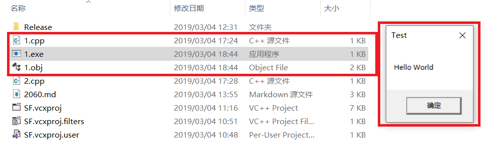
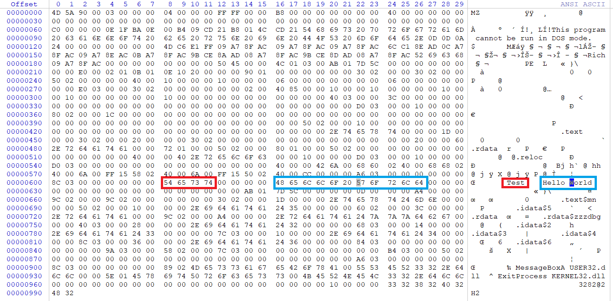
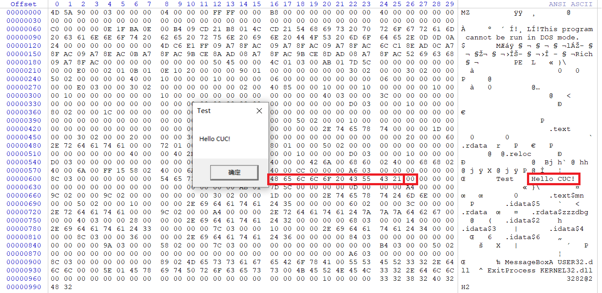

### 1、编写一个release版本的 hello world 程序。通过修改程序可执行文件的方式（不是修改源代码），使得程序运行后显示的内容不为hello world，变成 hello cuc！

提示：一定要在编译选项中将调试信息相关的编译连接选项去掉，否则程序体积会比较大，而且存在很多“干扰”信息。

#### 代码

```c
#include<windows.h>
int main() {
	MessageBoxA(NULL, "Hello World", "Test", MB_OK);
	// 程序正常退出
	ExitProcess(0);
}
```

#### 编译&链接

使用工具 Developer Command Prompt for VS 2017

```bash
# /c 编译但不链接
# /O1 最小体积
# /O2 最快速度
cl /c /O1 xxx.cpp

# /NOLOGO 取消显示启动版权标志
# /ENTRY 设置起始地址
# /NODEFAULTLIB 在解析外部引用时忽略所有（或指定的）默认库
# /SUBSYSTEM 通知操作系统如何运行 .exe 文件
# /ALIGN 指定每一节的对齐方式
link /NOLOGO /ENTRY:main /NODEFAULTLIB /SUBSYSTEM:WINDOWS /ALIGN:16 xxx.obj User32.lib Kernel32.lib
```

编译并链接，生成可执行文件，运行结果如下。



#### 修改
用十六进制编辑器打开可执行文件，因为体积较小，可以直接找到参数字符串



将 `World` 改为 `CUC!` 多余两个字节用0进行替换，保存后再次运行。




#### 参阅
- [MessageBoxA function](https://docs.microsoft.com/en-us/windows/desktop/api/winuser/nf-winuser-messageboxa)
- [ExitProcess function](https://docs.microsoft.com/en-us/windows/desktop/api/processthreadsapi/nf-processthreadsapi-exitprocess)
- [按字母顺序列出的编译器选项](https://docs.microsoft.com/zh-cn/cpp/build/reference/compiler-options-listed-alphabetically?view=vs-2017)
- [链接器选项](https://docs.microsoft.com/zh-cn/cpp/build/reference/linker-options?view=vs-2017)

#### 代码

msvcrt.lib（需手动添加） 编译时需加上`/MD`
- msvcrt.dll

```c
#include<stdio.h>
int main() {
	printf("hello world");
}
```

#### 编译&链接

#### 修改

#### 参阅